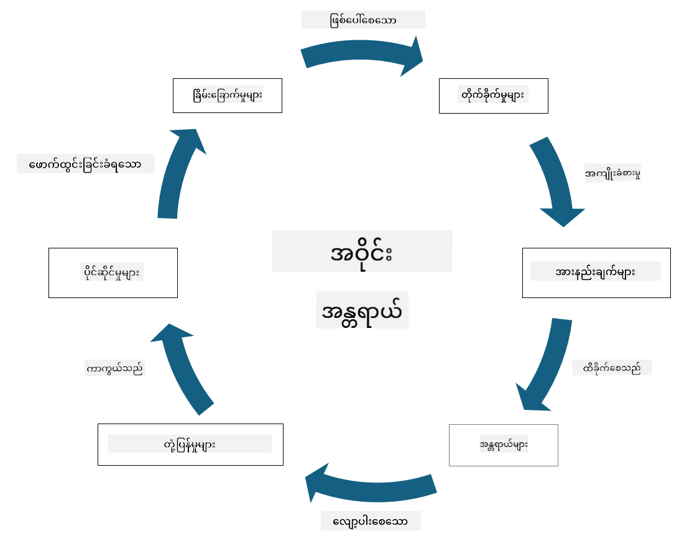

<!--
CO_OP_TRANSLATOR_METADATA:
{
  "original_hash": "fcca304f072cabf206388199e8e2e578",
  "translation_date": "2025-09-04T01:38:01+00:00",
  "source_file": "1.3 Understanding risk management.md",
  "language_code": "my"
}
-->
# အန္တရာယ်စီမံခန့်ခွဲမှုကို နားလည်ခြင်း

## အကျဉ်းချုပ်

ဒီသင်ခန်းစာမှာ ကျွန်တော်တို့ လေ့လာမယ့်အရာတွေကတော့ -

 - လုံခြုံရေးနယ်ပယ်မှာ အများဆုံးအသုံးပြုတဲ့ အဓိပ္ပါယ်များ

 - လုံခြုံရေးထိန်းချုပ်မှုအမျိုးအစားများ

 - လုံခြုံရေးအန္တရာယ်များကို အကဲဖြတ်ခြင်း

## လုံခြုံရေးနယ်ပယ်မှာ အများဆုံးအသုံးပြုတဲ့ အဓိပ္ပါယ်များ

ဒီအဓိပ္ပါယ်တွေကတော့ စိုက်ထုတ်မှုနဲ့ အန္တရာယ်စီမံခန့်ခွဲမှုနယ်ပယ်မှာ အခြေခံအယူအဆတွေဖြစ်ပါတယ်။ အဓိပ္ပါယ်တစ်ခုချင်းစီကို ခွဲခြမ်းစိတ်ဖြာပြီး တစ်ဦးနဲ့တစ်ဦး ဘယ်လိုဆက်စပ်နေသလဲဆိုတာကို ကြည့်ကြရအောင်။

1. **Threat Agent (အန္တရာယ်အကြောင်းဖန်တီးသူ)**:

Threat Agent ဆိုတာက စနစ်တစ်ခု သို့မဟုတ် ကွန်ယက်တစ်ခုမှာ ရှိတဲ့ အားနည်းချက်တွေကို အသုံးချပြီး နစ်နာမှု သို့မဟုတ် ထိခိုက်မှု ဖြစ်ပေါ်စေနိုင်တဲ့ ပုဂ္ဂိုလ်၊ အဖွဲ့၊ အဖွဲ့အစည်း သို့မဟုတ် အလိုအလျောက်စနစ်တစ်ခု ဖြစ်ပါတယ်။ Threat Agent တွေမှာ ဟက်ကာတွေ၊ မော်လ်ဝဲရေးသားသူတွေ၊ အလုပ်အကိုင်မကျေနပ်တဲ့ ဝန်ထမ်းတွေ သို့မဟုတ် အန္တရာယ်ဖြစ်စေနိုင်တဲ့ အခြားအဖွဲ့အစည်းတွေ ပါဝင်နိုင်ပါတယ်။

2. **Threat (အန္တရာယ်)**:

Threat ဆိုတာက စနစ်တစ်ခုရဲ့ အားနည်းချက်တွေကို အသုံးချပြီး ပိုင်ဆိုင်မှုတစ်ခုကို ထိခိုက်စေနိုင်တဲ့ ဖြစ်ရပ် သို့မဟုတ် လုပ်ဆောင်မှုတစ်ခု ဖြစ်ပါတယ်။ Threat တွေမှာ ဟက်ကင်းလုပ်ဆောင်မှု၊ ဒေတာပေါက်ကြားမှု၊ ဝန်ဆောင်မှုငြင်းပယ်မှုတိုက်ခိုက်မှု (DoS) စတဲ့ လုပ်ဆောင်မှုတွေ ပါဝင်နိုင်ပါတယ်။ Threat တွေက အဖွဲ့အစည်းရဲ့ ပိုင်ဆိုင်မှုတွေကို ထိခိုက်စေနိုင်တဲ့ အန္တရာယ်အခြေအနေတွေကို ဖော်ပြပါတယ်။

3. **Vulnerability (အားနည်းချက်)**:

Vulnerability ဆိုတာက စနစ်တစ်ခုရဲ့ ဒီဇိုင်း၊ အကောင်အထည်ဖော်မှု သို့မဟုတ် ဖွဲ့စည်းမှုမှာ ရှိတဲ့ အားနည်းချက် သို့မဟုတ် အပြစ်တစ်ခုဖြစ်ပြီး Threat Agent တစ်ခုက အသုံးချနိုင်တဲ့ အခြေအနေဖြစ်ပါတယ်။ Vulnerability တွေက ဆော့ဖ်ဝဲ၊ ဟာ့ဒ်ဝဲ၊ လုပ်ငန်းစဉ်တွေ သို့မဟုတ် လူ့အပြုအမူတွေမှာ ရှိနိုင်ပါတယ်။ အားနည်းချက်တွေကို ရှာဖွေပြီး ဖြေရှင်းတာက အန္တရာယ်ကို လျှော့ချဖို့ အရေးကြီးပါတယ်။

4. **Risk (အန္တရာယ်)**:

Risk ဆိုတာက Threat နဲ့ Vulnerability တို့ရဲ့ ပေါင်းစပ်မှုကြောင့် ဖြစ်ပေါ်လာနိုင်တဲ့ နစ်နာမှု၊ ထိခိုက်မှု သို့မဟုတ် ပျက်စီးမှု ဖြစ်နိုင်ခြေကို ဆိုလိုပါတယ်။ Threat Agent တစ်ခုက Vulnerability တစ်ခုကို အသုံးချပြီး အနုတ်လက္ခဏာဆိုးကျိုးတွေ ဖြစ်ပေါ်စေနိုင်တဲ့ ဖြစ်နိုင်ခြေကို Risk လို့ ခေါ်ပါတယ်။ Risk တွေကို အကျိုးသက်ရောက်မှုနဲ့ ဖြစ်နိုင်ခြေ အခြေခံပြီး အကဲဖြတ်ကြပါတယ်။

5. **Asset (ပိုင်ဆိုင်မှု)**:

Asset ဆိုတာက အဖွဲ့အစည်းတစ်ခုက ကာကွယ်ချင်တဲ့ တန်ဖိုးရှိတဲ့ အရာတစ်ခု ဖြစ်ပါတယ်။ Asset တွေမှာ ရုပ်ပိုင်းဆိုင်ရာပစ္စည်းတွေ (ကွန်ပျူတာ၊ ဆာဗာတွေ)၊ ဒေတာ (ဖောက်သည်အချက်အလက်၊ ငွေကြေးမှတ်တမ်း)၊ ဉာဏပညာပိုင်ဆိုင်မှု (ကုန်သွယ်ရေးလျှို့ဝှက်ချက်၊ မူပိုင်ခွင့်) နဲ့ လူ့အရင်းအမြစ် (ဝန်ထမ်းတွေရဲ့ ကျွမ်းကျင်မှုနဲ့ အသိပညာ) တွေ ပါဝင်ပါတယ်။ Asset တွေကို ကာကွယ်တာက လုံခြုံရေးရဲ့ အဓိကရည်မှန်းချက်ဖြစ်ပါတယ်။

6. **Exposure (ထိတွေ့မှု)**:

Exposure ဆိုတာက Threat Agent တစ်ခုက အသုံးချနိုင်တဲ့ Vulnerability ရှိနေတဲ့ အခြေအနေကို ဆိုလိုပါတယ်။ Exposure က စနစ် သို့မဟုတ် ကွန်ယက်မှာ Vulnerability ရှိနေတဲ့ အန္တရာယ်ကို ဖော်ပြပါတယ်။

7. **Control (ထိန်းချုပ်မှု)**:

Control ဆိုတာက Vulnerability နဲ့ Threat တွေကြောင့် ဖြစ်ပေါ်လာနိုင်တဲ့ အန္တရာယ်ကို လျှော့ချဖို့ ထည့်သွင်းထားတဲ့ အစီအစဉ်တစ်ခု ဖြစ်ပါတယ်။ Control တွေက နည်းပညာဆိုင်ရာ၊ လုပ်ထုံးလုပ်နည်းဆိုင်ရာ သို့မဟုတ် အုပ်ချုပ်မှုဆိုင်ရာ ဖြစ်နိုင်ပါတယ်။ Control တွေမှာ Firewall, Access Control, Encryption, လုံခြုံရေးမူဝါဒတွေ၊ ဝန်ထမ်းလေ့ကျင့်မှုတွေ ပါဝင်ပါတယ်။

အဓိပ္ပါယ်တွေကြား ဆက်စပ်မှုကို အကျဉ်းချုပ်ရမယ်ဆိုရင် - Threat Agent တွေက Vulnerability တွေကို အသုံးချပြီး Threat တွေကို ဖြစ်ပေါ်စေပါတယ်၊ ဒါဟာ Asset တွေကို ထိခိုက်စေနိုင်တဲ့ Risk တွေကို ဖြစ်ပေါ်စေပါတယ်။ Exposure က Vulnerability ရှိနေတဲ့ အခြေအနေကို ဖော်ပြပြီး၊ Control တွေက Threat တွေက Asset တွေကို ထိခိုက်စေမှုကို ကာကွယ် သို့မဟုတ် လျှော့ချဖို့ အရေးပါတဲ့ အခန်းကဏ္ဍကို ထမ်းဆောင်ပါတယ်။ ဒီစနစ်က Cybersecurity Risk Management ရဲ့ အခြေခံအဆောက်အအုံဖြစ်ပြီး အဖွဲ့အစည်းတွေကို သူတို့ရဲ့ အချက်အလက်စနစ်နဲ့ Asset တွေကို အန္တရာယ်ကင်းစေရန် လမ်းညွှန်ပါတယ်။

## လုံခြုံရေးထိန်းချုပ်မှုအမျိုးအစားများ

လုံခြုံရေးထိန်းချုပ်မှုတွေက အချက်အလက်စနစ်နဲ့ Asset တွေကို Threat နဲ့ Vulnerability တွေကနေ ကာကွယ်ဖို့ အကောင်အထည်ဖော်ထားတဲ့ အစီအစဉ်တွေ ဖြစ်ပါတယ်။ အဓိကရည်ရွယ်ချက်နဲ့ အခြေခံပြီး အမျိုးအစားအများအပြားအဖြစ် ခွဲခြားနိုင်ပါတယ်။ အောက်မှာ အများဆုံးတွေ့ရတဲ့ လုံခြုံရေးထိန်းချုပ်မှုအမျိုးအစားတွေကို ဖော်ပြထားပါတယ် -

1. **Administrative Controls (အုပ်ချုပ်မှုထိန်းချုပ်မှုများ)**:

ဒီထိန်းချုပ်မှုတွေက အဖွဲ့အစည်းရဲ့ လုံခြုံရေးအလေ့အကျင့်နဲ့ အသုံးပြုသူအပြုအမူကို စီမံခန့်ခွဲတဲ့ မူဝါဒတွေ၊ လုပ်ထုံးလုပ်နည်းတွေ၊ လမ်းညွှန်ချက်တွေနဲ့ ဆိုင်ပါတယ်။

- လုံခြုံရေးမူဝါဒနဲ့ လုပ်ထုံးလုပ်နည်းတွေ: အဖွဲ့အစည်းအတွင်း လုံခြုံရေးကို ဘယ်လိုထိန်းသိမ်းမလဲဆိုတာကို သတ်မှတ်ထားတဲ့ စာတမ်းအညွှန်းတွေ။

- လုံခြုံရေးအသိပညာနဲ့ လေ့ကျင့်မှု: ဝန်ထမ်းတွေကို လုံခြုံရေးအကောင်းဆုံးအလေ့အကျင့်နဲ့ အန္တရာယ်တွေကို သင်ကြားပေးတဲ့ အစီအစဉ်တွေ။

- ဖြစ်ရပ်တုံ့ပြန်မှုနဲ့ စီမံခန့်ခွဲမှု: လုံခြုံရေးဖြစ်ရပ်တွေကို တုံ့ပြန်ပြီး ထိန်းချုပ်ဖို့ အစီအစဉ်တွေ။

2. **Technical Controls (နည်းပညာဆိုင်ရာထိန်းချုပ်မှုများ)**:

နည်းပညာကို အသုံးပြုပြီး လုံခြုံရေးကို အကောင်အထည်ဖော်တဲ့ ထိန်းချုပ်မှုတွေ ဖြစ်ပါတယ်။

- Access Control: အသုံးပြုသူတွေကို သူတို့ရဲ့ အခန်းကဏ္ဍနဲ့ ခွင့်ပြုချက်အပေါ်မူတည်ပြီး အရင်းအမြစ်တွေကို ဝင်ရောက်ခွင့်ပေးတဲ့ အစီအစဉ်တွေ။

- Encryption: ဒေတာကို လုံခြုံစေရန် အချက်အလက်တွေကို ကုဒ်ပြုလုပ်ခြင်း။

- Firewall: ကွန်ယက်ထဲကို ဝင်လာတဲ့ သို့မဟုတ် ထွက်သွားတဲ့ လမ်းကြောင်းတွေကို စစ်ဆေးပြီး ထိန်းချုပ်တဲ့ စနစ်။

- Intrusion Detection and Prevention Systems (IDPS): သံသယရှိတဲ့ လှုပ်ရှားမှုတွေကို စောင့်ကြည့်တဲ့ ကိရိယာတွေ။

- Antivirus နဲ့ Anti-malware Software: မကောင်းဆိုးဝါးဆော့ဖ်ဝဲတွေကို ရှာဖွေပြီး ဖယ်ရှားပေးတဲ့ အစီအစဉ်တွေ။

- Authentication Mechanisms: အသုံးပြုသူတွေကို အတည်ပြုတဲ့ နည်းလမ်းတွေ (ဥပမာ- စကားဝှက်၊ ကိုယ်ရေးအချက်အလက်၊ နှစ်ဆင့်အတည်ပြုမှု)။

- Patch Management: ရှိပြီးသား Vulnerability တွေကို ဖြေရှင်းဖို့ ဆော့ဖ်ဝဲတွေကို အမြဲပြုပြင်မွမ်းမံခြင်း။

3. **Physical Controls (ရုပ်ပိုင်းဆိုင်ရာထိန်းချုပ်မှုများ)**:

ရုပ်ပိုင်းဆိုင်ရာပိုင်ဆိုင်မှုနဲ့ အဆောက်အဦတွေကို ကာကွယ်ဖို့ အစီအစဉ်တွေ။

- လုံခြုံရေးစောင့်တွေနဲ့ ဝင်ရောက်ခွင့်ထိန်းချုပ်သူတွေ: ရုပ်ပိုင်းဆိုင်ရာနေရာတွေကို စောင့်ကြည့်ပြီး ထိန်းချုပ်တဲ့ ဝန်ထမ်းတွေ။

- Surveillance Cameras: လှုပ်ရှားမှုတွေကို စောင့်ကြည့်ပြီး မှတ်တမ်းတင်တဲ့ စနစ်တွေ။

- Locks နဲ့ Physical Barriers: အရေးကြီးနေရာတွေကို ဝင်ရောက်ခွင့်ကန့်သတ်တဲ့ ရုပ်ပိုင်းဆိုင်ရာအကာအကွယ်တွေ။

- Environmental Controls: ပစ္စည်းနဲ့ ဒေတာစင်တာတွေကို ထိခိုက်စေနိုင်တဲ့ ပတ်ဝန်းကျင်အခြေအနေတွေ (အပူချိန်၊ စိုထိုင်းဆ) ကို ထိန်းချုပ်တဲ့ အစီအစဉ်တွေ။

4. **Operational Controls (စီမံခန့်ခွဲမှုထိန်းချုပ်မှုများ)**:

နေ့စဉ်လုပ်ငန်းစဉ်နဲ့ လှုပ်ရှားမှုတွေကို လုံခြုံစေရန် အကောင်အထည်ဖော်တဲ့ ထိန်းချုပ်မှုတွေ။

- Change Management: စနစ်နဲ့ ဖွဲ့စည်းမှုတွေကို ပြောင်းလဲမှုတွေကို စစ်ဆေးပြီး ခွင့်ပြုတဲ့ လုပ်ငန်းစဉ်တွေ။

- Backup နဲ့ Disaster Recovery: စနစ်ပျက်ကွက်မှု သို့မဟုတ် ဘေးအန္တရာယ်တွေဖြစ်လာရင် ဒေတာကို ပြန်လည်ရယူဖို့ အစီအစဉ်တွေ။

- Logging နဲ့ Auditing: လုံခြုံရေးနဲ့လိုက်နာမှုအတွက် စနစ်လှုပ်ရှားမှုတွေကို စောင့်ကြည့်ပြီး မှတ်တမ်းတင်ခြင်း။

- Secure Coding Practices: Vulnerability တွေကို လျှော့ချဖို့ ဆော့ဖ်ဝဲရေးသားတဲ့ လမ်းညွှန်ချက်တွေ။

5. **Legal and Regulatory Controls (ဥပဒေနဲ့ စည်းမျဉ်းထိန်းချုပ်မှုများ)**:

ဆိုင်ရာဥပဒေ၊ စည်းမျဉ်းနဲ့ စက်မှုစံနှုန်းတွေကို လိုက်နာမှုကို သေချာစေတဲ့ ထိန်းချုပ်မှုတွေ။

- Data Protection Regulations: GDPR, HIPAA, CCPA စတဲ့ ဥပဒေတွေကို လိုက်နာမှု။

- Industry-Specific Standards: PCI DSS စတဲ့ စက်မှုစံနှုန်းတွေကို လိုက်နာမှု။

ဒီထိန်းချုပ်မှုအမျိုးအစားတွေက အဖွဲ့အစည်းတွေရဲ့ စနစ်တွေ၊ ဒေတာတွေ၊ Asset တွေကို အန္တရာယ်အမျိုးမျိုးကနေ ကာကွယ်ဖို့ Comprehensive Security Posture တစ်ခု ဖန်တီးပေးပါတယ်။

## လုံခြုံရေးအန္တရာယ်များကို အကဲဖြတ်ခြင်း

လုံခြုံရေးပညာရှင်တချို့က အန္တရာယ်စီမံခန့်ခွဲမှုကို အန္တရာယ်စီမံခန့်ခွဲမှုအထူးပြုသူတွေကိုသာ 맡ထားရမယ်လို့ ယူဆကြပါတယ်။ ဒါပေမယ့် လုံခြုံရေးအန္တရာယ်စီမံခန့်ခွဲမှုလုပ်ငန်းစဉ်ကို နားလည်ထားတာက အဖွဲ့အစည်းရဲ့ အခြားဌာနတွေ နားလည်ပြီး လုပ်ဆောင်နိုင်အောင် အဓိကအရေးပါပါတယ်။

အဖွဲ့အစည်းတွေက အန္တရာယ်တွေကို အမြဲတမ်းအကဲဖြတ်ပြီး ဘယ်လိုလုပ်ဆောင်မလဲ (သို့မဟုတ်) ဘာမှမလုပ်ဘဲထားမလဲဆိုတာ ဆုံးဖြတ်ရပါတယ်။ အောက်မှာ အန္တရာယ်စီမံခန့်ခွဲမှုလုပ်ငန်းစဉ်ကို အကျဉ်းချုပ်ဖော်ပြထားပါတယ်။ ဒီလုပ်ငန်းစဉ်ကို အဖွဲ့အစည်းတစ်ခုရဲ့ အမျိုးမျိုးသောအဖွဲ့အစည်းတွေကြားမှာ အများအားဖြင့် ဆောင်ရွက်ကြပြီး၊ တစ်ဌာနတည်းက အဆုံးအထိတာဝန်ယူတာ မရှိသလောက်ပါ။

1. **ပိုင်ဆိုင်မှုနဲ့ အန္တရာယ်တွေကို ဖော်ထုတ်ခြင်း**:

အဖွဲ့အစည်းက သူတို့ကာကွယ်ချင်တဲ့ ပိုင်ဆိုင်မှုတွေကို ဖော်ထုတ်ပါတယ်။ ဒါတွေမှာ ဒေတာ၊ စနစ်တွေ၊ ဟာ့ဒ်ဝဲ၊ ဆော့ဖ်ဝဲ၊ ဉာဏပညာပိုင်ဆိုင်မှု စတာတွေ ပါဝင်နိုင်ပါတယ်။ နောက်ပြီးတော့ ဒီပိုင်ဆိုင်မှုတွေကို ပစ်မှတ်ထားနိုင်တဲ့ အန္တရာယ်တွေကို ဖော်ထုတ်ပါတယ်။

2. **အားနည်းချက်တွေကို အကဲဖြတ်ခြင်း**:

အဖွဲ့အစည်းတွေက Threat တွေက အသုံးချနိုင်တဲ့ စနစ် သို့မဟုတ် လုပ်ငန်းစဉ်တွေမှာ ရှိတဲ့ အားနည်းချက်တွေကို ဖော်ထုတ်ပါတယ်။ ဒီအားနည်းချက်တွေက ဆော့ဖ်ဝဲအပြစ်တွေ၊ မမှန်ကန်တဲ့ဖွဲ့စည်းမှုတွေ၊ လုံခြုံရေးထိန်းချုပ်မှုမရှိတာတွေ၊ လူ့အမှားတွေကြောင့် ဖြစ်ပေါ်နိုင်ပါတယ်။

3. **ဖြစ်နိုင်ခြေကို အကဲဖြတ်ခြင်း**:

အဖွဲ့အစည်းက Threat တစ်ခုဖြစ်ပေါ်နိုင်တဲ့ ဖြစ်နိုင်ခြေကို အကဲဖြတ်ပါတယ်။ ဒီအတွက် သမိုင်းမှတ်တမ်းဒေတာ၊ Threat Intelligence, စက်မှုလုပ်ငန်းလမ်းကြောင်းတွေ၊ အတွင်းရေးရာအချက်အလက်တွေကို သုံးစွဲပါတယ်။ ဖြစ်နိုင်ခြေကို အနိမ့်၊ အလတ်၊ အမြင့်အဖြစ် ခွဲခြားနိုင်ပါတယ်။

4. **သက်ရောက်မှုကို အကဲဖြတ်ခြင်း**:

နောက်တစ်ဆင့်မှာ Threat တစ်ခုက Vulnerability တစ်ခုကို အသုံးချခဲ့ရင် ဖြစ်နိုင်တဲ့ သက်ရောက်မှုကို သတ်မှတ်ပါတယ်။ သက်ရောက်မှုတွေမှာ ငွေကြေးဆုံးရှုံးမှု၊ လုပ်ငန်းအနှောင့်အယှက်၊ အမည်ပျက်မှု၊ ဥပဒေရေးရာအကျိုးဆက်တွေ ပါဝင်နိုင်ပါတယ်

---

**ဝက်ဘ်ဆိုက်မှတ်ချက်**:  
ဤစာရွက်စာတမ်းကို AI ဘာသာပြန်ဝန်ဆောင်မှု [Co-op Translator](https://github.com/Azure/co-op-translator) ကို အသုံးပြု၍ ဘာသာပြန်ထားပါသည်။ ကျွန်ုပ်တို့သည် တိကျမှန်ကန်မှုအတွက် ကြိုးစားနေသော်လည်း၊ အလိုအလျောက်ဘာသာပြန်ခြင်းတွင် အမှားများ သို့မဟုတ် မမှန်ကန်မှုများ ပါဝင်နိုင်ကြောင်း သတိပြုပါ။ မူလဘာသာစကားဖြင့် ရေးသားထားသော စာရွက်စာတမ်းကို အာဏာတည်သော ရင်းမြစ်အဖြစ် သတ်မှတ်သင့်ပါသည်။ အရေးကြီးသော အချက်အလက်များအတွက် လူ့ဘာသာပြန်ပညာရှင်များကို အသုံးပြုရန် အကြံပြုပါသည်။ ဤဘာသာပြန်ကို အသုံးပြုခြင်းမှ ဖြစ်ပေါ်လာသော နားလည်မှုမှားများ သို့မဟုတ် အဓိပ္ပာယ်မှားများအတွက် ကျွန်ုပ်တို့သည် တာဝန်မယူပါ။