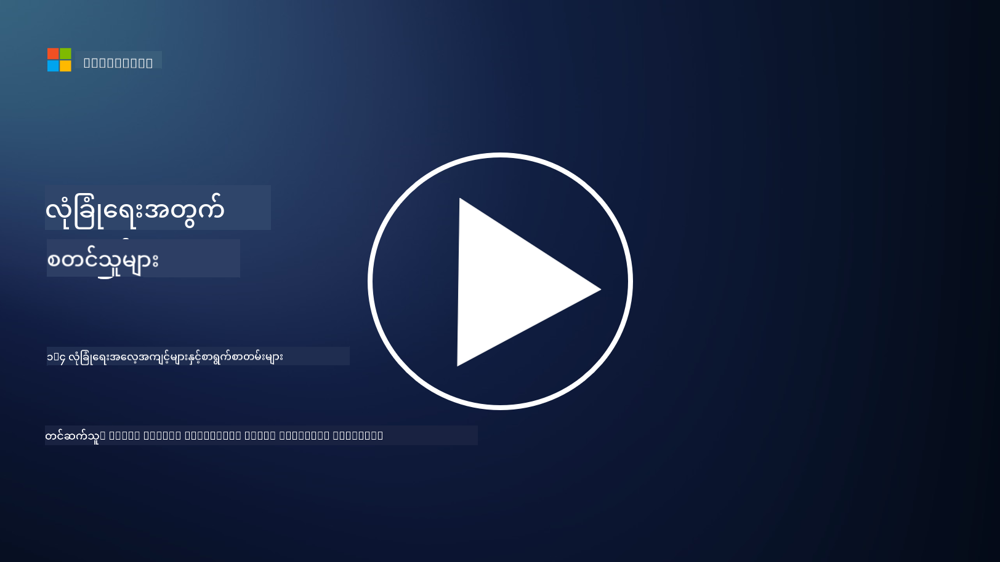

<!--
CO_OP_TRANSLATOR_METADATA:
{
  "original_hash": "d33500902124e52870935bdce4546fcc",
  "translation_date": "2025-09-04T00:23:14+00:00",
  "source_file": "1.4 Security practices and documentation.md",
  "language_code": "my"
}
-->
# လုံခြုံရေးအလေ့အကျင့်များနှင့်စာရွက်စာတမ်းများ

သင် “လုံခြုံရေးမူဝါဒ”၊ “လုံခြုံရေးစံနှုန်း” စသည်ဖြင့် နာမည်များကို ကြားဖူးနိုင်ပါသည်။ သို့သော် အမှန်တကယ်တွင် အများစုသော cybersecurity ပရော်ဖက်ရှင်နယ်များသည် ၎င်းတို့ကို မှန်ကန်စွာ အသုံးမပြုကြပါ။ ထို့ကြောင့် ဤအပိုင်းတွင် ၎င်းတို့၏ အဓိပ္ပါယ်နှင့် အဖွဲ့အစည်းတစ်ခုသည် အဘယ်ကြောင့် ၎င်းတို့ကို အသုံးပြုသင့်သည်ကို ရှင်းလင်းပေးပါမည်။

## အကျဉ်းချုပ်

ဤသင်ခန်းစာတွင် ကျွန်ုပ်တို့ ဖော်ပြမည်မှာ-

 - လုံခြုံရေးမူဝါဒဆိုတာဘာလဲ?

 - လုံခြုံရေးစံနှုန်းဆိုတာဘာလဲ?

 - လုံခြုံရေးအခြေခံလိုအပ်ချက်ဆိုတာဘာလဲ?

 - လုံခြုံရေးလမ်းညွှန်ဆိုတာဘာလဲ?

 - လုံခြုံရေးလုပ်ထုံးလုပ်နည်းဆိုတာဘာလဲ?

 - Cybersecurity အနက်တွင် ဥပဒေများနှင့် စည်းမျဉ်းများဆိုတာဘာလဲ?

ဤစကားလုံးများကို အဖွဲ့အစည်းတစ်ခု၏ လုံခြုံရေးစာရွက်စာတမ်းများနှင့် လုပ်ထုံးလုပ်နည်းများကို အဆင့်အတန်းများဖြင့် သတ်မှတ်ရန်အတွက် cybersecurity အနက်တွင် မကြာခဏ အသုံးပြုကြသည်။ အခုတော့ စကားလုံးတစ်ခုချင်းစီကို ရှင်းလင်းကြည့်ပါစို့-

## လုံခြုံရေးမူဝါဒဆိုတာဘာလဲ?

လုံခြုံရေးမူဝါဒသည် အဖွဲ့အစည်းတစ်ခု၏ လုံခြုံရေးဆိုင်ရာ ရည်မှန်းချက်များ၊ အခြေခံကျသော သဘောထားများနှင့် လမ်းညွှန်ချက်များကို ဖော်ပြထားသော အဆင့်မြင့်စာရွက်စာတမ်းတစ်ခုဖြစ်သည်။ ၎င်းသည် လုံခြုံရေးဆိုင်ရာ ဆုံးဖြတ်ချက်များကို ချမှတ်ရန်အတွက် အခြေခံအုတ်မြစ်တစ်ခုကို ပေးစွမ်းပြီး အဖွဲ့အစည်း၏ လုံခြုံရေးအနေအထားကို သတ်မှတ်ပေးသည်။ လုံခြုံရေးမူဝါဒများသည် အရင်းအမြစ်များ၏ သုံးစွဲမှု၊ ဒေတာကာကွယ်မှု၊ ဝင်ခွင့်ထိန်းချုပ်မှု၊ အရေးပေါ်ဖြေရှင်းမှု စသည်တို့ကို များစွာဖုံးလွှမ်းထားသည်။ မူဝါဒသည် ဖြေရှင်းနည်းနှင့် နည်းပညာပေါ်မူတည်မှုမရှိပါ။ လူတိုင်းနီးပါး ရင်းနှီးသော လုံခြုံရေးမူဝါဒတစ်ခုမှာ အဖွဲ့အစည်း၏ “အသုံးပြုမှုလက်ခံနိုင်မှုမူဝါဒ” ဖြစ်သည်။

## လုံခြုံရေးစံနှုန်းဆိုတာဘာလဲ?

လုံခြုံရေးစံနှုန်းသည် အဖွဲ့အစည်းတစ်ခုအတွင်း လုံခြုံရေးထိန်းချုပ်မှုများနှင့် လုပ်ဆောင်ချက်များကို အကောင်အထည်ဖော်ရန် လမ်းညွှန်ချက်များနှင့် လိုအပ်ချက်များကို ပေးစွမ်းသော အသေးစိတ်နှင့် သတ်မှတ်ချက်များပါဝင်သော စာရွက်စာတမ်းတစ်ခုဖြစ်သည်။ စံနှုန်းများသည် မူဝါဒများထက် ပိုမိုတိကျပြီး နည်းပညာဆိုင်ရာဖြစ်ပြီး လုံခြုံရေးရည်မှန်းချက်များကို ရောက်ရှိရန် စနစ်များ၊ ကွန်ယက်များနှင့် လုပ်ငန်းစဉ်များကို ပြင်ဆင်ထိန်းသိမ်းရန်အတွက် အကြံဉာဏ်များနှင့် အညွှန်းများကို ပေးသည်။ လုံခြုံရေးစံနှုန်းတစ်ခု၏ ဥပမာမှာ _“အတွင်းဒေတာအား အနားမှာနှင့် သယ်ယူပို့ဆောင်မှုအတွင်းတွင် စာဝှက်ထားရမည်”_ ဖြစ်သည်။

## လုံခြုံရေးအခြေခံလိုအပ်ချက်ဆိုတာဘာလဲ?

လုံခြုံရေးအခြေခံလိုအပ်ချက်သည် အချိန်အခါတစ်ခုတွင် စနစ်၊ အက်ပလီကေးရှင်း၊ သို့မဟုတ် ပတ်ဝန်းကျင်တစ်ခုအတွက် မရှိမဖြစ်လိုအပ်သော လုံခြုံရေးဖွဲ့စည်းမှုများကို သတ်မှတ်ထားသော စနစ်တစ်ခုဖြစ်သည်။ ၎င်းသည် အဖွဲ့အစည်း၏ IT အခြေခံအုတ်မြစ်တစ်ခုလုံးတွင် တူညီမှုနှင့် လုံခြုံရေးအဆင့်တစ်ခုကို သေချာစေရန် အခြေခံအနေအထားကို သတ်မှတ်ပေးသည်။ လုံခြုံရေးအခြေခံလိုအပ်ချက်တစ်ခု၏ ဥပမာမှာ _“Azure VMs များသည် အင်တာနက်ကို တိုက်ရိုက်ဝင်ရောက်ခွင့်မရှိရ”_ ဖြစ်သည်။

## လုံခြုံရေးလမ်းညွှန်ဆိုတာဘာလဲ?

လုံခြုံရေးလမ်းညွှန်သည် သတ်မှတ်ထားသော လုံခြုံရေးစံနှုန်းတစ်ခု မသက်ဆိုင်သောအခါ အကြံဉာဏ်များနှင့် လမ်းညွှန်ချက်များကို ပေးစွမ်းသော စာရွက်စာတမ်းတစ်ခုဖြစ်သည်။ လမ်းညွှန်များသည် စံနှုန်းတစ်ခုက အပြည့်အဝမဖုံးလွှမ်းနိုင်သော သို့မဟုတ် တစ်စိတ်တစ်ပိုင်းသာ ဖုံးလွှမ်းနိုင်သော အကြောင်းအရာများကို ကိုင်တွယ်ရန် ကြိုးစားသည်။

## လုံခြုံရေးလုပ်ထုံးလုပ်နည်းဆိုတာဘာလဲ?

လုံခြုံရေးလုပ်ထုံးလုပ်နည်းသည် လုံခြုံရေးဆိုင်ရာ လုပ်ငန်းစဉ် သို့မဟုတ် တာဝန်တစ်ခုကို အကောင်အထည်ဖော်ရန် လိုအပ်သော အတိအကျအဆင့်ဆင့် လုပ်ဆောင်ချက်များကို ဖော်ပြထားသော အသေးစိတ်လမ်းညွှန်စာရွက်စာတမ်းတစ်ခုဖြစ်သည်။ လုပ်ထုံးလုပ်နည်းများသည် အရေးပေါ်ဖြေရှင်းမှု၊ စနစ်ထိန်းသိမ်းမှု၊ အသုံးပြုသူ onboarding စသည်တို့အတွက် လုပ်ဆောင်ရန် လိုအပ်သော အဆင့်များကို ရှင်းလင်းစွာ ဖော်ပြထားသော လက်တွေ့ကျပြီး လုပ်ဆောင်နိုင်သော စာရွက်စာတမ်းများဖြစ်သည်။ လုံခြုံရေးလုပ်ထုံးလုပ်နည်းတစ်ခု၏ ဥပမာမှာ _“Microsoft Sentinel မှ P1 လုံခြုံရေးအရေးပေါ်ဖြစ်ရပ်တစ်ခု ဖန်တီးသောအခါ၊ လုံခြုံရေးစစ်ဆင်ရေးဌာန (SOC) သည် လုံခြုံရေးမန်နေဂျာကို ချက်ချင်းအသိပေးပြီး ဖြစ်ရပ်၏ အသေးစိတ်ကို ၎င်းတို့ထံ ပေးပို့ရမည်”_ ဖြစ်သည်။

အကျဉ်းချုပ်အားဖြင့်၊ ဤစကားလုံးများသည် အဖွဲ့အစည်းတစ်ခု၏ cybersecurity ဖွဲ့စည်းတည်ဆောက်မှုအတွင်း စာရွက်စာတမ်းနှင့် လမ်းညွှန်ချက်အဆင့်အတန်းများကို ကိုယ်စားပြုသည်။ လုံခြုံရေးမူဝါဒများသည် အဆင့်မြင့်ရည်မှန်းချက်များကို သတ်မှတ်ပေးပြီး၊ စံနှုန်းများသည် အသေးစိတ်လိုအပ်ချက်များကို ပေးသည်၊ အခြေခံလိုအပ်ချက်များသည် မူလလုံခြုံရေးဖွဲ့စည်းမှုကို သတ်မှတ်ပေးသည်၊ လမ်းညွှန်များသည် အကောင်းဆုံးအလေ့အကျင့်များကို ပေးသည်၊ လုပ်ထုံးလုပ်နည်းများသည် လုံခြုံရေးလုပ်ငန်းစဉ်များအတွက် လုပ်ဆောင်နိုင်သော အဆင့်များကို ပေးသည်။

## Cybersecurity အနက်တွင် ဥပဒေများ/စည်းမျဉ်းများဆိုတာဘာလဲ?

ဥပဒေများနှင့် စည်းမျဉ်းများသည် ဒစ်ဂျစ်တယ်စနစ်များ၊ ဒေတာများနှင့် အချက်အလက်များကို လုံခြုံစေရန် စည်းကမ်းများ၊ စံနှုန်းများနှင့် လိုအပ်ချက်များကို သတ်မှတ်ရန်နှင့် အကောင်အထည်ဖော်ရန် အစိုးရများနှင့် စည်းမျဉ်းသတ်မှတ်ရေးအဖွဲ့များက တည်ဆောက်ထားသော ဥပဒေစနစ်များကို ကိုယ်စားပြုသည်။ ဤဥပဒေများနှင့် စည်းမျဉ်းများသည် တည်နေရာအလိုက် ကွဲပြားမှုရှိပြီး၊ ဒေတာကာကွယ်မှု၊ ကိုယ်ရေးအချက်အလက်လုံခြုံရေး၊ ဖြစ်ရပ်အစီရင်ခံမှုနှင့် အရေးကြီးအခြေခံအုတ်မြစ်များ၏ လုံခြုံရေးကို အဓိကထားသည်။ Cybersecurity နှင့်ပတ်သက်သော ဥပဒေများနှင့် စည်းမျဉ်းများ၏ ဥပမာများမှာ- General Data Protection Regulation (GDPR), Health Insurance Portability and Accountability Act (HIPAA), California Consumer Privacy Act (CCPA), Payment Card Industry Data Security Standard (PCI DSS) စသည်တို့ဖြစ်သည်။

## ထပ်မံဖတ်ရှုရန်

[Information Security Policy Templates | SANS Institute](https://www.sans.org/information-security-policy/)

[Compliance with Cybersecurity and Privacy Laws and Regulations | NIST](https://www.nist.gov/mep/cybersecurity-resources-manufacturers/compliance-cybersecurity-and-privacy-laws-and-regulations)

---

**အကြောင်းကြားချက်**:  
ဤစာရွက်စာတမ်းကို AI ဘာသာပြန်ဝန်ဆောင်မှု [Co-op Translator](https://github.com/Azure/co-op-translator) ကို အသုံးပြု၍ ဘာသာပြန်ထားပါသည်။ ကျွန်ုပ်တို့သည် တိကျမှုအတွက် ကြိုးစားနေပါသော်လည်း၊ အလိုအလျောက် ဘာသာပြန်မှုများတွင် အမှားများ သို့မဟုတ် မတိကျမှုများ ပါဝင်နိုင်သည်ကို သတိပြုပါ။ မူရင်းဘာသာစကားဖြင့် ရေးသားထားသော စာရွက်စာတမ်းကို အာဏာရှိသော ရင်းမြစ်အဖြစ် သတ်မှတ်သင့်ပါသည်။ အရေးကြီးသော အချက်အလက်များအတွက် လူ့ဘာသာပြန်ပညာရှင်များမှ ပရော်ဖက်ရှင်နယ် ဘာသာပြန်မှုကို အကြံပြုပါသည်။ ဤဘာသာပြန်မှုကို အသုံးပြုခြင်းမှ ဖြစ်ပေါ်လာသော အလွဲအလွတ်များ သို့မဟုတ် အနားလွဲမှုများအတွက် ကျွန်ုပ်တို့သည် တာဝန်မယူပါ။