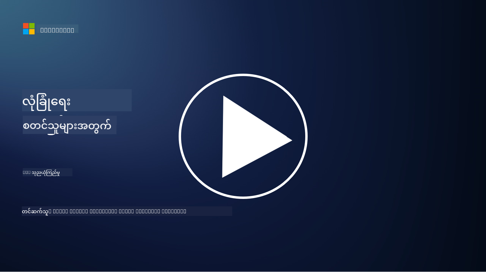
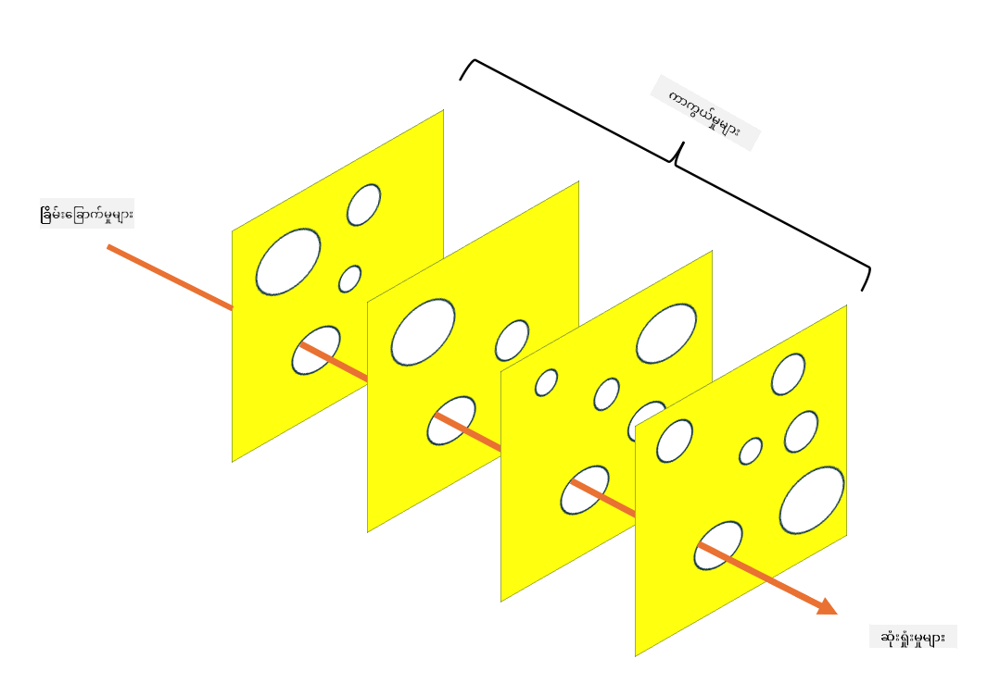

<!--
CO_OP_TRANSLATOR_METADATA:
{
  "original_hash": "75f77f972d2233c584f87c1eb96c983b",
  "translation_date": "2025-09-03T23:50:59+00:00",
  "source_file": "1.5 Zero trust.md",
  "language_code": "my"
}
-->
# Zero Trust

“Zero trust” ဆိုတာ လုံခြုံရေးနယ်ပယ်မှာ အခုတလော အများဆုံးအသုံးပြုနေတဲ့ စကားလုံးတစ်ခုပါ။ ဒါပေမယ့် အဲဒါက ဘာကိုဆိုလိုတာလဲ၊ buzzword တစ်ခုသာလား? ဒီသင်ခန်းစာမှာတော့ zero trust ဆိုတာ ဘာလဲဆိုတာကို အနက်အနက်ရှင်းပြပေးပါမယ်။

## အကျဉ်းချုပ်

 - ဒီသင်ခန်းစာမှာ ကျွန်တော်တို့ ဖော်ပြမယ့်အကြောင်းအရာတွေက:
   
   
 - Zero trust ဆိုတာဘာလဲ?

   
  

 - Zero trust ဟာ ရိုးရာလုံခြုံရေးပုံစံတွေနဲ့ ဘယ်လိုကွာခြားသလဲ?

   
   

 - Defense in depth ဆိုတာဘာလဲ?

## Zero Trust

Zero Trust ဆိုတာ "trust but verify" ဆိုတဲ့ ရိုးရာแนวคิดကို စိန်ခေါ်ပြီး အဖွဲ့အစည်းရဲ့ network အတွင်းဖြစ်ဖြစ် အပြင်ဖြစ်ဖြစ် ဘယ်သူ့ကိုမှ အလိုအလျောက်ယုံကြည်မထားသင့်ဘူးဆိုတဲ့ အယူအဆကို အခြေခံတဲ့ cybersecurity နည်းလမ်းတစ်ခုပါ။ Zero Trust ဟာ ဘယ်နေရာမှာရှိနေတဲ့သူဖြစ်ဖြစ် resource တွေကို access လုပ်ဖို့ ကြိုးစားနေတဲ့ user, device, application တစ်ခုချင်းစီကို အတည်ပြုဖို့ advocate လုပ်ပါတယ်။ Zero Trust ရဲ့ အဓိက principle က "attack surface" ကို လျှော့ချပြီး လုံခြုံရေး breach ဖြစ်ပွားနိုင်မှုရဲ့ သက်ရောက်မှုကို လျှော့ချဖို့ ဖြစ်ပါတယ်။

Zero Trust model မှာ အောက်ပါ principle တွေကို အရေးပါအောင်ထားပါတယ်:

1. **Identity အတည်ပြုခြင်း**: Authentication နဲ့ authorization ကို user နဲ့ device အားလုံးအတွက် တိကျစွာ အကောင်အထည်ဖော်ပါမယ်၊ သူတို့ရဲ့ location မည်သည့်နေရာမှာရှိနေပါစေ။ Identity ဆိုတာ လူသားတစ်ဦးသာမဟုတ်ပါဘူး၊ device, application တစ်ခုလည်း ဖြစ်နိုင်ပါတယ်။

2. **အနည်းဆုံးအခွင့်အရေး**: User နဲ့ device တွေကို သူတို့ရဲ့ task တွေကို ပြုလုပ်ဖို့ လိုအပ်တဲ့ အနည်းဆုံး access ကိုပေးပြီး၊ compromised ဖြစ်ခဲ့ရင် ဖြစ်နိုင်တဲ့ နစ်နာမှုကို လျှော့ချပါမယ်။

3. **Micro-Segmentation**: Network resource တွေကို အပိုင်းပိုင်းခွဲပြီး breach ဖြစ်ပွားခဲ့ရင် network အတွင်း lateral movement ကို ကန့်သတ်ပါမယ်။

4. **အဆက်မပြတ်ကြည့်ရှုခြင်း**: User နဲ့ device ရဲ့ အပြုအမူကို အဆက်မပြတ်ကြည့်ရှုပြီး anomaly နဲ့ အန္တရာယ်ဖြစ်နိုင်မှုတွေကို ရှာဖွေပါမယ်။ Modern monitoring techniques တွေမှာ machine learning, AI နဲ့ threat intelligence ကို အသုံးပြုပြီး monitoring ကို ပိုမိုအသေးစိတ်နဲ့ context ပေးနိုင်ပါတယ်။

5. **Data Encryption**: Data ကို transit နဲ့ rest မှာ encryption လုပ်ပြီး unauthorized access ကို ကာကွယ်ပါမယ်။

6. **Strict Access Control**: Access control တွေကို user role, device health, network location စတဲ့ context အပေါ် အခြေခံပြီး enforce လုပ်ပါမယ်။

Microsoft က Zero Trust ကို pillar ၅ ခုအဖြစ် ခွဲထားပြီး၊ အဲဒီ pillar တွေကို နောက်ဆုံးသင်ခန်းစာမှာ ဆွေးနွေးပါမယ်။

## ရိုးရာလုံခြုံရေးပုံစံတွေနဲ့ ကွာခြားချက်

Zero Trust ဟာ ရိုးရာလုံခြုံရေးပုံစံတွေဖြစ်တဲ့ perimeter-based model တွေနဲ့ အတော်လေး ကွာခြားပါတယ်:

1. **Perimeter vs. Identity-Centric**: ရိုးရာ model တွေက network ရဲ့ perimeter ကို လုံခြုံစေဖို့ အာရုံစိုက်ပြီး၊ internal user နဲ့ device တွေကို အတွင်းရောက်လာတဲ့အခါ ယုံကြည်ပါတယ်။ Zero Trust ကတော့ အန္တရာယ်တွေဟာ network ရဲ့ အတွင်းနဲ့ အပြင်နှစ်ဖက်လုံးက ရှိနိုင်တယ်လို့ သတ်မှတ်ပြီး strict identity-based control တွေကို အကောင်အထည်ဖော်ပါတယ်။

2. **Implicit vs. Explicit Trust**: ရိုးရာ model တွေက network အတွင်းရှိ device နဲ့ user တွေကို အလိုအလျောက် ယုံကြည်ပါတယ်။ Zero Trust ကတော့ identity တွေကို တိကျစွာ အတည်ပြုပြီး anomaly တွေကို အဆက်မပြတ်ကြည့်ရှုပါတယ်။

3. **Flat vs. Segmented Network**: ရိုးရာ architecture တွေက flat network တွေကို အသုံးပြုပြီး internal user တွေကို access အကျယ်ပေးပါတယ်။ Zero Trust ကတော့ network ကို အပိုင်းပိုင်းခွဲပြီး breach ဖြစ်ပွားခဲ့ရင် containment လုပ်နိုင်အောင် လုပ်ပါတယ်။

4. **Reactive vs. Proactive**: ရိုးရာလုံခြုံရေးက perimeter firewall နဲ့ intrusion detection စတဲ့ reactive measure တွေကို အခြေခံပါတယ်။ Zero Trust ကတော့ breach ဖြစ်နိုင်မှုကို သတ်မှတ်ပြီး သက်ရောက်မှုကို လျှော့ချဖို့ proactive approach ကို အသုံးပြုပါတယ်။

## Defense in Depth

Defense in depth ဆိုတာ layered security လို့လည်း ခေါ်ပြီး၊ အဖွဲ့အစည်းရဲ့ asset တွေကို ကာကွယ်ဖို့ security control နဲ့ measure အလွှာများစွာကို အသုံးပြုတဲ့ cybersecurity strategy တစ်ခုပါ။ ရည်ရွယ်ချက်ကတော့ အလွှာတစ်ခု breach ဖြစ်ခဲ့ရင် အခြားအလွှာတွေက protection ပေးနိုင်ဖို့ ဖြစ်ပါတယ်။ အလွှာတစ်ခုချင်းစီက security ရဲ့ aspect တစ်ခုချင်းစီကို အာရုံစိုက်ပြီး အဖွဲ့အစည်းရဲ့ security posture ကို တိုးတက်စေပါတယ်။

Defense in depth မှာ technical, procedural, physical security measure တွေကို ပေါင်းစပ်အသုံးပြုပါတယ်။ Firewall, intrusion detection system, access control, encryption, user training, security policy စတဲ့အရာတွေပါဝင်ပါတယ်။ ရည်ရွယ်ချက်ကတော့ အလွှာများစွာကို ဖန်တီးပြီး အဖွဲ့အစည်းရဲ့ system နဲ့ network တွေကို အခက်အခဲဖြစ်အောင် လုပ်ပေးဖို့ ဖြစ်ပါတယ်။ ဒါကို "swiss cheese" model လို့လည်း ခေါ်ပြီး၊ အခြားလုပ်ငန်းတွေ (ဥပမာ - သယ်ယူပို့ဆောင်ရေး) မှာ accident ကာကွယ်ရေးအတွက် အသုံးပြုပါတယ်။

## ထပ်မံဖတ်ရှုရန်

[What is Zero Trust?](https://learn.microsoft.com/security/zero-trust/zero-trust-overview?WT.mc_id=academic-96948-sayoung)

[Evolving Zero Trust – Microsoft Position Paper](https://query.prod.cms.rt.microsoft.com/cms/api/am/binary/RWJJdT?WT.mc_id=academic-96948-sayoung)

[Zero Trust and BeyondCorp Google Cloud | Google Cloud Blog](https://cloud.google.com/blog/topics/developers-practitioners/zero-trust-and-beyondcorp-google-cloud)

---

**ဝက်ဘ်ဆိုက်မှတ်ချက်**:  
ဤစာရွက်စာတမ်းကို AI ဘာသာပြန်ဝန်ဆောင်မှု [Co-op Translator](https://github.com/Azure/co-op-translator) ကို အသုံးပြု၍ ဘာသာပြန်ထားပါသည်။ ကျွန်ုပ်တို့သည် တိကျမှန်ကန်မှုအတွက် ကြိုးစားနေပါသော်လည်း၊ အလိုအလျောက်ဘာသာပြန်ဆိုမှုများတွင် အမှားများ သို့မဟုတ် မမှန်ကန်မှုများ ပါဝင်နိုင်သည်ကို ကျေးဇူးပြု၍ သတိပြုပါ။ မူရင်းစာရွက်စာတမ်းကို ၎င်း၏ မူလဘာသာစကားဖြင့် အာဏာတည်သောရင်းမြစ်အဖြစ် သတ်မှတ်သင့်ပါသည်။ အရေးကြီးသောအချက်အလက်များအတွက် လူပညာရှင်များမှ လက်တွေ့ဘာသာပြန်ဆိုမှုကို အကြံပြုပါသည်။ ဤဘာသာပြန်ဆိုမှုကို အသုံးပြုခြင်းမှ ဖြစ်ပေါ်လာသော နားလည်မှုမှားများ သို့မဟုတ် အဓိပ္ပာယ်မှားများအတွက် ကျွန်ုပ်တို့သည် တာဝန်မယူပါ။