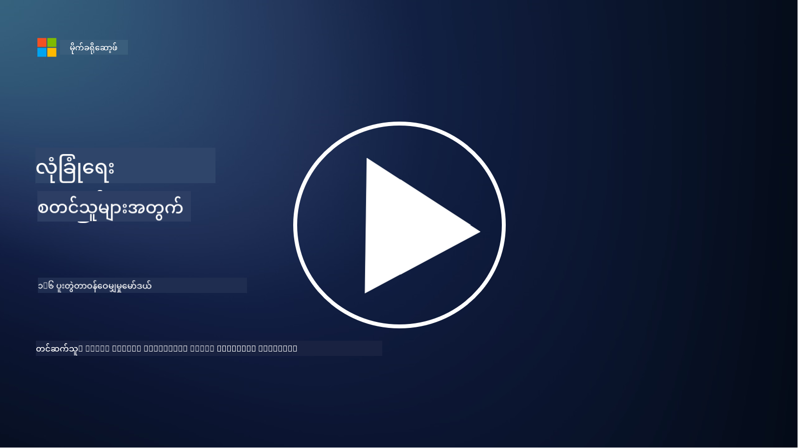

<!--
CO_OP_TRANSLATOR_METADATA:
{
  "original_hash": "a48db640d80c786b928ca178c414f084",
  "translation_date": "2025-09-04T00:29:39+00:00",
  "source_file": "1.6 Shared responsibility model.md",
  "language_code": "my"
}
-->
# အမျှဝေသောတာဝန်မော်ဒယ်

အမျှဝေသောတာဝန်သည် Cloud Computing ပေါ်ပေါက်လာပြီးနောက် IT အတွင်းအသစ်ဖြစ်လာသောအယူအဆတစ်ခုဖြစ်သည်။ Cybersecurity ရှုထောင့်မှကြည့်လျှင် ဘယ်သူကဘယ်လိုလုံခြုံရေးထိန်းချုပ်မှုများပေးထားသည်ကိုနားလည်ရန်အရေးကြီးပြီး ကာကွယ်ရေးတွင်အခွင့်အလမ်းများမရှိစေရန်လိုအပ်သည်။

## အကျဉ်းချုပ်

ဒီသင်ခန်းစာမှာ ကျွန်တော်တို့ဖော်ပြမယ့်အကြောင်းအရာတွေကတော့:

 - Cybersecurity ရှုထောင့်မှအမျှဝေသောတာဝန်ဆိုတာဘာလဲ?

 - IaaS, PaaS, SaaS အကြား လုံခြုံရေးထိန်းချုပ်မှုများအတွက် 
   အမျှဝေသောတာဝန်ကွာခြားချက်များကဘာလဲ?

 - Cloud Platform သင့်ရဲ့လုံခြုံရေးထိန်းချုပ်မှုများကိုဘယ်မှာရှာနိုင်မလဲ?

 - “ယုံကြည်ပါ၊ ဒါပေမယ့်စစ်ဆေးပါ” ဆိုတာဘာလဲ?

## Cybersecurity ရှုထောင့်မှအမျှဝေသောတာဝန်ဆိုတာဘာလဲ?

Cybersecurity အတွင်းအမျှဝေသောတာဝန်ဆိုတာ Cloud Service Provider (CSP) နဲ့သူ့ရဲ့ဖောက်သည်များအကြား လုံခြုံရေးတာဝန်များကိုခွဲဝေခြင်းကိုဆိုလိုသည်။ Infrastructure as a Service (IaaS), Platform as a Service (PaaS), Software as a Service (SaaS) ကဲ့သို့သော Cloud Computing ပတ်ဝန်းကျင်များတွင် CSP နဲ့ဖောက်သည်နှစ်ဦးစလုံးသည် ဒေတာများ၊ အပလီကေးရှင်းများနှင့်စနစ်များ၏လုံခြုံရေးကိုသေချာစေရန်အခန်းကဏ္ဍများရှိသည်။

## IaaS, PaaS, SaaS အကြား လုံခြုံရေးထိန်းချုပ်မှုများအတွက် အမျှဝေသောတာဝန်ကွာခြားချက်များကဘာလဲ?

တာဝန်ခွဲဝေမှုသည် အသုံးပြုနေသော Cloud Service အမျိုးအစားပေါ်မူတည်သည်။

 - **IaaS (Infrastructure as a Service)**: CSP သည် အခြေခံအဆောက်အအုံ (server, network, storage) ကိုပေးသည်။ ဖောက်သည်သည် အဲဒီအဆောက်အအုံပေါ်မှာ Operating System, Application, Security Configuration များကိုစီမံခန့်ခွဲရမည်။

 - **PaaS (Platform as a Service)**: CSP သည် Application များကိုတည်ဆောက်ပြီး Deploy လုပ်နိုင်သော Platform ကိုပေးသည်။ CSP သည် အခြေခံအဆောက်အအုံကိုစီမံခန့်ခွဲပြီး ဖောက်သည်သည် Application တည်ဆောက်ခြင်းနှင့် Data Security ကိုအာရုံစိုက်ရမည်။

 - **SaaS (Software as a Service)**: CSP သည် အင်တာနက်မှတဆင့်အသုံးပြုနိုင်သော Application များကိုပေးသည်။ ဒီအခါ CSP သည် Application ရဲ့လုံခြုံရေးနှင့်အဆောက်အအုံကိုတာဝန်ယူပြီး ဖောက်သည်သည် User Access နှင့် Data Usage ကိုစီမံခန့်ခွဲရမည်။

အမျှဝေသောတာဝန်ကိုနားလည်ခြင်းသည် CSP ကဘယ်လုံခြုံရေးအပိုင်းကိုတာဝန်ယူထားပြီး ဖောက်သည်ကဘယ်အပိုင်းကိုတာဝန်ယူရမည်ဆိုတာရှင်းလင်းစေသည်။ ဒါကအနားလွဲမှုများကိုကာကွယ်ပြီး လုံခြုံရေးအတိုင်းအတာများကိုအပြည့်အဝအကောင်အထည်ဖော်နိုင်စေသည်။

## Cloud Platform သင့်ရဲ့လုံခြုံရေးထိန်းချုပ်မှုများကိုဘယ်မှာရှာနိုင်မလဲ?

Cloud Platform သင့်ရဲ့လုံခြုံရေးထိန်းချုပ်မှုများကိုရှာဖွေရန် CSP ရဲ့ Documentation နဲ့ Resources ကိုကိုးကားရမည်။ အဲဒီမှာပါဝင်သောအရာများကတော့:

 - **CSP ရဲ့ Website နဲ့ Documentation**: CSP ရဲ့ Website မှာ သူတို့ရဲ့ Service တွေမှာပါဝင်တဲ့ လုံခြုံရေး Features နဲ့ Controls အကြောင်းကိုဖော်ပြထားမည်။ CSP တွေက သူတို့ရဲ့လုံခြုံရေးအလေ့အကျင့်များ၊ ထိန်းချုပ်မှုများနဲ့အကြံပြုချက်များကိုရှင်းလင်းဖော်ပြထားသော Whitepaper, Security Guide, Technical Documentation စသည်တို့ကိုပေးသည်။

 - **Security Assessments နဲ့ Audits**: CSP များသည် သူတို့ရဲ့လုံခြုံရေးထိန်းချုပ်မှုများကို လွတ်လပ်သောလုံခြုံရေးကျွမ်းကျင်သူများနှင့်အဖွဲ့အစည်းများမှအကဲဖြတ်ခြင်းခံရသည်။ ဒီအကဲဖြတ်မှုများက CSP ရဲ့လုံခြုံရေးအတိုင်းအတာများအကြောင်းသိရှိစေသည်။ CSP များသည် Security Compliance Certificate ရရှိရန်ကြိုးစားသည်။

 - **Security Compliance Certifications**: CSP များသည် ISO:27001, SOC 2, FedRAMP စသည်တို့ကဲ့သို့သော Certifications ရရှိထားသည်။ ဒီ Certifications များသည် Provider သည် သတ်မှတ်ထားသောလုံခြုံရေးနှင့်အညီမှုစံချိန်များကိုဖြည့်ဆည်းထားသည်ကိုပြသသည်။

Cloud Provider များအကြား အချက်အလက်အဆင့်အတန်းနှင့်ရရှိနိုင်မှုမှာကွဲပြားနိုင်သည်ကိုသတိပြုပါ။ Cloud-based Asset များ၏လုံခြုံရေးအတွက်အတိအကျဆုံးဆုံးဖြတ်ချက်များကိုလုပ်ဆောင်ရန် CSP မှပေးသောတရားဝင်နှင့် Update ဖြစ်သော Resources များကိုအမြဲကိုးကားပါ။

## “ယုံကြည်ပါ၊ ဒါပေမယ့်စစ်ဆေးပါ” ဆိုတာဘာလဲ?

CSP, Third-party Software, ဒါမှမဟုတ်အခြား IT Security Service ကိုအသုံးပြုရာတွင် အဖွဲ့အစည်းတစ်ခုသည် Provider ရဲ့လုံခြုံရေးအတိုင်းအတာများအကြောင်းအဆိုကိုစတင်ယုံကြည်နိုင်သည်။ သို့သော် သူတို့ရဲ့ဒေတာနှင့်စနစ်များ၏လုံခြုံရေးကိုအမှန်တကယ်သေချာစေရန် Security Assessments, Penetration Testing, Provider ရဲ့လုံခြုံရေးထိန်းချုပ်မှုများကိုစစ်ဆေးပြီးမှ Software သို့မဟုတ် Service ကိုအပြည့်အဝအသုံးပြုရန်လိုအပ်သည်။ လူများနှင့်အဖွဲ့အစည်းများသည် သူတို့တာဝန်မရှိသောလုံခြုံရေးထိန်းချုပ်မှုများကို ယုံကြည်ပြီးစစ်ဆေးရန်လိုအပ်သည်။

## အဖွဲ့အစည်းအတွင်းအမျှဝေသောတာဝန်

အဖွဲ့အစည်းအတွင်းလုံခြုံရေးအတွက်အမျှဝေသောတာဝန်ကိုလည်းအရေးယူရန်လိုအပ်သည်။ Security Team သည်လုံခြုံရေးထိန်းချုပ်မှုများအားလုံးကိုကိုယ်တိုင်အကောင်အထည်ဖော်မည်မဟုတ်ဘဲ Operations Team, Developer များနှင့်အခြား Business အပိုင်းများနှင့်ပူးပေါင်းပြီး အဖွဲ့အစည်းကိုလုံခြုံစေရန်လိုအပ်သောလုံခြုံရေးထိန်းချုပ်မှုများအားလုံးကိုအကောင်အထည်ဖော်ရမည်။

## ထပ်မံဖတ်ရှုရန်
- [Shared responsibility in the cloud - Microsoft Azure | Microsoft Learn](https://learn.microsoft.com/azure/security/fundamentals/shared-responsibility?WT.mc_id=academic-96948-sayoung)
- [What is shared responsibility model? – Definition from TechTarget.com](https://www.techtarget.com/searchcloudcomputing/definition/shared-responsibility-model)
- [The shared responsibility model explained and what it means for cloud security | CSO Online](https://www.csoonline.com/article/570779/the-shared-responsibility-model-explained-and-what-it-means-for-cloud-security.html)
- [Shared Responsibility for Cloud Security: What You Need to Know (cisecurity.org)](https://www.cisecurity.org/insights/blog/shared-responsibility-cloud-security-what-you-need-to-know)

---

**အကြောင်းကြားချက်**:  
ဤစာရွက်စာတမ်းကို AI ဘာသာပြန်ဝန်ဆောင်မှု [Co-op Translator](https://github.com/Azure/co-op-translator) ကို အသုံးပြု၍ ဘာသာပြန်ထားပါသည်။ ကျွန်ုပ်တို့သည် တိကျမှုအတွက် ကြိုးစားနေသော်လည်း၊ အလိုအလျောက် ဘာသာပြန်မှုများတွင် အမှားများ သို့မဟုတ် မတိကျမှုများ ပါဝင်နိုင်သည်ကို သတိပြုပါ။ မူရင်းဘာသာစကားဖြင့် ရေးသားထားသော စာရွက်စာတမ်းကို အာဏာရှိသော ရင်းမြစ်အဖြစ် သတ်မှတ်သင့်ပါသည်။ အရေးကြီးသော အချက်အလက်များအတွက် လူ့ဘာသာပြန်ပညာရှင်များမှ ပရော်ဖက်ရှင်နယ် ဘာသာပြန်မှုကို အကြံပြုပါသည်။ ဤဘာသာပြန်မှုကို အသုံးပြုခြင်းမှ ဖြစ်ပေါ်လာသော အလွဲအလွတ်များ သို့မဟုတ် အနားယူမှုများအတွက် ကျွန်ုပ်တို့သည် တာဝန်မယူပါ။