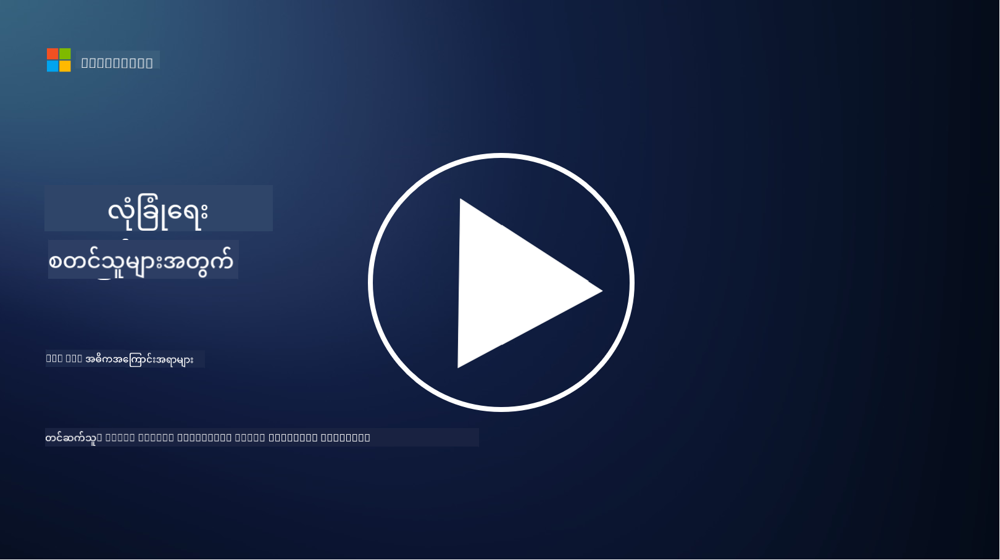

<!--
CO_OP_TRANSLATOR_METADATA:
{
  "original_hash": "2e3864e3d579f0dbb4ac2ec8c5f82acf",
  "translation_date": "2025-09-03T22:44:28+00:00",
  "source_file": "2.1 IAM key concepts.md",
  "language_code": "my"
}
-->
# IAM အဓိကအကြောင်းအရာများ

သင်က ကွန်ပျူတာတစ်လုံး သို့မဟုတ် ဝက်ဘ်ဆိုဒ်တစ်ခုမှာ လော့ဂ်အင်လုပ်ဖူးပါသလား။ အမှန်တကယ် လုပ်ဖူးမှာပါ! ဒါက သင်ရဲ့ နေ့စဉ်ဘဝမှာ အတည်ပြုမှုနဲ့ ဝင်ခွင့်ထိန်းချုပ်မှုတွေကို အသုံးပြုဖူးတယ်ဆိုတာကို ဆိုလိုပါတယ်။ အတည်ပြုမှုနဲ့ ဝင်ခွင့်စီမံခန့်ခွဲမှု (IAM) ဟာ လုံခြုံရေးရဲ့ အဓိကအဆင့်တစ်ခုဖြစ်ပြီး၊ နောက်ပိုင်း သင်ခန်းစာတွေမှာ ပိုမိုလေ့လာသွားမှာဖြစ်ပါတယ်။

**မိတ်ဆက်**

ဒီသင်ခန်းစာမှာ ကျွန်တော်တို့ လေ့လာမယ့်အရာတွေကတော့ -

 - အတည်ပြုမှုနဲ့ ဝင်ခွင့်စီမံခန့်ခွဲမှု (IAM) ဆိုတာကို
   cybersecurity ရဲ့ အနက်အဓိပ္ပါယ်အရ ဘာကို ဆိုလိုတာလဲ?
   
 - အနည်းဆုံးအခွင့်အာဏာ (principle of least privilege) ဆိုတာဘာလဲ?
   
 - တာဝန်ခွဲဝေမှု (segregation of duties) ဆိုတာဘာလဲ?
 - အတည်ပြုမှု (authentication) နဲ့ ခွင့်ပြုမှု (authorization) ဆိုတာဘာလဲ?

## Cybersecurity ရဲ့ အနက်အဓိပ္ပါယ်အရ အတည်ပြုမှုနဲ့ ဝင်ခွင့်စီမံခန့်ခွဲမှု (IAM) ဆိုတာဘာလဲ?

Identity and Access Management (IAM) ဆိုတာ အဖွဲ့အစည်းရဲ့ ဒစ်ဂျစ်တယ်ပတ်ဝန်းကျင်အတွင်းမှာ သင့်လျော်တဲ့လူတွေကို သင့်လျော်တဲ့အရင်းအမြစ်တွေကို ဝင်ခွင့်ပေးဖို့အတွက် အကောင်အထည်ဖော်ထားတဲ့ လုပ်ငန်းစဉ်တွေ၊ နည်းပညာတွေ၊ မူဝါဒတွေကို ဆိုလိုပါတယ်။ IAM ဟာ ဒစ်ဂျစ်တယ်အတည်ပြုမှုတွေ (အသုံးပြုသူတွေ၊ ဝန်ထမ်းတွေ၊ မိတ်ဖက်တွေ) နဲ့ သူတို့ရဲ့ စနစ်တွေ၊ အပလီကေးရှင်းတွေ၊ ဒေတာတွေ၊ နက်ဝက်တွေကို စီမံခန့်ခွဲတာပါ။ IAM ရဲ့ အဓိကရည်ရွယ်ချက်က လုံခြုံရေးကို မြှင့်တင်ပေးပြီး၊ အသုံးပြုသူဝင်ခွင့်ကို လွယ်ကူစေပြီး၊ အဖွဲ့အစည်းရဲ့ မူဝါဒနဲ့ စည်းမျဉ်းများကို လိုက်နာစေဖို့ဖြစ်ပါတယ်။ IAM ဖြေရှင်းနည်းတွေက အသုံးပြုသူအတည်ပြုမှု၊ ခွင့်ပြုမှု၊ အတည်ပြုမှုပေးခြင်း၊ ဝင်ခွင့်ထိန်းချုပ်မှု၊ အသုံးပြုသူဘဝစီမံခန့်ခွဲမှု (အသုံးမပြုတော့တဲ့အကောင့်တွေကို ဖျက်ပစ်တာ) စတဲ့အရာတွေကို typically ပါဝင်ပါတယ်။

## အနည်းဆုံးအခွင့်အာဏာ (principle of least privilege) ဆိုတာဘာလဲ?

အနည်းဆုံးအခွင့်အာဏာဆိုတာ အသုံးပြုသူတွေ နဲ့ စနစ်တွေကို သူတို့ရဲ့ တာဝန်တွေ သို့မဟုတ် အခန်းကဏ္ဍတွေကို လုပ်ဆောင်ဖို့ လိုအပ်တဲ့ အနည်းဆုံးအခွင့်အာဏာပေးဖို့ အကြံပြုတဲ့ အခြေခံအယူအဆတစ်ခုပါ။ ဒီအယူအဆက လုံခြုံရေးဖောက်ဖျက်မှု သို့မဟုတ် အတွင်းသားအန္တရာယ်ဖြစ်ပေါ်လာတဲ့အခါမှာ ဖြစ်နိုင်တဲ့ နစ်နာမှုကို ကန့်သတ်ပေးနိုင်ပါတယ်။ အနည်းဆုံးအခွင့်အာဏာကို လိုက်နာခြင်းအားဖြင့် အဖွဲ့အစည်းတွေဟာ အန္တရာယ်ဖြစ်နိုင်မှုကို လျှော့ချပြီး၊ မလိုလားအပ်တဲ့ ဝင်ခွင့်၊ ဒေတာဖောက်ဖျက်မှု၊ အခွင့်အာဏာအလွဲသုံးမှုကို လျှော့ချနိုင်ပါတယ်။ လက်တွေ့မှာဆိုရင် အသုံးပြုသူတွေကို သူတို့ရဲ့ အလုပ်တာဝန်အတွက် လိုအပ်တဲ့ အရင်းအမြစ်နဲ့ လုပ်ဆောင်ချက်တွေကိုပဲ ဝင်ခွင့်ပေးပြီး၊ အဲဒီထက်ပိုမပေးပါဘူး။ ဥပမာ၊ သင်က စာရွက်တစ်ရွက်ကို ဖတ်ဖို့ပဲ လိုအပ်တယ်ဆိုရင်၊ အဲဒီစာရွက်ကို အပြည့်အဝ admin အခွင့်အာဏာပေးတာဟာ မလိုအပ်တဲ့အရာပါ။

## တာဝန်ခွဲဝေမှု (segregation of duties) ဆိုတာဘာလဲ?

တာဝန်ခွဲဝေမှုဆိုတာ အဖွဲ့အစည်းအတွင်း အရေးကြီးတဲ့ လုပ်ငန်းစဉ်တွေ နဲ့ တာဝန်တွေကို လူတစ်ဦးတည်းမှာ မရှိအောင် ခွဲဝေခြင်းအားဖြင့် အကျိုးစီးပွားပဋိပက္ခတွေကို ကာကွယ်ပြီး၊ လိမ်လည်မှုနဲ့ အမှားတွေကို လျှော့ချဖို့ ရည်ရွယ်တဲ့ အယူအဆတစ်ခုပါ။ Cybersecurity ရဲ့ အနက်အဓိပ္ပါယ်အရ တာဝန်ခွဲဝေမှုက အရေးကြီးတဲ့ လုပ်ငန်းစဉ် သို့မဟုတ် စနစ်ရဲ့ အပိုင်းအားလုံးကို လူတစ်ဦးတည်းမှာ ထိန်းချုပ်နိုင်မယ့်အခြေအနေမရှိအောင် သေချာစေဖို့ ရည်ရွယ်ပါတယ်။ ဒီအယူအဆရဲ့ ရည်ရွယ်ချက်က စစ်ဆေးမှုနဲ့ အချိုးအလွှာတွေကို ဖန်တီးပြီး၊ လုပ်ငန်းစဉ်ရဲ့ စတင်ခြင်းနဲ့ အတည်ပြုခြင်းအဆင့်တွေကို တစ်ဦးတည်းမှာ မရှိအောင်လုပ်တာပါ။ ဥပမာ၊ ငွေကြေးစနစ်တွေမှာဆိုရင်၊ စနစ်ထဲမှာ လုပ်ငန်းစဉ်တွေကို ထည့်သွင်းတဲ့သူနဲ့ အဲဒီလုပ်ငန်းစဉ်တွေကို အတည်ပြုတဲ့သူဟာ တစ်ဦးတည်းမဖြစ်သင့်ပါဘူး။ ဒီလိုလုပ်ခြင်းက မလိုလားအပ်တဲ့ လုပ်ရပ်တွေ သို့မဟုတ် လိမ်လည်မှုတွေကို မသိမသာဖြစ်ပေါ်လာမယ့် အန္တရာယ်ကို လျှော့ချနိုင်ပါတယ်။

## အတည်ပြုမှု (authentication) နဲ့ ခွင့်ပြုမှု (authorization) ဆိုတာဘာလဲ?

အတည်ပြုမှုနဲ့ ခွင့်ပြုမှုဟာ Cybersecurity ရဲ့ အရေးကြီးတဲ့ အယူအဆနှစ်ခုဖြစ်ပြီး၊ ကွန်ပျူတာစနစ်နဲ့ ဒေတာရဲ့ လုံခြုံရေးနဲ့ တရားဝင်မှုကို သေချာစေဖို့ အရေးပါပါတယ်။ ဒီအယူအဆနှစ်ခုဟာ အရင်းအမြစ်တွေကို ထိန်းချုပ်ပြီး၊ အရေးကြီးတဲ့ အချက်အလက်တွေကို ကာကွယ်ဖို့အတွက် အတူတကွ အသုံးပြုပါတယ်။

**1. အတည်ပြုမှု (Authentication)**:  
အတည်ပြုမှုဆိုတာ ကွန်ပျူတာစနစ် သို့မဟုတ် အရင်းအမြစ်တစ်ခုကို ဝင်ရောက်ဖို့ ကြိုးစားနေတဲ့ အသုံးပြုသူ၊ စနစ် သို့မဟုတ် အဖွဲ့အစည်းရဲ့ အတည်ပြုမှုကို စစ်ဆေးတဲ့ လုပ်ငန်းစဉ်ပါ။ အတည်ပြုမှုက အဆိုပြုထားတဲ့ အတည်ပြုမှုဟာ တကယ့်အတည်ပြုမှုဖြစ်ကြောင်း သေချာစေပါတယ်။ အတည်ပြုမှုနည်းလမ်းတွေက အောက်ပါအရာတွေကို typically ပါဝင်ပါတယ် -  
    a. သင်သိတဲ့အရာ: Passwords, PINs, သို့မဟုတ် တရားဝင်အသုံးပြုသူပိုင်ဆိုင်ထားသင့်တဲ့ လျှို့ဝှက်အချက်တွေ။  
    b. သင်ပိုင်ဆိုင်ထားတဲ့အရာ: Smart cards, security tokens, သို့မဟုတ် အသုံးပြုသူရဲ့ အတည်ပြုမှုကို အတည်ပြုဖို့ အသုံးပြုတဲ့ မိုဘိုင်းဖုန်းတွေ။  
    c. သင်ဖြစ်တဲ့အရာ: Fingerprints, facial recognition, retinal scans စတဲ့ အသုံးပြုသူရဲ့ တစ်ဦးတည်းသော biometric အချက်အလက်တွေ။  

အတည်ပြုမှုစနစ်တွေက အသုံးပြုသူဟာ သူတို့ဆိုလိုတဲ့သူဖြစ်ကြောင်း အတည်ပြုပြီး၊ စနစ် သို့မဟုတ် အရင်းအမြစ်ကို ဝင်ခွင့်ပေးမယ့်အခါမှာ အသုံးပြုပါတယ်။ ဒါက မလိုလားအပ်တဲ့ ဝင်ခွင့်ကို ကာကွယ်ပြီး၊ တရားဝင်အသုံးပြုသူတွေက စနစ်အတွင်းမှာ လုပ်ဆောင်မှုတွေကို လုပ်နိုင်ဖို့ သေချာစေပါတယ်။

**2. ခွင့်ပြုမှု (Authorization)**:  
ခွင့်ပြုမှုဆိုတာ အတည်ပြုထားတဲ့ အသုံးပြုသူ သို့မဟုတ် အဖွဲ့အစည်းတွေကို သတ်မှတ်ထားတဲ့ ခွင့်ပြုချက်နဲ့ အခွင့်အာဏာတွေကို ပေးမလား၊ ပေးမလား ဆုံးဖြတ်တဲ့ လုပ်ငန်းစဉ်ပါ။ ဒါက အသုံးပြုသူဟာ စနစ်အတွင်းမှာ သို့မဟုတ် အရင်းအမြစ်တစ်ခုမှာ ဘာလုပ်ဆောင်မှုတွေကို လုပ်ခွင့်ရှိလဲဆိုတာကို ဆုံးဖြတ်ပါတယ်။ ခွင့်ပြုမှုဟာ မူဝါဒတွေ၊ ဝင်ခွင့်ထိန်းချုပ်မှုစည်းမျဉ်းတွေ၊ အသုံးပြုသူတွေရဲ့ အခန်းကဏ္ဍတွေကို အခြေခံပြီး ဆုံးဖြတ်ပါတယ်။

ခွင့်ပြုမှုကို "အတည်ပြုထားတဲ့ အသုံးပြုသူက ဘာလုပ်ခွင့်ရှိလဲ?" ဆိုတဲ့ မေးခွန်းကို ဖြေရှင်းတဲ့အနေနဲ့ တွေးနိုင်ပါတယ်။ ဒါဟာ အရေးကြီးတဲ့ ဒေတာနဲ့ အရင်းအမြစ်တွေကို မလိုလားအပ်တဲ့ ဝင်ခွင့် သို့မဟုတ် ပြောင်းလဲမှုတွေကနေ ကာကွယ်ဖို့ ဝင်ခွင့်ထိန်းချုပ်မှုမူဝါဒတွေကို သတ်မှတ်ပြီး အကောင်အထည်ဖော်တာပါ။

**အကျဉ်းချုပ်:**

-   အတည်ပြုမှုက အသုံးပြုသူ သို့မဟုတ် အဖွဲ့အစည်းရဲ့ အတည်ပြုမှုကို သတ်မှတ်ပေးပါတယ်။
-   ခွင့်ပြုမှုက အတည်ပြုထားတဲ့ အသုံးပြုသူတွေက ဘာလုပ်ဆောင်မှုတွေကို လုပ်ခွင့်ရှိလဲဆိုတာကို ဆုံးဖြတ်ပေးပါတယ်။

## ထပ်မံဖတ်ရှုရန်

- [Describe identity concepts - Training | Microsoft Learn](https://learn.microsoft.com/training/modules/describe-identity-principles-concepts/?WT.mc_id=academic-96948-sayoung)  
- [Introduction to identity - Microsoft Entra | Microsoft Learn](https://learn.microsoft.com/azure/active-directory/fundamentals/identity-fundamental-concepts?WT.mc_id=academic-96948-sayoung)  
- [What is Identity Access Management (IAM)? | Microsoft Security](https://www.microsoft.com/security/business/security-101/what-is-identity-access-management-iam?WT.mc_id=academic-96948-sayoung)  
- [What is IAM? Identity and access management explained | CSO Online](https://www.csoonline.com/article/518296/what-is-iam-identity-and-access-management-explained.html)  
- [What is IAM? (auth0.com)](https://auth0.com/blog/what-is-iam/)  
- [Security+: implementing Identity and Access Management (IAM) controls [updated 2021] | Infosec (infosecinstitute.com)](https://resources.infosecinstitute.com/certifications/securityplus/security-implementing-identity-and-access-management-iam-controls/)  
- [least privilege - Glossary | CSRC (nist.gov)](https://csrc.nist.gov/glossary/term/least_privilege)  
- [Security: The Principle of Least Privilege (POLP) - Microsoft Community Hub](https://techcommunity.microsoft.com/t5/azure-sql-blog/security-the-principle-of-least-privilege-polp/ba-p/2067390?WT.mc_id=academic-96948-sayoung)  
- [Principle of least privilege | CERT NZ](https://www.cert.govt.nz/it-specialists/critical-controls/principle-of-least-privilege/)  
- [Why is separation of duties required by NIST 800-171 and CMMC? - (totem.tech)](https://www.totem.tech/cmmc-separation-of-duties/)  

---

**အကြောင်းကြားချက်**:  
ဤစာရွက်စာတမ်းကို AI ဘာသာပြန်ဝန်ဆောင်မှု [Co-op Translator](https://github.com/Azure/co-op-translator) ကို အသုံးပြု၍ ဘာသာပြန်ထားပါသည်။ ကျွန်ုပ်တို့သည် တိကျမှုအတွက် ကြိုးစားနေသော်လည်း၊ အလိုအလျောက် ဘာသာပြန်မှုများတွင် အမှားများ သို့မဟုတ် မတိကျမှုများ ပါဝင်နိုင်သည်ကို သတိပြုပါ။ မူရင်းစာရွက်စာတမ်းကို ၎င်း၏ မူလဘာသာစကားဖြင့် အာဏာတရားရှိသော အရင်းအမြစ်အဖြစ် သတ်မှတ်သင့်ပါသည်။ အရေးကြီးသော အချက်အလက်များအတွက် လူက ဘာသာပြန်မှု ဝန်ဆောင်မှုကို အသုံးပြုရန် အကြံပြုပါသည်။ ဤဘာသာပြန်မှုကို အသုံးပြုခြင်းမှ ဖြစ်ပေါ်လာသော အလွဲအလွတ်များ သို့မဟုတ် အနားယူမှားမှုများအတွက် ကျွန်ုပ်တို့သည် တာဝန်မယူပါ။