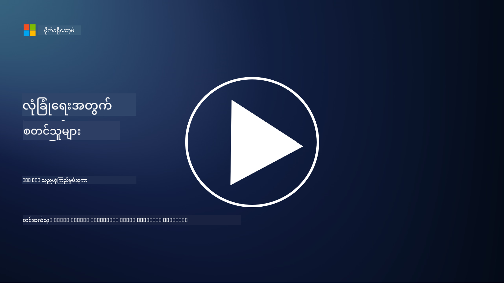

<!--
CO_OP_TRANSLATOR_METADATA:
{
  "original_hash": "4774a978af123f72ebb872199c4c4d4f",
  "translation_date": "2025-09-03T23:44:50+00:00",
  "source_file": "2.2 IAM zero trust architecture.md",
  "language_code": "my"
}
-->
# IAM အပြည့်အဝ ယုံကြည်မှုမရှိသော Architecture

Identity သည် ယုံကြည်မှုမရှိသော architecture ကို အကောင်အထည်ဖော်ရန်နှင့် IT ပတ်ဝန်းကျင်အတွက် အကာအရံတည်ဆောက်ရန် အရေးပါသော အစိတ်အပိုင်းတစ်ခုဖြစ်သည်။ ဒီအပိုင်းမှာ Identity ကို အသုံးပြု၍ ယုံကြည်မှုမရှိသော အကောင်အထည်ဖော်ခြင်းအတွက် အရေးကြီးမှုကို ရှင်းလင်းပြသပါမည်။

## အကျဉ်းချုပ်

ဒီသင်ခန်းစာမှာ ကျွန်တော်တို့ လေ့လာမည်မှာ -

 - အခေတ်မီ IT ပတ်ဝန်းကျင်များတွင် Identity ကို perimeter အဖြစ် အသုံးပြုရခြင်းအကြောင်းရင်းများ

 - ယခင် IT architecture များနှင့် ဘယ်လိုကွာခြားမှုရှိသလဲ?

 - Identity ကို ယုံကြည်မှုမရှိသော architecture အတွက် ဘယ်လိုအသုံးပြုသလဲ?

## အခေတ်မီ IT ပတ်ဝန်းကျင်များတွင် Identity ကို perimeter အဖြစ် အသုံးပြုရခြင်းအကြောင်းရင်းများ

အခေတ်မီ IT ပတ်ဝန်းကျင်များတွင် firewall နှင့် network boundary ကဲ့သို့သော tools များကို အသုံးပြု၍ physical perimeter ကို အဓိကကာကွယ်မှုအဖြစ် သတ်မှတ်ထားသော ယဉ်ကျေးမှုဟောင်းသည် နည်းပညာ၏ ရှုပ်ထွေးမှုများ၊ အဝေးမှ အလုပ်လုပ်ခြင်းနှင့် cloud services ကို အသုံးပြုမှုများကြောင့် အကျိုးရှိမှုနည်းလာသည်။ ထို့အစား အဖွဲ့အစည်းများသည် Identity ကို perimeter အဖြစ် အသုံးပြုရန် ပြောင်းလဲလာကြသည်။ ဒါဟာ physical location မည်သည့်နေရာတွင်မဆို အရင်းအမြစ်များကို ဝင်ရောက်ရန် ကြိုးစားနေသော user, device, application များ၏ identity ကို အတည်ပြုခြင်းနှင့် စီမံခန့်ခွဲခြင်းကို အခြေခံထားသည်။

Identity ကို perimeter အဖြစ် အသုံးပြုရခြင်းအရေးကြီးမှုမှာ -

**Remote Workforce**: အဝေးမှ အလုပ်လုပ်ခြင်းနှင့် mobile device များသည် အခြေခံဖြစ်လာသည်။ User များသည် အရင်းအမြစ်များကို အမျိုးမျိုးသောနေရာများနှင့် device များမှ ဝင်ရောက်နိုင်သည်။ ယဉ်ကျေးမှုဟောင်း၏ perimeter အနည်းဆုံး approach သည် physical office တွင်သာ အကန့်အသတ်ရှိသော user များအတွက် အကျိုးရှိသည်။

**Cloud နှင့် Hybrid Environment**: အဖွဲ့အစည်းများသည် cloud services နှင့် hybrid environment များကို တိုးတက်အသုံးပြုလာသည်။ Data နှင့် application များသည် အဖွဲ့အစည်း၏ နေရာတွင်းတွင်သာ မရှိတော့ဘဲ traditional perimeter ကာကွယ်မှုများသည် relevance နည်းလာသည်။

**Zero Trust Security**: Zero trust security ၏ အယူအဆသည် network အတွင်းဖြစ်စေ၊ အပြင်ဖြစ်စေ မည်သည့် entity ကိုမဆို အလိုအလျောက် ယုံကြည်မှုမရှိသင့်ကြောင်း သတ်မှတ်ထားသည်။ Identity သည် access request များကို အတည်ပြုရန် အခြေခံအဖြစ် လုပ်ဆောင်သည်။

**Threat Landscape**: Cyber လုံခြုံရေး ခြိမ်းခြောက်မှုများသည် တိုးတက်လာပြီး traditional perimeter ကာကွယ်မှုများကို ကျော်လွှားနိုင်သော နည်းလမ်းများကို ရှာဖွေကြသည်။ Phishing, social engineering နှင့် insider threat များသည် network perimeter များကို ကျော်လွှားရန်ထက် လူ့အားနည်းချက်များကို အသုံးချသည်။

**Data-Centric Approach**: အရေးကြီးသော data ကို ကာကွယ်ခြင်းသည် အဓိကဖြစ်သည်။ Identity ကို အခြေခံ၍ data ကို ဘယ်သူဝင်ရောက်နိုင်မည်ကို ထိန်းချုပ်ခြင်းဖြင့် data breach ဖြစ်နိုင်ခြေကို လျှော့ချနိုင်သည်။

## ယခင် IT architecture များနှင့် ဘယ်လိုကွာခြားမှုရှိသလဲ?

ယခင် IT architecture များသည် firewall နှင့် network boundary ကဲ့သို့သော perimeter-based security model များကို အဓိကထားခဲ့သည်။ Traditional နှင့် identity-centric approach များ၏ အဓိကကွာခြားချက်များမှာ -

|      Aspect                 |      Traditional IT Architectures                                                                  |      Identity-Centric Approach                                                                             |
|-----------------------------|----------------------------------------------------------------------------------------------------|------------------------------------------------------------------------------------------------------------|
|     Focus                   |     Perimeter Focus: Firewalls နှင့် access control ကဲ့သို့သော perimeter ကာကွယ်မှုများကို အခြေခံထားသည်။             |     Focus on Identity Verification: Network boundary များမှ user/device identity ကို အတည်ပြုခြင်းသို့ ပြောင်းလဲသည်။     |
|     Location                |     Location Dependency: - Security ကို physical office location နှင့် network boundary များနှင့် ချိတ်ဆက်ထားသည်။    |     Location Independence: Security ကို specific location များနှင့် မချိတ်ဆက်ဘဲ မည်သည့်နေရာမှမဆို access လုပ်နိုင်သည်။                |
|     Trust Assumption        |     Assumed Trust: Network perimeter အတွင်းရှိ user/device များကို အလိုအလျောက် ယုံကြည်မှုရှိသည်ဟု သတ်မှတ်ထားသည်။                 |     Zero Trust Approach: Trust ကို အလိုအလျောက် မသတ်မှတ်ဘဲ identity နှင့် context အပေါ် အခြေခံ၍ access ကို အတည်ပြုသည်။       |
|     Device Consideration    |     Device Diversity: Network perimeter အတွင်းရှိ device များကို လုံခြုံမှုရှိသည်ဟု သတ်မှတ်ထားသည်။                  |     Device Awareness: Device health နှင့် security posture ကို location မည်သည့်နေရာတွင်မဆို စဉ်ဆက်မပြတ် စစ်ဆေးသည်။               |
|     Data Protection         |     Data Protection: Network perimeter များကို data ကာကွယ်မှုအတွက် အဓိကထားသည်။                 |     Data-Centric Protection: Identity နှင့် data sensitivity အပေါ် အခြေခံ၍ data access ကို ထိန်းချုပ်သည်။    |
|                             |                                                                                                    |                                                                                                            |

## Identity ကို ယုံကြည်မှုမရှိသော architecture အတွက် ဘယ်လိုအသုံးပြုသလဲ?

ယုံကြည်မှုမရှိသော architecture တွင် အဓိကအယူအဆမှာ network perimeter အတွင်းဖြစ်စေ၊ အပြင်ဖြစ်စေ မည်သည့် entity ကိုမဆို အလိုအလျောက် ယုံကြည်မှုမရှိသင့်ကြောင်း ဖြစ်သည်။ Identity သည် resource များကို ဝင်ရောက်ရန် ကြိုးစားနေသော entity များကို စဉ်ဆက်မပြတ် အတည်ပြုရန် အဓိကအခန်းကဏ္ဍ ပါဝင်သည်။ ယနေ့ခေတ် identity security control များသည် user, device, application, service များကို resource များကို ဝင်ရောက်ခွင့်ပေးမီ thoroughly identify နှင့် authenticate လုပ်ရန် ခွင့်ပြုသည်။ ဒါဟာ username/password combination, multi-factor authentication (MFA), biometrics နှင့် အခြားသော authentication mechanism များကို အသုံးပြု၍ digital identity ကို အတည်ပြုခြင်းဖြင့် လုပ်ဆောင်သည်။

## ထပ်မံဖတ်ရှုရန်

- [Securing identity with Zero Trust | Microsoft Learn](https://learn.microsoft.com/security/zero-trust/deploy/identity?WT.mc_id=academic-96948-sayoung)
- [Zero Trust Principles and Guidance for Identity and Access | CSA (cloudsecurityalliance.org)](https://cloudsecurityalliance.org/artifacts/zero-trust-principles-and-guidance-for-iam/)
- [Zero Trust Identity Controls - Essentials Series - Episode 2 - YouTube](https://www.youtube.com/watch?v=fQZQznIKcGM&list=PLXtHYVsvn_b_gtX1-NB62wNervQx1Fhp4&index=13)

---

**ဝက်ဘ်ဆိုက်မှတ်ချက်**:  
ဤစာရွက်စာတမ်းကို AI ဘာသာပြန်ဝန်ဆောင်မှု [Co-op Translator](https://github.com/Azure/co-op-translator) ကို အသုံးပြု၍ ဘာသာပြန်ထားပါသည်။ ကျွန်ုပ်တို့သည် တိကျမှန်ကန်မှုအတွက် ကြိုးစားနေသော်လည်း၊ အလိုအလျောက်ဘာသာပြန်ဆိုမှုများတွင် အမှားများ သို့မဟုတ် မတိကျမှုများ ပါဝင်နိုင်သည်ကို ကျေးဇူးပြု၍ သတိပြုပါ။ မူရင်းစာရွက်စာတမ်းကို ၎င်း၏ မူလဘာသာစကားဖြင့် အာဏာတည်သောရင်းမြစ်အဖြစ် သတ်မှတ်သင့်ပါသည်။ အရေးကြီးသော အချက်အလက်များအတွက် လူပညာရှင်များမှ လက်တွေ့ဘာသာပြန်ဆိုမှုကို အကြံပြုပါသည်။ ဤဘာသာပြန်ဆိုမှုကို အသုံးပြုခြင်းမှ ဖြစ်ပေါ်လာသော နားလည်မှုမှားများ သို့မဟုတ် အဓိပ္ပာယ်မှားများအတွက် ကျွန်ုပ်တို့သည် တာဝန်မယူပါ။