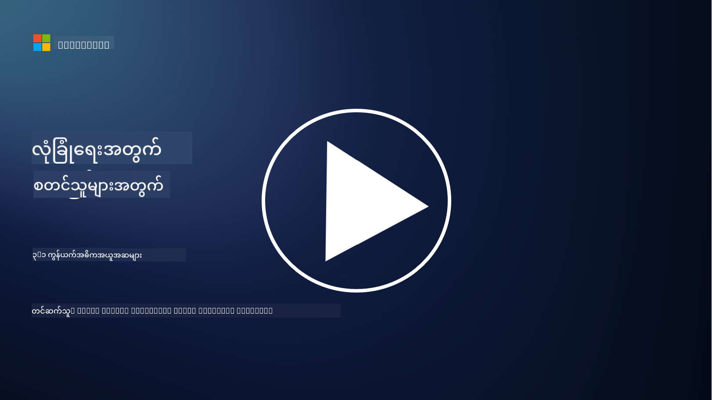
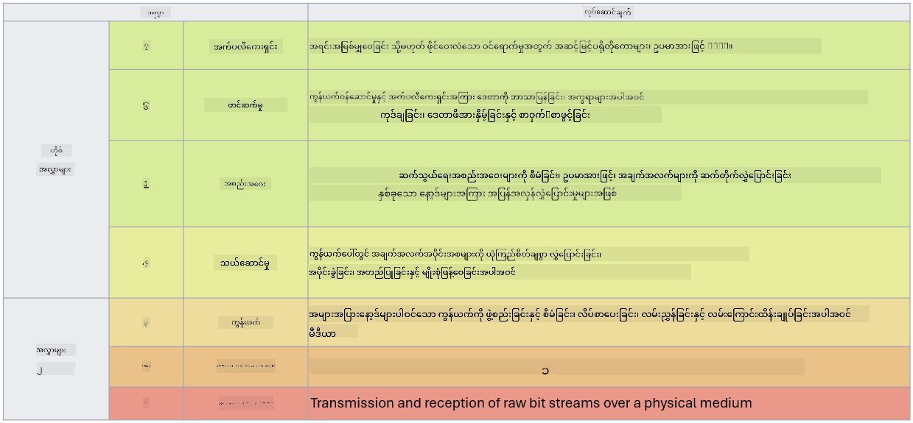

<!--
CO_OP_TRANSLATOR_METADATA:
{
  "original_hash": "252724eceeb183fb9018f88c5e1a3f0c",
  "translation_date": "2025-09-04T01:52:15+00:00",
  "source_file": "3.1 Networking key concepts.md",
  "language_code": "my"
}
-->
# နက်ဝက်ကင်းဆိုင်ရာ အဓိကအကြောင်းအရာများ

သင် IT လုပ်ငန်းတွင် အလုပ်လုပ်ဖူးခဲ့ရင် နက်ဝက်ကင်းဆိုင်ရာ အကြောင်းအရာများနဲ့ ရင်းနှီးနေပြီးဖြစ်နိုင်ပါတယ်။ ခေတ်မီပတ်ဝန်းကျင်များတွင် အဓိကအကာအကွယ်အဖြစ် အတည်ပြုမှု (identity) ကို အသုံးပြုသော်လည်း၊ နက်ဝက်ကင်းဆိုင်ရာ ထိန်းချုပ်မှုများသည် အရေးမပါသောအရာ မဟုတ်ပါ။ ဤအကြောင်းအရာသည် အကျယ်အဝန်းကြီးသောအရာဖြစ်သော်လည်း၊ ဤသင်ခန်းစာတွင် နက်ဝက်ကင်းဆိုင်ရာ အဓိကအချက်အချို့ကို ဖော်ပြသွားပါမည်။

ဤသင်ခန်းစာတွင် ဖော်ပြမည့်အကြောင်းအရာများမှာ -

 - IP လိပ်စာဆိုတာဘာလဲ?

 - OSI မော်ဒယ်ဆိုတာဘာလဲ?

 - TCP/UDP ဆိုတာဘာလဲ?

 - ပေါ့တ်နံပါတ်များဆိုတာဘာလဲ?

 - သိုလှောင်ထားသောအချက်အလက်နှင့် ပို့ဆောင်နေစဉ် အချက်အလက်များကို စာဝှက်ခြင်းဆိုတာဘာလဲ?

## IP လိပ်စာဆိုတာဘာလဲ?

IP လိပ်စာ (Internet Protocol Addressing) ဆိုသည်မှာ အင်တာနက်ပရိုတိုကောကို အသုံးပြုသော ကွန်ပျူတာကွန်ယက်တွင် ချိတ်ဆက်ထားသော စက်များအားလုံးအတွက် သတ်မှတ်ထားသော နံပါတ်တစ်ခုဖြစ်သည်။ ၎င်းသည် ကွန်ယက်အတွင်းရှိ စက်များအတွက် တစ်ခုတည်းသော အထူးသတ်မှတ်ချက်အဖြစ် တာဝန်ထမ်းဆောင်ပြီး၊ အင်တာနက် သို့မဟုတ် အခြားချိတ်ဆက်ထားသော ကွန်ယက်များအတွင်း အချက်အလက်များ ပို့ဆောင်ခြင်းနှင့် လက်ခံခြင်းကို ခွင့်ပြုသည်။ IP လိပ်စာတွင် အဓိကမူကွဲနှစ်ခုရှိသည် - IPv4 (Internet Protocol version 4) နှင့် IPv6 (Internet Protocol version 6) ဖြစ်သည်။ IP လိပ်စာကို IPv4 ပုံစံ (ဥပမာ - 192.168.1.1) သို့မဟုတ် IPv6 ပုံစံ (ဥပမာ - 2001:0db8:85a3:0000:0000:8a2e:0370:7334) အဖြစ် ဖော်ပြလေ့ရှိသည်။

## OSI မော်ဒယ်ဆိုတာဘာလဲ?

OSI (Open Systems Interconnection) မော်ဒယ်သည် ဆက်သွယ်ရေးစနစ်တစ်ခု၏ လုပ်ဆောင်မှုများကို အဆင့်ခုနှစ်ဆင့်အဖြစ် စံပြသတ်မှတ်ထားသော အတွေးအခေါ်စနစ်တစ်ခုဖြစ်သည်။ အဆင့်တစ်ခုစီသည် သတ်မှတ်ထားသော လုပ်ငန်းတာဝန်များကို ထမ်းဆောင်ပြီး၊ ကွန်ယက်အတွင်းရှိ စက်များအကြား အချက်အလက်များကို ထိရောက်စွာနှင့် ယုံကြည်စိတ်ချစွာ ပို့ဆောင်နိုင်ရန် အနီးကပ်အဆင့်များနှင့် ဆက်သွယ်သည်။ အောက်ဆုံးမှ အပေါ်ဆုံးအထိ အဆင့်များမှာ -

 1. ရုပ်ပိုင်းဆိုင်ရာအဆင့် (Physical Layer)

 2. ဒေတာလင့်ခ်အဆင့် (Data Link Layer)

 3. ကွန်ယက်အဆင့် (Network Layer)

 4. ပို့ဆောင်ရေးအဆင့် (Transport Layer)

 5. အစည်းအဝေးအဆင့် (Session Layer)

 6. တင်ဆက်မှုအဆင့် (Presentation Layer)

 7. အက်ပလီကေးရှင်းအဆင့် (Application Layer)

OSI မော်ဒယ်သည် ကွန်ယက်ပရိုတိုကောများနှင့် နည်းပညာများသည် သတ်မှတ်ထားသော ဟာ့ဒ်ဝဲ သို့မဟုတ် ဆော့ဖ်ဝဲအကောင်အထည်မဟုတ်ဘဲ၊ အပြန်အလှန်ဆက်သွယ်ပုံကို နားလည်ရန် အထောက်အကူပြုသော ရည်ညွှန်းချက်တစ်ခုဖြစ်သည်။

_ref: https://en.wikipedia.org/wiki/OSI_model_

## TCP/UDP ဆိုတာဘာလဲ?

TCP (Transmission Control Protocol) နှင့် UDP (User Datagram Protocol) သည် ကွန်ပျူတာကွန်ယက်များတွင် စက်များအကြား ဆက်သွယ်မှုကို အထောက်အကူပြုရန် အသုံးပြုသော အခြေခံပို့ဆောင်ရေးအဆင့် ပရိုတိုကောနှစ်ခုဖြစ်သည်။ ၎င်းတို့သည် အချက်အလက်များကို ပက်ကက်များအဖြစ် ခွဲခြားပို့ဆောင်ပြီး၊ လက်ခံသူဘက်တွင် အစီအစဉ်တကျ ပြန်လည်စုစည်းပေးသည်။ သို့သော်၊ ၎င်းတို့၏ လက္ခဏာများနှင့် အသုံးပြုမှုအခြေအနေများမှာ ကွဲပြားသည်။

**TCP (Transmission Control Protocol)**:

TCP သည် ချိတ်ဆက်မှုအခြေခံပရိုတိုကောဖြစ်ပြီး၊ စက်များအကြား အချက်အလက်များကို ယုံကြည်စိတ်ချစွာနှင့် အစီအစဉ်တကျ ပို့ဆောင်ပေးသည်။ အချက်အလက်များကို ပို့ဆောင်မည်မဆို၊ ပို့ဆောင်သူနှင့် လက်ခံသူအကြား ချိတ်ဆက်မှုတစ်ခုကို စတင်ဖွဲ့စည်းသည်။ TCP သည် ပက်ကက်များကို အစီအစဉ်တကျ ရောက်ရှိစေရန် သေချာစေပြီး၊ ပျောက်ဆုံးသွားသော ပက်ကက်များကို ပြန်လည်ပို့ဆောင်နိုင်စေရန် စီမံဆောင်ရွက်သည်။ ထို့ကြောင့် TCP သည် အချက်အလက်များကို ယုံကြည်စိတ်ချစွာ ပို့ဆောင်ရန် လိုအပ်သော အက်ပလီကေးရှင်းများ (ဥပမာ - ဝဘ်ဘရောက်ဇာ, အီးမေးလ်, ဖိုင်ပို့ဆောင်မှု (FTP), ဒေတာဘေ့စ်ဆက်သွယ်မှု) အတွက် သင့်လျော်သည်။

**UDP (User Datagram Protocol)**:

UDP သည် ချိတ်ဆက်မှုမလိုအပ်သော ပရိုတိုကောဖြစ်ပြီး၊ ပိုမိုမြန်ဆန်သော အချက်အလက်ပို့ဆောင်မှုကို ပေးစွမ်းသော်လည်း TCP ကဲ့သို့ ယုံကြည်စိတ်ချမှုမရှိပါ။ ၎င်းသည် အချက်အလက်များကို ပို့ဆောင်မည်မဆို ချိတ်ဆက်မှုမလိုအပ်ဘဲ၊ ပျောက်ဆုံးသွားသော ပက်ကက်များကို ပြန်လည်ပို့ဆောင်ရန် စီမံဆောင်ရွက်မှုမပါဝင်ပါ။ UDP သည် အချိန်နှင့် ထိရောက်မှုကို အဓိကထားသော အက်ပလီကေးရှင်းများ (ဥပမာ - အချိန်နှင့်တပြေးညီဆက်သွယ်မှု, မီဒီယာစီးဆင်းမှု, အွန်လိုင်းဂိမ်းများ, DNS မေးမြန်းမှုများ) အတွက် သင့်လျော်သည်။

အကျဉ်းချုပ်အားဖြင့်၊ TCP သည် ယုံကြည်စိတ်ချမှုနှင့် အစီအစဉ်တကျ ပို့ဆောင်မှုကို ဦးစားပေးပြီး၊ UDP သည် မြန်နှုန်းနှင့် ထိရောက်မှုကို ဦးစားပေးသည်။ TCP သို့မဟုတ် UDP ကို ရွေးချယ်ရန်သည် အသုံးပြုမည့် အက်ပလီကေးရှင်း သို့မဟုတ် ဝန်ဆောင်မှု၏ လိုအပ်ချက်များပေါ်မူတည်သည်။

## ပေါ့တ်နံပါတ်များဆိုတာဘာလဲ?

ကွန်ယက်တွင် ပေါ့တ်နံပါတ်သည် ကွန်ယက်အတွင်းရှိ တစ်စက်တည်းပေါ်တွင် လည်ပတ်နေသော ဝန်ဆောင်မှု သို့မဟုတ် အက်ပလီကေးရှင်းများကို ခွဲခြားရန် အသုံးပြုသော နံပါတ်တစ်ခုဖြစ်သည်။ ပေါ့တ်များသည် ဝင်ရောက်လာသော အချက်အလက်များကို သင့်လျော်သော အက်ပလီကေးရှင်းသို့ လမ်းညွှန်ပေးသည်။ ပေါ့တ်နံပါတ်များသည် 16-ဘစ် အမည်မရှိသော အင်တီဂါများဖြစ်ပြီး၊ 0 မှ 65535 အထိရှိသည်။ ၎င်းတို့ကို အောက်ပါအတိုင်း ခွဲခြားထားသည် -

- **Well-Known Ports (0-1023)**: HTTP (ပေါ့တ် 80) နှင့် FTP (ပေါ့တ် 21) ကဲ့သို့သော စံဝန်ဆောင်မှုများအတွက် သီးသန့်ထားသည်။

- **Registered Ports (1024-49151)**: စံအကွာအဝေးတွင် မပါဝင်သော်လည်း တရားဝင်မှတ်ပုံတင်ထားသော အက်ပလီကေးရှင်းများနှင့် ဝန်ဆောင်မှုများအတွက် အသုံးပြုသည်။

- **Dynamic/Private Ports (49152-65535)**: အက်ပလီကေးရှင်းများမှ ယာယီ သို့မဟုတ် ပုဂ္ဂလိကအသုံးအတွက် ရရှိနိုင်သည်။

## သိုလှောင်ထားသောအချက်အလက်နှင့် ပို့ဆောင်နေစဉ် အချက်အလက်များကို စာဝှက်ခြင်းဆိုတာဘာလဲ?

စာဝှက်ခြင်းဆိုသည်မှာ အချက်အလက်များကို ခွင့်မပြုထားသော ဝင်ရောက်မှု သို့မဟုတ် ပြင်ဆင်မှုမှ ကာကွယ်ရန် လုံခြုံသောပုံစံတစ်ခုအဖြစ် ပြောင်းလဲခြင်းဖြစ်သည်။ စာဝှက်ခြင်းကို "သိုလှောင်ထားသောအချက်အလက်" (device သို့မဟုတ် server ပေါ်တွင် သိမ်းဆည်းထားသောအချိန်) နှင့် "ပို့ဆောင်နေစဉ်" (စက်များအကြား သို့မဟုတ် ကွန်ယက်များအတွင်း ပို့ဆောင်နေစဉ်) နှစ်မျိုးလုံးတွင် အသုံးပြုနိုင်သည်။

**သိုလှောင်ထားသောအချက်အလက်စာဝှက်ခြင်း**: ၎င်းသည် device, server သို့မဟုတ် သိမ်းဆည်းစနစ်များပေါ်တွင် သိမ်းဆည်းထားသော အချက်အလက်များကို စာဝှက်ခြင်းဖြစ်သည်။ တိုက်ရိုက် device သို့မဟုတ် သိမ်းဆည်းမီဒီယာကို ဝင်ရောက်နိုင်သော်လည်း၊ စာဝှက်ချက်များမရှိပါက အချက်အလက်များကို မရနိုင်ပါ။ ၎င်းသည် device ခိုးယူမှု, အချက်အလက်ပျက်စီးမှု သို့မဟုတ် ခွင့်မပြုထားသော ဝင်ရောက်မှုများအတွက် အရေးကြီးသည်။

**ပို့ဆောင်နေစဉ်စာဝှက်ခြင်း**: ၎င်းသည် စက်များအကြား သို့မဟုတ် ကွန်ယက်များအတွင်း အချက်အလက်များကို ပို့ဆောင်နေစဉ် စာဝှက်ခြင်းဖြစ်သည်။ ၎င်းသည် အချက်အလက်များကို ခိုးကြည့်ခြင်းနှင့် ခွင့်မပြုထားသော ဖမ်းဆီးမှုများမှ ကာကွယ်သည်။ ပို့ဆောင်နေစဉ်စာဝှက်ခြင်းအတွက် အသုံးပြုသော ပုံမှန်ပရိုတိုကောများမှာ ဝဘ်ဆက်သွယ်မှုအတွက် HTTPS နှင့် ကွန်ယက်အသွားအလာအမျိုးမျိုးကို လုံခြုံစေရန် TLS/SSL တို့ဖြစ်သည်။

## ထပ်မံဖတ်ရှုရန်
- [How Do IP Addresses Work? (howtogeek.com)](https://www.howtogeek.com/341307/how-do-ip-addresses-work/)
- [Understanding IP Address: An Introductory Guide (geekflare.com)](https://geekflare.com/understanding-ip-address/)
- [What is the OSI model? The 7 layers of OSI explained (techtarget.com)](https://www.techtarget.com/searchnetworking/definition/OSI)
- [The OSI Model – The 7 Layers of Networking Explained in Plain English (freecodecamp.org)](https://www.freecodecamp.org/news/osi-model-networking-layers-explained-in-plain-english/)
- [TCP/IP protocols - IBM Documentation](https://www.ibm.com/docs/en/aix/7.3?topic=protocol-tcpip-protocols)
- [Common Ports Cheat Sheet: The Ultimate Ports & Protocols List (stationx.net)](https://www.stationx.net/common-ports-cheat-sheet/)
- [Azure Data Encryption-at-Rest - Azure Security | Microsoft Learn](https://learn.microsoft.com/azure/security/fundamentals/encryption-atrest?WT.mc_id=academic-96948-sayoung)

---

**ဝက်ဘ်ဆိုက်မှတ်ချက်**:  
ဤစာရွက်စာတမ်းကို AI ဘာသာပြန်ဝန်ဆောင်မှု [Co-op Translator](https://github.com/Azure/co-op-translator) ကို အသုံးပြု၍ ဘာသာပြန်ထားပါသည်။ ကျွန်ုပ်တို့သည် တိကျမှန်ကန်မှုအတွက် ကြိုးစားနေသော်လည်း၊ အလိုအလျောက်ဘာသာပြန်ခြင်းတွင် အမှားများ သို့မဟုတ် မမှန်ကန်မှုများ ပါဝင်နိုင်ကြောင်း သတိပြုပါ။ မူလဘာသာစကားဖြင့် ရေးသားထားသော စာရွက်စာတမ်းကို အာဏာတည်သော ရင်းမြစ်အဖြစ် သတ်မှတ်သင့်ပါသည်။ အရေးကြီးသော အချက်အလက်များအတွက် လူ့ဘာသာပြန်ပညာရှင်များကို အသုံးပြုရန် အကြံပြုပါသည်။ ဤဘာသာပြန်ကို အသုံးပြုခြင်းမှ ဖြစ်ပေါ်လာသော နားလည်မှုမှားများ သို့မဟုတ် အဓိပ္ပါယ်မှားများအတွက် ကျွန်ုပ်တို့ တာဝန်မယူပါ။