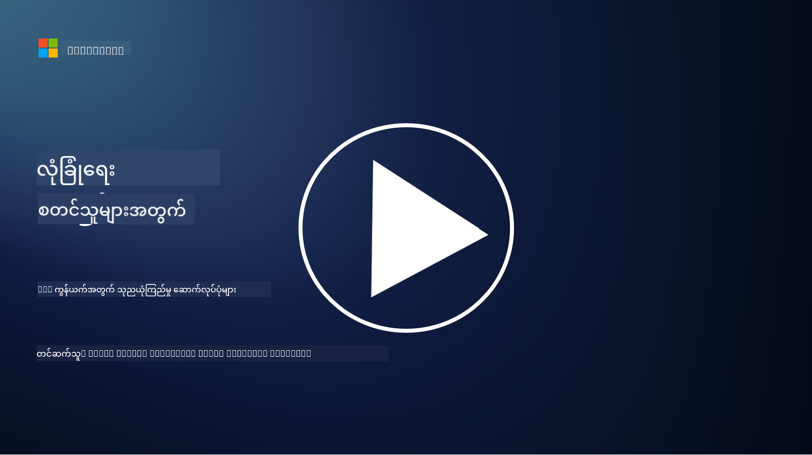

<!--
CO_OP_TRANSLATOR_METADATA:
{
  "original_hash": "680d6e14d9d33fc471c22f44679713f8",
  "translation_date": "2025-09-04T00:42:25+00:00",
  "source_file": "3.2 Networking zero trust architecture.md",
  "language_code": "my"
}
-->
# Networking zero trust architectures

ကွန်ယက်သည် zero trust ထိန်းချုပ်မှုများအတွက် အရေးပါသောအလွှာတစ်ခုဖြစ်ပြီး၊ ဒီသင်ခန်းစာတွင် အောက်ပါအကြောင်းအရာများကို ပိုမိုလေ့လာသွားမည်ဖြစ်သည်-

 - Network Segmentation ဆိုတာဘာလဲ?  
 - Network Segmentation က Zero Trust ကို ဘယ်လိုအကောင်အထည်ဖော်နိုင်စေသလဲ?  
 - End-to-End Encryption ဆိုတာဘာလဲ?  

## Network Segmentation ဆိုတာဘာလဲ?

Network Segmentation ဆိုတာက ကွန်ယက်တစ်ခုကို သေးငယ်ပြီး သီးခြားထားသော အပိုင်းများ သို့မဟုတ် Subnetworks အဖြစ် ခွဲခြားထားခြင်းဖြစ်သည်။ အပိုင်းတစ်ခုနှင့် တစ်ခုအကြား သီးခြားထားပြီး၊ အပိုင်းများအကြား ဝင်ရောက်ခွင့်ကို သတ်မှတ်ထားသော လုံခြုံရေးမူဝါဒများအရ ထိန်းချုပ်ထားသည်။ Network Segmentation ကို အသုံးပြုခြင်းဖြင့် လုံခြုံရေးကို တိုးတက်စေပြီး၊ ဖြစ်နိုင်သော လုံခြုံရေးဖောက်ထွင်းမှုများ၏ သက်ရောက်မှုကို ကန့်သတ်နိုင်သည်။ ထို့အပြင်၊ တိုက်ခိုက်သူများ၏ ကွန်ယက်အတွင်း လှုပ်ရှားမှုများကိုလည်း ကန့်သတ်နိုင်သည်။

Network Segmentation ကို အဖွဲ့အစည်းတစ်ခုအနေဖြင့် "zones" များဖန်တီးခြင်းဖြင့် အသုံးပြုနိုင်ပြီး၊ အသုံးပြုသူအမျိုးမျိုး၊ အက်ပလီကေးရှင်းများနှင့် ဒေတာများကို သီးခြားခွဲခြားထားနိုင်သည်။ ဒီလိုလုပ်ခြင်းက တိုက်ခိုက်မှုဖြစ်နိုင်ခြေကို လျှော့ချပြီး၊ လုံခြုံရေးဖြစ်ရပ်တစ်ခုဖြစ်ပေါ်လာပါက ဖြစ်နိုင်သော နောက်ဆက်တွဲထိခိုက်မှုကိုလည်း လျှော့ချနိုင်သည်။ Network Segmentation ကို Virtual LANs (VLANs), Firewalls, နှင့် Access Controls ကဲ့သို့သော နည်းပညာများဖြင့် အကောင်အထည်ဖော်နိုင်သည်။

## Network Segmentation က Zero Trust ကို ဘယ်လိုအကောင်အထည်ဖော်နိုင်စေသလဲ?

Network Segmentation သည် Zero Trust မော်ဒယ်၏ မူဝါဒများနှင့် နီးကပ်စွာ ကိုက်ညီသည်။ Zero Trust Architecture တွင် Network Segmentation သည် "အနည်းဆုံးလိုအပ်ချက်" မူဝါဒကို အကောင်အထည်ဖော်ရန် အထောက်အကူပြုသည်။ အသုံးပြုသူများနှင့် စက်များသည် မိမိလုပ်ငန်းဆောင်တာများအတွက် လိုအပ်သော အရင်းအမြစ်များနှင့် ဝန်ဆောင်မှုများကိုသာ ဝင်ရောက်ခွင့်ရစေရန် သေချာစေသည်။ ကွန်ယက်ကို သေးငယ်သော zones များအဖြစ် ခွဲခြားခြင်းဖြင့် အဖွဲ့အစည်းများသည် တင်းကြပ်သော ဝင်ရောက်ခွင့်ထိန်းချုပ်မှုများကို အကောင်အထည်ဖော်နိုင်ပြီး၊ အရေးကြီးသော အရင်းအမြစ်များကို သီးခြားထားနိုင်သည်။ ထို့အပြင် တိုက်ခိုက်သူများ၏ လှုပ်ရှားမှုကိုလည်း ကန့်သတ်နိုင်သည်။

Network Segmentation သည် Identity-Based Access Controls ကိုလည်း အကောင်အထည်ဖော်ရာတွင် အထောက်အကူပြုသည်။ အသုံးပြုသူများနှင့် စက်များကို သေချာစွာ အတည်ပြုပြီး၊ သတ်မှတ်ထားသော zones များကို ဝင်ရောက်ခွင့်ရမည်ဖြစ်သည်။ ဒီလိုလုပ်ခြင်းက မလိုလားအပ်သော ဝင်ရောက်မှုများကို ကာကွယ်နိုင်ပြီး၊ လုံခြုံရေးအထောက်အထားများ ဖောက်ထွင်းခံရပါကလည်း ထိခိုက်မှုကို လျှော့ချနိုင်သည်။

## End-to-End Encryption ဆိုတာဘာလဲ?

End-to-End (E2E) Encryption ဆိုတာက ဒေတာတစ်ခုသည် ပေးပို့သူမှ လက်ခံသူထံသို့ ခရီးသွားစဉ်အတွင်း အစအဆုံး စာဝှက်ထားသော အခြေအနေဖြင့်သာ ရှိနေစေရန် သေချာစေသော လုံခြုံရေးနည်းလမ်းတစ်ခုဖြစ်သည်။ ဒီလုပ်ငန်းစဉ်တွင် ဒေတာကို ပေးပို့သူဘက်တွင် စာဝှက်ပြီး၊ လက်ခံသူဘက်တွင်သာ စာဝှက်ဖျော်နိုင်သော key ကို ပိုင်ဆိုင်ထားသည်။ စာဝှက်ခြင်းနှင့် ဖျော်ခြင်းလုပ်ငန်းစဉ်များသည် endpoints များတွင်သာ ဖြစ်ပေါ်သည်။ ထို့ကြောင့် ဝင်ရောက်ခွင့်မရှိသော အခြားသူများ၊ ဝန်ဆောင်မှုပေးသူများ၊ သို့မဟုတ် ကြားခံစနစ်များက plaintext ဒေတာကို မရနိုင်စေပါ။

E2E Encryption သည် ဒေတာပေးပို့မှုအတွက် အလွန်မြင့်မားသော လုံခြုံရေးနှင့် သီးသန့်ကျမှုကို ပေးစွမ်းသည်။ ဒေတာသည် ကြားခံစနစ်များ သို့မဟုတ် ကွန်ယက်များမှ ဖြတ်သန်းသွားစဉ်တွင်တောင်လည်း လုံခြုံစွာ ရှိနေစေသည်။ ဒီနည်းလမ်းကို လုံခြုံသော မက်ဆေ့ဂျ်ပို့ဆောင်မှုအက်ပလီကေးရှင်းများ၊ အီးမေးလ်ဝန်ဆောင်မှုများနှင့် အခြားဆက်သွယ်ရေးပလက်ဖောင်းများတွင် အသုံးပြုသည်။ ဒေတာကို ကြားခံသူများက ဖမ်းမိနိုင်ပါကလည်း စာဝှက်ထားသော အချက်အလက်များသာ မြင်ရမည်ဖြစ်ပြီး၊ စာဝှက်ဖျော်ရန် key မရှိပါက အဓိပ္ပါယ်မရှိသော အချက်အလက်များသာ ဖြစ်နေမည်ဖြစ်သည်။

End-to-End Encryption သည် အသုံးပြုသူ၏ ကိုယ်ရေးကိုယ်တာအချက်အလက်များကို ကာကွယ်ပေးပြီး၊ သီးသန့်ကျမှုကို အထောက်အကူပြုသည့် အရေးပါသော နည်းလမ်းတစ်ခုဖြစ်သည်။

## SASE ဆိုတာဘာလဲ?

SASE သည် "Secure Access Service Edge" ၏ အတိုကောက်ဖြစ်ပြီး၊ ကွန်ယက်လုံခြုံရေးနှင့် Wide-Area Networking (WAN) စွမ်းဆောင်ရည်များကို တစ်ခုတည်းသော Cloud-Based ဝန်ဆောင်မှုအဖြစ် ပေါင်းစပ်ထားသော လုံခြုံရေးဖွဲ့စည်းပုံနှင့် Architecture တစ်ခုဖြစ်သည်။ SASE သည် အဝေးမှနှင့် မိုဘိုင်းအသုံးပြုသူများအတွက် ကွန်ယက်အရင်းအမြစ်များ၊ အက်ပလီကေးရှင်းများနှင့် ဒေတာများကို လုံခြုံစွာ ဝင်ရောက်ခွင့်ရစေရန် ရည်ရွယ်ထားပြီး၊ ကွန်ယက်စီမံခန့်ခွဲမှုကို ရိုးရှင်းစေသည်။ ထို့အပြင်၊ ရိုးရာကွန်ယက်နှင့် လုံခြုံရေးဖွဲ့စည်းပုံများ၏ ရှုပ်ထွေးမှုကိုလည်း လျှော့ချပေးသည်။

SASE ၏ အဓိကအင်္ဂါရပ်များနှင့် အစိတ်အပိုင်းများမှာ-

1.  **Cloud-Based:** SASE သည် Cloud ဝန်ဆောင်မှုအဖြစ် ပေးဆောင်သည်။ ထို့ကြောင့် လုံခြုံရေးနှင့် ကွန်ယက်လုပ်ဆောင်မှုများကို ရိုးရာ On-Premises Hardware များအစား Cloud မှပေးဆောင်သည်။
    
2.  **လုံခြုံရေးနှင့် ကွန်ယက်ပေါင်းစည်းမှု:** SASE သည် Secure Web Gateways (SWG), Firewall as a Service (FWaaS), Data Loss Prevention (DLP), Zero-Trust Network Access (ZTNA) နှင့် WAN Optimization ကဲ့သို့သော လုံခြုံရေးဝန်ဆောင်မှုများကို ပေါင်းစပ်ထားသည်။ ဒီလိုပေါင်းစည်းမှုက လုံခြုံရေးနှင့် ကွန်ယက်လုပ်ငန်းများကို ပိုမိုစနစ်တကျဖြစ်စေသည်။
    
3.  **Zero Trust:** SASE သည် Zero Trust မူဝါဒအပေါ် အခြေခံထားပြီး၊ တင်းကြပ်သော ဝင်ရောက်ခွင့်ထိန်းချုပ်မှုများနှင့် အနည်းဆုံးလိုအပ်ချက်မူဝါဒများကို အကောင်အထည်ဖော်သည်။ အသုံးပြုသူများနှင့် စက်များကို အလိုအလျောက် မယုံကြည်ဘဲ၊ အရင်းအမြစ်များကို ဝင်ရောက်ခွင့်ရမည်ဆိုပါက အတည်ပြုမှုနှင့် ခွင့်ပြုမှုများကို လိုအပ်သည်။
    
4.  **Identity-Centric:** SASE သည် အသုံးပြုသူနှင့် စက်၏ အထောက်အထားများကို အခြေခံ၍ ဝင်ရောက်ခွင့်ထိန်းချုပ်မှုများကို အကောင်အထည်ဖော်သည်။ Identity နှင့် Context-Based မူဝါဒများကို အသုံးပြု၍ ခွင့်ပြုချက်များကို သတ်မှတ်ပြီး၊ အသုံးပြုသူ၏ အပြုအမူနှင့် Context အပေါ်မူတည်၍ မူဝါဒများကို အလိုအလျောက် ပြောင်းလဲနိုင်သည်။
    
5.  **Scalability နှင့် Flexibility:** SASE သည် အသုံးပြုသူများနှင့် စက်များအရေအတွက် များပြားလာသည့်အခါတွင်လည်း အလွယ်တကူ တိုးချဲ့နိုင်သည်။ ထို့ကြောင့် ကွန်ယက်နှင့် လုံခြုံရေးလိုအပ်ချက်များ မျိုးစုံဖြစ်သော အဖွဲ့အစည်းများအတွက် သင့်တော်သည်။
    

SASE သည် အဝေးမှအလုပ်လုပ်ခြင်းနှင့် Cloud အသုံးပြုမှုများ ပိုမိုများပြားလာသည့် ယနေ့ခေတ်တွင် အထူးသင့်လျော်သည်။ ဒါဟာ ကွန်ယက်ဝင်ရောက်ခွင့်ကို လုံခြုံစွာ စီမံခန့်ခွဲနိုင်ရန် Comprehensive နှင့် Agile လမ်းကြောင်းတစ်ခုကို ပေးစွမ်းသည်။ SASE သည် အသုံးပြုသူအလယ်တန်းနှင့် Zero Trust လုံခြုံရေးမော်ဒယ်များကို အဓိကထားပြီး၊ လုံခြုံရေးနှင့် ကွန်ယက်လိုအပ်ချက်များ ပြောင်းလဲလာသည့်အခါတွင်လည်း အဖွဲ့အစည်းများကို လိုက်လျောညီထွေဖြစ်စေသည်။

## ပိုမိုလေ့လာရန်

- [What Is Network Segmentation? - Cisco](https://www.cisco.com/c/en/us/products/security/what-is-network-segmentation.html#~benefits)  
- [What Is Micro-Segmentation? - Cisco](https://www.cisco.com/c/en/us/products/security/what-is-microsegmentation.html)  
- [Implementing Network Segmentation and Segregation | Cyber.gov.au](https://www.cyber.gov.au/resources-business-and-government/maintaining-devices-and-systems/system-hardening-and-administration/network-hardening/implementing-network-segmentation-and-segregation)  
- [What Is Network Segmentation and Why It Matters | CompTIA](https://www.comptia.org/blog/security-awareness-training-network-segmentation)  
- [Network Segmentation: Concepts and Practices (cmu.edu)](https://insights.sei.cmu.edu/blog/network-segmentation-concepts-and-practices/)  
- [Secure networks with Zero Trust | Microsoft Learn](https://learn.microsoft.com/security/zero-trust/deploy/networks?WT.mc_id=academic-96948-sayoung)  
- [What is end-to-end encryption? | IBM](https://www.ibm.com/topics/end-to-end-encryption)  
- [What Is End-to-End Encryption, and Why Does It Matter? (howtogeek.com)](https://www.howtogeek.com/711656/what-is-end-to-end-encryption-and-why-does-it-matter/)  
- [Definition of Secure Access Service Edge (SASE) - Gartner Information Technology Glossary](https://www.gartner.com/en/information-technology/glossary/secure-access-service-edge-sase)  
- [What Is Secure Access Service Edge (SASE)? | Microsoft Security](https://www.microsoft.com/security/business/security-101/what-is-sase?WT.mc_id=academic-96948-sayoung)  

---

**ဝက်ဘ်ဆိုက်မှတ်ချက်**:  
ဤစာရွက်စာတမ်းကို AI ဘာသာပြန်ဝန်ဆောင်မှု [Co-op Translator](https://github.com/Azure/co-op-translator) ကို အသုံးပြု၍ ဘာသာပြန်ထားပါသည်။ ကျွန်ုပ်တို့သည် တိကျမှန်ကန်မှုအတွက် ကြိုးစားနေပါသော်လည်း၊ အလိုအလျောက်ဘာသာပြန်မှုများတွင် အမှားများ သို့မဟုတ် မမှန်ကန်မှုများ ပါဝင်နိုင်သည်ကို ကျေးဇူးပြု၍ သတိပြုပါ။ မူရင်းစာရွက်စာတမ်းကို ၎င်း၏ မူလဘာသာစကားဖြင့် အာဏာတည်သောရင်းမြစ်အဖြစ် သတ်မှတ်ရန် လိုအပ်ပါသည်။ အရေးကြီးသော အချက်အလက်များအတွက် လူကောင်းမွန်သော ပရော်ဖက်ရှင်နယ်ဘာသာပြန်ဝန်ဆောင်မှုကို အကြံပြုပါသည်။ ဤဘာသာပြန်မှုကို အသုံးပြုခြင်းမှ ဖြစ်ပေါ်လာသော နားလည်မှုမှားများ သို့မဟုတ် အဓိပ္ပါယ်မှားများအတွက် ကျွန်ုပ်တို့သည် တာဝန်မယူပါ။