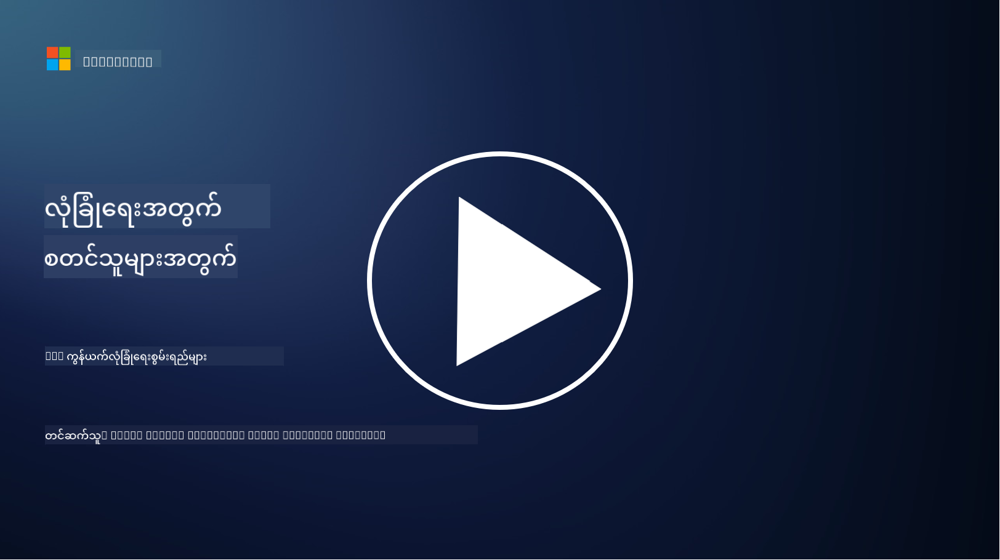

<!--
CO_OP_TRANSLATOR_METADATA:
{
  "original_hash": "c3aba077bb98eebc925dd58d870229ab",
  "translation_date": "2025-09-03T23:36:53+00:00",
  "source_file": "3.3 Network security capabilities.md",
  "language_code": "my"
}
-->
# ကွန်ယက်လုံခြုံရေးစွမ်းရည်များ

ဒီသင်ခန်းစာမှာ ကွန်ယက်ကိုလုံခြုံစေဖို့အသုံးပြုနိုင်တဲ့အောက်ပါစွမ်းရည်များကိုလေ့လာပါမယ်-

 - ရိုးရာမီးကွင်း
 - ဝက်ဘ်အပလီကေးရှင်းမီးကွင်း
 - Cloud security groups
 - CDN
 - Load balancers
 - Bastion hosts
 - VPNs
 - DDoS ကာကွယ်မှု

## ရိုးရာမီးကွင်းများ

ရိုးရာမီးကွင်းများသည် သတ်မှတ်ထားသောလုံခြုံရေးစည်းမျဉ်းများအရ ကွန်ယက်ထဲဝင်လာသောနှင့်ထွက်သွားသော traffic ကိုထိန်းချုပ်ပြီးကြည့်ရှုသောလုံခြုံရေးပစ္စည်းများဖြစ်သည်။ ၎င်းတို့သည် ယုံကြည်ရသောအတွင်းပိုင်းကွန်ယက်နှင့် ယုံကြည်ရမရသောအပြင်ဘက်ကွန်ယက်များအကြားတားဆီးမှုအဖြစ်လုပ်ဆောင်ပြီး traffic ကိုစစ်ထုတ်ကာ မလိုလားအပ်သောဝင်ရောက်မှုများနှင့်အန္တရာယ်များကိုကာကွယ်ပေးသည်။

## ဝက်ဘ်အပလီကေးရှင်းမီးကွင်းများ

ဝက်ဘ်အပလီကေးရှင်းမီးကွင်းများ (WAFs) သည် SQL injection, cross-site scripting နှင့်အခြားအန္တရာယ်များကဲ့သို့သော ဝက်ဘ်အပလီကေးရှင်းများကိုတိုက်ခိုက်မှုများမှကာကွယ်ရန်အထူးပြုလုပ်ထားသောမီးကွင်းများဖြစ်သည်။ ၎င်းတို့သည် HTTP requests နှင့် responses ကိုခွဲခြားစစ်ဆေးကာ ဝက်ဘ်အပလီကေးရှင်းများကိုပစ်မှတ်ထားသောမကောင်းသော traffic ကိုတားဆီးပေးသည်။

## Cloud security groups

Security groups သည် cloud service providers များမှပေးသောအခြေခံကွန်ယက်လုံခြုံရေးအင်္ဂါရပ်များဖြစ်သည်။ ၎င်းတို့သည် virtual firewalls အဖြစ်လုပ်ဆောင်ကာ cloud resources (ဥပမာ- virtual machines (VMs) နှင့် instances) သို့ဝင်လာသောနှင့်ထွက်သွားသော traffic ကိုထိန်းချုပ်ပေးသည်။ Security groups သည် traffic အမျိုးအစားများကို ခွင့်ပြုမည်/တားဆီးမည်ကိုသတ်မှတ်နိုင်သောစည်းမျဉ်းများကိုဖန်တီးရန်အဖွဲ့အစည်းများကိုခွင့်ပြုကာ cloud deployments များအတွက်အပိုလုံခြုံရေးအလွှာတစ်ခုထည့်သွင်းပေးသည်။

## Content Delivery Network (CDN)

Content Delivery Network သည် မျိုးစုံသောဒေသများတွင်တည်ရှိသော server များဖြန့်ဝေထားသောကွန်ယက်ဖြစ်သည်။ CDN များသည် website များ၏စွမ်းဆောင်ရည်နှင့်ရရှိနိုင်မှုကိုတိုးတက်စေပြီး content ကို caching လုပ်ကာ အသုံးပြုသူနှင့်အနီးဆုံး server များမှပေးဆောင်သည်။ ၎င်းတို့သည် DDoS တိုက်ခိုက်မှုများကို traffic ကို server တည်နေရာများစွာတွင်ဖြန့်ဝေခြင်းဖြင့်တစ်စိတ်တစ်ပိုင်းကာကွယ်ပေးသည်။

## Load Balancers

Load balancers သည် ဝင်လာသော network traffic ကို server များစွာတွင်ဖြန့်ဝေကာ resource အသုံးပြုမှုကိုအကောင်းဆုံးဖြစ်စေပြီး ရရှိနိုင်မှုမြင့်မားစေကာ အပလီကေးရှင်းစွမ်းဆောင်ရည်ကိုတိုးတက်စေသည်။ ၎င်းတို့သည် server overload ကိုကာကွယ်ကာ response time များကိုထိန်းသိမ်းကာ ကွန်ယက်၏တည်ငြိမ်မှုကိုတိုးတက်စေသည်။

## Bastion Hosts

Bastion hosts သည် အပြင်ဘက်ကွန်ယက် (ဥပမာ- အင်တာနက်) မှအတွင်းပိုင်းကွန်ယက်သို့ဝင်ရောက်ရန်အတွက် ထိန်းချုပ်ထားသောလုံခြုံသော server များဖြစ်သည်။ ၎င်းတို့သည် administrator များအတွက်အတွင်းပိုင်းစနစ်များကိုလုံခြုံစွာဝင်ရောက်နိုင်ရန် entry point အဖြစ်လုပ်ဆောင်သည်။ Bastion hosts များကို အန္တရာယ်များကိုလျှော့ချရန်အတွက် အထူးလုံခြုံရေးအတိုင်းအတာများဖြင့်တပ်ဆင်ထားသည်။

## Virtual Private Networks (VPNs)

VPNs သည် အသုံးပြုသူ၏ device နှင့် remote server အကြားအချက်အလက်များကိုစကားဝှက်ထားသောလမ်းကြောင်းများဖန်တီးကာ အင်တာနက်ကဲ့သို့သောလုံခြုံမှုမရှိသောကွန်ယက်များပေါ်တွင်လုံခြုံပြီးကိုယ်ပိုင်ဆက်သွယ်မှုကိုသေချာစေသည်။ VPNs များကို အတွင်းပိုင်းကွန်ယက်များသို့ remote access ပေးရန်အသုံးပြုပြီး အသုံးပြုသူများကို တစ်နေရာတည်းတွင် physically ရှိနေသကဲ့သို့ resource များကိုဝင်ရောက်နိုင်စေသည်။

## DDoS ကာကွယ်မှု tools

DDoS (Distributed Denial of Service) ကာကွယ်မှု tools နှင့် services များသည် DDoS တိုက်ခိုက်မှုများ၏အကျိုးသက်ရောက်မှုကိုလျှော့ချရန်အတွက်ဖန်တီးထားသည်။ DDoS တိုက်ခိုက်မှုများသည် compromised devices များစွာမှ network သို့မဟုတ် service ကို overload ဖြစ်စေရန် traffic များဖြန့်ဝေခြင်းဖြစ်သည်။ DDoS ကာကွယ်မှုဖြေရှင်းချက်များသည် မကောင်းသော traffic ကိုစစ်ထုတ်ကာ legitimate traffic သည်၎င်း၏ရည်ရွယ်ထားသော destination သို့ရောက်ရှိနိုင်စေရန်သေချာစေသည်။

## အပိုဖတ်ရှုရန်

- [What Is a Firewall? - Cisco](https://www.cisco.com/c/en/us/products/security/firewalls/what-is-a-firewall.html#~types-of-firewalls)
- [What Does a Firewall Actually Do? (howtogeek.com)](https://www.howtogeek.com/144269/htg-explains-what-firewalls-actually-do/)
- [What is a Firewall? How Firewalls Work & Types of Firewalls (kaspersky.com)](https://www.kaspersky.com/resource-center/definitions/firewall)
- [Network security group - how it works | Microsoft Learn](https://learn.microsoft.com/azure/virtual-network/network-security-group-how-it-works)
- [Introduction to Azure Content Delivery Network (CDN) - Training | Microsoft Learn](https://learn.microsoft.com/training/modules/intro-to-azure-content-delivery-network/?WT.mc_id=academic-96948-sayoung)
- [What is a content delivery network (CDN)? - Azure | Microsoft Learn](https://learn.microsoft.com/azure/cdn/cdn-overview?WT.mc_id=academic-96948-sayoung)
- [What Is Load Balancing? How Load Balancers Work (nginx.com)](https://www.nginx.com/resources/glossary/load-balancing/)
- [Bastion hosts vs. VPNs · Tailscale](https://tailscale.com/learn/bastion-hosts-vs-vpns/)
- [What is VPN? How It Works, Types of VPN (kaspersky.com)](https://www.kaspersky.com/resource-center/definitions/what-is-a-vpn)
- [Introduction to Azure DDoS Protection - Training | Microsoft Learn](https://learn.microsoft.com/training/modules/introduction-azure-ddos-protection/?WT.mc_id=academic-96948-sayoung)
- [What Is a DDoS Attack? | Microsoft Security](https://www.microsoft.com/security/business/security-101/what-is-a-ddos-attack?WT.mc_id=academic-96948-sayoung)

---

**ဝက်ဘ်ဆိုက်မှတ်ချက်**:  
ဤစာရွက်စာတမ်းကို AI ဘာသာပြန်ဝန်ဆောင်မှု [Co-op Translator](https://github.com/Azure/co-op-translator) ကို အသုံးပြု၍ ဘာသာပြန်ထားပါသည်။ ကျွန်ုပ်တို့သည် တိကျမှန်ကန်မှုအတွက် ကြိုးစားနေပါသော်လည်း၊ အလိုအလျောက်ဘာသာပြန်မှုများတွင် အမှားများ သို့မဟုတ် မမှန်ကန်မှုများ ပါဝင်နိုင်သည်ကို ကျေးဇူးပြု၍ သတိပြုပါ။ မူရင်းစာရွက်စာတမ်းကို ၎င်း၏ မူလဘာသာစကားဖြင့် အာဏာတည်သောရင်းမြစ်အဖြစ် သတ်မှတ်ရန် လိုအပ်ပါသည်။ အရေးကြီးသော အချက်အလက်များအတွက် လူကောင်းမွန်သော ပရော်ဖက်ရှင်နယ်ဘာသာပြန်ဝန်ဆောင်မှုကို အကြံပြုပါသည်။ ဤဘာသာပြန်မှုကို အသုံးပြုခြင်းမှ ဖြစ်ပေါ်လာသော နားလည်မှုမှားများ သို့မဟုတ် အဓိပ္ပါယ်မှားများအတွက် ကျွန်ုပ်တို့သည် တာဝန်မယူပါ။