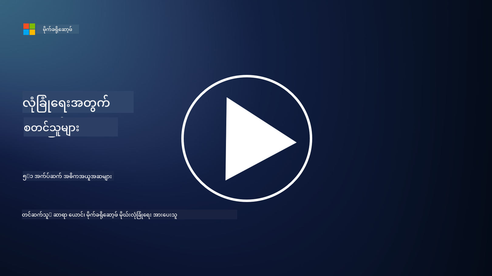

<!--
CO_OP_TRANSLATOR_METADATA:
{
  "original_hash": "e4b56bb23078d3ffb7ad407d280b0c36",
  "translation_date": "2025-09-04T00:34:52+00:00",
  "source_file": "5.1 AppSec key concepts.md",
  "language_code": "my"
}
-->
# AppSec အဓိကအကြောင်းအရာများ

Application security သည် သီးခြားလေ့လာရမည့် လုံခြုံရေးအထူးပြုဘာသာရပ်တစ်ခုဖြစ်သည်။ ဒီသင်ခန်းစာတွင် Application security အကြောင်းကို ပိုမိုနက်နက်နဲနဲ လေ့လာသွားမည်ဖြစ်သည်။

## အကျဉ်းချုပ်

ဒီသင်ခန်းစာမှာ ကျွန်တော်တို့ လေ့လာမည့်အရာများမှာ:

- Application security ဆိုတာဘာလဲ?

- Application security ရဲ့ အဓိကအကြောင်းအရာများ/မူဘောင်များက ဘာတွေလဲ?

## Application security ဆိုတာဘာလဲ?

Application security ကို "AppSec" လို့ အတိုကောက်ခေါ်ကြပြီး၊ ဒါဟာ ဆော့ဖ်ဝဲလ်များကို လုံခြုံရေးအန္တရာယ်များ၊ အားနည်းချက်များနှင့် တိုက်ခိုက်မှုများမှ ကာကွယ်ပေးရန်အတွက် လုပ်ဆောင်မှုတစ်ရပ်ဖြစ်သည်။ ၎င်းသည် ဆော့ဖ်ဝဲလ်တစ်ခု၏ ဖွံ့ဖြိုးမှု၊ တပ်ဆင်မှုနှင့် ပြုပြင်ထိန်းသိမ်းမှု လက်ရှိအဆင့်များအတွင်း လုံခြုံရေးအန္တရာယ်များကို ရှာဖွေ၊ လျော့ပါးစေခြင်းနှင့် ကာကွယ်ပေးရန် အသုံးပြုသော လုပ်ငန်းစဉ်များ၊ နည်းလမ်းများနှင့် ကိရိယာများကို အကျုံးဝင်သည်။

Application security သည် အရေးကြီးသောအချက်တစ်ခုဖြစ်သည်၊ အကြောင်းမှာ ဆော့ဖ်ဝဲလ်များသည် စက်မှုလက်မှုလောကတွင် အများဆုံး တိုက်ခိုက်မှုများခံရသော ပစ္စည်းများဖြစ်ကြသည်။ မကောင်းဆိုးဝါးများသည် ဆော့ဖ်ဝဲလ်၏ အားနည်းချက်များနှင့် အားနည်းသောနေရာများကို အသုံးချပြီး ခွင့်မပြုထားသော ဝင်ရောက်မှုများ၊ ဒေတာခိုးယူမှုများ၊ ဝန်ဆောင်မှုများကို ဖျက်ဆီးခြင်း သို့မဟုတ် အခြားမကောင်းဆိုးဝါး လှုပ်ရှားမှုများကို လုပ်ဆောင်ကြသည်။ ထိရောက်သော Application security သည် ဆော့ဖ်ဝဲလ်နှင့် ၎င်းနှင့်ဆက်စပ်သော ဒေတာများ၏ လျှို့ဝှက်မှု၊ တရားဝင်မှုနှင့် ရရှိနိုင်မှုကို သေချာစေသည်။

## Application security ရဲ့ အဓိကအကြောင်းအရာများ/မူဘောင်များက ဘာတွေလဲ?

Application security ကို အခြေခံထားသော အဓိကအကြောင်းအရာများနှင့် မူဘောင်များမှာ အောက်ပါအတိုင်းဖြစ်သည်-

1. **Secure by Design**:

- လုံခြုံရေးကို ဆော့ဖ်ဝဲလ်၏ ဒီဇိုင်းနှင့် ဖွဲ့စည်းမှုအဆင့်မှစ၍ ထည့်သွင်းထားရမည်၊ နောက်ကျမှ ထည့်သွင်းခြင်းမဟုတ်ရ။

2. **Input Validation**:

- အသုံးပြုသူ၏ အချက်အလက်များအားလုံးကို စစ်ဆေးပြီး၊ မျှော်မှန်းထားသော ပုံစံများနှင့် ကိုက်ညီမှုရှိကြောင်းနှင့် မကောင်းဆိုးဝါး ကုဒ် သို့မဟုတ် ဒေတာများမပါဝင်ကြောင်း သေချာရမည်။

3. **Output Encoding**:

- Client သို့ ပို့သော ဒေတာများကို မှန်ကန်စွာ encode လုပ်ထားရမည်၊ ဥပမာ Cross-Site Scripting (XSS) ကဲ့သို့သော အားနည်းချက်များကို ကာကွယ်ရန်။

4. **Authentication and Authorization**:

- အသုံးပြုသူများကို အတည်ပြုပြီး၊ ၎င်းတို့၏ အခန်းကဏ္ဍနှင့် ခွင့်ပြုချက်အရ အရင်းအမြစ်များကို အသုံးပြုခွင့်ပေးရမည်။

5. **Data Protection**:

- အရေးကြီးသော ဒေတာများကို သိမ်းဆည်းမှု၊ ပို့ဆောင်မှုနှင့် လုပ်ဆောင်မှုအတွင်း Encryption လုပ်ထားရမည်၊ ခွင့်မပြုထားသော ဝင်ရောက်မှုများမှ ကာကွယ်ရန်။

6. **Session Management**:

- အသုံးပြုသူ၏ session များကို hijacking နှင့် ခွင့်မပြုထားသော ဝင်ရောက်မှုများမှ ကာကွယ်ရန် လုံခြုံစွာ စီမံခန့်ခွဲရမည်။

7. **Secure Dependencies**:

- ဆော့ဖ်ဝဲလ်၏ Dependencies များအားလုံးကို လုံခြုံရေး patch များဖြင့် အမြဲတမ်း အပ်ဒိတ်လုပ်ထားရမည်။

8. **Error Handling and Logging**:

- အချက်အလက်အရေးကြီးများ မဖော်ပြစေရန် လုံခြုံသော error handling ကို အကောင်အထည်ဖော်ပြီး၊ လုံခြုံသော logging လုပ်ငန်းစဉ်များကို အကောင်အထည်ဖော်ရမည်။

9. **Security Testing**:

- Penetration testing, code reviews, automated scanning tools ကဲ့သို့သော နည်းလမ်းများကို အသုံးပြု၍ ဆော့ဖ်ဝဲလ်များကို အားနည်းချက်များအတွက် အမြဲတမ်း စမ်းသပ်ရမည်။

10. **Secure Software Development Lifecycle (SDLC)**:

- လုံခြုံရေးလုပ်ငန်းစဉ်များကို ဆော့ဖ်ဝဲလ်ဖွံ့ဖြိုးမှု၏ အဆင့်တိုင်းတွင် ထည့်သွင်းရမည်၊ ဥပမာ Requirements, Deployment နှင့် Maintenance အထိ။

## ထပ်မံဖတ်ရှုရန်

- [SheHacksPurple: What is Application Security? - YouTube](https://www.youtube.com/watch?v=eNmccQNzSSY)
- [What Is Application Security? - Cisco](https://www.cisco.com/c/en/us/solutions/security/application-first-security/what-is-application-security.html#~how-does-it-work)
- [What is application security? A process and tools for securing software | CSO Online](https://www.csoonline.com/article/566471/what-is-application-security-a-process-and-tools-for-securing-software.html)
- [OWASP Cheat Sheet Series | OWASP Foundation](https://owasp.org/www-project-cheat-sheets/)

---

**ဝက်ဘ်ဆိုက်မှတ်ချက်**:  
ဤစာရွက်စာတမ်းကို AI ဘာသာပြန်ဝန်ဆောင်မှု [Co-op Translator](https://github.com/Azure/co-op-translator) ကို အသုံးပြု၍ ဘာသာပြန်ထားပါသည်။ ကျွန်ုပ်တို့သည် တိကျမှန်ကန်မှုအတွက် ကြိုးစားနေသော်လည်း၊ အလိုအလျောက်ဘာသာပြန်ဆိုမှုများတွင် အမှားများ သို့မဟုတ် မတိကျမှုများ ပါဝင်နိုင်သည်ကို ကျေးဇူးပြု၍ သတိပြုပါ။ မူရင်းစာရွက်စာတမ်းကို ၎င်း၏ မူလဘာသာစကားဖြင့် အာဏာတည်သောရင်းမြစ်အဖြစ် သတ်မှတ်ပါ။ အရေးကြီးသော အချက်အလက်များအတွက် လူ့ဘာသာပြန်ပညာရှင်များမှ ပြန်ဆိုမှုကို အကြံပြုပါသည်။ ဤဘာသာပြန်ကို အသုံးပြုခြင်းမှ ဖြစ်ပေါ်လာသော နားလည်မှုမှားများ သို့မဟုတ် အဓိပ္ပါယ်မှားများအတွက် ကျွန်ုပ်တို့သည် တာဝန်မယူပါ။