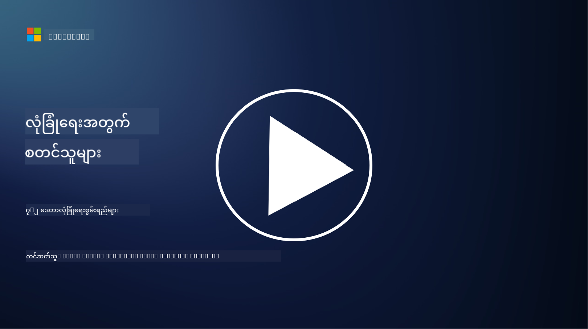

<!--
CO_OP_TRANSLATOR_METADATA:
{
  "original_hash": "50697add9758e54693442d502d2d5f8a",
  "translation_date": "2025-09-04T00:59:22+00:00",
  "source_file": "7.2 Data security capabilities.md",
  "language_code": "my"
}
-->
# ဒေတာလုံခြုံရေးစွမ်းရည်များ

ဤအပိုင်းတွင် ဒေတာလုံခြုံရေးအတွက် အသုံးပြုသော အဓိကကိရိယာများနှင့် စွမ်းရည်များအကြောင်း အသေးစိတ်ကို ဆွေးနွေးသွားပါမည်။

**နိဒါန်း**

ဤသင်ခန်းစာတွင် ကျွန်ုပ်တို့ ဆွေးနွေးမည့်အကြောင်းအရာများမှာ-

- ဒေတာဆုံးရှုံးမှုကာကွယ်ရေးကိရိယာများဆိုတာဘာလဲ?

- အတွင်းပိုင်းအန္တရာယ်စီမံခန့်ခွဲမှုကိရိယာများဆိုတာဘာလဲ?

- ဒေတာသိမ်းဆည်းမှုအတွက် ရနိုင်သောကိရိယာများက ဘာတွေလဲ?

## ဒေတာဆုံးရှုံးမှုကာကွယ်ရေးကိရိယာများဆိုတာဘာလဲ?

ဒေတာဆုံးရှုံးမှုကာကွယ်ရေး (DLP) ကိရိယာများဆိုသည်မှာ အဖွဲ့အစည်းအတွင်းရှိ အရေးကြီးသော ဒေတာများကို မလိုလားအပ်သော ဝင်ရောက်မှု၊ မျှဝေမှု သို့မဟုတ် ယိုစိမ့်မှုများမှ ကာကွယ်ရန် ရည်ရွယ်ထားသော ဆော့ဖ်ဝဲဖြေရှင်းနည်းများနှင့် နည်းပညာများကို ဆိုလိုသည်။ ဤကိရိယာများသည် အကြောင်းအရာစစ်ဆေးမှု၊ မူဝါဒအကောင်အထည်ဖော်မှုနှင့် စောင့်ကြည့်မှုများကို အသုံးပြုကာ အရေးကြီးသော ဒေတာများကို ဖော်ထုတ်ပြီး ကာကွယ်ပေးပါသည်။ ဥပမာ DLP ထုတ်ကုန်များမှာ- Symantec Data Loss Prevention, McAfee Total Protection for Data Loss Prevention, Microsoft 365 DLP**: Microsoft 365 အပလီကေးရှင်းများနှင့် ပေါင်းစပ်ပြီး အဖွဲ့အစည်းများအတွက် အီးမေးလ်များ၊ စာရွက်စာတမ်းများနှင့် မက်ဆေ့များအတွင်းရှိ အရေးကြီးသော ဒေတာများကို ဖော်ထုတ်ကာ ကာကွယ်ပေးသည်။

## အတွင်းပိုင်းအန္တရာယ်စီမံခန့်ခွဲမှုကိရိယာများဆိုတာဘာလဲ?

အတွင်းပိုင်းအန္တရာယ်စီမံခန့်ခွဲမှုကိရိယာများသည် ဝန်ထမ်းများ၊ ကာရံသူများ သို့မဟုတ် မိတ်ဖက်များက မတော်တဆ သို့မဟုတ် တမင်တကာ ဒေတာလုံခြုံရေးကို ချိုးဖောက်နိုင်သည့် အန္တရာယ်များကို ဖော်ထုတ်ကာ လျှော့ချရန် အဖွဲ့အစည်းများကို ကူညီပေးသည်။ ဤကိရိယာများသည် အသုံးပြုသူအပြုအမူများ၊ ဝင်ရောက်မှုပုံစံများနှင့် ဒေတာအသုံးပြုမှုများကို စောင့်ကြည့်ကာ သံသယဖြစ်စရာ လှုပ်ရှားမှုများနှင့် အတွင်းပိုင်းအန္တရာယ်များကို ရှာဖွေသည်။ ဥပမာ အတွင်းပိုင်းအန္တရာယ်စီမံခန့်ခွဲမှုထုတ်ကုန်များမှာ- Microsoft Insider Risk Management (Microsoft 365 ၏ အစိတ်အပိုင်းတစ်ခု), Forcepoint Insider Threat Data Protection, Varonis Insider Threat Detection.

## ဒေတာသိမ်းဆည်းမှုအတွက် ရနိုင်သောကိရိယာများက ဘာတွေလဲ?

ဒေတာသိမ်းဆည်းမှုကိရိယာများသည် အဖွဲ့အစည်း၏ ဒေတာသိမ်းဆည်းမှုမူဝါဒများနှင့် ဥပဒေရေးရာလိုအပ်ချက်များနှင့် ကိုက်ညီစွာ ဒေတာကို သိမ်းဆည်းခြင်းနှင့် ဖျက်သိမ်းခြင်းကို စီမံခန့်ခွဲရန် ရည်ရွယ်ထားသော ဆော့ဖ်ဝဲနှင့် ဖြေရှင်းနည်းများကို ပါဝင်သည်။ ဤကိရိယာများသည် ဒေတာကို သတ်မှတ်ထားသော ကာလအတွင်း သိမ်းဆည်းရန်နှင့် မလိုအပ်တော့သောအခါ လုံခြုံစွာ ဖျက်သိမ်းရန် လုပ်ငန်းစဉ်များကို အလိုအလျောက်လုပ်ဆောင်ရန် ကူညီပေးသည်။ ဥပမာ ဒေတာသိမ်းဆည်းမှုထုတ်ကုန်များမှာ- Veritas Enterprise Vault, Commvault Complete Data Protection, Microsoft data lifecycle management. ဤကိရိယာဖြေရှင်းနည်းများသည် ဒေတာသိမ်းဆည်းမှုနှင့် ဖျက်သိမ်းမှုကို ထိန်းချုပ်ထားနိုင်စေရန် အဖွဲ့အစည်းများကို ကူညီပေးပြီး ဒေတာကာကွယ်ရေးစည်းမျဉ်းများနှင့် ကိုက်ညီစွာ ဒေတာကို ၎င်း၏ အသက်တာလျှောက်လုံး ထိရောက်စွာ စီမံခန့်ခွဲနိုင်စေသည်။

## ထပ်မံဖတ်ရှုရန်

- [Guide to Data Security Posture Management (DSPM) | CSA (cloudsecurityalliance.org)](https://cloudsecurityalliance.org/blog/2023/03/31/the-big-guide-to-data-security-posture-management-dspm/)
- [Data Loss Prevention across endpoints, apps, & services | Microsoft Purview](https://youtu.be/hvqq8L_0kgI)
- [18 Best Data Loss Prevention Software Tools 2023 (Free + Paid) (comparitech.com)](https://www.comparitech.com/data-privacy-management/data-loss-prevention-tools-software/)
- [Data Loss Prevention (nist.gov)](https://tsapps.nist.gov/publication/get_pdf.cfm?pub_id=904672)
- [Learn about insider risk management | Microsoft Learn](https://learn.microsoft.com/purview/insider-risk-management?WT.mc_id=academic-96948-sayoung)
- [Data Lifecycle Management | IBM](https://www.ibm.com/topics/data-lifecycle-management)
- [What Is Data Lifecycle Management (DLM)? | 2023 Best Practices (selecthub.com)](https://www.selecthub.com/big-data-analytics/data-lifecycle-management/)

---

**ဝက်ဘ်ဆိုက်မှတ်ချက်**:  
ဤစာရွက်စာတမ်းကို AI ဘာသာပြန်ဝန်ဆောင်မှု [Co-op Translator](https://github.com/Azure/co-op-translator) ကို အသုံးပြု၍ ဘာသာပြန်ထားပါသည်။ ကျွန်ုပ်တို့သည် တိကျမှန်ကန်မှုအတွက် ကြိုးစားနေပါသော်လည်း၊ အလိုအလျောက်ဘာသာပြန်မှုများတွင် အမှားများ သို့မဟုတ် မမှန်ကန်မှုများ ပါဝင်နိုင်သည်ကို ကျေးဇူးပြု၍ သတိပြုပါ။ မူရင်းစာရွက်စာတမ်းကို ၎င်း၏ မူလဘာသာစကားဖြင့် အာဏာတည်သောရင်းမြစ်အဖြစ် သတ်မှတ်ရန် လိုအပ်ပါသည်။ အရေးကြီးသော အချက်အလက်များအတွက် လူက ဘာသာပြန်မှုကို အသုံးပြုရန် အကြံပြုပါသည်။ ဤဘာသာပြန်မှုကို အသုံးပြုခြင်းမှ ဖြစ်ပေါ်လာသော နားလည်မှုမှားမှုများ သို့မဟုတ် အဓိပ္ပါယ်မှားမှုများအတွက် ကျွန်ုပ်တို့သည် တာဝန်မယူပါ။