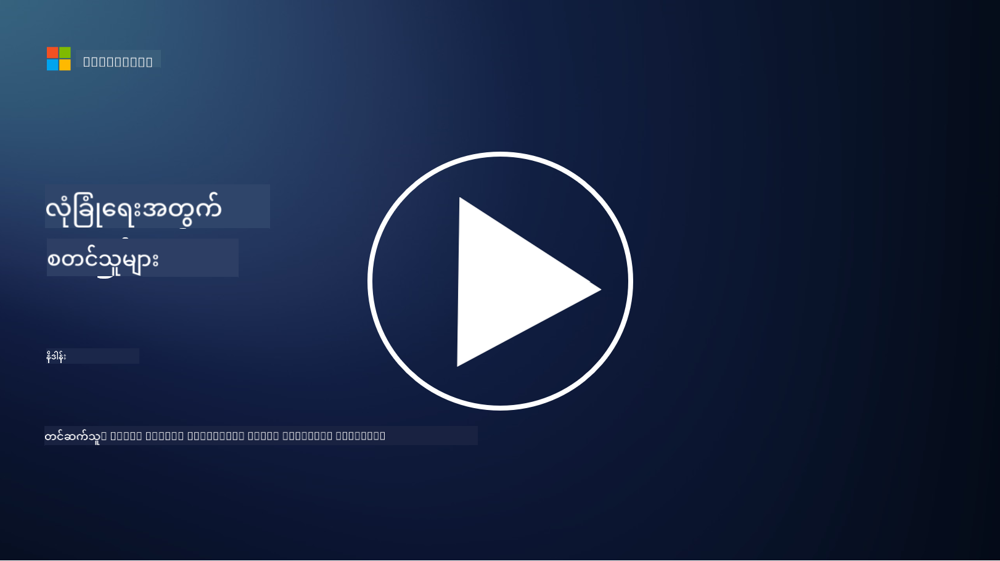

<!--
CO_OP_TRANSLATOR_METADATA:
{
  "original_hash": "79a7e63fa60f649eb3560e1cd7246272",
  "translation_date": "2025-11-18T17:51:21+00:00",
  "source_file": "README.md",
  "language_code": "my"
}
-->

### 🌐 ဘာသာစကားများ အထောက်အပံ့

#### GitHub Action မှတဆင့် အလိုအလျောက် (အမြဲတမ်း နောက်ဆုံးပေါ်)

<!-- CO-OP TRANSLATOR LANGUAGES TABLE START -->
[Arabic](../ar/README.md) | [Bengali](../bn/README.md) | [Bulgarian](../bg/README.md) | [Burmese (Myanmar)](./README.md) | [Chinese (Simplified)](../zh/README.md) | [Chinese (Traditional, Hong Kong)](../hk/README.md) | [Chinese (Traditional, Macau)](../mo/README.md) | [Chinese (Traditional, Taiwan)](../tw/README.md) | [Croatian](../hr/README.md) | [Czech](../cs/README.md) | [Danish](../da/README.md) | [Dutch](../nl/README.md) | [Estonian](../et/README.md) | [Finnish](../fi/README.md) | [French](../fr/README.md) | [German](../de/README.md) | [Greek](../el/README.md) | [Hebrew](../he/README.md) | [Hindi](../hi/README.md) | [Hungarian](../hu/README.md) | [Indonesian](../id/README.md) | [Italian](../it/README.md) | [Japanese](../ja/README.md) | [Korean](../ko/README.md) | [Lithuanian](../lt/README.md) | [Malay](../ms/README.md) | [Marathi](../mr/README.md) | [Nepali](../ne/README.md) | [Nigerian Pidgin](../pcm/README.md) | [Norwegian](../no/README.md) | [Persian (Farsi)](../fa/README.md) | [Polish](../pl/README.md) | [Portuguese (Brazil)](../br/README.md) | [Portuguese (Portugal)](../pt/README.md) | [Punjabi (Gurmukhi)](../pa/README.md) | [Romanian](../ro/README.md) | [Russian](../ru/README.md) | [Serbian (Cyrillic)](../sr/README.md) | [Slovak](../sk/README.md) | [Slovenian](../sl/README.md) | [Spanish](../es/README.md) | [Swahili](../sw/README.md) | [Swedish](../sv/README.md) | [Tagalog (Filipino)](../tl/README.md) | [Tamil](../ta/README.md) | [Thai](../th/README.md) | [Turkish](../tr/README.md) | [Ukrainian](../uk/README.md) | [Urdu](../ur/README.md) | [Vietnamese](../vi/README.md)
<!-- CO-OP TRANSLATOR LANGUAGES TABLE END -->

**သင်ထည့်သွင်းလိုသော အခြားဘာသာစကားများကို [ဒီမှာ](https://github.com/Azure/co-op-translator/blob/main/getting_started/supported-languages.md) တွေ့နိုင်ပါသည်**

#### ကျွန်ုပ်တို့၏ အသိုင်းအဝိုင်းနှင့် ပူးပေါင်းပါ 

# 🚀 Cybersecurity for Beginners – သင်ခန်းစာ

AI နည်းပညာများကို အလျင်အမြန် အသုံးပြုနေသော ယနေ့ခေတ်တွင် IT စနစ်များကို လုံခြုံစေခြင်းသည် အရေးကြီးလွန်းသည်။ ဒီသင်ခန်းစာသည် သင်၏ လုံခြုံရေး သင်ယူမှုကို စတင်ရန် အခြေခံ Cybersecurity အယူအဆများကို သင်ပေးရန် ရည်ရွယ်ထားသည်။ Vendor အပေါ်မူတည်မှုမရှိဘဲ သင်ခန်းစာများကို ၃၀-၆၀ မိနစ်အတွင်း ပြီးစီးနိုင်သော အပိုင်းငယ်များအဖြစ် ခွဲထားသည်။ သင်ခန်းစာတစ်ခုစီတွင် အတိုချုံးမေးခွန်းများနှင့် အကြောင်းအရာကို ပိုမိုနက်ရှိုင်းစွာ လေ့လာလိုပါက ဖတ်ရှုရန် လင့်များပါဝင်သည်။

ဒီသင်ခန်းစာတွင် ပါဝင်သော အကြောင်းအရာများ 📚

- 🔐 CIA triad, risks, threats စသည်တို့ကဲ့သို့သော အခြေခံ Cybersecurity အယူအဆများ
- 🛡️ Security control ဆိုတာဘာလဲ၊ ဘယ်လိုပုံစံတွေ ရှိနိုင်လဲဆိုတာ နားလည်ခြင်း
- 🌐 Zero trust ဆိုတာဘာလဲ၊ ယနေ့ခေတ် Cybersecurity တွင် အရေးကြီးတဲ့အကြောင်း နားလည်ခြင်း
- 🔑 Identity, networking, security operations, infrastructure, data security စသည်တို့နှင့် ပတ်သက်သော အဓိက အယူအဆများကို နားလည်ခြင်း
- 🔧 Security controls တွေကို အကောင်အထည်ဖော်ဖို့ အသုံးပြုတဲ့ tools များကို ဥပမာပြခြင်း

ဒီသင်ခန်းစာတွင် မပါဝင်သော အကြောင်းအရာ 🙅‍♂️

- 🚫 Security tools အထူးသုံးပုံကို မသင်ပေးပါ
- 🚫 "Hack" လုပ်ခြင်း၊ red teaming/offensive security မပါဝင်ပါ
- 🚫 Compliance standards အထူးသင်ယူခြင်း မပါဝင်ပါ

ဒီသင်ခန်းစာကို ပြီးမြောက်ပြီးနောက် Microsoft Learn modules များကို ဆက်လက်လေ့လာနိုင်ပါသည်။ ကျွန်ုပ်တို့၏ [Microsoft Security, Compliance, and Identity Fundamentals](https://learn.microsoft.com/training/paths/describe-concepts-of-security-compliance-identity/?WT.mc_id=academic-96948-sayoung) ကို ဆက်လက်လေ့လာရန် အကြံပြုပါသည်။

နောက်ဆုံးတွင် [Exam SC-900: Microsoft Security, Compliance, and Identity Fundamentals exam](https://learn.microsoft.com/credentials/certifications/exams/sc-900/?WT.mc_id=academic-96948-sayoung) ကို စဉ်းစားနိုင်ပါသည်။

> 💁 ဒီသင်ခန်းစာနှင့် ပျောက်နေသော အကြောင်းအရာများအပေါ် သင်၏ အကြံပြုချက်များ ရှိပါက ကျွန်ုပ်တို့အား အသိပေးပါ။

## Modules အကျဉ်းချုပ် 📝 
| **Module နံပါတ်** | **Module အမည်**                           | **သင်ကြားမည့် အကြောင်းအရာများ**                  | **သင်ယူရမည့် ရည်မှန်းချက်များ**                                                                                          |
|-------------------|-------------------------------------------|--------------------------------------|-----------------------------------------------------------------------------------------------------------------|
| **1.1**           | အခြေခံ လုံခြုံရေး အယူအဆများ                   | [The CIA triad](https://github.com/microsoft/Security-101/blob/main/1.1%20The%20CIA%20triad%20and%20other%20key%20concepts.md)                        | Confidentiality, availability, integrity, authenticity, nonrepudiation, privacy စသည်တို့ကို သင်ယူပါ။ |
| **1.2**           | အခြေခံ လုံခြုံရေး အယူအဆများ                   | [Common cyber security threats](https://github.com/microsoft/Security-101/blob/main/1.2%20Common%20cybersecurity%20threats.md)        | လူပုဂ္ဂိုလ်များနှင့် အဖွဲ့အစည်းများကို ရင်ဆိုင်နေရသော အများဆုံး Cybersecurity အန္တရာယ်များကို သင်ယူပါ။                             |
| **1.3**           | အခြေခံ လုံခြုံရေး အယူအဆများ                   | [Understanding risk management](https://github.com/microsoft/Security-101/blob/main/1.3%20Understanding%20risk%20management.md)       | Risk ကို သုံးသပ်ခြင်းနှင့် နားလည်ခြင်း – impact/likelihood နှင့် controls များကို အကောင်အထည်ဖော်ခြင်း                                                                                                               | |
| **1.4**           | အခြေခံ လုံခြုံရေး အယူအဆများ                   | [Security practices and documentation](https://github.com/microsoft/Security-101/blob/main/1.4%20Security%20practices%20and%20documentation.md) | Policies, procedures, standards, regulations/laws တို့၏ ကွာခြားချက်ကို သင်ယူပါ။                         |
| **1.5**           | အခြေခံ လုံခြုံရေး အယူအဆများ                   | [Zero trust](https://github.com/microsoft/Security-101/blob/main/1.5%20Zero%20trust.md)                           | Zero trust ဆိုတာဘာလဲ၊ architecture ကို ဘယ်လို အကျိုးသက်ရောက်မှုရှိစေသလဲ၊ defense in depth ဆိုတာဘာလဲဆိုတာ သင်ယူပါ။                   |
| **1.6**           | အခြေခံ လုံခြုံရေး အယူအဆများ                   | [The shared responsibility model](https://github.com/microsoft/Security-101/blob/main/1.6%20Shared%20responsibility%20model.md)                           | Shared responsibility model ဆိုတာဘာလဲ၊ Cybersecurity ကို ဘယ်လို အကျိုးသက်ရောက်မှုရှိစေသလဲဆိုတာ သင်ယူပါ။                  |
| **1.7**           | [End of module quiz](https://github.com/microsoft/Security-101/blob/main/1.7%20End%20of%20module%20quiz.md)                        |                                      |                                                                                                                 |
| **2.1**           | Identity & access management အခြေခံအယူအဆများ | [IAM key concepts](https://github.com/microsoft/Security-101/blob/main/2.1%20IAM%20key%20concepts.md)                     | Principle of least privilege, segregation of duties, IAM သည် zero trust ကို ဘယ်လို ထောက်ပံ့ပေးသလဲဆိုတာ သင်ယူပါ။               |
| **2.2**           | Identity & access management အခြေခံအယူအဆများ | [IAM zero trust architecture](https://github.com/microsoft/Security-101/blob/main/2.2%20IAM%20zero%20trust%20architecture.md)          | Identity သည် ယနေ့ခေတ် IT ပတ်ဝန်းကျင်များအတွက် perimeter အသစ်ဖြစ်ပြီး၊ အန္တရာယ်များကို ဘယ်လို ကာကွယ်ပေးသလဲဆိုတာ သင်ယူပါ။          |
| **2.3**           | Identity & access management အခြေခံအယူအဆများ | [IAM capabilities](https://github.com/microsoft/Security-101/blob/main/2.3%20IAM%20capabilities.md)                     | IAM capabilities နှင့် identities များကို လုံခြုံစေသော controls များကို သင်ယူပါ။                                                  |
| **2.4**           | [End of module quiz](https://github.com/microsoft/Security-101/blob/main/2.4%20End%20of%20module%20quiz.md)                        |                                      |                                                                                                                 |
| **3.1**           | Network security အခြေခံအယူအဆများ             | [Networking key concepts](https://github.com/microsoft/Security-101/blob/main/3.1%20Networking%20key%20concepts.md)              | Networking အယူအဆများ (IP addressing, port numbers, encryption စသည်တို့) ကို သင်ယူပါ။                                 |
| **3.2**           | Network security အခြေခံအယူအဆများ             | [Networking zero trust architecture](https://github.com/microsoft/Security-101/blob/main/3.2%20Networking%20zero%20trust%20architecture.md)   | Networking သည် E2E ZT architecture ကို ဘယ်လို ထောက်ပံ့ပေးပြီး၊ အန္တရာယ်များကို ဘယ်လို ကာကွယ်ပေးသလဲဆိုတာ သင်ယူပါ။                  |
| **3.3**           | Network security အခြေခံအယူအဆများ             | [Network security capabilities](https://github.com/microsoft/Security-101/blob/main/3.3%20Network%20security%20capabilities.md)        | Network security tooling – firewalls, WAF, DDoS protection စသည်တို့ကို သင်ယူပါ။                                    |
| **3.4**           | [End of module quiz](https://github.com/microsoft/Security-101/blob/main/3.4%20End%20of%20module%20quiz.md)                        |                                      |                                                                                                                 |
| **4.1**           | Security operations အခြေခံအယူအဆများ          | [SecOps key concepts](https://github.com/microsoft/Security-101/blob/main/4.1%20SecOps%20key%20concepts.md)                  | Security operations အရေးကြီးမှုနှင့် IT ops teams များနှင့် ကွာခြားမှုကို သင်ယူပါ။                  |
| **4.2**           | Security operations အခြေခံအယူအဆများ          | [SecOps zero trust architecture](https://github.com/microsoft/Security-101/blob/main/4.2%20SecOps%20zero%20trust%20architecture.md)       | SecOps သည် E2E ZT architecture ကို ဘယ်လို ထောက်ပံ့ပေးပြီး၊ အန္တရာယ်များကို ဘယ်လို ကာကွယ်ပေးသလဲဆိုတာ သင်ယူပါ။                      |
| **4.3**           | Security operations အခြေခံအယူအဆများ          | [SecOps capabilities](https://github.com/microsoft/Security-101/blob/main/4.3%20SecOps%20capabilities.md)                  | SecOps tooling – SIEM, XDR စသည်တို့ကို သင်ယူပါ။                                                                    |
| **4.4**           | [End of module quiz](https://github.com/microsoft/Security-101/blob/main/4.4%20End%20of%20module%20quiz.md)                        |                                      |                                                                                                                 |
| **5.1**           | Application security အခြေခံအယူအဆများ         | [AppSec key concepts](https://github.com/microsoft/Security-101/blob/main/5.1%20AppSec%20key%20concepts.md)                  | AppSec အယူအဆများ (secure by design, input validation စသည်တို့) ကို သင်ယူပါ။                                    |
| **5.2**           | အက်ပလီကေးရှင်းလုံခြုံရေးအခြေခံအချက်များ         | [AppSec capabilities](https://github.com/microsoft/Security-101/blob/main/5.2%20AppSec%20key%20capabilities.md)                  | AppSec tools များကိုလေ့လာပါ - pipeline security tools, code scanning, secret scanning စသည်တို့။                       |
| **5.3**           | [အခန်းအဆုံး စမ်းမေးခွန်း](https://github.com/microsoft/Security-101/blob/main/5.3%20End%20of%20module%20quiz.md)                        |                                      |                                                                                                                 |
| **6.1**           | အခြေခံအဆောက်အအုံလုံခြုံရေးအချက်များ      | [Infrastructure security key concepts](https://github.com/microsoft/Security-101/blob/main/6.1%20Infrastructure%20security%20key%20concepts.md) | စနစ်များကို ခိုင်မာစေခြင်း၊ patching, security hygiene, container security စသည်တို့ကိုလေ့လာပါ။                                  |
| **6.2**           | အခြေခံအဆောက်အအုံလုံခြုံရေးအချက်များ      | [Infrastructure security capabilities](https://github.com/microsoft/Security-101/blob/main/6.2%20Infrastructure%20security%20capabilities.md) | အဆောက်အအုံလုံခြုံရေးကို ကူညီနိုင်သော tools များကိုလေ့လာပါ - CSPM, container security စသည်တို့။            |
| **6.3**           | [အခန်းအဆုံး စမ်းမေးခွန်း](https://github.com/microsoft/Security-101/blob/main/6.3%20End%20of%20module%20quiz.md)                        |                                      |                                                                                                                 |
| **7.1**           | ဒေတာလုံခြုံရေးအခြေခံအချက်များ                | [Data security key concepts](https://github.com/microsoft/Security-101/blob/main/7.1%20Data%20security%20key%20concepts.md)           | ဒေတာအမျိုးအစားခွဲခြင်းနှင့် ထိန်းသိမ်းမှုအရေးကြီးမှုကို လေ့လာပါ။                     |
| **7.2**           | ဒေတာလုံခြုံရေးအခြေခံအချက်များ                | [Data security capabilities](https://github.com/microsoft/Security-101/blob/main/7.2%20Data%20security%20capabilities.md)           | ဒေတာလုံခြုံရေး tools များကိုလေ့လာပါ - DLP, inside risk management, data governance စသည်တို့။                          |
| **7.3**           | [အခန်းအဆုံး စမ်းမေးခွန်း](https://github.com/microsoft/Security-101/blob/main/7.3%20End%20of%20module%20quiz.md)                        |
| **8.1**           | AI လုံခြုံရေးအခြေခံအချက်များ                | [AI security key concepts](https://github.com/microsoft/Security-101/blob/main/8.1%20AI%20security%20key%20concepts.md)          | ရိုးရာလုံခြုံရေးနှင့် AI လုံခြုံရေးအကြား ကွာခြားချက်နှင့် တူညီချက်များကို လေ့လာပါ။                 |
| **8.2**           | AI လုံခြုံရေးအခြေခံအချက်များ                | [AI security capabilities](https://github.com/microsoft/Security-101/blob/main/8.2%20AI%20security%20capabilities.md)           | AI လုံခြုံရေး tools များနှင့် AI ကိုလုံခြုံစေသော ထိန်းချုပ်မှုများကို လေ့လာပါ။                         |
| **8.3**           | AI လုံခြုံရေးအခြေခံအချက်များ                | [Responsible AI](https://github.com/microsoft/Security-101/blob/main/8.3%20Responsible%20AI.md)          | Responsible AI ဆိုတာဘာလဲ၊ AI အထူးပျက်စီးမှုများနှင့် လုံခြုံရေးပညာရှင်များသိထားရမည့်အချက်များကို လေ့လာပါ။                          |
| **8.4**           | [အခန်းအဆုံး စမ်းမေးခွန်း](https://github.com/microsoft/Security-101/blob/main/8.4%20End%20of%20module%20quiz.md)     

## 🎒 အခြားသင်ခန်းစာများ 

ကျွန်ုပ်တို့၏အဖွဲ့သည် အခြားသင်ခန်းစာများကိုလည်း ထုတ်လုပ်ပါသည်။ ကြည့်ရှုပါ:

<!-- CO-OP TRANSLATOR OTHER COURSES START -->
### Azure / Edge / MCP / Agents

---
 
### Generative AI Series

[-9333EA?style=for-the-badge&labelColor=E5E7EB&color=9333EA)](https://github.com/microsoft/Generative-AI-for-beginners-dotnet?WT.mc_id=academic-105485-koreyst)
[-C084FC?style=for-the-badge&labelColor=E5E7EB&color=C084FC)](https://github.com/microsoft/generative-ai-for-beginners-java?WT.mc_id=academic-105485-koreyst)
[-E879F9?style=for-the-badge&labelColor=E5E7EB&color=E879F9)](https://github.com/microsoft/generative-ai-with-javascript?WT.mc_id=academic-105485-koreyst)

---
 
### Core Learning

---
 
### Copilot Series

<!-- CO-OP TRANSLATOR OTHER COURSES END -->

## အကူအညီရယူခြင်း

AI app များကို တည်ဆောက်ရာတွင် အခက်အခဲရှိပါက သို့မဟုတ် မေးခွန်းများရှိပါက MCP အကြောင်းကို လေ့လာနေသောသူများနှင့် အတွေ့အကြုံရှိသော developer များနှင့် ဆွေးနွေးပါ။ မေးခွန်းများကို ကြိုဆိုပြီး အသိပညာများကို လွတ်လပ်စွာမျှဝေသော အဖွဲ့အစည်းတစ်ခုဖြစ်သည်။

ထုတ်ကုန်အကြောင်း feedback များ သို့မဟုတ် တည်ဆောက်ရာတွင် error များရှိပါက သွားရောက်ကြည့်ရှုပါ:

---

<!-- CO-OP TRANSLATOR DISCLAIMER START -->
**အကြောင်းကြားချက်**:  
ဤစာရွက်စာတမ်းကို AI ဘာသာပြန်ဝန်ဆောင်မှု [Co-op Translator](https://github.com/Azure/co-op-translator) ကို အသုံးပြု၍ ဘာသာပြန်ထားပါသည်။ ကျွန်ုပ်တို့သည် တိကျမှုအတွက် ကြိုးစားနေသော်လည်း အလိုအလျောက် ဘာသာပြန်မှုများတွင် အမှားများ သို့မဟုတ် မမှန်ကန်မှုများ ပါဝင်နိုင်သည်ကို သတိပြုပါ။ မူရင်းဘာသာစကားဖြင့် ရေးသားထားသော စာရွက်စာတမ်းကို အာဏာတရ အရင်းအမြစ်အဖြစ် သတ်မှတ်သင့်ပါသည်။ အရေးကြီးသော အချက်အလက်များအတွက် လူက ဘာသာပြန်မှုကို အကြံပြုပါသည်။ ဤဘာသာပြန်မှုကို အသုံးပြုခြင်းမှ ဖြစ်ပေါ်လာသော အလွဲအမှားများ သို့မဟုတ် အနားလွဲမှုများအတွက် ကျွန်ုပ်တို့သည် တာဝန်မယူပါ။
<!-- CO-OP TRANSLATOR DISCLAIMER END -->