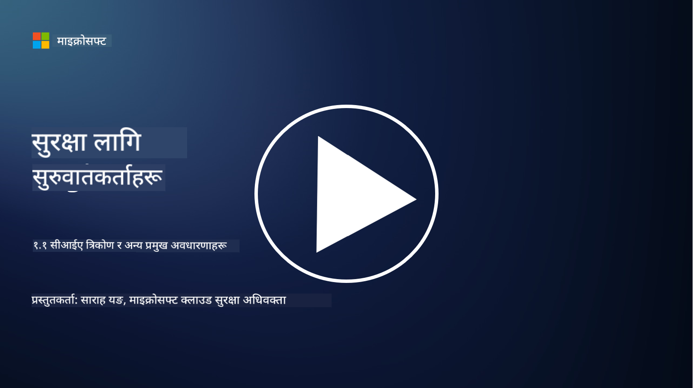
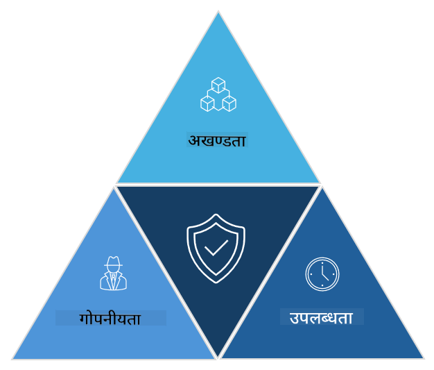

<!--
CO_OP_TRANSLATOR_METADATA:
{
  "original_hash": "16a76f9fa372fb63cffb6d76b855f023",
  "translation_date": "2025-09-04T01:09:12+00:00",
  "source_file": "1.1 The CIA triad and other key concepts.md",
  "language_code": "ne"
}
-->
# CIA त्रिकोण र अन्य मुख्य अवधारणाहरू

## परिचय

यस पाठमा हामीले निम्न विषयहरू समेट्नेछौं:

 - साइबर सुरक्षा के हो?
   
 
 - साइबर सुरक्षा CIA त्रिकोण के हो?

   

 - साइबर सुरक्षाको सन्दर्भमा प्रामाणिकता, गैर-अस्वीकृति, र गोपनीयता के हुन्?

## साइबर सुरक्षा के हो?

साइबर सुरक्षा, जसलाई सूचना सुरक्षा पनि भनिन्छ, कम्प्युटर प्रणालीहरू, नेटवर्कहरू, उपकरणहरू, र डाटालाई डिजिटल आक्रमण, अनधिकृत पहुँच, क्षति, वा चोरीबाट जोगाउने अभ्यास हो। साइबर सुरक्षाको मुख्य उद्देश्य डिजिटल सम्पत्ति र सूचनाको गोपनीयता, अखण्डता, र उपलब्धता सुनिश्चित गर्नु हो। साइबर सुरक्षा विशेषज्ञहरूले सम्पत्ति, डाटा, र सूचनाको सुरक्षा गर्न सुरक्षा नियन्त्रणहरू डिजाइन र कार्यान्वयन गर्छन्। हाम्रो जीवन अधिक डिजिटल र अनलाइन हुँदै गएकोले, साइबर सुरक्षा निजी व्यक्तिहरू र संस्थाहरूका लागि प्रमुख चिन्ता बनेको छ।

## साइबर सुरक्षा CIA त्रिकोण के हो?

साइबर सुरक्षा त्रिकोणले कुनै पनि साइबर सुरक्षा कार्य वा प्रणाली/पर्यावरण डिजाइन गर्दा ध्यान दिनुपर्ने तीन मुख्य पक्षहरूलाई समेट्छ:

### गोपनीयता

यो त्यस्तो पक्ष हो जसलाई धेरै मानिसहरूले "साइबर सुरक्षा" सोच्दा चिन्छन्: गोपनीयता भनेको डाटा र सूचनालाई अनधिकृत पहुँच प्रयासहरूबाट जोगाउने प्रक्रिया हो, अर्थात् केवल आवश्यक व्यक्तिहरूले मात्र सूचनामा पहुँच गर्न सक्नेछन्। तर सबै डाटा समान हुँदैन, र डाटालाई सामान्यतया वर्गीकृत गरिन्छ र गलत व्यक्तिहरूले पहुँच गरेमा कति क्षति हुनेछ भन्ने आधारमा सुरक्षित गरिन्छ।

### अखण्डता

यो वातावरणभित्र रहेको डाटाको शुद्धता र विश्वसनीयता जोगाउने कुरा हो र अनधिकृत व्यक्तिहरूले डाटालाई परिवर्तन वा संशोधन गर्न नपाउने सुनिश्चितता हो। उदाहरणका लागि, DMV मा एक विद्यार्थीले आफ्नो जन्म मिति परिवर्तन गरेर आफूलाई पुरानो देखाउँछ ताकि उनी आफ्नो लाइसेन्स पुनः छपाई गरेर मदिरा किन्न सकून्।

### उपलब्धता

यो सञ्चालनात्मक IT मा महत्त्वपूर्ण पक्ष हो, तर उपलब्धता साइबर सुरक्षाका लागि पनि महत्त्वपूर्ण छ। त्यस्ता विशेष प्रकारका आक्रमणहरू छन् जसले उपलब्धतालाई लक्षित गर्छन्, जसबाट सुरक्षा विशेषज्ञहरूले जोगाउनुपर्छ (जस्तै, वितरित सेवा अस्वीकृति – DDoS – आक्रमणहरू)।

**साइबर सुरक्षा CIA त्रिकोण**

## साइबर सुरक्षाको सन्दर्भमा प्रामाणिकता, गैर-अस्वीकृति, र गोपनीयता के हुन्?

यी प्रणाली र डाटाको सुरक्षा र विश्वसनीयता सुनिश्चित गर्न सम्बन्धित थप महत्त्वपूर्ण अवधारणाहरू हुन्:

**प्रामाणिकता** - यो सुनिश्चितता हो कि तपाईंले अन्तरक्रिया गरिरहेको सूचना, सञ्चार, वा इकाई वास्तविक हो र अनधिकृत पक्षहरूले यसलाई परिवर्तन वा संशोधन गरेको छैन।

**गैर-अस्वीकृति** - यो अवधारणा हो जसले सुनिश्चित गर्छ कि कुनै पक्षले आफ्नो संलग्नता वा कुनै लेनदेन वा सञ्चारको प्रामाणिकता अस्वीकार गर्न सक्दैन। यसले कसैलाई सन्देश पठाएको वा कुनै विशेष कार्य गरेको प्रमाण हुँदा त्यसलाई अस्वीकार गर्नबाट रोक्छ।

**गोपनीयता** - यो संवेदनशील र व्यक्तिगत रूपमा पहिचान गर्न सकिने सूचनालाई अनधिकृत पहुँच, प्रयोग, खुलासा, वा हेरफेरबाट जोगाउने कुरा हो। यसले व्यक्तिगत डाटामा कसले पहुँच गर्न सक्छ र त्यो डाटा कसरी सङ्कलन, भण्डारण, र साझा गरिन्छ भन्ने कुरालाई नियन्त्रण गर्छ। 

## थप अध्ययन

[What Is Information Security (InfoSec)? | Microsoft Security](https://www.microsoft.com/security/business/security-101/what-is-information-security-infosec#:~:text=Three%20pillars%20of%20information%20security%3A%20the%20CIA%20triad,as%20guiding%20principles%20for%20implementing%20an%20InfoSec%20plan.)

---

**अस्वीकरण**:  
यो दस्तावेज़ AI अनुवाद सेवा [Co-op Translator](https://github.com/Azure/co-op-translator) प्रयोग गरी अनुवाद गरिएको हो। हामी यथासम्भव सटीकता सुनिश्चित गर्न प्रयास गर्छौं, तर कृपया ध्यान दिनुहोस् कि स्वचालित अनुवादहरूमा त्रुटिहरू वा अशुद्धताहरू हुन सक्छन्। यसको मूल भाषामा रहेको मूल दस्तावेज़लाई आधिकारिक स्रोत मानिनुपर्छ। महत्त्वपूर्ण जानकारीका लागि, व्यावसायिक मानव अनुवाद सिफारिस गरिन्छ। यस अनुवादको प्रयोगबाट उत्पन्न हुने कुनै पनि गलतफहमी वा गलत व्याख्याका लागि हामी जिम्मेवार हुने छैनौं।