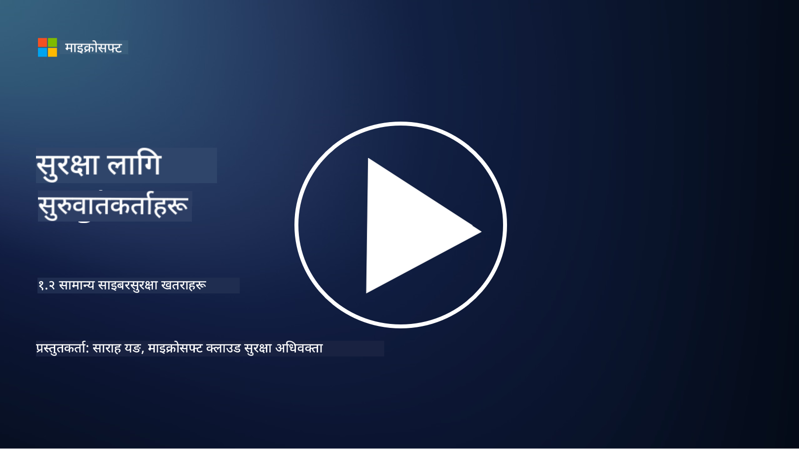

<!--
CO_OP_TRANSLATOR_METADATA:
{
  "original_hash": "6fc3030323139d7134a4ca9d03eccac9",
  "translation_date": "2025-09-03T23:22:20+00:00",
  "source_file": "1.2 Common cybersecurity threats.md",
  "language_code": "ne"
}
-->
# सामान्य साइबर सुरक्षा खतरा

## परिचय

यस पाठमा हामीले निम्न विषयहरू समेट्नेछौं:

- साइबर सुरक्षा खतरा के हो?

- किन दुर्भावनापूर्ण व्यक्तिहरू डाटा र आईटी प्रणालीलाई हानि पुर्‍याउन चाहन्छन्?

- सबैभन्दा सामान्य प्रकारका साइबर सुरक्षा खतरा के हुन्?

- MITRE ATT&CK फ्रेमवर्क के हो?

- साइबर सुरक्षा खतरा परिदृश्यसँग अद्यावधिक कसरी रहन सकिन्छ?

## साइबर सुरक्षा खतरा के हो?

साइबर सुरक्षा खतरा भनेको कुनै पनि सम्भावित जोखिम वा खतरा हो जसले डाटा वा आईटी प्रणालीको गोपनीयता, अखण्डता, वा उपलब्धतालाई हानि पुर्‍याउन सक्छ। यी खतरा दुर्भावनापूर्ण व्यक्तिहरूले कमजोरीहरूको फाइदा उठाएर अनधिकृत पहुँच प्राप्त गर्न, संवेदनशील जानकारी चोरी गर्न, सञ्चालनमा बाधा पुर्‍याउन, वा व्यक्तिहरू, संगठनहरू, वा राष्ट्रहरूलाई हानि पुर्‍याउन प्रयास गर्दा उत्पन्न हुन्छ। साइबर सुरक्षा खतरा विभिन्न प्रकारका हुन सक्छन् र डिजिटल प्रणाली र डाटाका विभिन्न पक्षहरूलाई लक्षित गर्न सक्छन्।

## किन दुर्भावनापूर्ण व्यक्तिहरू डाटा र आईटी प्रणालीलाई हानि पुर्‍याउन चाहन्छन्?

दुर्भावनापूर्ण व्यक्तिहरू विभिन्न कारणले डाटा र आईटी प्रणालीलाई हानि पुर्‍याउँछन्, प्रायः व्यक्तिगत लाभ, विचारधारात्मक उद्देश्य, वा अवरोध सिर्जना गर्ने चाहनाले प्रेरित हुन्छ। यी प्रेरणाहरूलाई बुझ्नाले संगठनहरू र व्यक्तिहरूलाई साइबर खतरा विरुद्ध राम्रोसँग बचाउन मद्दत गर्न सक्छ। दुर्भावनापूर्ण व्यक्तिहरू साइबर आक्रमणमा संलग्न हुने सामान्य कारणहरूमा समावेश छन्:

1. **आर्थिक लाभ**: धेरै आक्रमणहरू आर्थिक नाफाको लागि प्रेरित हुन्छन्। दुर्भावनापूर्ण व्यक्तिहरूले क्रेडिट कार्ड नम्बर, बैंक खाता विवरण, वा व्यक्तिगत पहिचान जानकारी जस्ता संवेदनशील जानकारी चोरी गर्न सक्छन् ताकि ठगी, पहिचान चोरी, फिरौती माग, वा चोरी गरिएको डाटा अन्धकार वेबमा बेच्न सकियोस्।

2. **जासुसी**: राष्ट्रहरू, प्रतिस्पर्धीहरू, वा अन्य संस्थाहरूले राजनीतिक, आर्थिक, वा सैन्य लाभको लागि संवेदनशील सरकारी, कर्पोरेट, वा अनुसन्धान डाटा चोरी गर्न साइबर जासुसीमा संलग्न हुन सक्छन्।

3. **अवरोध र तोडफोड**: केही आक्रमणहरूले राजनीतिक वा विचारधारात्मक कारणले महत्वपूर्ण पूर्वाधार, सेवा, वा सञ्चालनमा बाधा पुर्‍याउने उद्देश्य राख्छन्। यी आक्रमणहरूले व्यापक अराजकता, आर्थिक हानि, र प्रतिष्ठामा क्षति पुर्‍याउन सक्छ।

4. **विचारधारात्मक प्रेरणा**: ह्याक्टिभिस्टहरू र विचारधारात्मक वा राजनीतिक प्रेरणाहरू भएका समूहहरूले निश्चित मुद्दाहरूको बारेमा जागरूकता बढाउन, आफ्ना विश्वासहरू प्रवर्द्धन गर्न, वा विशिष्ट कार्यहरू वा संगठनहरूको विरोध गर्न प्रणालीलाई हानि पुर्‍याउन सक्छन्।

5. **अनजान कार्यहरू**: सबै दुर्भावनापूर्ण कार्यहरू जानाजानी गरिएका हुँदैनन्; केही व्यक्तिहरू सामाजिक इन्जिनियरिङको शिकार भएर वा हानि पुर्‍याइएको नेटवर्कको भाग भएर अनजानेमा साइबर खतरा सिर्जना गर्न सक्छन्।

अन्ततः, डाटा र आईटी प्रणालीलाई हानि पुर्‍याउने प्रेरणाहरू धेरै फरक हुन सक्छन्, र यी आक्रमणहरूको प्रभाव गम्भीर हुन सक्छ। व्यक्तिहरू, संगठनहरू, र सरकारहरूले साइबर सुरक्षा गम्भीरतापूर्वक लिनु र यी खतराहरूबाट बचाउन उपायहरू लागू गर्नु महत्त्वपूर्ण छ।

## सबैभन्दा सामान्य प्रकारका साइबर सुरक्षा खतरा के हुन्?

दुर्भावनापूर्ण व्यक्तिहरूले प्रणालीलाई हानि पुर्‍याउन, डाटा चोरी गर्न, र अवरोध सिर्जना गर्न प्रयोग गर्ने धेरै सामान्य प्रकारका साइबर आक्रमणहरू छन्। लेख्ने समयमा सबैभन्दा प्रचलित प्रकारहरू यहाँ छन्:

1. **फिसिङ**:

फिसिङले झूटो इमेल वा सन्देशहरू पठाउने समावेश गर्दछ जुन वैध स्रोतहरूबाट आएको जस्तो देखिन्छ ताकि प्राप्तकर्ताहरूलाई पासवर्ड, क्रेडिट कार्ड नम्बर, वा व्यक्तिगत विवरण जस्ता संवेदनशील जानकारी खुलासा गर्न फसाउन सकियोस्। फिसिङले पीडितहरूलाई दुर्भावनापूर्ण वेबसाइटहरूमा लैजान वा मालवेयर डाउनलोड गर्न पनि प्रेरित गर्न सक्छ।

2. **मालवेयर**:

मालवेयर (दुर्भावनापूर्ण सफ्टवेयर) विभिन्न प्रकारका दुर्भावनापूर्ण कार्यक्रमहरू समेट्छ जसले प्रणालीलाई संक्रमित गर्न, डाटा चोरी गर्न, वा क्षति पुर्‍याउन डिजाइन गरिएको हुन्छ। मालवेयरका प्रकारहरूमा समावेश छन्:

- **र्यान्समवेयर**: फाइलहरू एन्क्रिप्ट गर्छ र डिक्रिप्शनको लागि फिरौती माग्छ।

- **ट्रोजन**: वैध सफ्टवेयरको रूपमा लुक्छ, तर आक्रमणकारीलाई अनधिकृत पहुँच दिन्छ।

- **भाइरस**: फाइलहरूमा संलग्न हुने र फैलने आत्म-प्रतिकृति कार्यक्रम।

- **वर्म्स**: नेटवर्क मार्फत फैलने आत्म-प्रतिकृति कार्यक्रम।

3. **डिनायल अफ सर्भिस (DoS) र डिस्ट्रिब्युटेड डिनायल अफ सर्भिस (DDoS)**:

DoS आक्रमणहरूले लक्षित प्रणालीलाई ओभरलोड गर्छ, जसले प्रयोगकर्ताहरूलाई अनुपलब्ध बनाउँछ। DDoS आक्रमणहरूले कम्प्रमाइज गरिएको उपकरणहरूको नेटवर्क प्रयोग गरेर लक्षित प्रणालीलाई ट्राफिकले भरिन्छ, जसले प्रणालीलाई ठीकसँग काम गर्न असम्भव बनाउँछ वा पूर्ण रूपमा बन्द गराउँछ।

4. **SQL इन्जेक्सन**:

यस आक्रमणमा, आक्रमणकारीहरूले वेब अनुप्रयोगको इनपुट फिल्डहरूलाई हेरफेर गरेर दुर्भावनापूर्ण SQL क्वेरीहरू इन्जेक्ट गर्छन्, जसले डाटाबेस र संवेदनशील डाटामा अनधिकृत पहुँच प्राप्त गर्न सक्छ।

5. **क्रस-साइट स्क्रिप्टिङ (XSS)**:

आक्रमणकारीहरूले वेब अनुप्रयोगहरूमा दुर्भावनापूर्ण स्क्रिप्टहरू इन्जेक्ट गर्छन्, जुन प्रयोगकर्ताहरूको ब्राउजरद्वारा कार्यान्वयन गरिन्छ। यसले प्रयोगकर्ताको डाटा चोरी गर्न वा मालवेयर फैलाउन सक्छ।

6. **सामाजिक इन्जिनियरिङ**:

सामाजिक इन्जिनियरिङले मानव मनोविज्ञानको फाइदा उठाएर व्यक्तिहरूलाई गोप्य जानकारी खुलासा गर्न वा सुरक्षा सम्झौता गर्ने कार्यहरू गर्न हेरफेर गर्छ।

7. **जिरो-डे (0day) एक्सप्लोइट्स**:

यी आक्रमणहरूले सफ्टवेयर वा हार्डवेयरमा कमजोरीहरूलाई लक्षित गर्छन् जुन विक्रेता वा सार्वजनिकलाई अझै थाहा छैन। आक्रमणकारीहरूले प्याचहरू विकास हुनु अघि यी कमजोरीहरूको फाइदा उठाउँछन्। धेरै संगठनहरू जिरो-डेको चिन्ता गर्छन् किनकि यसको लागि कुनै प्याच हुँदैन, तर यो सूचीका अन्य आक्रमणहरू जति सामान्य हुँदैन। जब जिरो-डे पत्ता लाग्छ, सुरक्षा अनुसन्धानकर्ताहरूले छिटो प्याच बनाउन काम गर्छन्, र त्यसैले जिरो-डे सामान्यतया छोटो समयको लागि मात्र सक्रिय हुन्छ।

8. **क्रेडेन्शियल आक्रमणहरू**:

यी आक्रमणहरूमा ब्रुट फोर्स आक्रमणहरू समावेश छन्, जहाँ आक्रमणकारीहरूले बारम्बार पासवर्ड अनुमान गर्छन्, र क्रेडेन्शियल स्टफिङ आक्रमणहरू, जहाँ एक साइटबाट चोरी गरिएको क्रेडेन्शियलहरू अन्य साइटहरूमा पहुँच प्रयास गर्न प्रयोग गरिन्छ।

## MITRE ATT&CK फ्रेमवर्क के हो?

[MITRE ATT&CK फ्रेमवर्क](https://attack.mitre.org/) (Adversarial Tactics, Techniques, and Common Knowledge) एक फ्रेमवर्क हो जसले साइबर आक्रमणको क्रममा प्रतिद्वन्द्वीहरूले प्रयोग गर्ने रणनीति, प्रविधि, र प्रक्रियाहरू (TTPs) वर्गीकृत र सूचीबद्ध गर्छ। यो फ्रेमवर्क MITRE Corporation द्वारा सिर्जना गरिएको हो, जुन विभिन्न सरकारी एजेन्सीहरूको लागि अनुसन्धान र विकास केन्द्रहरू सञ्चालन गर्ने गैर-नाफामूलक संस्था हो।

MITRE ATT&CK फ्रेमवर्कले साइबर खतराहरूलाई वर्णन र विश्लेषण गर्ने मानकीकृत तरिका प्रदान गर्दछ, जसले साइबर सुरक्षा पेशेवरहरूलाई विभिन्न आक्रमण प्रविधिहरूलाई राम्रोसँग बुझ्न र बचाउन मद्दत गर्दछ। यो सुरक्षा टोलीहरू, खतरा शिकारीहरू, र घटना प्रतिक्रिया दिने व्यक्तिहरूले व्यापक रूपमा प्रयोग गर्छन्:

1. **प्रतिद्वन्द्वीको व्यवहार बुझ्नुहोस्**: फ्रेमवर्कले वास्तविक-विश्व आक्रमण व्यवहारहरूलाई दस्तावेज गर्छ, आक्रमणकारीहरूले प्रारम्भिक प्रवेशबाट आफ्नो उद्देश्य प्राप्त गर्न लिने चरणहरूलाई रूपरेखा दिन्छ। यसले विभिन्न खतरा समूहहरूले प्रयोग गर्ने आक्रमण प्रविधिहरूको विस्तृत दायरा समेट्छ।

2. **रक्षा रणनीति योजना र कार्यान्वयन गर्नुहोस्**: सुरक्षा टोलीहरूले फ्रेमवर्कलाई आक्रमणकारीहरूले प्रयोग गर्न सक्ने विशिष्ट रणनीति र प्रविधिहरूसँग मेल खाने सक्रिय रक्षा रणनीति विकास गर्न प्रयोग गर्न सक्छन्।

3. **घटना प्रतिक्रिया र खतरा शिकार**: घटनाहरूको अनुसन्धान गर्दा वा खतरा शिकार गर्दा, सुरक्षा पेशेवरहरूले फ्रेमवर्कलाई सन्दर्भ गर्न सक्छन् ताकि आक्रमणकारीहरूले प्रयोग गरेका विशिष्ट प्रविधिहरूलाई पहिचान र कम गर्न सकियोस्।

MITRE ATT&CK फ्रेमवर्कले प्लेटफर्म र वातावरणहरू जस्तै Windows, macOS, Linux, र क्लाउड सेवाहरूमा आधारित आक्रमण प्रविधिहरूलाई समूहबद्ध गर्ने म्याट्रिक्सहरूमा व्यवस्थित छ। प्रत्येक म्याट्रिक्सलाई रणनीति (उच्च-स्तरीय लक्ष्यहरू) र प्रविधिहरू (ती लक्ष्यहरू प्राप्त गर्न प्रयोग गरिएका विशिष्ट विधिहरू) मा विभाजित गरिएको छ। प्रत्येक प्रविधिको लागि, फ्रेमवर्कले यसको काम गर्ने तरिका, सम्भावित रोकथामहरू, र प्रविधि प्रयोग गरेका वास्तविक-विश्व खतरा व्यक्तिहरूको सन्दर्भमा जानकारी प्रदान गर्दछ।

फ्रेमवर्कलाई नयाँ खतरा खुफिया जानकारी संकलन गरिएपछि र साइबर सुरक्षा परिदृश्य विकसित हुँदै जाँदा निरन्तर अद्यावधिक र विस्तार गरिन्छ। यो आक्रमणकारीहरूले कसरी काम गर्छन् र उनीहरूको रणनीतिहरू विरुद्ध कसरी बच्न सकिन्छ भन्ने गहिरो समझ प्रदान गरेर संगठनको साइबर सुरक्षा स्थितिलाई सुधार गर्ने मूल्यवान स्रोत हो।

## साइबर सुरक्षा खतरा परिदृश्यसँग अद्यावधिक कसरी रहन सकिन्छ?

साइबर सुरक्षा खतराहरूको बारेमा अद्यावधिक रहनका लागि धेरै स्रोतहरू प्रयोग गर्न सकिन्छ, यहाँ केही चयन गरिएको छ:

- [Open Web Application Security Project (OWASP) शीर्ष १० कमजोरीहरू](https://owasp.org/Top10/)
- [Common Vulnerabilities and Exposures (CVEs)](https://www.bing.com/ck/a?!&&p=53df6007f017bca2JmltdHM9MTY5MjU3NjAwMCZpZ3VpZD0zYmY4N2RiYS1jYWI1LTYwMDgtMWY1YS02ZmYyY2JjNjYxZWUmaW5zaWQ9NTc2OQ&ptn=3&hsh=3&fclid=3bf87dba-cab5-6008-1f5a-6ff2cbc661ee&psq=cve&u=a1aHR0cHM6Ly9iaW5nLmNvbS9hbGluay9saW5rP3VybD1odHRwcyUzYSUyZiUyZmN2ZS5taXRyZS5vcmclMmYmc291cmNlPXNlcnAtcnImaD1BZXN4S0VBWTNnbGhNZEFpd3daMlNSZkZQNTlrODhIUnYxRUtlSkY1RTk0JTNkJnA9a2NvZmZjaWFsd2Vic2l0ZQ&ntb=1 "Common Vulnerabilities and Exposures")
- [Microsoft Security Response Center ब्लगहरू](https://msrc.microsoft.com/blog/)
- [National Institute of Standards and Technology (NIST)](https://www.dhs.gov/topics/cybersecurity): NIST ले सम्भावित साइबर सुरक्षा खतराहरूको बारेमा स्रोतहरू, चेतावनीहरू, र नवीनतम अद्यावधिकहरू प्रदान गर्दछ।
- [Cybersecurity and Infrastructure Security Agency (CISA)](https://www.cisa.gov/resources-tools/resources/free-cybersecurity-services-and-tools): CISA ले व्यवसायहरू, सरकारी एजेन्सीहरू, र अन्य संगठनहरूको लागि साइबर सुरक्षा स्रोतहरू र उत्तम अभ्यासहरू प्रदान गर्दछ। CISA ले समुदायलाई व्यापक रूपमा असर गर्ने उच्च-प्रभाव प्रकारका सुरक्षा गतिविधिहरूको बारेमा अद्यावधिक जानकारी र नयाँ र विकसित साइबर खतराहरूको गहिरो विश्लेषण साझा गर्दछ।
- [National Cybersecurity Center of Excellence (NCCoE)](https://www.dhs.gov/topics/cybersecurity): NCCoE एक केन्द्र हो जसले वास्तविक-विश्व परिस्थितिहरूमा लागू गर्न सकिने व्यावहारिक साइबर सुरक्षा समाधानहरू प्रदान गर्दछ।
- [US-CERT](https://www.cisa.gov/resources-tools/resources/free-cybersecurity-services-and-tools): संयुक्त राज्य कम्प्युटर आपतकालीन तयारी टोली (US-CERT) ले चेतावनीहरू, सुझावहरू, र अन्य सहित विभिन्न साइबर सुरक्षा स्रोतहरू प्रदान गर्दछ।
- तपाईंको देशको साइबर आपतकालीन प्रतिक्रिया टोली (CERT)

---

**अस्वीकरण**:  
यो दस्तावेज़ AI अनुवाद सेवा [Co-op Translator](https://github.com/Azure/co-op-translator) प्रयोग गरेर अनुवाद गरिएको छ। हामी शुद्धताको लागि प्रयास गर्छौं, तर कृपया ध्यान दिनुहोस् कि स्वचालित अनुवादहरूमा त्रुटि वा अशुद्धता हुन सक्छ। यसको मूल भाषा मा रहेको मूल दस्तावेज़लाई आधिकारिक स्रोत मानिनुपर्छ। महत्वपूर्ण जानकारीको लागि, व्यावसायिक मानव अनुवाद सिफारिस गरिन्छ। यस अनुवादको प्रयोगबाट उत्पन्न हुने कुनै पनि गलतफहमी वा गलत व्याख्याको लागि हामी जिम्मेवार हुने छैनौं।