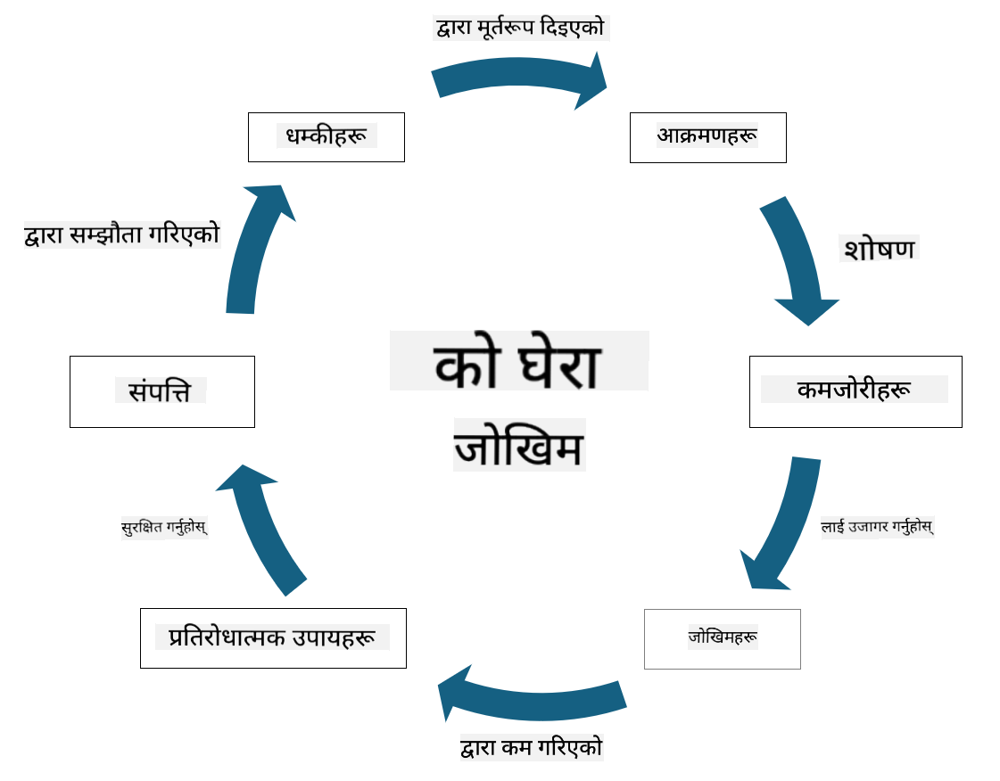

<!--
CO_OP_TRANSLATOR_METADATA:
{
  "original_hash": "fcca304f072cabf206388199e8e2e578",
  "translation_date": "2025-09-04T01:27:51+00:00",
  "source_file": "1.3 Understanding risk management.md",
  "language_code": "ne"
}
-->
# जोखिम व्यवस्थापन बुझ्दै

## परिचय

यस पाठमा हामीले निम्न विषयहरू समेट्नेछौं:

- सामान्य रूपमा प्रयोग गरिने सुरक्षा शब्दावलीहरूको परिभाषा

- सुरक्षा नियन्त्रणका प्रकारहरू

- सुरक्षा जोखिमहरूको मूल्याङ्कन

## सामान्य रूपमा प्रयोग गरिने सुरक्षा शब्दावलीहरूको परिभाषा

यी शब्दहरू साइबर सुरक्षा र जोखिम व्यवस्थापनको क्षेत्रमा आधारभूत अवधारणाहरू हुन्। प्रत्येक शब्दलाई तोडेर हेरौं र तिनीहरू एकअर्कासँग कसरी सम्बन्धित छन्:

1. **थ्रेट एजेन्ट**:

थ्रेट एजेन्ट भनेको कुनै व्यक्ति, समूह, संगठन, वा स्वचालित प्रणाली हो जसले प्रणाली वा नेटवर्कको कमजोरीलाई फाइदा उठाएर हानि वा क्षति पुर्‍याउन सक्छ। थ्रेट एजेन्टहरूमा ह्याकरहरू, मालवेयर लेखकहरू, असन्तुष्ट कर्मचारीहरू, वा सूचना र प्रविधि प्रणालीलाई जोखिममा पार्ने कुनै पनि इकाई समावेश हुन सक्छ।

2. **थ्रेट (खतरा)**:

थ्रेट भनेको प्रणालीको कमजोरीलाई फाइदा उठाएर सम्पत्तिमा हानि पुर्‍याउन सक्ने सम्भावित घटना वा कार्य हो। थ्रेटहरूमा ह्याकिङ, डाटा चोरी, डिनायल-अफ-सर्भिस आक्रमण जस्ता कार्यहरू समावेश हुन सक्छन्। थ्रेट भनेको संगठनको सम्पत्तिमा सम्भावित हानि पुर्‍याउन सक्ने "के" हो।

3. **भल्नरेबिलिटी (कमजोरी)**:

भल्नरेबिलिटी भनेको प्रणालीको डिजाइन, कार्यान्वयन, वा कन्फिगरेसनमा रहेको कमजोरी वा त्रुटि हो जसलाई थ्रेट एजेन्टले प्रणालीको सुरक्षामा सम्झौता गर्न फाइदा उठाउन सक्छ। भल्नरेबिलिटी सफ्टवेयर, हार्डवेयर, प्रक्रियाहरू, वा मानव व्यवहारमा हुन सक्छ। सफल आक्रमणको जोखिम कम गर्न भल्नरेबिलिटी पहिचान र समाधान गर्नु महत्त्वपूर्ण छ।

4. **रिस्क (जोखिम)**:

रिस्क भनेको थ्रेट र भल्नरेबिलिटीको अन्तरक्रियाबाट उत्पन्न हुने हानि, क्षति, वा नोक्सानीको सम्भावना हो। यो सम्भावना हो कि थ्रेट एजेन्टले भल्नरेबिलिटीलाई फाइदा उठाएर नकारात्मक प्रभाव पार्नेछ। जोखिमहरू प्रायः तिनीहरूको सम्भावित प्रभाव र हुने सम्भावनाको आधारमा मूल्याङ्कन गरिन्छ।

5. **एसेट (सम्पत्ति)**:

एसेट भनेको कुनै पनि मूल्यवान वस्तु हो जसलाई संगठनले सुरक्षित गर्न चाहन्छ। एसेटहरूमा भौतिक वस्तुहरू (जस्तै कम्प्युटर र सर्भरहरू), डाटा (ग्राहक जानकारी, वित्तीय अभिलेखहरू), बौद्धिक सम्पत्ति (व्यापार गोप्य, पेटेन्टहरू), र मानव स्रोतहरू (कर्मचारीहरूको सीप र ज्ञान) समावेश हुन सक्छ। सम्पत्तिको सुरक्षा साइबर सुरक्षाको प्रमुख लक्ष्य हो।

6. **एक्सपोजर (जोखिममा पर्नु)**:

एक्सपोजर भनेको सम्भावित थ्रेटहरूको सामना गर्न सक्ने अवस्थालाई जनाउँछ। यो तब हुन्छ जब कुनै भल्नरेबिलिटी हुन्छ जसलाई थ्रेट एजेन्टले फाइदा उठाउन सक्छ। एक्सपोजरले प्रणाली वा नेटवर्कमा भल्नरेबिलिटीको उपस्थितिसँग सम्बन्धित जोखिमलाई उजागर गर्छ।

7. **कन्ट्रोल (नियन्त्रण)**:

कन्ट्रोल भनेको भल्नरेबिलिटी र थ्रेटसँग सम्बन्धित जोखिमलाई कम गर्न राखिएको उपाय हो। कन्ट्रोलहरू प्राविधिक, प्रक्रियागत, वा प्रशासनिक प्रकृतिका हुन सक्छन्। तिनीहरू सम्भावित थ्रेट र भल्नरेबिलिटीलाई रोक्न, पत्ता लगाउन, वा कम गर्न डिजाइन गरिएका हुन्छन्। उदाहरणहरूमा फायरवाल, पहुँच नियन्त्रण, इन्क्रिप्सन, सुरक्षा नीतिहरू, र कर्मचारी प्रशिक्षण समावेश छन्।

यी शब्दहरूको सम्बन्धलाई संक्षेपमा भन्नुपर्दा: थ्रेट एजेन्टहरूले भल्नरेबिलिटीलाई फाइदा उठाएर थ्रेटहरू कार्यान्वयन गर्छन्, जसले जोखिम उत्पन्न गर्न सक्छ, जसले मूल्यवान सम्पत्तिमा हानि पुर्‍याउन सक्छ। एक्सपोजर तब हुन्छ जब भल्नरेबिलिटीहरू उपस्थित हुन्छन्, र कन्ट्रोलहरू जोखिमलाई कम गर्न थ्रेटहरूको प्रभावलाई रोक्न वा कम गर्न राखिन्छन्। यो ढाँचा साइबर सुरक्षा जोखिम व्यवस्थापनको आधार बनाउँछ, जसले संगठनहरूलाई तिनीहरूको सूचना प्रणाली र सम्पत्तिमा सम्भावित जोखिमहरू पहिचान, मूल्याङ्कन, र समाधान गर्न मार्गदर्शन गर्दछ।

## सुरक्षा नियन्त्रणका प्रकारहरू

सुरक्षा नियन्त्रण भनेको विभिन्न थ्रेट र भल्नरेबिलिटीबाट सूचना प्रणाली र सम्पत्तिलाई जोगाउन लागू गरिएका उपायहरू वा सुरक्षा सावधानीहरू हुन्। तिनीहरूलाई तिनीहरूको ध्यान र उद्देश्यको आधारमा विभिन्न श्रेणीहरूमा वर्गीकृत गर्न सकिन्छ। यहाँ केही सामान्य प्रकारका सुरक्षा नियन्त्रणहरू छन्:

1. **प्रशासनिक नियन्त्रणहरू**:

यी नियन्त्रणहरू संगठनको सुरक्षा अभ्यास र प्रयोगकर्ताको व्यवहारलाई नियमन गर्ने नीतिहरू, प्रक्रियाहरू, र दिशानिर्देशहरूसँग सम्बन्धित छन्।

- सुरक्षा नीतिहरू र प्रक्रियाहरू: संगठनभित्र सुरक्षा कसरी कायम राखिन्छ भन्ने परिभाषा गर्ने लिखित दिशानिर्देशहरू।

- सुरक्षा सचेतना र प्रशिक्षण: कर्मचारीहरूलाई सुरक्षा सम्बन्धी उत्तम अभ्यास र सम्भावित थ्रेटहरूको बारेमा शिक्षित गर्ने कार्यक्रमहरू।

- घटना प्रतिक्रिया र व्यवस्थापन: सुरक्षा घटनाहरूको प्रतिक्रिया र न्यूनीकरणका लागि योजना।

2. **प्राविधिक नियन्त्रणहरू**:

प्राविधिक नियन्त्रणहरूले सुरक्षा उपायहरू लागू गर्न र प्रणाली र डाटालाई सुरक्षित गर्न प्रविधिको प्रयोग समावेश गर्दछ। प्राविधिक नियन्त्रणका उदाहरणहरू:

- पहुँच नियन्त्रण: प्रयोगकर्ताको भूमिकाहरू र अनुमतिहरूको आधारमा स्रोतहरूको पहुँचलाई प्रतिबन्ध गर्ने उपायहरू।

- इन्क्रिप्सन: डाटालाई सुरक्षित ढाँचामा रूपान्तरण गरेर अनधिकृत पहुँच रोक्ने प्रक्रिया।

- फायरवाल: इनकमिङ र आउटगोइङ ट्राफिकलाई फिल्टर र नियन्त्रण गर्ने नेटवर्क सुरक्षा उपकरणहरू।

- इन्ट्रुजन डिटेक्सन र प्रिभेन्सन सिस्टम (IDPS): शंकास्पद गतिविधिको लागि नेटवर्क ट्राफिकको निगरानी गर्ने उपकरणहरू।

- एन्टिभाइरस र एन्टि-मालवेयर सफ्टवेयर: हानिकारक सफ्टवेयर पत्ता लगाउने र हटाउने कार्यक्रमहरू।

- प्रमाणीकरण संयन्त्रहरू: पासवर्ड, बायोमेट्रिक्स, र मल्टि-फ्याक्टर प्रमाणीकरण जस्ता प्रयोगकर्ताको पहिचान प्रमाणित गर्ने विधिहरू।

- प्याच व्यवस्थापन: ज्ञात भल्नरेबिलिटीहरू समाधान गर्न सफ्टवेयरलाई नियमित रूपमा अद्यावधिक गर्ने प्रक्रिया।

3. **भौतिक नियन्त्रणहरू**:

भौतिक नियन्त्रणहरूले भौतिक सम्पत्ति र सुविधाहरूको सुरक्षा समावेश गर्दछ।

- सुरक्षा गार्ड र पहुँच नियन्त्रण कर्मचारी: भौतिक परिसरको निगरानी र पहुँच नियन्त्रण गर्ने कर्मचारीहरू।

- निगरानी क्यामेरा: गतिविधिहरू निगरानी र रेकर्ड गर्नका लागि भिडियो निगरानी प्रणालीहरू।

- लक र भौतिक अवरोधहरू: संवेदनशील क्षेत्रहरूको पहुँचलाई प्रतिबन्ध गर्नका लागि भौतिक उपायहरू।

- वातावरणीय नियन्त्रण: उपकरण र डाटा सेन्टरहरूलाई असर गर्ने तापक्रम, आर्द्रता, र अन्य वातावरणीय कारकहरू नियमन गर्ने उपायहरू।

4. **सञ्चालनात्मक नियन्त्रणहरू**:

यी नियन्त्रणहरू प्रणालीहरूको निरन्तर सुरक्षालाई सुनिश्चित गर्ने दिन-प्रतिदिनका कार्यहरू र गतिविधिहरूसँग सम्बन्धित छन्।

- परिवर्तन व्यवस्थापन: प्रणाली र कन्फिगरेसनमा परिवर्तनहरू ट्र्याक र स्वीकृत गर्ने प्रक्रियाहरू।

- ब्याकअप र प्रकोप पुन:प्राप्ति: प्रणाली विफलता वा प्रकोपको अवस्थामा डाटा ब्याकअप र पुन:प्राप्तिका लागि योजना।

- लगिङ र अडिटिङ: सुरक्षा र अनुपालन उद्देश्यका लागि प्रणाली गतिविधिहरूको निगरानी र रेकर्ड गर्ने प्रक्रिया।

- सुरक्षित कोडिङ अभ्यास: भल्नरेबिलिटीलाई न्यूनतम गर्न सफ्टवेयर लेख्नका लागि दिशानिर्देशहरू।

5. **कानूनी र नियामक नियन्त्रणहरू**:

यी नियन्त्रणहरूले सम्बन्धित कानुन, नियम, र उद्योग मापदण्डहरूको अनुपालन सुनिश्चित गर्छन्। संगठनले पालना गर्नुपर्ने मापदण्डहरू क्षेत्राधिकार, उद्योग क्षेत्र, र अन्य कारकहरूमा निर्भर गर्दछ।

- डाटा संरक्षण नियमहरू: GDPR, HIPAA, र CCPA जस्ता कानुनहरूको अनुपालन।

- उद्योग-विशिष्ट मापदण्डहरू: भुक्तानी कार्ड डाटा सुरक्षाका लागि PCI DSS जस्ता मापदण्डहरूको पालना।

यी सुरक्षा नियन्त्रणका श्रेणीहरूले संगठनहरूको प्रणाली, डाटा, र सम्पत्तिलाई विभिन्न थ्रेटहरूबाट जोगाउन व्यापक सुरक्षा स्थिति सिर्जना गर्न सँगै काम गर्छन्।

## सुरक्षा जोखिमहरूको मूल्याङ्कन

केही सुरक्षा पेशेवरहरूले जोखिम व्यवस्थापनलाई जोखिम व्यवस्थापन विशेषज्ञहरूमा मात्र छोड्नुपर्छ भन्छन्, तर सुरक्षा जोखिम व्यवस्थापनको प्रक्रिया बुझ्नु कुनै पनि सुरक्षा पेशेवरका लागि महत्त्वपूर्ण छ ताकि सुरक्षा जोखिमलाई संगठनका अन्य सदस्यहरूले बुझ्न र कार्य गर्न सक्ने भाषामा व्यक्त गर्न सकियोस्।

संगठनहरूले सुरक्षा जोखिमहरूलाई निरन्तर मूल्याङ्कन गर्नुपर्छ र व्यवसायमा जोखिमहरू विरुद्ध के कदम चाल्ने (वा नचल्ने) निर्णय गर्नुपर्छ। तल यो सामान्यतया कसरी गरिन्छ भन्ने अवलोकन छ। ध्यान दिनुहोस् कि यो प्रक्रिया प्रायः संगठनभित्रका विभिन्न टोलीहरूद्वारा गरिन्छ, एक टोलीले जोखिमको अन्त-देखि-अन्त व्यवस्थापनको जिम्मेवारी लिने दुर्लभ हुन्छ।

1. **सम्पत्ति र थ्रेटहरूको पहिचान गर्नुहोस्**:

संगठनले जोगाउन चाहने सम्पत्तिहरू पहिचान गर्छ। यीमा डाटा, प्रणालीहरू, हार्डवेयर, सफ्टवेयर, बौद्धिक सम्पत्ति, र अन्य समावेश हुन सक्छ। त्यसपछि, तिनीहरूले यी सम्पत्तिहरूलाई लक्षित गर्न सक्ने सम्भावित थ्रेटहरू पहिचान गर्छन्।

2. **भल्नरेबिलिटीहरूको मूल्याङ्कन गर्नुहोस्**:

संगठनहरूले प्रणाली वा प्रक्रियामा रहेका कमजोरीहरू वा त्रुटिहरू पहिचान गर्छन् जसलाई थ्रेटहरूले फाइदा उठाउन सक्छन्। यी कमजोरीहरू सफ्टवेयर त्रुटि, गलत कन्फिगरेसन, सुरक्षा नियन्त्रणको अभाव, र मानव त्रुटिबाट उत्पन्न हुन सक्छन्।

3. **सम्भाव्यता मूल्याङ्कन**:

संगठनले प्रत्येक थ्रेटको हुने सम्भावनाको मूल्याङ्कन गर्छ। यसमा ऐतिहासिक डाटा, थ्रेट इन्टेलिजेन्स, उद्योग प्रवृत्ति, र आन्तरिक कारकहरू विचार गरिन्छ। सम्भावनालाई कम, मध्यम, वा उच्च रूपमा वर्गीकृत गर्न सकिन्छ।

4. **प्रभाव मूल्याङ्कन**:

त्यसपछि, संगठनले प्रत्येक थ्रेटले भल्नरेबिलिटीलाई फाइदा उठाएमा हुने सम्भावित प्रभाव निर्धारण गर्छ। प्रभावमा वित्तीय नोक्सानी, सञ्चालनमा अवरोध, प्रतिष्ठामा क्षति, कानूनी परिणामहरू, र अन्य समावेश हुन सक्छ। प्रभावलाई पनि कम, मध्यम, वा उच्च रूपमा वर्गीकृत गर्न सकिन्छ।

5. **जोखिम गणना**:

सम्भाव्यता र प्रभाव मूल्याङ्कनलाई संयोजन गरेर प्रत्येक पहिचान गरिएको थ्रेटको समग्र जोखिम स्तर गणना गरिन्छ। यो प्रायः जोखिम म्याट्रिक्स प्रयोग गरेर गरिन्छ जसले सम्भाव्यता र प्रभाव स्तरहरूलाई संख्यात्मक मानहरू वा गुणात्मक वर्णनकर्ता प्रदान गर्छ। परिणामस्वरूप जोखिम स्तरले कुन जोखिमहरूलाई तत्काल ध्यान दिन आवश्यक छ भनेर प्राथमिकता दिन मद्दत गर्छ।

6. **प्राथमिकता र निर्णय-निर्माण**:

संगठनले उच्च सम्भाव्यता र प्रभाव भएका जोखिमहरूमा ध्यान केन्द्रित गरेर जोखिमहरूको प्राथमिकता निर्धारण गर्छ। यसले तिनीहरूलाई स्रोतहरू प्रभावकारी रूपमा वितरण गर्न र नियन्त्रणहरू लागू गर्न अनुमति दिन्छ। उच्च-जोखिम थ्रेटहरूले तत्काल ध्यान आवश्यक पर्छ, जबकि कम-जोखिम थ्रेटहरू लामो समयसम्म सम्बोधन गर्न सकिन्छ।

7. **जोखिम उपचार**:

जोखिम मूल्याङ्कनको आधारमा, संगठनले प्रत्येक जोखिमलाई कसरी कम गर्ने वा व्यवस्थापन गर्ने निर्धारण गर्छ। यसमा सुरक्षा नियन्त्रणहरू लागू गर्ने, बीमाको माध्यमबाट जोखिम स्थानान्तरण गर्ने, वा व्यवस्थापन गर्न सकिने/धेरै महँगो हुने बाँकी जोखिमलाई स्वीकार गर्ने समावेश हुन सक्छ।

8. **निरन्तर निगरानी र समीक्षा**:

जोखिम मूल्याङ्कन एक पटक मात्र गरिने प्रक्रिया होइन। यो समय-समयमा वा संगठनको वातावरणमा महत्त्वपूर्ण परिवर्तनहरू हुँदा गरिनुपर्छ। निरन्तर निगरानीले नयाँ थ्रेट, भल्नरेबिलिटी, वा व्यवसाय परिदृश्यमा भएका परिवर्तनहरूलाई ध्यानमा राख्न सुनिश्चित गर्छ।

यस संरचित तरिकाले सुरक्षा जोखिमहरूको मूल्याङ्कन गरेर, संगठनहरूले स्रोतहरूको वितरण, सुरक्षा नियन्त्रणहरू, र समग्र जोखिम व्यवस्थापन रणनीतिहरूको बारेमा सूचित निर्णय गर्न सक्छन्। उद्देश्य भनेको संगठनको समग्र जोखिम एक्सपोजरलाई कम गर्नु हो, जबकि सुरक्षा प्रयासहरूलाई संगठनका व्यवसाय लक्ष्य र उद्देश्यहरूसँग मिलाउनु हो।

---

**अस्वीकरण**:  
यो दस्तावेज़ AI अनुवाद सेवा [Co-op Translator](https://github.com/Azure/co-op-translator) प्रयोग गरी अनुवाद गरिएको हो। हामी यथासम्भव सटीकता सुनिश्चित गर्न प्रयास गर्छौं, तर कृपया ध्यान दिनुहोस् कि स्वचालित अनुवादहरूमा त्रुटि वा अशुद्धता हुन सक्छ। यसको मूल भाषामा रहेको मूल दस्तावेज़लाई आधिकारिक स्रोत मानिनुपर्छ। महत्त्वपूर्ण जानकारीका लागि, व्यावसायिक मानव अनुवाद सिफारिस गरिन्छ। यस अनुवादको प्रयोगबाट उत्पन्न हुने कुनै पनि गलतफहमी वा गलत व्याख्याको लागि हामी जिम्मेवार हुने छैनौं।