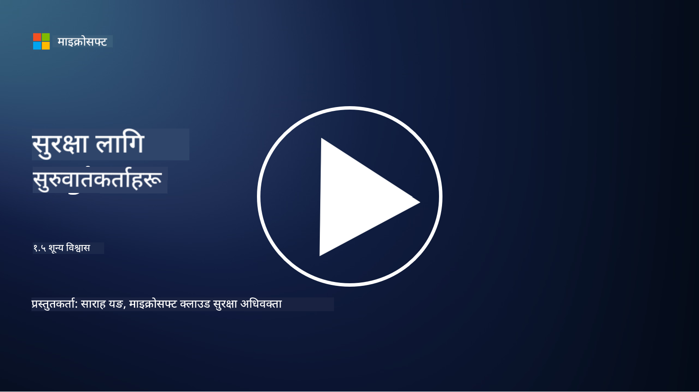
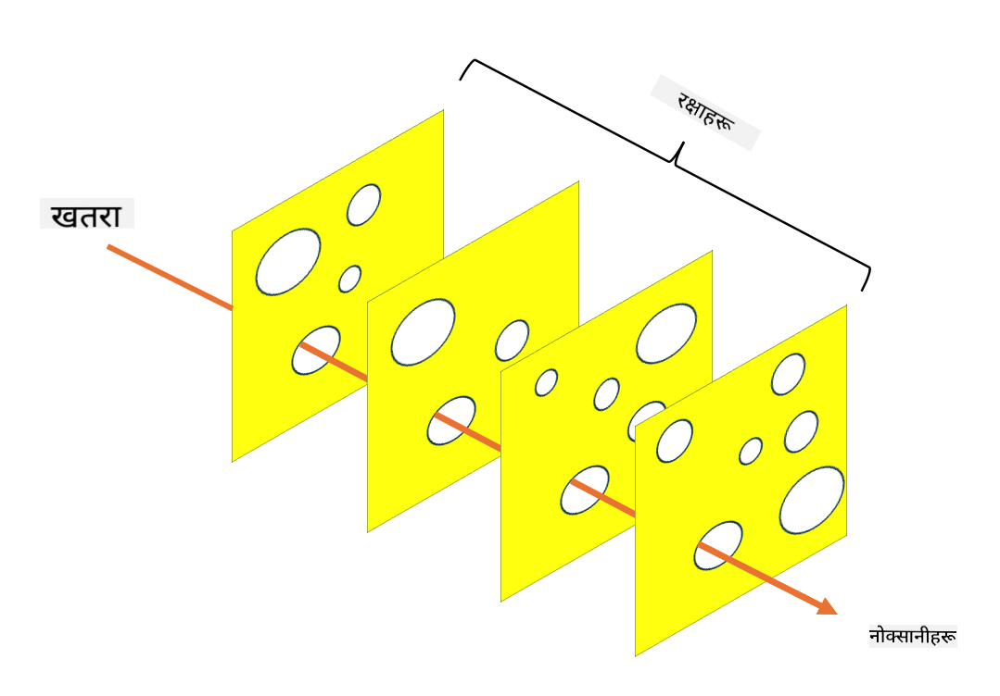

<!--
CO_OP_TRANSLATOR_METADATA:
{
  "original_hash": "75f77f972d2233c584f87c1eb96c983b",
  "translation_date": "2025-09-03T23:46:19+00:00",
  "source_file": "1.5 Zero trust.md",
  "language_code": "ne"
}
-->
# शून्य विश्वास

"शून्य विश्वास" अहिले सुरक्षा क्षेत्रमा धेरै प्रयोग हुने शब्द हो। तर यसको अर्थ के हो, के यो केवल एउटा चर्चित शब्द मात्र हो? यस पाठमा, हामी शून्य विश्वास के हो भन्ने कुरा गहिरो रूपमा बुझ्नेछौं।

## परिचय

 - यस पाठमा हामीले समेट्नेछौं:
   
   
 - शून्य विश्वास के हो?

   
  

 - शून्य विश्वास परम्परागत सुरक्षा संरचनाहरूबाट कसरी फरक छ?

   
   

 - गहिरो सुरक्षा के हो?

## शून्य विश्वास

शून्य विश्वास एक साइबर सुरक्षा दृष्टिकोण हो जसले "विश्वास गर तर पुष्टि गर" भन्ने परम्परागत धारणा चुनौती दिन्छ। यसले संगठनको नेटवर्क भित्र वा बाहिर कुनै पनि इकाईलाई स्वाभाविक रूपमा विश्वास गर्न नहुने मान्यता दिन्छ। यसको सट्टा, शून्य विश्वासले स्रोतहरूमा पहुँच गर्न खोज्ने प्रत्येक प्रयोगकर्ता, उपकरण, र एप्लिकेसनलाई स्थानको परवाह नगरी पुष्टि गर्न सिफारिस गर्दछ। शून्य विश्वासको मुख्य सिद्धान्त "आक्रमण सतह" कम गर्नु र सुरक्षा उल्लङ्घनको सम्भावित प्रभाव घटाउनु हो।

शून्य विश्वास मोडेलमा निम्न सिद्धान्तहरूलाई प्राथमिकता दिइन्छ:

1. **पहिचान पुष्टि गर्नुहोस्**: प्रत्येक प्रयोगकर्ता र उपकरणको प्रमाणीकरण र अनुमति कडा रूपमा लागू गरिन्छ, चाहे तिनीहरूको स्थान जहाँ भए पनि। याद गर्नुहोस् कि पहिचान केवल मानव मात्र होइन: यो उपकरण, एप्लिकेसन आदि पनि हुन सक्छ।

2. **न्यूनतम विशेषाधिकार**: प्रयोगकर्ता र उपकरणलाई उनीहरूको कार्यहरू पूरा गर्न आवश्यक न्यूनतम स्तरको पहुँच प्रदान गरिन्छ, जसले उल्लङ्घन भएमा सम्भावित क्षति कम गर्छ।

3. **सूक्ष्म विभाजन**: नेटवर्क स्रोतहरूलाई साना खण्डहरूमा विभाजन गरिन्छ ताकि उल्लङ्घन भएमा नेटवर्क भित्रको पार्श्व आन्दोलन सीमित गर्न सकियोस्।

4. **निरन्तर निगरानी**: प्रयोगकर्ता र उपकरणको व्यवहारको निरन्तर निगरानी र विश्लेषण गरिन्छ ताकि असामान्य गतिविधि र सम्भावित खतरा पत्ता लगाउन सकियोस्। आधुनिक निगरानी प्रविधिहरूले मेसिन लर्निङ, कृत्रिम बुद्धिमत्ता, र खतरा खुफिया प्रयोग गरेर निगरानीमा थप विवरण र सन्दर्भ प्रदान गर्छ।

5. **डाटा इन्क्रिप्शन**: डाटालाई ट्रान्जिट र रेस्ट दुवै अवस्थामा इन्क्रिप्ट गरिन्छ ताकि अनधिकृत पहुँच रोक्न सकियोस्।

6. **कडा पहुँच नियन्त्रण**: पहुँच नियन्त्रण प्रयोगकर्ता भूमिका, उपकरणको स्वास्थ्य, र नेटवर्क स्थान जस्ता सन्दर्भहरूमा आधारित भएर लागू गरिन्छ।

माइक्रोसफ्टले शून्य विश्वासलाई पाँच स्तम्भमा विभाजन गरेको छ, जुन हामी अर्को पाठमा छलफल गर्नेछौं।

## परम्परागत सुरक्षा संरचनाहरूबाट भिन्नता

शून्य विश्वास परम्परागत सुरक्षा संरचनाहरू, जस्तै परिधि-आधारित मोडेलहरू, सँग धेरै तरिकामा फरक छ:

1. **परिधि बनाम पहिचान-केंद्रित**: परम्परागत मोडेलहरूले नेटवर्कको परिधि सुरक्षित गर्न र भित्रका प्रयोगकर्ता र उपकरणलाई विश्वास गर्न ध्यान दिन्छ। शून्य विश्वास, अर्कोतर्फ, भित्र र बाहिर दुवैबाट खतरा उत्पन्न हुन सक्छ भन्ने मान्यता दिन्छ र कडा पहिचान-आधारित नियन्त्रण लागू गर्छ।

2. **अन्तर्निहित बनाम स्पष्ट विश्वास**: परम्परागत मोडेलहरूले नेटवर्क भित्रका उपकरण र प्रयोगकर्तालाई स्वतः विश्वास गर्छन् जबसम्म अन्यथा प्रमाणित हुँदैन। शून्य विश्वासले पहिचानलाई स्पष्ट रूपमा पुष्टि गर्छ र असामान्य गतिविधिको लागि निरन्तर निगरानी गर्छ।

3. **समतल बनाम विभाजित नेटवर्क**: परम्परागत संरचनाहरूले प्रायः समतल नेटवर्क समावेश गर्छन् जहाँ भित्रका प्रयोगकर्ताहरूलाई व्यापक पहुँच हुन्छ। शून्य विश्वासले नेटवर्कलाई साना, अलग-अलग क्षेत्रहरूमा विभाजन गर्न सिफारिस गर्छ ताकि सम्भावित उल्लङ्घनलाई नियन्त्रण गर्न सकियोस्।

4. **प्रतिक्रियात्मक बनाम सक्रिय**: परम्परागत सुरक्षा प्रायः परिधि फायरवाल र घुसपैठ पत्ता लगाउने जस्ता प्रतिक्रियात्मक उपायहरूमा निर्भर गर्दछ। शून्य विश्वासले उल्लङ्घन सम्भावित छ भन्ने मान्यता दिएर र यसको प्रभाव कम गरेर सक्रिय दृष्टिकोण अपनाउँछ।

## गहिरो सुरक्षा

गहिरो सुरक्षा, जसलाई स्तरित सुरक्षा पनि भनिन्छ, एक साइबर सुरक्षा रणनीति हो जसले संगठनको सम्पत्तिहरू सुरक्षित गर्न धेरै तहका सुरक्षा नियन्त्रण र उपायहरू तैनात गर्दछ। उद्देश्य भनेको धेरै तहको सुरक्षा सिर्जना गर्नु हो ताकि एउटा तह उल्लङ्घन भए पनि अन्य तहहरूले सुरक्षा प्रदान गर्न सकून्। प्रत्येक तहले सुरक्षा को फरक पक्षमा ध्यान दिन्छ र संगठनको समग्र सुरक्षा स्थिति सुधार गर्छ।

गहिरो सुरक्षा प्राविधिक, प्रक्रियागत, र भौतिक सुरक्षा उपायहरूको संयोजन समावेश गर्दछ। यसमा फायरवाल, घुसपैठ पत्ता लगाउने प्रणाली, पहुँच नियन्त्रण, इन्क्रिप्शन, प्रयोगकर्ता प्रशिक्षण, सुरक्षा नीतिहरू, र अन्य उपायहरू समावेश हुन सक्छ। विचार भनेको धेरै बाधाहरू सिर्जना गर्नु हो जसले सामूहिक रूपमा आक्रमणकारीहरूलाई संगठनको प्रणाली र नेटवर्कमा प्रवेश गर्न कठिन बनाउँछ। यसलाई कहिलेकाहीं "स्विस चीज" मोडेल पनि भनिन्छ, जुन अन्य उद्योगहरू (जस्तै यातायात) मा दुर्घटना रोकथामको लागि प्रयोग गरिन्छ।

## थप अध्ययन

[शून्य विश्वास के हो?](https://learn.microsoft.com/security/zero-trust/zero-trust-overview?WT.mc_id=academic-96948-sayoung)

[शून्य विश्वासको विकास – माइक्रोसफ्ट स्थिति पत्र](https://query.prod.cms.rt.microsoft.com/cms/api/am/binary/RWJJdT?WT.mc_id=academic-96948-sayoung)

[शून्य विश्वास र BeyondCorp Google Cloud | Google Cloud Blog](https://cloud.google.com/blog/topics/developers-practitioners/zero-trust-and-beyondcorp-google-cloud)

---

**अस्वीकरण**:  
यो दस्तावेज़ AI अनुवाद सेवा [Co-op Translator](https://github.com/Azure/co-op-translator) प्रयोग गरेर अनुवाद गरिएको छ। हामी शुद्धताको लागि प्रयास गर्छौं, तर कृपया ध्यान दिनुहोस् कि स्वचालित अनुवादमा त्रुटिहरू वा अशुद्धताहरू हुन सक्छ। यसको मूल भाषा मा रहेको मूल दस्तावेज़लाई आधिकारिक स्रोत मानिनुपर्छ। महत्वपूर्ण जानकारीको लागि, व्यावसायिक मानव अनुवाद सिफारिस गरिन्छ। यस अनुवादको प्रयोगबाट उत्पन्न हुने कुनै पनि गलतफहमी वा गलत व्याख्याको लागि हामी जिम्मेवार हुने छैनौं।