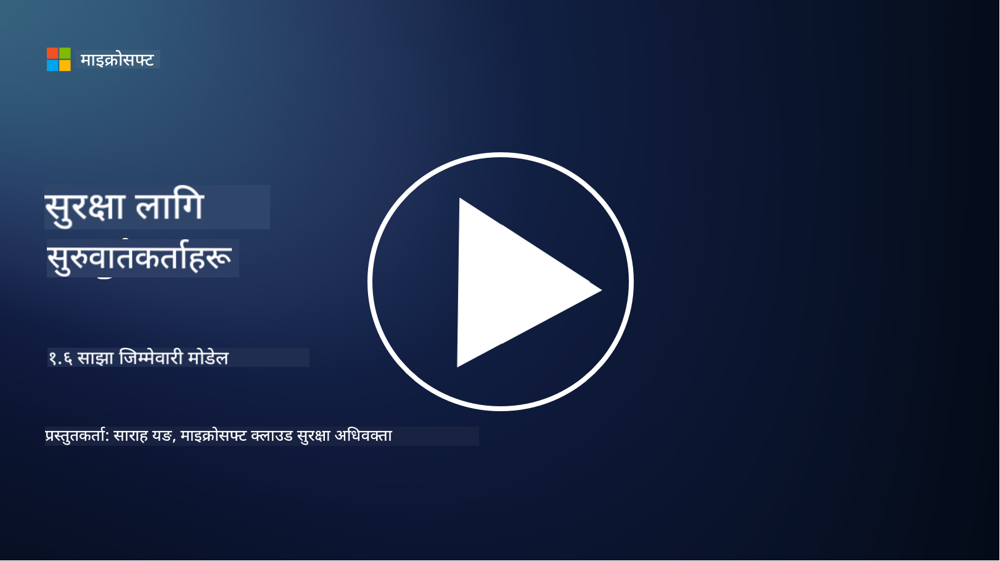

<!--
CO_OP_TRANSLATOR_METADATA:
{
  "original_hash": "a48db640d80c786b928ca178c414f084",
  "translation_date": "2025-09-04T00:24:47+00:00",
  "source_file": "1.6 Shared responsibility model.md",
  "language_code": "ne"
}
-->
# साझा जिम्मेवारी मोडेल

साझा जिम्मेवारी आईटीको नयाँ अवधारणा हो जुन क्लाउड कम्प्युटिङको आगमनसँगै आएको हो। साइबर सुरक्षा दृष्टिकोणबाट, सुरक्षा नियन्त्रणहरू कसले प्रदान गरिरहेको छ भन्ने कुरा बुझ्न महत्त्वपूर्ण छ ताकि सुरक्षा प्रणालीमा कुनै कमी नहोस्।

## परिचय

यस पाठमा हामीले निम्न विषयहरू समेट्नेछौं:

 - साइबर सुरक्षाको सन्दर्भमा साझा जिम्मेवारी भनेको के हो?
   
 - IaaS, PaaS र SaaS बीच सुरक्षा नियन्त्रणहरूको साझा जिम्मेवारीमा 
   के फरक छ?

   

 - तपाईंको क्लाउड प्लेटफर्मले कुन सुरक्षा नियन्त्रणहरू प्रदान गरिरहेको छ 
   भन्ने जानकारी कहाँ पाउन सकिन्छ?

   
 

 - "भरोसा तर पुष्टि गर्नुहोस्" भनेको के हो?

## साइबर सुरक्षाको सन्दर्भमा साझा जिम्मेवारी भनेको के हो?

साइबर सुरक्षामा साझा जिम्मेवारी भनेको क्लाउड सेवा प्रदायक (CSP) र यसको ग्राहकहरू बीच सुरक्षा जिम्मेवारीहरूको बाँडफाँड हो। क्लाउड कम्प्युटिङ वातावरणहरू, जस्तै Infrastructure as a Service (IaaS), Platform as a Service (PaaS), र Software as a Service (SaaS) मा CSP र ग्राहक दुवैले डेटा, एप्लिकेसनहरू, र प्रणालीहरूको सुरक्षामा भूमिका खेल्छन्।

## IaaS, PaaS र SaaS बीच सुरक्षा नियन्त्रणहरूको साझा जिम्मेवारीमा के फरक छ?

जिम्मेवारीको बाँडफाँड सामान्यतया प्रयोग गरिरहेको क्लाउड सेवाको प्रकारमा निर्भर गर्दछ:

 - **IaaS (Infrastructure as a Service)**: CSPले आधारभूत पूर्वाधार (सर्भरहरू, नेटवर्किङ, स्टोरेज) प्रदान गर्दछ, जबकि ग्राहकले उक्त पूर्वाधारमा अपरेटिङ सिस्टम, एप्लिकेसनहरू, र सुरक्षा कन्फिगरेसनहरू व्यवस्थापन गर्न जिम्मेवार हुन्छ।
   
   
 - **PaaS (Platform as a Service):** CSPले ग्राहकहरूले एप्लिकेसन निर्माण र परिनियोजन गर्न सक्ने प्लेटफर्म प्रदान गर्दछ। CSPले आधारभूत पूर्वाधार व्यवस्थापन गर्छ, र ग्राहकले एप्लिकेसन विकास र डेटा सुरक्षामा ध्यान केन्द्रित गर्छ।

   

 - **SaaS (Software as a Service)**: CSPले इन्टरनेटमार्फत पहुँचयोग्य पूर्ण रूपमा कार्यात्मक एप्लिकेसनहरू प्रदान गर्दछ। यस अवस्थामा, CSP एप्लिकेसनको सुरक्षा र पूर्वाधारको जिम्मेवार हुन्छ, जबकि ग्राहकले प्रयोगकर्ता पहुँच र डेटा प्रयोग व्यवस्थापन गर्छ।

साझा जिम्मेवारी बुझ्नु महत्त्वपूर्ण छ किनभने यसले CSPले कभर गरेका सुरक्षा पक्षहरू र ग्राहकले सम्बोधन गर्नुपर्ने पक्षहरू स्पष्ट पार्छ। यसले गलतफहमी रोक्छ र सुरक्षा उपायहरू समग्र रूपमा कार्यान्वयन गर्न मद्दत गर्छ।

## तपाईंको क्लाउड प्लेटफर्मले कुन सुरक्षा नियन्त्रणहरू प्रदान गरिरहेको छ भन्ने जानकारी कहाँ पाउन सकिन्छ?

तपाईंको क्लाउड प्लेटफर्मले कुन सुरक्षा नियन्त्रणहरू प्रदान गरिरहेको छ भन्ने जानकारी पाउन, तपाईंले क्लाउड सेवा प्रदायकको दस्तावेज र स्रोतहरू हेर्नुपर्छ। यी समावेश छन्:

 - **CSPको वेबसाइट र दस्तावेज**: CSPको वेबसाइटमा उनीहरूले आफ्नो सेवाको भागको रूपमा प्रदान गरेका सुरक्षा सुविधाहरू र नियन्त्रणहरूको जानकारी हुनेछ। CSPहरूले सामान्यतया विस्तृत दस्तावेज प्रदान गर्छन् जसले उनीहरूको सुरक्षा अभ्यास, नियन्त्रणहरू, र सिफारिसहरू व्याख्या गर्छ। यसमा ह्वाइटपेपरहरू, सुरक्षा गाइडहरू, र प्राविधिक दस्तावेजहरू समावेश हुन सक्छ।
   
 - **सुरक्षा मूल्यांकन र अडिटहरू**: अधिकांश CSPहरूले स्वतन्त्र सुरक्षा विशेषज्ञहरू र संस्थाहरूद्वारा उनीहरूको सुरक्षा नियन्त्रणहरूको मूल्यांकन गराउँछन्। यी समीक्षाले CSPको सुरक्षा उपायहरूको गुणस्तरबारे जानकारी प्रदान गर्न सक्छ। कहिलेकाहीँ यसले CSPलाई सुरक्षा अनुपालन प्रमाणपत्र प्राप्त गर्न मद्दत गर्छ (अर्को बुलेट पोइन्ट हेर्नुहोस्)।
 - **सुरक्षा अनुपालन प्रमाणपत्रहरू**: अधिकांश CSPहरूले ISO:27001, SOC 2, र FedRAMP जस्ता प्रमाणपत्रहरू प्राप्त गर्छन्। यी प्रमाणपत्रहरूले प्रदायकले विशिष्ट सुरक्षा र अनुपालन मापदण्डहरू पूरा गरेको देखाउँछ।

ध्यान दिनुहोस् कि विवरणको स्तर र जानकारीको उपलब्धता क्लाउड प्रदायकहरू बीच फरक हुन सक्छ। सधैं सुनिश्चित गर्नुहोस् कि तपाईंले क्लाउड सेवा प्रदायकद्वारा प्रदान गरिएका आधिकारिक र अद्यावधिक स्रोतहरू परामर्श गर्दै आफ्नो क्लाउड-आधारित सम्पत्तिको सुरक्षाबारे सूचित निर्णय लिइरहनुभएको छ।

## "भरोसा तर पुष्टि गर्नुहोस्" भनेको के हो?

CSP, तेस्रो-पक्ष सफ्टवेयर वा अन्य आईटी सुरक्षा सेवाको प्रयोगको सन्दर्भमा, कुनै संगठनले सुरक्षाका उपायहरूको दाबीमा प्रदायकलाई सुरुमा विश्वास गर्न सक्छ। तर, आफ्नो डेटा र प्रणालीहरूको सुरक्षा सुनिश्चित गर्न, उनीहरूले सुरक्षा मूल्यांकन, पेनिट्रेशन परीक्षण र बाह्य पक्षको सुरक्षा नियन्त्रणहरूको समीक्षा गरेर यी दाबीहरू पुष्टि गर्नेछन्। सफ्टवेयर वा सेवा पूर्ण रूपमा आफ्नो सञ्चालनमा समाहित गर्नु अघि सबै व्यक्तिहरू र संगठनहरूले आफू जिम्मेवार नभएका सुरक्षा नियन्त्रणहरूमा विश्वास गर्नुपर्छ तर पुष्टि गर्नुपर्छ।

## संगठनभित्र साझा जिम्मेवारी
संगठनभित्र विभिन्न टोलीहरूको लागि सुरक्षा सम्बन्धी साझा जिम्मेवारीलाई पनि ध्यानमा राख्नुपर्छ। सुरक्षा टोलीले प्रायः सबै नियन्त्रणहरू आफैं कार्यान्वयन गर्दैन र संगठनलाई सुरक्षित राख्न आवश्यक सबै सुरक्षा नियन्त्रणहरू कार्यान्वयन गर्न अपरेसन टोलीहरू, विकासकर्ताहरू र व्यवसायका अन्य भागहरूसँग सहकार्य गर्नुपर्ने हुन्छ।

## थप अध्ययन
- [Shared responsibility in the cloud - Microsoft Azure | Microsoft Learn](https://learn.microsoft.com/azure/security/fundamentals/shared-responsibility?WT.mc_id=academic-96948-sayoung)
- [What is shared responsibility model? – Definition from TechTarget.com](https://www.techtarget.com/searchcloudcomputing/definition/shared-responsibility-model)
- [The shared responsibility model explained and what it means for cloud security | CSO Online](https://www.csoonline.com/article/570779/the-shared-responsibility-model-explained-and-what-it-means-for-cloud-security.html)
- [Shared Responsibility for Cloud Security: What You Need to Know (cisecurity.org)](https://www.cisecurity.org/insights/blog/shared-responsibility-cloud-security-what-you-need-to-know)

---

**अस्वीकरण**:  
यो दस्तावेज़ AI अनुवाद सेवा [Co-op Translator](https://github.com/Azure/co-op-translator) प्रयोग गरी अनुवाद गरिएको हो। हामी यथासम्भव सटीकता सुनिश्चित गर्न प्रयास गर्छौं, तर कृपया ध्यान दिनुहोस् कि स्वचालित अनुवादहरूमा त्रुटि वा अशुद्धता हुन सक्छ। यसको मूल भाषामा रहेको मूल दस्तावेज़लाई आधिकारिक स्रोत मानिनुपर्छ। महत्त्वपूर्ण जानकारीका लागि, व्यावसायिक मानव अनुवाद सिफारिस गरिन्छ। यस अनुवादको प्रयोगबाट उत्पन्न हुने कुनै पनि गलतफहमी वा गलत व्याख्याको लागि हामी जिम्मेवार हुने छैनौं।