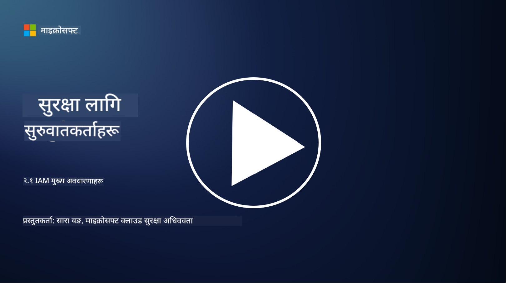

<!--
CO_OP_TRANSLATOR_METADATA:
{
  "original_hash": "2e3864e3d579f0dbb4ac2ec8c5f82acf",
  "translation_date": "2025-09-03T22:38:35+00:00",
  "source_file": "2.1 IAM key concepts.md",
  "language_code": "ne"
}
-->
# IAM मुख्य अवधारणाहरू

के तपाईं कहिल्यै कम्प्युटर वा वेबसाइटमा लगइन गर्नुभएको छ? पक्कै पनि गर्नुभएको छ! यसको मतलब तपाईंले आफ्नो दैनिक जीवनमा पहिचान नियन्त्रणहरू प्रयोग गर्नुभएको छ। पहिचान र पहुँच व्यवस्थापन (IAM) सुरक्षा को एक प्रमुख स्तम्भ हो, हामी यसबारे थप जानकारी आगामी पाठहरूमा सिक्नेछौं।

**परिचय**

यस पाठमा हामीले निम्न विषयहरू समेट्नेछौं:

- साइबर सुरक्षा को सन्दर्भमा पहिचान र पहुँच व्यवस्थापन (IAM) भन्नाले के बुझिन्छ?

- न्यूनतम विशेषाधिकारको सिद्धान्त के हो?

- कार्यहरूको विभाजन के हो?

- प्रमाणीकरण र अधिकारप्राप्ति के हो?

## साइबर सुरक्षा को सन्दर्भमा पहिचान र पहुँच व्यवस्थापन (IAM) भन्नाले के बुझिन्छ?

पहिचान र पहुँच व्यवस्थापन (IAM) भनेको प्रक्रियाहरू, प्रविधिहरू, र नीतिहरूको सेट हो जुन सुनिश्चित गर्नका लागि लागू गरिन्छ कि सही व्यक्तिहरूले संस्थाको डिजिटल वातावरण भित्रका स्रोतहरूमा उपयुक्त पहुँच प्राप्त गर्छन्। IAM ले डिजिटल पहिचानहरू (प्रयोगकर्ता, कर्मचारी, साझेदार) र तिनीहरूको प्रणालीहरू, अनुप्रयोगहरू, डेटा, र नेटवर्कहरूमा पहुँच व्यवस्थापन गर्दछ। IAM को मुख्य उद्देश्य सुरक्षा सुधार गर्नु, प्रयोगकर्ता पहुँचलाई सरल बनाउनु, र संस्थागत नीतिहरू र नियमहरूको पालना सुनिश्चित गर्नु हो। IAM समाधानहरूले सामान्यतया प्रयोगकर्ता प्रमाणीकरण, अधिकारप्राप्ति, पहिचान प्रावधान, पहुँच नियन्त्रण, र प्रयोगकर्ता जीवनचक्र व्यवस्थापन समेट्छ (खाता प्रयोगमा नरहेको अवस्थामा मेटाउने सुनिश्चितता सहित)।

## न्यूनतम विशेषाधिकारको सिद्धान्त के हो?

न्यूनतम विशेषाधिकारको सिद्धान्त भनेको प्रयोगकर्ता र प्रणालीहरूलाई उनीहरूको निर्दिष्ट कार्यहरू वा भूमिकाहरू पूरा गर्न आवश्यक न्यूनतम विशेषाधिकार मात्र प्रदान गर्ने अवधारणा हो। यस सिद्धान्तले सुरक्षा उल्लङ्घन वा आन्तरिक खतरा भएमा हुन सक्ने सम्भावित क्षति सीमित गर्न मद्दत गर्दछ। न्यूनतम विशेषाधिकारको सिद्धान्तलाई पालना गरेर, संस्थाहरू आक्रमणको सतह घटाउँछन् र अनधिकृत पहुँच, डेटा उल्लङ्घन, र विशेषाधिकारको अनावश्यक प्रयोगको जोखिम कम गर्छन्। व्यवहारमा, यसको मतलब प्रयोगकर्ताहरूलाई उनीहरूको कामको भूमिकाका लागि आवश्यक स्रोतहरू र कार्यक्षमताहरू मात्र प्रदान गरिन्छ, र अरू केही होइन। उदाहरणका लागि, यदि तपाईंलाई केवल एउटा दस्तावेज पढ्न आवश्यक छ भने, उक्त दस्तावेजमा पूर्ण प्रशासक विशेषाधिकार प्रदान गर्नु अत्यधिक हुनेछ।

## कार्यहरूको विभाजन के हो?

कार्यहरूको विभाजन भनेको हितको द्वन्द्व रोक्न र धोखाधडी तथा त्रुटिको जोखिम कम गर्नका लागि महत्वपूर्ण कार्यहरू र जिम्मेवारीहरू संस्थाभित्र विभिन्न व्यक्तिहरूमा वितरण गर्ने सिद्धान्त हो। साइबर सुरक्षा को सन्दर्भमा, कार्यहरूको विभाजनले सुनिश्चित गर्दछ कि कुनै पनि एक व्यक्तिले महत्वपूर्ण प्रक्रिया वा प्रणालीको सबै पक्षहरूमा नियन्त्रण राख्न सक्दैन। यसको उद्देश्य जाँच र सन्तुलनको प्रणाली सिर्जना गर्नु हो जसले कुनै पनि व्यक्तिलाई प्रक्रिया को सेटअप र अनुमोदन चरणहरू दुवै गर्न सक्ने क्षमता रोक्छ। उदाहरणका लागि, वित्तीय प्रणालीहरूमा, यसले निर्धारण गर्न सक्छ कि प्रणालीमा लेनदेन प्रविष्ट गर्ने व्यक्ति लेनदेन अनुमोदन गर्ने व्यक्ति समान हुनु हुँदैन। यसले अनधिकृत वा धोखाधडी कार्यहरू पत्ता नलाग्ने जोखिम कम गर्दछ।

## प्रमाणीकरण र अधिकारप्राप्ति के हो?

प्रमाणीकरण र अधिकारप्राप्ति साइबर सुरक्षा का दुई आधारभूत अवधारणाहरू हुन् जसले कम्प्युटर प्रणालीहरू र डेटा को सुरक्षा र अखण्डता सुनिश्चित गर्न महत्वपूर्ण भूमिका खेल्छन्। यी सामान्यतया स्रोतहरूमा पहुँच नियन्त्रण गर्न र संवेदनशील जानकारीको सुरक्षा गर्न सँगसँगै प्रयोग गरिन्छ।

**1. प्रमाणीकरण**: प्रमाणीकरण भनेको कम्प्युटर प्रणाली वा विशिष्ट स्रोतमा पहुँच गर्न खोज्ने प्रयोगकर्ता, प्रणाली, वा इकाईको पहिचान प्रमाणित गर्ने प्रक्रिया हो। यसले दाबी गरिएको पहिचान वास्तविक र सही छ भनी सुनिश्चित गर्दछ। प्रमाणीकरण विधिहरू सामान्यतया निम्न मध्ये एक वा बढी कारकहरूको प्रयोग समावेश गर्दछ:

   a. तपाईंलाई थाहा भएको कुरा: यसमा पासवर्ड, पिन, वा अन्य गोप्य जानकारी समावेश हुन्छ जुन केवल अधिकृत प्रयोगकर्ताले मात्र थाहा पाउनुपर्छ।

   b. तपाईंसँग भएको कुरा: यसमा स्मार्ट कार्ड, सुरक्षा टोकन, वा मोबाइल फोन जस्ता भौतिक टोकन वा उपकरणहरू समावेश हुन्छन् जसले प्रयोगकर्ताको पहिचान पुष्टि गर्न प्रयोग गरिन्छ।

   c. तपाईं हुनुहुने कुरा: यसमा फिंगरप्रिन्ट, अनुहार पहिचान, वा रेटिना स्क्यान जस्ता जैविक कारकहरू समावेश हुन्छन् जुन व्यक्तिको लागि अद्वितीय हुन्छन्।

प्रमाणीकरण प्रणालीहरूले प्रयोगकर्ताले दाबी गरेजस्तै हो भनी पुष्टि गर्न प्रयोग गरिन्छ, प्रणाली वा स्रोतमा पहुँच अनुमति दिनु अघि। यसले अनधिकृत पहुँच रोक्न मद्दत गर्दछ र सुनिश्चित गर्दछ कि केवल वैध प्रयोगकर्ताहरूले प्रणाली भित्र कार्यहरू गर्न सक्छन्।

**2. अधिकारप्राप्ति**: अधिकारप्राप्ति भनेको प्रमाणीकरण गरिएका प्रयोगकर्ता वा इकाईहरूलाई विशिष्ट अनुमति र विशेषाधिकार प्रदान गर्ने वा अस्वीकार गर्ने प्रक्रिया हो। यसले प्रयोगकर्ताले प्रणाली भित्र वा विशिष्ट स्रोतहरूमा के कार्यहरू वा अपरेशनहरू गर्न अनुमति छ भनी निर्धारण गर्दछ। अधिकारप्राप्ति सामान्यतया पूर्वनिर्धारित नीतिहरू, पहुँच नियन्त्रण नियमहरू, र प्रयोगकर्ताहरूलाई प्रदान गरिएका भूमिकाहरूमा आधारित हुन्छ।

अधिकारप्राप्तिलाई "प्रमाणीकरण गरिएका प्रयोगकर्ताले के गर्न सक्छ?" भन्ने प्रश्नको उत्तर दिने रूपमा सोच्न सकिन्छ। यसले संवेदनशील डेटा र स्रोतहरूलाई अनधिकृत पहुँच वा संशोधनबाट बचाउन पहुँच नियन्त्रण नीतिहरू परिभाषित र लागू गर्न समावेश गर्दछ।

**सारांशमा:**

- प्रमाणीकरणले प्रयोगकर्ता वा इकाईहरूको पहिचान स्थापित गर्दछ।
- अधिकारप्राप्तिले प्रमाणीकरण गरिएका प्रयोगकर्ताहरूले के कार्यहरू र स्रोतहरूमा पहुँच गर्न वा हेरफेर गर्न अनुमति छ भनी निर्धारण गर्दछ।

## थप अध्ययन सामग्री

- [Describe identity concepts - Training | Microsoft Learn](https://learn.microsoft.com/training/modules/describe-identity-principles-concepts/?WT.mc_id=academic-96948-sayoung)
- [Introduction to identity - Microsoft Entra | Microsoft Learn](https://learn.microsoft.com/azure/active-directory/fundamentals/identity-fundamental-concepts?WT.mc_id=academic-96948-sayoung)
- [What is Identity Access Management (IAM)? | Microsoft Security](https://www.microsoft.com/security/business/security-101/what-is-identity-access-management-iam?WT.mc_id=academic-96948-sayoung)
- [What is IAM? Identity and access management explained | CSO Online](https://www.csoonline.com/article/518296/what-is-iam-identity-and-access-management-explained.html)
- [What is IAM? (auth0.com)](https://auth0.com/blog/what-is-iam/)
- [Security+: implementing Identity and Access Management (IAM) controls [updated 2021] | Infosec (infosecinstitute.com)](https://resources.infosecinstitute.com/certifications/securityplus/security-implementing-identity-and-access-management-iam-controls/)
- [least privilege - Glossary | CSRC (nist.gov)](https://csrc.nist.gov/glossary/term/least_privilege)
- [Security: The Principle of Least Privilege (POLP) - Microsoft Community Hub](https://techcommunity.microsoft.com/t5/azure-sql-blog/security-the-principle-of-least-privilege-polp/ba-p/2067390?WT.mc_id=academic-96948-sayoung)
- [Principle of least privilege | CERT NZ](https://www.cert.govt.nz/it-specialists/critical-controls/principle-of-least-privilege/)
- [Why is separation of duties required by NIST 800-171 and CMMC? - (totem.tech)](https://www.totem.tech/cmmc-separation-of-duties/)

---

**अस्वीकरण**:  
यो दस्तावेज़ AI अनुवाद सेवा [Co-op Translator](https://github.com/Azure/co-op-translator) प्रयोग गरेर अनुवाद गरिएको छ। हामी शुद्धताको लागि प्रयास गर्छौं, तर कृपया ध्यान दिनुहोस् कि स्वचालित अनुवादहरूमा त्रुटि वा अशुद्धता हुन सक्छ। यसको मूल भाषा मा रहेको मूल दस्तावेज़लाई आधिकारिक स्रोत मानिनुपर्छ। महत्वपूर्ण जानकारीको लागि, व्यावसायिक मानव अनुवाद सिफारिस गरिन्छ। यस अनुवादको प्रयोगबाट उत्पन्न हुने कुनै पनि गलतफहमी वा गलत व्याख्याको लागि हामी जिम्मेवार हुने छैनौं।