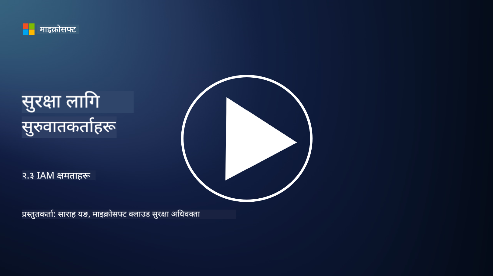

<!--
CO_OP_TRANSLATOR_METADATA:
{
  "original_hash": "bf0b8a54f2c69951744df5a94bc923f7",
  "translation_date": "2025-09-04T01:54:16+00:00",
  "source_file": "2.3 IAM capabilities.md",
  "language_code": "ne"
}
-->
# IAM क्षमताहरू

यस खण्डमा, हामी पहिचान सुरक्षा व्यवस्थापनका लागि प्रयोग गरिने मुख्य उपकरणहरू र क्षमताहरूको विस्तृत विवरण दिनेछौं।

## परिचय

यस पाठमा, हामीले निम्न विषयहरू समेट्नेछौं:

 - डाइरेक्टरी सेवा के हो?
      
     
    
 - पहिचान सुरक्षित गर्नका लागि कुन-कुन प्रकारका क्षमताहरू प्रयोग गर्न सकिन्छ?
>
>        मल्टि-फ्याक्टर प्रमाणिकरण (MFA)
> 
>        सिंगल साइन-ऑन (SSO)
> 
>        भूमिका-आधारित पहुँच नियन्त्रण (RBAC)
> 
>        अनुकूलन प्रमाणिकरण
> 
>        बायोमेट्रिक प्रमाणिकरण
> 
>        विशेषाधिकारयुक्त पहुँच व्यवस्थापन (PAM)
> 
>        पहिचान शासन र प्रशासन (IGA)
> 
>        व्यवहार विश्लेषण

## डाइरेक्टरी सेवा के हो?

डाइरेक्टरी सेवा एक विशेष प्रकारको डाटाबेस हो जसले नेटवर्क स्रोतहरूको जानकारी (जस्तै प्रयोगकर्ता, समूह, उपकरण, एप्लिकेसन, र अन्य वस्तुहरू) भण्डारण र व्यवस्थापन गर्दछ। यो पहिचान र पहुँच सम्बन्धित डाटाको केन्द्रिय भण्डारको रूपमा काम गर्दछ, जसले संस्थाहरूलाई प्रयोगकर्ता प्रमाणिकरण, अधिकार प्रदान गर्ने, र अन्य सुरक्षा सम्बन्धित कार्यहरू प्रभावकारी रूपमा व्यवस्थापन गर्न मद्दत गर्दछ।

डाइरेक्टरी सेवाहरू आधुनिक आईटी वातावरणमा महत्त्वपूर्ण भूमिका खेल्छन्, पहिचान र पहुँच व्यवस्थापन (IAM) समाधानहरूको आधार प्रदान गर्दै। यसले स्रोतहरूमा सुरक्षित पहुँच सुनिश्चित गर्दछ, पहुँच नीतिहरू लागू गर्दछ, र प्रशासनिक कार्यहरू सरल बनाउँछ। सबैभन्दा प्रख्यात डाइरेक्टरी सेवाहरू मध्ये एक Microsoft Active Directory हो, तर LDAP (Lightweight Directory Access Protocol) जस्ता अन्य समाधानहरू पनि समान उद्देश्यका लागि प्रयोग गरिन्छन्।

साइबर सुरक्षाको सन्दर्भमा डाइरेक्टरी सेवाको मुख्य कार्यहरू र विशेषताहरूमा समावेश छन्:

 - **प्रयोगकर्ता प्रमाणिकरण**: डाइरेक्टरी सेवाहरूले प्रयोगकर्ताको प्रमाणपत्र (जस्तै प्रयोगकर्ता नाम र पासवर्ड) प्रमाणित गर्छन् ताकि केवल अधिकृत प्रयोगकर्ताहरूले नेटवर्क र यसको स्रोतहरूमा पहुँच प्राप्त गर्न सकून्।
 - **प्रयोगकर्ता अधिकार प्रदान गर्ने**: यसले प्रत्येक प्रयोगकर्ताको भूमिका, समूह सदस्यता, र अन्य विशेषताहरूको आधारमा पहुँच स्तर निर्धारण गर्दछ। यसले सुनिश्चित गर्दछ कि प्रयोगकर्ताहरूले केवल उनीहरूको अधिकार प्राप्त स्रोतहरूमा पहुँच गर्न सकून्।
 - **समूह व्यवस्थापन**: डाइरेक्टरी सेवाहरूले प्रशासकहरूलाई प्रयोगकर्ताहरूलाई तार्किक समूहहरूमा व्यवस्थित गर्न अनुमति दिन्छ, पहुँच नियन्त्रण व्यवस्थापनलाई सरल बनाउँदै। अनुमति समूहहरूलाई प्रदान गर्न सकिन्छ, व्यक्तिगत प्रयोगकर्ताहरूलाई होइन।
 - **पासवर्ड नीतिहरू**: यसले पासवर्ड जटिलता र समाप्ति नियमहरू लागू गर्दछ, प्रयोगकर्ता खाताहरूको सुरक्षालाई बढाउँदै।
 - **सिंगल साइन-ऑन (SSO)**: केही डाइरेक्टरी सेवाहरूले SSO समर्थन गर्छन्, जसले प्रयोगकर्ताहरूलाई एक सेट प्रमाणपत्रको साथ धेरै एप्लिकेसन र सेवाहरूमा पहुँच प्रदान गर्दछ।
 - **केन्द्रिय प्रयोगकर्ता व्यवस्थापन**: डाइरेक्टरी सेवाहरूले प्रयोगकर्ता जानकारीलाई केन्द्रित गर्दछ, एकल स्थानबाट प्रयोगकर्ता खाता, प्रोफाइल, र विशेषताहरू व्यवस्थापन गर्न सजिलो बनाउँछ।
 - **अडिटिङ र लगिङ**: यसले प्रयोगकर्ता प्रमाणिकरण र पहुँच गतिविधिहरू रेकर्ड गर्न सक्छ, सुरक्षा अडिट र अनुपालन प्रयासहरूमा सहयोग पुर्‍याउँदै।

## पहिचान सुरक्षित गर्नका लागि कुन-कुन प्रकारका क्षमताहरू प्रयोग गर्न सकिन्छ?

**मल्टि-फ्याक्टर प्रमाणिकरण (MFA)**

MFA ले प्रयोगकर्ताहरूलाई पहुँच प्रदान गर्नु अघि धेरै प्रकारका प्रमाणिकरण प्रदान गर्न आवश्यक बनाउँछ। यसमा सामान्यतया प्रयोगकर्ताले थाहा पाएको कुरा (पासवर्ड), प्रयोगकर्तासँग भएको कुरा (स्मार्टफोन वा सुरक्षा टोकन), र प्रयोगकर्ता भएको कुरा (बायोमेट्रिक डाटा जस्तै फिंगरप्रिन्ट वा अनुहार पहिचान) समावेश हुन्छ।

**सिंगल साइन-ऑन (SSO)**

SSO ले प्रयोगकर्ताहरूलाई एक सेट प्रमाणपत्रको साथ धेरै एप्लिकेसन र प्रणालीहरूमा पहुँच प्रदान गर्दछ। यसले प्रयोगकर्ता अनुभव सुधार गर्दछ र धेरै पासवर्ड व्यवस्थापनसँग सम्बन्धित जोखिम कम गर्दछ।

**भूमिका-आधारित पहुँच नियन्त्रण (RBAC)**

RBAC ले पूर्वनिर्धारित भूमिकाहरूको आधारमा अनुमति प्रदान गर्दछ। प्रयोगकर्ताहरूलाई संस्थाभित्रको उनीहरूको भूमिकाको आधारमा पहुँच प्रदान गरिन्छ।

**अनुकूलन प्रमाणिकरण**

अनुकूलन प्रमाणिकरणले स्थान, उपकरण, पहुँचको समय, र प्रयोगकर्ता व्यवहार जस्ता जोखिम कारकहरूको मूल्यांकन गर्दछ र आवश्यक प्रमाणिकरण स्तरलाई गतिशील रूपमा समायोजन गर्दछ। यदि अनुरोध शंकास्पद देखिन्छ भने, थप प्रमाणिकरण चरणहरू ट्रिगर हुन सक्छ।

**बायोमेट्रिक प्रमाणिकरण**

बायोमेट्रिक प्रमाणिकरणले फिंगरप्रिन्ट, अनुहार विशेषताहरू, आवाज ढाँचा, र टाइपिङ गति जस्ता अद्वितीय जैविक विशेषताहरू प्रयोग गरेर पहिचान प्रमाणित गर्दछ।

**विशेषाधिकारयुक्त पहुँच व्यवस्थापन (PAM)**

PAM ले विशेषाधिकारयुक्त खाताहरूमा कडा नियन्त्रण लागू गरेर महत्त्वपूर्ण प्रणाली र डाटामा पहुँच सुरक्षित गर्न केन्द्रित गर्दछ। यसमा समयमै पहुँच र सत्र निगरानी जस्ता सुविधाहरू समावेश छन्।

**पहिचान शासन र प्रशासन (IGA)**

IGA समाधानहरूले प्रयोगकर्ता पहिचानहरू र उनीहरूको स्रोतहरूमा पहुँचलाई जीवनचक्रभरि व्यवस्थापन गर्दछ। यसमा अनबोर्डिङ, प्रोभिजनिङ, भूमिका-आधारित पहुँच नियन्त्रण, र डिप्रोभिजनिङ समावेश छ।

**व्यवहार विश्लेषण**

व्यवहार विश्लेषणले प्रयोगकर्ता व्यवहारलाई निगरानी गर्दछ र आधारभूत ढाँचाहरू स्थापना गर्दछ। सामान्य ढाँचाबाट विचलनले थप अनुसन्धानका लागि अलर्ट ट्रिगर गर्न सक्छ।

# थप अध्ययन सामग्री
- [Azure Active Directory fundamentals documentation - Microsoft Entra | Microsoft Learn](https://learn.microsoft.com/azure/active-directory/fundamentals/?WT.mc_id=academic-96948-sayoung)
- [What is Azure Active Directory? - Microsoft Entra | Microsoft Learn](https://learn.microsoft.com/azure/active-directory/fundamentals/whatis?WT.mc_id=academic-96948-sayoung)
- [Manage your multi-cloud identity infrastructure with Microsoft Entra - YouTube](https://www.youtube.com/watch?v=9qQiq3wTS2Y&list=PLXtHYVsvn_b_gtX1-NB62wNervQx1Fhp4&index=18)

---

**अस्वीकरण**:  
यो दस्तावेज़ AI अनुवाद सेवा [Co-op Translator](https://github.com/Azure/co-op-translator) प्रयोग गरी अनुवाद गरिएको हो। हामी यथासम्भव सटीकता सुनिश्चित गर्न प्रयास गर्छौं, तर कृपया ध्यान दिनुहोस् कि स्वचालित अनुवादहरूमा त्रुटि वा अशुद्धि हुन सक्छ। यसको मूल भाषामा रहेको मूल दस्तावेज़लाई आधिकारिक स्रोत मानिनुपर्छ। महत्त्वपूर्ण जानकारीका लागि, व्यावसायिक मानव अनुवाद सिफारिस गरिन्छ। यस अनुवादको प्रयोगबाट उत्पन्न हुने कुनै पनि गलतफहमी वा गलत व्याख्याका लागि हामी जिम्मेवार हुने छैनौं।