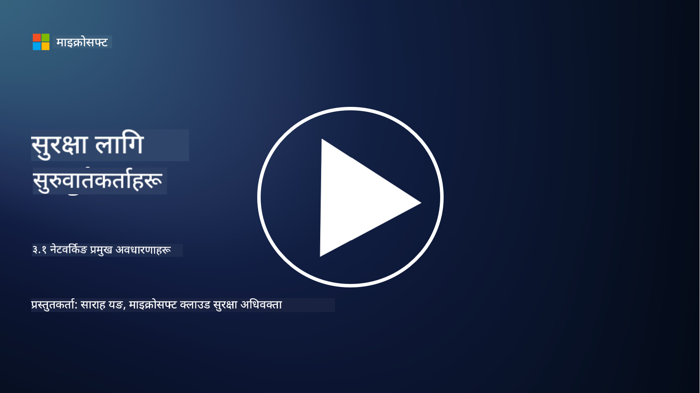
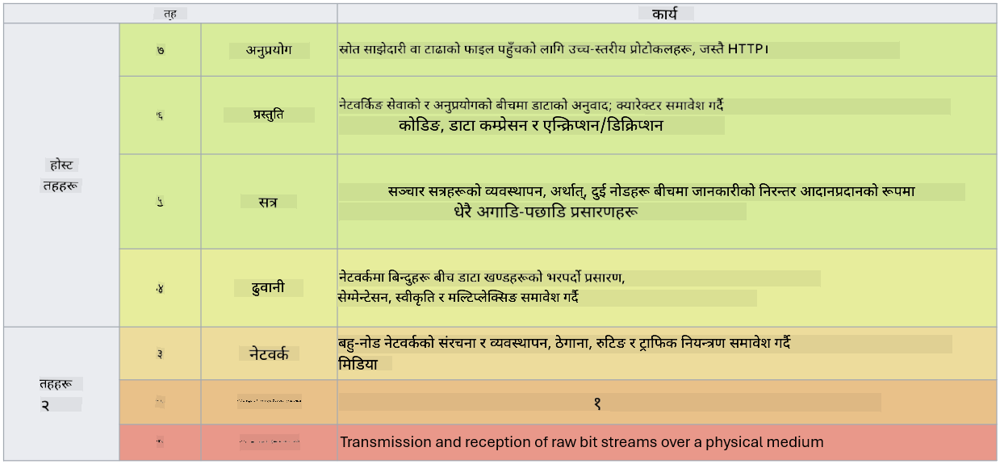

<!--
CO_OP_TRANSLATOR_METADATA:
{
  "original_hash": "252724eceeb183fb9018f88c5e1a3f0c",
  "translation_date": "2025-09-04T01:44:35+00:00",
  "source_file": "3.1 Networking key concepts.md",
  "language_code": "ne"
}
-->
# नेटवर्किङका मुख्य अवधारणाहरू

यदि तपाईंले आईटी क्षेत्रमा कुनै काम गर्नुभएको छ भने, तपाईंले नेटवर्किङ अवधारणाहरूको सामना गर्नुभएको हुन सक्छ। यद्यपि आधुनिक वातावरणमा हामी पहिचानलाई हाम्रो प्राथमिक सुरक्षा नियन्त्रणको रूपमा प्रयोग गर्छौं, यसको मतलब यो होइन कि नेटवर्क नियन्त्रणहरू अनावश्यक छन्। यो एक विशाल विषय हो, तर यस पाठमा हामी केही मुख्य नेटवर्किङ अवधारणाहरू समेट्नेछौं।

यस पाठमा हामी समेट्नेछौं:

 - IP ठेगाना के हो?
   
 - OSI मोडेल के हो?

 

 - TCP/UDP के हो?

   
 

 - पोर्ट नम्बरहरू के हुन्?

   
  

 - स्थिर र ट्रान्जिटमा इन्क्रिप्शन के हो?

## IP ठेगाना के हो?

IP ठेगाना, वा इन्टरनेट प्रोटोकल ठेगाना, कम्प्युटर नेटवर्कमा जडान भएका प्रत्येक उपकरणलाई दिइने संख्यात्मक लेबल हो, जसले इन्टरनेट प्रोटोकल प्रयोग गरेर सञ्चार गर्छ। यो नेटवर्कभित्र उपकरणहरूको लागि अद्वितीय पहिचानकर्ता हो, जसले तिनीहरूलाई इन्टरनेट वा अन्य आपसमा जडित नेटवर्कहरूमा डाटा पठाउन र प्राप्त गर्न अनुमति दिन्छ। IP ठेगानाका दुई मुख्य संस्करणहरू छन्: IPv4 (इन्टरनेट प्रोटोकल संस्करण 4) र IPv6 (इन्टरनेट प्रोटोकल संस्करण 6)। IP ठेगाना सामान्यतया IPv4 ढाँचामा (जस्तै, 192.168.1.1) वा IPv6 ढाँचामा (जस्तै, 2001:0db8:85a3:0000:0000:8a2e:0370:7334) प्रतिनिधित्व गरिन्छ।

## OSI मोडेल के हो?

OSI (ओपन सिस्टम्स इन्टरकनेक्शन) मोडेल एक अवधारणात्मक ढाँचा हो जसले सञ्चार प्रणालीका कार्यहरूलाई सात अलग तहहरूमा मानकीकरण गर्छ। प्रत्येक तहले विशिष्ट कार्यहरू गर्दछ र नेटवर्कमा उपकरणहरू बीच कुशल र भरपर्दो डाटा सञ्चार सुनिश्चित गर्न छेउछाउका तहहरूसँग सञ्चार गर्छ। यी तहहरू तलदेखि माथिसम्म यस प्रकार छन्:

 1. भौतिक तह
    
 
 2. डाटा लिङ्क तह

    
    

 1. नेटवर्क तह

    
   

 1. ट्रान्सपोर्ट तह

    

 1. सेसन तह

    
   

 1. प्रिजेन्टेसन तह

    
    

 1. एप्लिकेसन तह

OSI मोडेलले नेटवर्किङ प्रोटोकल र प्रविधिहरू कसरी अन्तरक्रिया गर्छन् भन्ने बुझ्नका लागि साझा सन्दर्भ प्रदान गर्छ, हार्डवेयर वा सफ्टवेयर कार्यान्वयनको विशिष्टतामा निर्भर नगरी।

_ref: https://en.wikipedia.org/wiki/OSI_model_

## TCP/UDP के हो?

TCP (ट्रान्समिसन कन्ट्रोल प्रोटोकल) र UDP (युजर डाटाग्राम प्रोटोकल) कम्प्युटर नेटवर्कहरूमा उपकरणहरू बीच इन्टरनेट वा स्थानीय नेटवर्कमा सञ्चारलाई सहज बनाउन प्रयोग गरिने दुई आधारभूत ट्रान्सपोर्ट तह प्रोटोकलहरू हुन्। यी प्रोटोकलहरूले डाटालाई ट्रान्समिसनका लागि साना प्याकेटहरूमा विभाजन गर्छन् र प्राप्त गर्ने पक्षमा ती प्याकेटहरूलाई पुनः मूल डाटामा संयोजन गर्छन्। यद्यपि, यी प्रोटोकलहरूका विशेषताहरू र प्रयोगका केसहरू फरक छन्।

**TCP (ट्रान्समिसन कन्ट्रोल प्रोटोकल)**:

TCP एक कनेक्शन-उन्मुख प्रोटोकल हो जसले उपकरणहरू बीच भरपर्दो र क्रमबद्ध डाटा डेलिभरी प्रदान गर्छ। डाटा आदानप्रदान सुरु हुनु अघि यो प्रेषक र प्राप्तकर्ताबीच कनेक्शन स्थापना गर्छ। TCP ले डाटा प्याकेटहरू सही क्रममा आइपुग्ने सुनिश्चित गर्छ र डाटा अखण्डता र पूर्णता ग्यारेन्टी गर्न हराएका प्याकेटहरूको पुन:प्रेषण गर्न सक्छ। यसले TCP लाई वेब ब्राउजिङ, इमेल, फाइल ट्रान्सफर (FTP), र डाटाबेस सञ्चार जस्ता भरपर्दो डाटा डेलिभरी आवश्यक पर्ने अनुप्रयोगहरूको लागि उपयुक्त बनाउँछ।

**UDP (युजर डाटाग्राम प्रोटोकल)**:

UDP एक कनेक्शनलेस प्रोटोकल हो जसले छिटो डाटा ट्रान्समिसन प्रदान गर्छ तर TCP जत्तिकै भरपर्दो छैन। यसले डाटा पठाउनु अघि औपचारिक कनेक्शन स्थापना गर्दैन र हराएका प्याकेटहरूको स्वीकृति वा पुन:प्रेषणका लागि संयन्त्रहरू समावेश गर्दैन। UDP ती अनुप्रयोगहरूको लागि उपयुक्त छ जहाँ गतिको प्राथमिकता हुन्छ र भरपर्दो डेलिभरीको आवश्यकता हुँदैन, जस्तै वास्तविक-समय सञ्चार, स्ट्रिमिङ मिडिया, अनलाइन गेमिङ, र DNS क्वेरीहरू।

संक्षेपमा, TCP ले भरपर्दो र क्रमबद्ध डेलिभरीलाई प्राथमिकता दिन्छ, जसले डाटा शुद्धता आवश्यक पर्ने अनुप्रयोगहरूको लागि उपयुक्त बनाउँछ, जबकि UDP ले गति र दक्षतालाई जोड दिन्छ, जसले न्यून विलम्बको लागि सानो डाटा हानि वा क्रम पुन:व्यवस्थापन स्वीकार्य हुने अनुप्रयोगहरूको लागि उपयुक्त बनाउँछ। TCP र UDP बीचको छनोट प्रयोग गरिने अनुप्रयोग वा सेवाको विशिष्ट आवश्यकताहरूमा निर्भर गर्दछ।

## पोर्ट नम्बरहरू के हुन्?

नेटवर्किङमा, पोर्ट नम्बर एक संख्यात्मक पहिचानकर्ता हो जसले नेटवर्कभित्र एउटै उपकरणमा चलिरहेका विभिन्न सेवाहरू वा अनुप्रयोगहरूलाई फरक पार्न प्रयोग गरिन्छ। पोर्टहरूले इनकमिङ डाटालाई उपयुक्त अनुप्रयोगमा रुट गर्न मद्दत गर्छ। पोर्ट नम्बरहरू 16-बिट असाइन गरिएको पूर्णांकहरू हुन्, जसको दायरा 0 देखि 65535 सम्म हुन्छ। यी तीन दायरामा विभाजित छन्:

- वेल-नोन पोर्टहरू (0-1023): HTTP (पोर्ट 80) र FTP (पोर्ट 21) जस्ता मानक सेवाहरूका लागि आरक्षित।

- रजिस्टर्ड पोर्टहरू (1024-49151): ती अनुप्रयोगहरू र सेवाहरूका लागि प्रयोग गरिन्छ जुन वेल-नोन दायराको हिस्सा होइनन् तर आधिकारिक रूपमा दर्ता गरिएका छन्।

- डायनामिक/प्राइभेट पोर्टहरू (49152-65535): अनुप्रयोगहरूले अस्थायी वा निजी प्रयोगका लागि उपलब्ध।

## स्थिर र ट्रान्जिटमा इन्क्रिप्शन के हो?

इन्क्रिप्शन भनेको डाटालाई सुरक्षित ढाँचामा रूपान्तरण गर्ने प्रक्रिया हो, जसले यसलाई अनधिकृत पहुँच वा छेडछाडबाट जोगाउँछ। इन्क्रिप्शनलाई "स्थिर" (जब डाटा उपकरण वा सर्भरमा भण्डारण गरिएको हुन्छ) र "ट्रान्जिटमा" (जब डाटा उपकरणहरू बीच वा नेटवर्कहरूमा प्रसारित भइरहेको हुन्छ) दुवैमा लागू गर्न सकिन्छ।

स्थिरमा इन्क्रिप्शन: यसले उपकरणहरू, सर्भरहरू, वा भण्डारण प्रणालीहरूमा भण्डारण गरिएको डाटालाई इन्क्रिप्ट गर्न समावेश गर्दछ। यदि आक्रमणकारीले भौतिक रूपमा भण्डारण मिडियामा पहुँच प्राप्त गरे पनि, तिनीहरूले इन्क्रिप्शन कुञ्जीहरू बिना डाटामा पहुँच गर्न सक्दैनन्। यो उपकरण चोरी, डाटा उल्लङ्घन, वा अनधिकृत पहुँचको अवस्थामा संवेदनशील डाटाको सुरक्षा गर्न महत्त्वपूर्ण छ।

ट्रान्जिटमा इन्क्रिप्शन: यसले डाटालाई उपकरणहरू बीच वा नेटवर्कहरूमा यात्रा गर्दा इन्क्रिप्ट गर्न समावेश गर्दछ। यसले प्रसारणको क्रममा डाटाको सुन्ने प्रयास र अनधिकृत अवरोधलाई रोक्छ। ट्रान्जिटमा इन्क्रिप्शनका लागि सामान्य प्रोटोकलहरूमा वेब सञ्चारका लागि HTTPS र विभिन्न प्रकारका नेटवर्क ट्राफिकलाई सुरक्षित गर्न TLS/SSL समावेश छन्।

## थप अध्ययन
- [How Do IP Addresses Work? (howtogeek.com)](https://www.howtogeek.com/341307/how-do-ip-addresses-work/)
- [Understanding IP Address: An Introductory Guide (geekflare.com)](https://geekflare.com/understanding-ip-address/)
- [What is the OSI model? The 7 layers of OSI explained (techtarget.com)](https://www.techtarget.com/searchnetworking/definition/OSI)
- [The OSI Model – The 7 Layers of Networking Explained in Plain English (freecodecamp.org)](https://www.freecodecamp.org/news/osi-model-networking-layers-explained-in-plain-english/)
- [TCP/IP protocols - IBM Documentation](https://www.ibm.com/docs/en/aix/7.3?topic=protocol-tcpip-protocols)
- [Common Ports Cheat Sheet: The Ultimate Ports & Protocols List (stationx.net)](https://www.stationx.net/common-ports-cheat-sheet/)
- [Azure Data Encryption-at-Rest - Azure Security | Microsoft Learn](https://learn.microsoft.com/azure/security/fundamentals/encryption-atrest?WT.mc_id=academic-96948-sayoung)

---

**अस्वीकरण**:  
यो दस्तावेज़ AI अनुवाद सेवा [Co-op Translator](https://github.com/Azure/co-op-translator) प्रयोग गरी अनुवाद गरिएको हो। हामी यथासम्भव सटीकता सुनिश्चित गर्न प्रयास गर्छौं, तर कृपया ध्यान दिनुहोस् कि स्वचालित अनुवादहरूमा त्रुटिहरू वा अशुद्धताहरू हुन सक्छन्। यसको मूल भाषामा रहेको मूल दस्तावेज़लाई आधिकारिक स्रोत मानिनुपर्छ। महत्त्वपूर्ण जानकारीका लागि, व्यावसायिक मानव अनुवाद सिफारिस गरिन्छ। यस अनुवादको प्रयोगबाट उत्पन्न हुने कुनै पनि गलतफहमी वा गलत व्याख्याका लागि हामी जिम्मेवार हुने छैनौं।