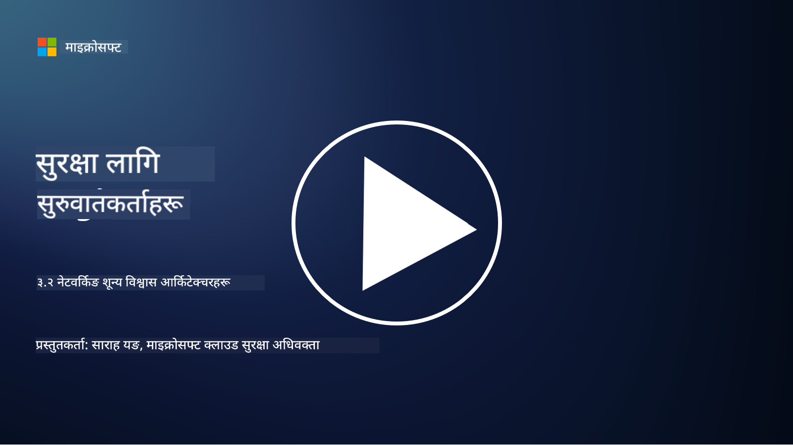

<!--
CO_OP_TRANSLATOR_METADATA:
{
  "original_hash": "680d6e14d9d33fc471c22f44679713f8",
  "translation_date": "2025-09-04T00:36:40+00:00",
  "source_file": "3.2 Networking zero trust architecture.md",
  "language_code": "ne"
}
-->
# नेटवर्किङ शून्य विश्वास आर्किटेक्चर

नेटवर्कले शून्य विश्वास नियन्त्रणमा महत्त्वपूर्ण तह प्रदान गर्दछ। यस पाठमा हामी यसबारे थप जान्नेछौं:

 - नेटवर्क विभाजन के हो? 
 - नेटवर्क विभाजनले शून्य विश्वास कार्यान्वयन गर्न कसरी मद्दत गर्छ? 
 - अन्त्य-देखि-अन्त्य इन्क्रिप्शन के हो?

## नेटवर्क विभाजन के हो?

नेटवर्क विभाजन भनेको नेटवर्कलाई साना, अलग-अलग खण्डहरू वा उप-नेटवर्कहरूमा विभाजन गर्ने अभ्यास हो। प्रत्येक खण्ड अन्य खण्डहरूबाट अलग गरिएको हुन्छ, र खण्डहरू बीचको पहुँच विशेष सुरक्षा नीतिहरूको आधारमा नियन्त्रण र सीमित गरिएको हुन्छ। नेटवर्क विभाजनले सम्भावित सुरक्षा उल्लङ्घनको प्रभावलाई सीमित गरेर र आक्रमणकारीहरूको नेटवर्कभित्रको पार्श्वीय गतिविधिलाई रोक्न सुरक्षा सुधार गर्न प्रयोग गरिन्छ।

नेटवर्क विभाजन कार्यान्वयन गरेर, संस्थाले विभिन्न प्रकारका प्रयोगकर्ता, अनुप्रयोगहरू, र डाटालाई अलग गर्ने "जोनहरू" सिर्जना गर्न सक्छ। यसले आक्रमणको सतहलाई घटाउँछ र सुरक्षा घटनाबाट हुने सम्भावित क्षति कम गर्छ। नेटवर्क विभाजन भर्चुअल LANs (VLANs), फायरवालहरू, र पहुँच नियन्त्रणजस्ता प्रविधिहरू प्रयोग गरेर हासिल गर्न सकिन्छ।

## नेटवर्क विभाजनले शून्य विश्वास कार्यान्वयन गर्न कसरी मद्दत गर्छ?

नेटवर्क विभाजन शून्य विश्वास मोडेलका सिद्धान्तहरूसँग नजिकबाट मेल खान्छ। शून्य विश्वास आर्किटेक्चरमा, नेटवर्क विभाजनले "कम्तिमा विशेषाधिकार"को सिद्धान्तलाई लागू गर्न मद्दत गर्छ। यसले सुनिश्चित गर्छ कि प्रयोगकर्ता र उपकरणहरूले आफ्नो कार्यहरू पूरा गर्न आवश्यक स्रोतहरू र सेवाहरूमा मात्र पहुँच पाउँछन्। नेटवर्कलाई साना जोनहरूमा विभाजन गरेर, संस्थाहरूले कडा पहुँच नियन्त्रण लागू गर्न, महत्त्वपूर्ण सम्पत्तिहरू अलग गर्न, र आक्रमणकारीहरूको पार्श्वीय गतिविधिलाई रोक्न सक्छ।

नेटवर्क विभाजनले पहिचान-आधारित पहुँच नियन्त्रण लागू गर्न पनि मद्दत गर्छ, जहाँ प्रयोगकर्ता र उपकरणहरूलाई विशिष्ट खण्डहरूमा पहुँच गर्नु अघि पूर्ण रूपमा प्रमाणित र स्वीकृत गरिन्छ। यसले संवेदनशील स्रोतहरूमा अनधिकृत पहुँच रोक्छ र सम्झौता गरिएको प्रमाणहरूको सम्भावित प्रभावलाई कम गर्छ।

## अन्त्य-देखि-अन्त्य इन्क्रिप्शन के हो?

अन्त्य-देखि-अन्त्य (E2E) इन्क्रिप्शन भनेको डाटा यसको सम्पूर्ण यात्रा प्रेषकबाट प्राप्तकर्तासम्म इन्क्रिप्टेड रहन्छ भन्ने सुनिश्चित गर्ने सुरक्षा उपाय हो। यस प्रक्रियामा, डाटा प्रेषकको अन्त्यमा इन्क्रिप्ट गरिन्छ, र केवल प्राप्तकर्तासँग डिक्रिप्शन कुञ्जी हुन्छ जसले डाटालाई अनलक गरेर पढ्न सक्छ। इन्क्रिप्शन र डिक्रिप्शन प्रक्रियाहरू अन्त्य बिन्दुहरूमा हुन्छन्, जसले अनधिकृत पक्षहरू, सेवा प्रदायकहरू, र मध्यस्थहरूलाई डाटाको वास्तविक सामग्री पहुँच गर्न अत्यन्त कठिन बनाउँछ।

E2E इन्क्रिप्शनले डाटा प्रसारणको लागि उच्च स्तरको गोपनीयता र सुरक्षा प्रदान गर्छ, चाहे डाटा विभिन्न मध्यस्थ प्रणालीहरू वा नेटवर्कहरूबाट किन नजाओस्। यो संवेदनशील जानकारीलाई अवरोध र अनधिकृत पहुँचबाट बचाउन सुरक्षित सन्देश अनुप्रयोगहरू, इमेल सेवाहरू, र अन्य सञ्चार प्लेटफर्महरूमा सामान्यतया प्रयोग गरिन्छ।

यो इन्क्रिप्शन विधिले सुनिश्चित गर्छ कि यदि आक्रमणकारीहरूले प्रसारणमा रहेको डाटामा पहुँच गर्न सफल भए पनि, उनीहरूले केवल इन्क्रिप्टेड सामग्री देख्नेछन्, जुन डिक्रिप्शन कुञ्जी बिना अर्थहीन हुन्छ। अन्त्य-देखि-अन्त्य इन्क्रिप्शनले प्रयोगकर्ताको गोपनीयता सुरक्षित गर्न र संवेदनशील जानकारीलाई अनधिकृत पक्षहरूबाट बचाउन महत्त्वपूर्ण भूमिका खेल्छ।

## SASE के हो?

SASE भनेको "Secure Access Service Edge" हो, र यो नेटवर्क सुरक्षा र वाइड-एरिया नेटवर्किङ (WAN) क्षमताहरूलाई एकल क्लाउड-आधारित सेवामा संयोजन गर्ने साइबर सुरक्षा फ्रेमवर्क र आर्किटेक्चर हो। SASEले टाढा र मोबाइल प्रयोगकर्ताहरूका लागि नेटवर्क स्रोतहरू, अनुप्रयोगहरू, र डाटामा सुरक्षित र स्केलेबल पहुँच प्रदान गर्न डिजाइन गरिएको हो, जबकि नेटवर्क व्यवस्थापनलाई सरल बनाउँछ र परम्परागत नेटवर्क र सुरक्षा आर्किटेक्चरहरूको जटिलता घटाउँछ।

SASEका प्रमुख विशेषताहरू र घटकहरूमा समावेश छन्:

1.  **क्लाउड-आधारित:** SASE क्लाउड सेवा रूपमा प्रदान गरिन्छ, जसको अर्थ सुरक्षा र नेटवर्किङ कार्यहरू परम्परागत हार्डवेयर र उपकरणहरूमा निर्भर नगरी क्लाउडबाट प्रदान गरिन्छ।
    
2.  **सुरक्षा र नेटवर्किङको एकीकरण:** SASEले सुरक्षित वेब गेटवे (SWG), फायरवाल सेवा रूपमा (FWaaS), डाटा हानि रोकथाम (DLP), शून्य-विश्वास नेटवर्क पहुँच (ZTNA), र WAN अनुकूलनजस्ता विभिन्न सुरक्षा सेवाहरूलाई वाइड-एरिया नेटवर्किङ क्षमतासँग एकीकृत गर्छ। यस एकीकरणले सुरक्षा र नेटवर्किङ कार्यहरूलाई सरल बनाउँछ।
    
3.  **शून्य विश्वास:** SASE शून्य विश्वासको सिद्धान्तमा सञ्चालन हुन्छ, जसले कडा पहुँच नियन्त्रण र कम्तिमा विशेषाधिकार पहुँच नीतिहरू लागू गर्छ। प्रयोगकर्ता र उपकरणहरूलाई स्वतः विश्वास गरिँदैन, र स्रोतहरूमा पहुँच गर्नु अघि तिनीहरूलाई प्रमाणित र स्वीकृत गर्नुपर्छ।
    
4.  **पहिचान-केंद्रित:** SASEले पहुँच नियन्त्रणको आधारका रूपमा प्रयोगकर्ता र उपकरण पहिचानहरूमा ध्यान केन्द्रित गर्छ। पहिचान र सन्दर्भ-आधारित नीतिहरू पहुँच अनुमति निर्धारण गर्न प्रयोग गरिन्छ, र यी नीतिहरू प्रयोगकर्ता व्यवहार र सन्दर्भको आधारमा गतिशील रूपमा अनुकूलित हुन्छन्।
    
5.  **स्केलेबिलिटी र लचिलोपन:** SASEले धेरै प्रयोगकर्ता र उपकरणहरू समायोजन गर्न सजिलै स्केल गर्न सक्छ, जसले विविध र विकसित नेटवर्किङ र सुरक्षा आवश्यकताहरू भएका संस्थाहरूका लागि उपयुक्त बनाउँछ।
   

SASE विशेष गरी टाढाको काम र क्लाउड अपनाउने आधुनिक युगमा सान्दर्भिक छ, किनकि यसले नेटवर्क पहुँचलाई सुरक्षित र व्यवस्थापन गर्न व्यापक र चपल दृष्टिकोण प्रदान गर्छ। यसले प्रयोगकर्ता-केंद्रित र शून्य-विश्वास सुरक्षा मोडेलमा बलियो ध्यान राख्दै बदलिँदो सुरक्षा र नेटवर्किङ आवश्यकताहरूमा संस्थाहरूलाई अनुकूलन गर्न मद्दत गर्छ।

## थप अध्ययन

- [What Is Network Segmentation? - Cisco](https://www.cisco.com/c/en/us/products/security/what-is-network-segmentation.html#~benefits)
- [What Is Micro-Segmentation? - Cisco](https://www.cisco.com/c/en/us/products/security/what-is-microsegmentation.html)
- [Implementing Network Segmentation and Segregation | Cyber.gov.au](https://www.cyber.gov.au/resources-business-and-government/maintaining-devices-and-systems/system-hardening-and-administration/network-hardening/implementing-network-segmentation-and-segregation)
- [What Is Network Segmentation and Why It Matters | CompTIA](https://www.comptia.org/blog/security-awareness-training-network-segmentation)
- [Network Segmentation: Concepts and Practices (cmu.edu)](https://insights.sei.cmu.edu/blog/network-segmentation-concepts-and-practices/)
- [Secure networks with Zero Trust | Microsoft Learn](https://learn.microsoft.com/security/zero-trust/deploy/networks?WT.mc_id=academic-96948-sayoung)
- [What is end-to-end encryption? | IBM](https://www.ibm.com/topics/end-to-end-encryption)
- [What Is End-to-End Encryption, and Why Does It Matter? (howtogeek.com)](https://www.howtogeek.com/711656/what-is-end-to-end-encryption-and-why-does-it-matter/)
-  [Definition of Secure Access Service Edge (SASE) - Gartner Information Technology Glossary](https://www.gartner.com/en/information-technology/glossary/secure-access-service-edge-sase)
- [What Is Secure Access Service Edge (SASE)? | Microsoft Security](https://www.microsoft.com/security/business/security-101/what-is-sase?WT.mc_id=academic-96948-sayoung)

---

**अस्वीकरण**:  
यो दस्तावेज़ AI अनुवाद सेवा [Co-op Translator](https://github.com/Azure/co-op-translator) प्रयोग गरी अनुवाद गरिएको हो। हामी यथासम्भव सटीकता सुनिश्चित गर्न प्रयास गर्छौं, तर कृपया ध्यान दिनुहोस् कि स्वचालित अनुवादहरूमा त्रुटिहरू वा अशुद्धताहरू हुन सक्छन्। यसको मूल भाषामा रहेको मूल दस्तावेज़लाई आधिकारिक स्रोत मानिनुपर्छ। महत्त्वपूर्ण जानकारीका लागि, व्यावसायिक मानव अनुवाद सिफारिस गरिन्छ। यस अनुवादको प्रयोगबाट उत्पन्न हुने कुनै पनि गलतफहमी वा गलत व्याख्याका लागि हामी जिम्मेवार हुने छैनौं।