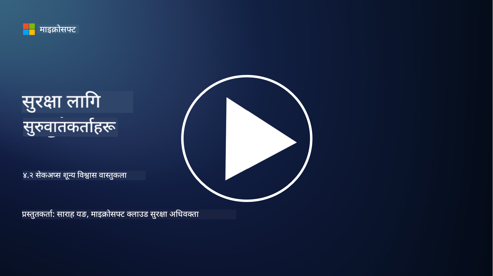

<!--
CO_OP_TRANSLATOR_METADATA:
{
  "original_hash": "45bbdc114e70936816b0b3e7c40189cf",
  "translation_date": "2025-09-04T00:43:56+00:00",
  "source_file": "4.2 SecOps zero trust architecture.md",
  "language_code": "ne"
}
-->
# SecOps शून्य विश्वास आर्किटेक्चर

सुरक्षा अपरेसन शून्य विश्वास आर्किटेक्चरका दुई भागहरू बनाउँछ, र यस पाठमा हामी दुबैबारे सिक्नेछौं:

- केन्द्रीयकृत लग सङ्कलनलाई अनुमति दिन IT आर्किटेक्चर कसरी निर्माण गर्नुपर्छ?

- आधुनिक IT वातावरणमा सुरक्षा अपरेसनका लागि उत्तम अभ्यासहरू के हुन्?

## केन्द्रीयकृत लग सङ्कलनलाई अनुमति दिन IT आर्किटेक्चर कसरी निर्माण गर्नुपर्छ?

केन्द्रीयकृत लग सङ्कलन आधुनिक सुरक्षा अपरेसनको एक महत्त्वपूर्ण अङ्ग हो। यसले संस्थाहरूलाई विभिन्न स्रोतहरूबाट, जस्तै सर्भर, एप्लिकेसन, नेटवर्क उपकरण, र सुरक्षा उपकरणहरू, लगहरू र डाटाहरूलाई एक केन्द्रीय भण्डारणमा सङ्कलन, विश्लेषण, अनुगमन, र घटनाको प्रतिक्रिया दिन अनुमति दिन्छ। केन्द्रीयकृत लग सङ्कलनलाई समर्थन गर्न IT आर्किटेक्चर निर्माण गर्नका लागि केही उत्तम अभ्यासहरू यहाँ छन्:

1. **लग स्रोत एकीकरण**:

- सुनिश्चित गर्नुहोस् कि सबै सम्बन्धित उपकरणहरू र प्रणालीहरू लगहरू उत्पन्न गर्न कन्फिगर गरिएको छ। यसमा सर्भर, फायरवाल, राउटर, स्विच, एप्लिकेसन, र सुरक्षा उपकरणहरू समावेश छन्।

- लग स्रोतहरूलाई केन्द्रीयकृत लग सङ्कलनकर्ता वा व्यवस्थापन प्रणालीमा लगहरू अग्रेषण गर्न कन्फिगर गर्नुहोस्।

2. **उपयुक्त SIEM (Security Information and Event Management) उपकरण चयन गर्नुहोस्**:

- आफ्नो संस्थाको आवश्यकताहरू र स्केलसँग मेल खाने SIEM समाधान चयन गर्नुहोस्।

- सुनिश्चित गर्नुहोस् कि चयन गरिएको समाधानले लग सङ्कलन, एकत्रीकरण, विश्लेषण, र रिपोर्टिङलाई समर्थन गर्दछ।

3. **स्केलेबिलिटी र रेडन्डेन्सी**:

- बढ्दो लग स्रोतहरूको संख्या र बढ्दो लग भोल्युमलाई समायोजन गर्न आर्किटेक्चरलाई स्केलेबल बनाउन डिजाइन गर्नुहोस्।

- हार्डवेयर वा नेटवर्क विफलताका कारण अवरोध रोक्न उच्च उपलब्धताका लागि रेडन्डेन्सी कार्यान्वयन गर्नुहोस्।

4. **लगहरू सुरक्षित रूपमा ट्रान्सपोर्ट गर्नुहोस्**:

- स्रोतहरूबाट केन्द्रीय भण्डारणमा लगहरू ट्रान्सपोर्ट गर्न TLS/SSL वा IPsec जस्ता सुरक्षित प्रोटोकलहरू प्रयोग गर्नुहोस्।

- लगहरू पठाउन मात्र अधिकृत उपकरणहरूले अनुमति पाउने सुनिश्चित गर्न प्रमाणीकरण र पहुँच नियन्त्रणहरू कार्यान्वयन गर्नुहोस्।

5. **सामान्यीकरण**:

- लग ढाँचाहरूलाई मानकीकरण गर्नुहोस् र डाटालाई सामान्यीकरण गर्नुहोस् ताकि विश्लेषण सजिलो र सुसंगत होस्।

6. **भण्डारण र अवधारण**:

- अनुपालन र सुरक्षा आवश्यकताहरूको आधारमा लगहरूको उपयुक्त अवधारण अवधि निर्धारण गर्नुहोस्।

- लगहरूलाई सुरक्षित रूपमा भण्डारण गर्नुहोस्, तिनीहरूलाई अनधिकृत पहुँच र छेडछाडबाट जोगाउनुहोस्।

## आधुनिक IT वातावरणमा सुरक्षा अपरेसनका लागि उत्तम अभ्यासहरू के हुन्?

केन्द्रीयकृत लग सङ्कलनको अतिरिक्त, यहाँ आधुनिक IT वातावरणमा सुरक्षा अपरेसनका लागि केही उत्तम अभ्यासहरू छन्:

1. **निरन्तर अनुगमन**: नेटवर्क र प्रणाली गतिविधिहरूको निरन्तर अनुगमन कार्यान्वयन गर्नुहोस् ताकि खतराहरूलाई वास्तविक समयमा पत्ता लगाउन र प्रतिक्रिया दिन सकियोस्।

2. **थ्रेट इन्टेलिजेन्स**: उदीयमान खतराहरू र कमजोरताहरूको बारेमा जानकारी राख्न थ्रेट इन्टेलिजेन्स फिडहरू र सेवाहरूको उपयोग गर्नुहोस्।

3. **प्रयोगकर्ता प्रशिक्षण**: सामाजिक इन्जिनियरिङ र फिसिङ आक्रमणसँग सम्बन्धित जोखिमहरू कम गर्न कर्मचारीहरूको लागि नियमित सुरक्षा सचेतना प्रशिक्षण सञ्चालन गर्नुहोस्।

4. **घटना प्रतिक्रिया योजना**: सुरक्षा घटनाहरूमा छिटो र प्रभावकारी प्रतिक्रिया सुनिश्चित गर्न घटना प्रतिक्रिया योजना विकास र परीक्षण गर्नुहोस्।

5. **सुरक्षा स्वचालन**: घटना प्रतिक्रिया र दोहोरिने कार्यहरूलाई सरल बनाउन सुरक्षा स्वचालन र अर्केस्ट्रेसन उपकरणहरूको उपयोग गर्नुहोस्।

6. **ब्याकअप र पुनःप्राप्ति**: डाटा हानि वा र्यान्समवेयर आक्रमणको अवस्थामा डाटाको उपलब्धता सुनिश्चित गर्न बलियो ब्याकअप र आपतकालीन पुनःप्राप्ति समाधानहरू कार्यान्वयन गर्नुहोस्।

## थप अध्ययन

- [Microsoft Security Best Practices module: Security operations | Microsoft Learn](https://learn.microsoft.com/security/operations/security-operations-videos-and-decks?WT.mc_id=academic-96948-sayoung)
- [Security operations - Cloud Adoption Framework | Microsoft Learn](https://learn.microsoft.com/azure/cloud-adoption-framework/secure/security-operations?WT.mc_id=academic-96948-sayoung)
- [What is Security Operations and Analytics Platform Architecture? A Definition of SOAPA, How It Works, Benefits, and More (digitalguardian.com)](https://www.digitalguardian.com/blog/what-security-operations-and-analytics-platform-architecture-definition-soapa-how-it-works#:~:text=All%20in%20all%2C%20security%20operations%20and%20analytics%20platform,become%20more%20efficient%20and%20operative%20with%20your%20security.)

---

**अस्वीकरण**:  
यो दस्तावेज़ AI अनुवाद सेवा [Co-op Translator](https://github.com/Azure/co-op-translator) प्रयोग गरी अनुवाद गरिएको हो। हामी यथासम्भव सटीकता सुनिश्चित गर्न प्रयास गर्छौं, तर कृपया ध्यान दिनुहोस् कि स्वचालित अनुवादहरूमा त्रुटि वा अशुद्धि हुन सक्छ। यसको मूल भाषामा रहेको मूल दस्तावेज़लाई आधिकारिक स्रोत मानिनुपर्छ। महत्त्वपूर्ण जानकारीका लागि, व्यावसायिक मानव अनुवाद सिफारिस गरिन्छ। यस अनुवादको प्रयोगबाट उत्पन्न हुने कुनै पनि गलतफहमी वा गलत व्याख्याका लागि हामी जिम्मेवार हुने छैनौं।