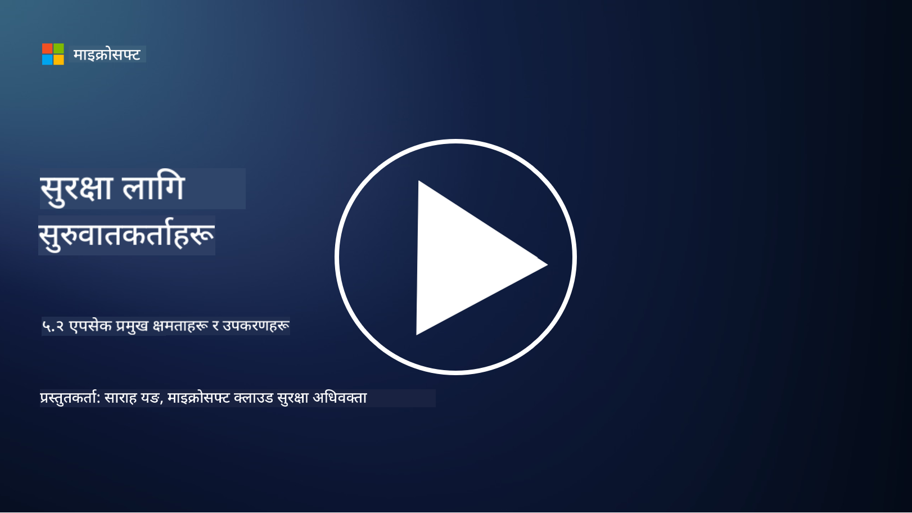

<!--
CO_OP_TRANSLATOR_METADATA:
{
  "original_hash": "790a3fa7e535ec60bb51bde13e759781",
  "translation_date": "2025-09-04T00:49:25+00:00",
  "source_file": "5.2 AppSec key capabilities.md",
  "language_code": "ne"
}
-->
## परिचय

यस पाठमा, हामी एप्लिकेशन सुरक्षा क्षेत्रमा प्रयोग गरिने मुख्य क्षमताहरू र उपकरणहरूको बारेमा छलफल गर्नेछौं।

## एप्सेकका मुख्य क्षमताहरू र उपकरणहरू

एप्लिकेशन सुरक्षामा प्रयोग गरिने मुख्य क्षमताहरू र उपकरणहरू सफ्टवेयर एप्लिकेशनहरूमा सुरक्षा कमजोरीहरू र खतराहरू पहिचान, न्यूनीकरण, र रोकथाम गर्न महत्त्वपूर्ण छन्। यहाँ केही मुख्य उपकरणहरू र क्षमताहरू छन्:

**1. स्टाटिक एप्लिकेशन सुरक्षा परीक्षण (SAST)**:

- **क्षमताहरू**: स्रोत कोड, बाइटकोड, वा बाइनरी कोड विश्लेषण गरेर एप्लिकेशनको कोडबेसमा सुरक्षा कमजोरीहरू पहिचान गर्दछ।

- **उपकरणहरू**: उदाहरणहरूमा Fortify, Checkmarx, र Veracode समावेश छन्।

**2. डायनामिक एप्लिकेशन सुरक्षा परीक्षण (DAST)**:

- **क्षमताहरू**: चलिरहेको एप्लिकेशन स्क्यान गरेर इनपुट अनुरोधहरू पठाउने र प्रतिक्रियाहरू विश्लेषण गर्ने माध्यमबाट कमजोरीहरू पहिचान गर्दछ।

- **उपकरणहरू**: उदाहरणहरूमा ZAP, Burp Suite, र Qualys Web Application Scanning समावेश छन्।

**3. इन्टरएक्टिभ एप्लिकेशन सुरक्षा परीक्षण (IAST)**:

- **क्षमताहरू**: SAST र DAST को तत्वहरू संयोजन गरेर रनटाइममा कोड विश्लेषण गर्दछ, जसले अधिक सटीक परिणामहरू प्रदान गर्दछ र गलत सकारात्मकहरू घटाउँछ।

- **उपकरणहरू**: उदाहरणहरूमा Contrast Security र HCL AppScan समावेश छन्।

**4. रनटाइम एप्लिकेशन सेल्फ-प्रोटेक्शन (RASP)**:

- **क्षमताहरू**: वास्तविक समयमा एप्लिकेशनहरू निगरानी र सुरक्षा गर्दछ, खतराहरू पहिचान र प्रतिक्रिया दिन्छ।

- **उपकरणहरू**: उदाहरणहरूमा Veracode Runtime Protection र F5 Advanced WAF with RASP समावेश छन्।

**5. वेब एप्लिकेशन फायरवाल (WAFs)**:

- **क्षमताहरू**: एप्लिकेशन र इन्टरनेटको बीचमा सुरक्षात्मक तह प्रदान गर्दछ, इनकमिङ ट्राफिक फिल्टर गर्दछ र हानिकारक अनुरोधहरू रोक्छ।

- **उपकरणहरू**: उदाहरणहरूमा ModSecurity, AWS WAF, र Akamai Kona Site Defender समावेश छन्।

**6. निर्भरता स्क्यानिङ**:

- **क्षमताहरू**: एप्लिकेशनमा प्रयोग गरिएका तेस्रो-पक्ष पुस्तकालयहरू र कम्पोनेन्टहरूमा कमजोरीहरू पहिचान गर्दछ।

- **उपकरणहरू**: उदाहरणहरूमा OWASP Dependency-Check र Snyk समावेश छन्।

**7. पेनिट्रेशन परीक्षण (Pen Testing)**:

- **क्षमताहरू**: वास्तविक-विश्व आक्रमणहरूको अनुकरण गरेर कमजोरीहरू पत्ता लगाउँछ र एप्लिकेशनको सुरक्षा मूल्याङ्कन गर्दछ।

- **उपकरणहरू**: प्रमाणित इथिकल ह्याकरहरू र सुरक्षा पेशेवरहरूले Metasploit र Nmap जस्ता उपकरणहरू प्रयोग गरेर परीक्षण गर्छन्।

**8. सुरक्षा स्क्यानिङ र विश्लेषण**:

- **क्षमताहरू**: ज्ञात कमजोरीहरू, कन्फिगरेसन त्रुटिहरू, र सुरक्षा गलत कन्फिगरेसनहरूको लागि स्क्यान गर्दछ।

- **उपकरणहरू**: उदाहरणहरूमा Nessus, Qualys Vulnerability Management, र OpenVAS समावेश छन्।

**9. कन्टेनर सुरक्षा उपकरणहरू**:

- **क्षमताहरू**: कन्टेनराइज्ड एप्लिकेशनहरू र तिनको वातावरणको सुरक्षा सुनिश्चित गर्न केन्द्रित।

- **उपकरणहरू**: उदाहरणहरूमा Docker Security Scanning र Aqua Security समावेश छन्।

**10. सुरक्षित विकास प्रशिक्षण**:

- **क्षमताहरू**: विकास टोलीहरूलाई सुरक्षित कोडिङ अभ्यासहरू प्रोत्साहित गर्न प्रशिक्षण र जागरूकता कार्यक्रमहरू प्रदान गर्दछ।

- **उपकरणहरू**: अनुकूलित प्रशिक्षण कार्यक्रमहरू र प्लेटफर्महरू।

**11. सुरक्षा परीक्षण फ्रेमवर्कहरू**:

- **क्षमताहरू**: विभिन्न एप्लिकेशन सुरक्षा परीक्षण आवश्यकताहरूको लागि व्यापक परीक्षण फ्रेमवर्कहरू प्रदान गर्दछ।

- **उपकरणहरू**: OWASP Amass, OWASP OWTF र FrAppSec।

**12. सुरक्षित कोड समीक्षा उपकरणहरू**:

- **क्षमताहरू**: स्रोत कोडको सुरक्षा कमजोरीहरू र कोडिङको उत्कृष्ट अभ्यासहरूको लागि समीक्षा गर्दछ।

- **उपकरणहरू**: उदाहरणहरूमा SonarQube र Checkmarx समावेश छन्।

**13. सुरक्षित APIs र माइक्रोसर्भिस उपकरणहरू**:

- **क्षमताहरू**: APIs र माइक्रोसर्भिसहरूको सुरक्षा सुनिश्चित गर्न केन्द्रित, जसमा प्रमाणीकरण, प्राधिकरण, र डाटा सुरक्षा समावेश छ।

- **उपकरणहरू**: उदाहरणहरूमा Apigee, AWS API Gateway, र Istio समावेश छन्।

## थप अध्ययन

- [What Is Application Security? Concepts, Tools & Best Practices | HackerOne](https://www.hackerone.com/knowledge-center/what-application-security-concepts-tools-best-practices)
- [What is IAST? (Interactive Application Security Testing) (comparitech.com)](https://www.comparitech.com/net-admin/what-is-iast/)
- [10 Types of Application Security Testing Tools: When and How to Use Them (cmu.edu)](https://insights.sei.cmu.edu/blog/10-types-of-application-security-testing-tools-when-and-how-to-use-them/)
- [Shifting the Balance of Cybersecurity Risk: Principles and Approaches for Security-by-Design and Default | Cyber.gov.au](https://www.cyber.gov.au/about-us/view-all-content/publications/principles-and-approaches-for-security-by-design-and-default)

---

**अस्वीकरण**:  
यो दस्तावेज़ AI अनुवाद सेवा [Co-op Translator](https://github.com/Azure/co-op-translator) प्रयोग गरी अनुवाद गरिएको हो। हामी यथासम्भव सटीकता सुनिश्चित गर्न प्रयास गर्छौं, तर कृपया ध्यान दिनुहोस् कि स्वचालित अनुवादहरूमा त्रुटि वा अशुद्धता हुन सक्छ। यसको मूल भाषामा रहेको मूल दस्तावेज़लाई आधिकारिक स्रोत मानिनुपर्छ। महत्त्वपूर्ण जानकारीका लागि, व्यावसायिक मानव अनुवाद सिफारिस गरिन्छ। यस अनुवादको प्रयोगबाट उत्पन्न हुने कुनै पनि गलतफहमी वा गलत व्याख्याको लागि हामी जिम्मेवार हुने छैनौं।