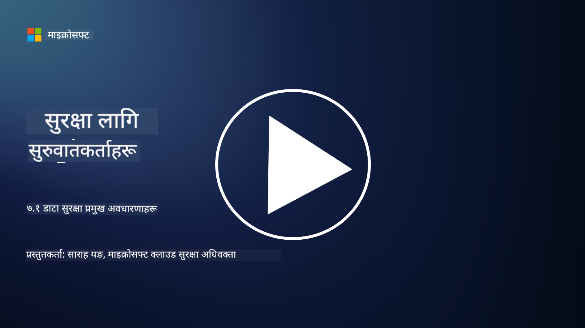

<!--
CO_OP_TRANSLATOR_METADATA:
{
  "original_hash": "9703868f41dcddd5a98dea9ea6fcd94d",
  "translation_date": "2025-09-03T23:55:25+00:00",
  "source_file": "7.1 Data security key concepts.md",
  "language_code": "ne"
}
-->
# डेटा सुरक्षा प्रमुख अवधारणाहरू

हामीले यस पाठ्यक्रममा डेटा सुरक्षा उल्लेख गरेका छौं र यसलाई धेरै पटक छोएका छौं। अब, यस विषयलाई अझ गहिराइमा बुझ्ने प्रयास गरौं। यस पाठमा तपाईंले सिक्नुहुनेछ:

- डेटा सुरक्षा के हो?

- डेटा वर्गीकरण के हो?

- डेटा जीवनचक्र व्यवस्थापन के हो?

- डेटा हानि रोकथाम (DLP) के हो?

- किन डेटा सुरक्षा संस्थाको लागि महत्त्वपूर्ण छ?

## डेटा सुरक्षा के हो?

**डेटा सुरक्षा** भनेको डिजिटल डेटा, जस्तै डाटाबेस, फाइलहरू, र संवेदनशील जानकारीलाई अनधिकृत पहुँच, खुलासा, परिवर्तन, वा विनाशबाट जोगाउने अभ्यास हो। डेटा सुरक्षाको मुख्य उद्देश्य डेटा गोपनीयता, अखण्डता, र उपलब्धता सुनिश्चित गर्नु हो। यसमा प्राविधिक, प्रशासनिक, र भौतिक सुरक्षा उपायहरूको संयोजन लागू गरेर विभिन्न खतरा र कमजोरीहरू, जस्तै साइबर आक्रमण, भित्री खतरा, र डेटा उल्लंघनबाट डेटा सुरक्षित राख्ने समावेश हुन्छ। डेटा सुरक्षा उपायहरूमा एनक्रिप्शन, पहुँच नियन्त्रण, प्रमाणीकरण, अडिट ट्रेल्स, र सुरक्षा नीतिहरू समावेश हुन सक्छ।

## डेटा वर्गीकरण के हो?

**डेटा वर्गीकरण** भनेको डेटा संवेदनशीलता, मूल्य, र संस्थाको लागि महत्त्वको आधारमा वर्गीकरण गर्ने प्रक्रिया हो। डेटा वर्गीकरणको उद्देश्य संस्थाहरूलाई विभिन्न प्रकारका डेटा पहिचान गर्न र तिनीहरूको सुरक्षा र ह्यान्डलिङलाई प्राथमिकता दिन मद्दत गर्नु हो। सामान्य डेटा वर्गीकरण श्रेणीहरूमा "सार्वजनिक," "आन्तरिक," "गोप्य," र "प्रतिबन्धित" वा "अत्यधिक गोप्य" समावेश छन्। एकपटक डेटा वर्गीकृत भएपछि, संस्थाहरूले उपयुक्त सुरक्षा नियन्त्रण र पहुँच प्रतिबन्धहरू लागू गर्न सक्छन् ताकि संवेदनशील डेटा पर्याप्त रूपमा सुरक्षित रहोस् र नियामक आवश्यकताहरूको पालना सुनिश्चित होस्।

## डेटा जीवनचक्र व्यवस्थापन के हो?

**डेटा जीवनचक्र व्यवस्थापन** भनेको डेटा सिर्जना वा प्राप्ति देखि संग्रह वा मेटाउनेसम्मको सम्पूर्ण जीवनचक्रको व्यवस्थापन गर्ने संरचित दृष्टिकोण हो। डेटा जीवनचक्रमा सामान्यतया सिर्जना, भण्डारण, प्रशोधन, प्रसारण, संग्रह, र नष्ट गर्ने चरणहरू समावेश हुन्छ। डेटा जीवनचक्र व्यवस्थापनले डेटा जीवनचक्रको प्रत्येक चरणको लागि नीतिहरू र प्रक्रियाहरू परिभाषित गर्न समावेश गर्दछ, जस्तै डेटा प्रतिधारण, पहुँच नियन्त्रण, ब्याकअप, र डेटा सफाइ। प्रभावकारी डेटा जीवनचक्र व्यवस्थापनले संस्थाहरूलाई डेटा भण्डारणलाई अनुकूलित गर्न, डेटा गुणस्तर सुधार गर्न, र डेटा संरक्षण नियमहरूको पालना सुनिश्चित गर्न मद्दत गर्दछ।

## डेटा हानि रोकथाम (DLP) के हो?

**डेटा हानि रोकथाम (DLP)** भनेको अनधिकृत पहुँच, साझेदारी, वा संवेदनशील वा गोप्य डेटा चुहावट रोक्न डिजाइन गरिएका प्रविधि, नीतिहरू, र अभ्यासहरूको सेट हो। DLP समाधानहरूले सामग्री निरीक्षण र सन्दर्भ विश्लेषण प्रयोग गरेर चलिरहेको डेटा (जस्तै, इमेल, वेब ट्राफिक), स्थिर डेटा (जस्तै, भण्डारण गरिएका फाइलहरू र डाटाबेसहरू), र प्रयोगमा रहेको डेटा (जस्तै, प्रयोगकर्ताहरूले पहुँच गरेको वा हेरफेर गरेको डेटा) अनुगमन र नियन्त्रण गर्छ। DLP को उद्देश्य संवेदनशील डेटा पहिचान गर्नु र डेटा उल्लंघन रोक्न, डेटा संरक्षण नियमहरूको पालना गर्न, र संस्थाको प्रतिष्ठा जोगाउन डेटा ब्लक वा एनक्रिप्ट गर्नु हो।

## किन डेटा सुरक्षा संस्थाको लागि महत्त्वपूर्ण छ?

डेटा सुरक्षा संस्थाहरूको लागि विभिन्न कारणले अत्यन्त महत्त्वपूर्ण छ:

- **संवेदनशील जानकारीको सुरक्षा**: संस्थाहरूले प्रायः ग्राहक रेकर्ड, बौद्धिक सम्पत्ति, वित्तीय डेटा, र कर्मचारी जानकारी जस्ता संवेदनशील डेटा भण्डारण गर्छन्। डेटा सुरक्षा यस संवेदनशील जानकारीलाई अनधिकृत पहुँच वा चोरीबाट जोगाउँछ।

- **पालना**: धेरै उद्योगहरू र क्षेत्राधिकारहरूले कडा डेटा संरक्षण र गोपनीयता नियमहरू राखेका छन्। डेटा सुरक्षा संस्थाहरूलाई यी कानुनहरूको पालना गर्न मद्दत गर्दछ, कानुनी सजाय र प्रतिष्ठामा क्षति टार्न।

- **डेटा उल्लंघन रोकथाम**: डेटा उल्लंघनले वित्तीय क्षति, प्रतिष्ठामा क्षति, र कानुनी परिणाम निम्त्याउन सक्छ। प्रभावकारी डेटा सुरक्षा उपायहरूले डेटा उल्लंघन रोक्न वा यसको प्रभाव सीमित गर्न मद्दत गर्दछ।

- **विश्वासको संरक्षण**: ग्राहकहरू र सरोकारवालाहरूले संस्थाहरूलाई आफ्नो डेटा प्रदान गर्दा विश्वास गर्छन्। डेटा सुरक्षा उल्लंघनले विश्वासलाई कमजोर बनाउँछ। बलियो डेटा सुरक्षा कायम राख्नाले विश्वास र ग्राहक आत्मविश्वास जोगाउन मद्दत गर्दछ।

- **प्रतिस्पर्धात्मक लाभ**: डेटा सुरक्षामा प्रतिबद्धता देखाउनु प्रतिस्पर्धात्मक लाभ हुन सक्छ। ग्राहकहरू र साझेदारहरू डेटा सुरक्षालाई गम्भीरतासाथ लिने संस्थासँग काम गर्न बढी इच्छुक हुन्छन्।

- **सञ्चालन निरन्तरता**: डेटा सुरक्षा उपायहरू, जस्तै डेटा ब्याकअप र विपत्ति पुनःप्राप्ति योजना, डेटा हानि वा विपत्तिको अवस्थामा महत्त्वपूर्ण डेटा उपलब्धता र व्यवसाय निरन्तरता सुनिश्चित गर्न मद्दत गर्दछ।

- **भित्री खतरा विरुद्ध सुरक्षा**: डेटा सुरक्षा उपायहरूले संस्थाभित्रका खतरा, जस्तै कर्मचारीहरूद्वारा आकस्मिक डेटा खुलासा र भित्री व्यक्तिहरूद्वारा दुर्भावनापूर्ण कार्यहरूलाई पनि सम्बोधन गर्दछ।

संक्षेपमा, डेटा सुरक्षा संवेदनशील जानकारी जोगाउन, नियमहरूको पालना गर्न, डेटा उल्लंघन रोक्न, विश्वास जोगाउन, र संस्थाको निरन्तर सफलता र प्रतिष्ठा सुनिश्चित गर्न आवश्यक छ।

## थप अध्ययन

- [What Is Data Security? | Microsoft Security](https://www.microsoft.com/en-au/security/business/security-101/what-is-data-security?WT.mc_id=academic-96948-sayoung)
- [Automatically Classify & Protect Documents & Data | Microsoft Purview Information Protection](https://youtu.be/v8LqmzBUaOo)
- [Example data classification policy](https://www.cmu.edu/data/guidelines/data-classification.html)
- [What is Data Security? Data Security Definition and Overview | IBM](https://www.ibm.com/topics/data-security)
- [Data Lifecycle Management: A 2023 Guide for Your Business (cloudwards.net)](https://www.cloudwards.net/data-lifecycle-management/)
- [What is data loss prevention (DLP)? | Microsoft Security](https://www.microsoft.com/security/business/security-101/what-is-data-loss-prevention-dlp?WT.mc_id=academic-96948-sayoung)
- [What is DLP? How data loss prevention software works and why you need it | CSO Online](https://www.csoonline.com/article/569559/what-is-dlp-how-data-loss-prevention-software-works-and-why-you-need-it.html)

---

**अस्वीकरण**:  
यो दस्तावेज़ AI अनुवाद सेवा [Co-op Translator](https://github.com/Azure/co-op-translator) प्रयोग गरी अनुवाद गरिएको हो। हामी यथासम्भव सटीकता सुनिश्चित गर्न प्रयास गर्छौं, तर कृपया ध्यान दिनुहोस् कि स्वचालित अनुवादहरूमा त्रुटि वा अशुद्धता हुन सक्छ। यसको मूल भाषामा रहेको मूल दस्तावेज़लाई आधिकारिक स्रोत मानिनुपर्छ। महत्त्वपूर्ण जानकारीका लागि, व्यावसायिक मानव अनुवाद सिफारिस गरिन्छ। यस अनुवादको प्रयोगबाट उत्पन्न हुने कुनै पनि गलतफहमी वा गलत व्याख्याका लागि हामी जिम्मेवार हुने छैनौं।