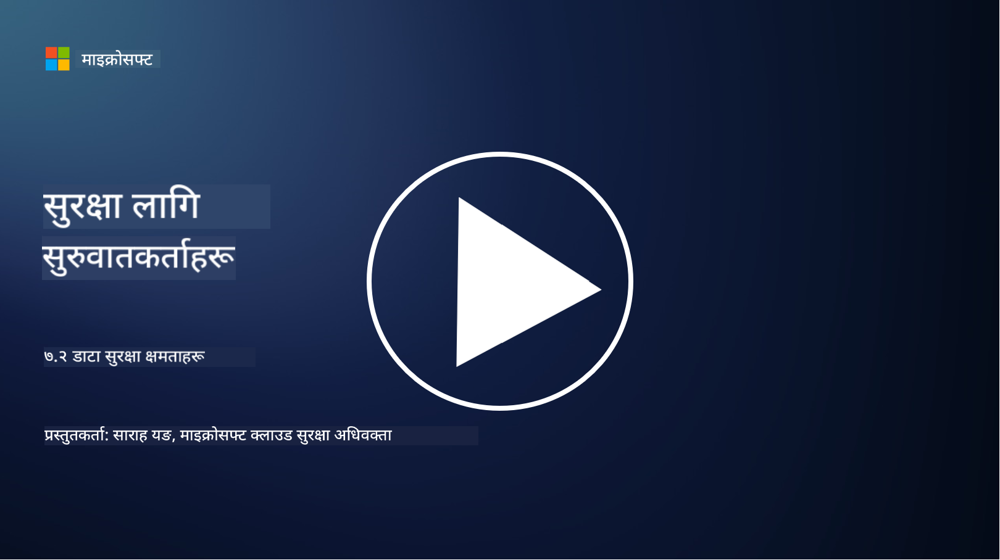

<!--
CO_OP_TRANSLATOR_METADATA:
{
  "original_hash": "50697add9758e54693442d502d2d5f8a",
  "translation_date": "2025-09-04T00:55:21+00:00",
  "source_file": "7.2 Data security capabilities.md",
  "language_code": "ne"
}
-->
# डेटा सुरक्षा क्षमता

यस खण्डमा, हामी डेटा सुरक्षा सम्बन्धी प्रयोग गरिने मुख्य उपकरण र क्षमताहरूको विस्तृत विवरण कभर गर्नेछौं:

**परिचय**

यस पाठमा, हामी कभर गर्नेछौं:

- डेटा हानि रोकथाम उपकरण के हो?

- इनसाइडर जोखिम व्यवस्थापन उपकरण के हो?

- डेटा संरक्षण उपकरणहरू के उपलब्ध छन्?

## डेटा हानि रोकथाम उपकरण के हो?

डेटा हानि रोकथाम (DLP) उपकरणले संगठनभित्र संवेदनशील वा गोप्य डेटा अनधिकृत पहुँच, साझेदारी, वा चुहावट रोक्न डिजाइन गरिएका सफ्टवेयर समाधान र प्रविधिहरूलाई जनाउँछ। यी उपकरणहरूले सामग्री निरीक्षण, नीति कार्यान्वयन, र निगरानी प्रयोग गरेर संवेदनशील डेटा पहिचान र सुरक्षा गर्न मद्दत गर्छन्। उदाहरणका DLP उत्पादनहरूमा समावेश छन्: Symantec Data Loss Prevention, McAfee Total Protection for Data Loss Prevention, Microsoft 365 DLP**: Microsoft 365 अनुप्रयोगहरूसँग एकीकृत भएर इमेल, कागजात, र सन्देशहरूमा संवेदनशील डेटा पहिचान र सुरक्षा गर्न संगठनहरूलाई सहयोग पुर्‍याउँछ।

## इनसाइडर जोखिम व्यवस्थापन उपकरण के हो?

इनसाइडर जोखिम व्यवस्थापन उपकरणले कर्मचारीहरू, ठेकेदारहरू, वा साझेदारहरूले डेटा सुरक्षा सम्झौतामा जानाजानी वा अनजानेमा जोखिम पुर्‍याउन सक्ने सम्भावनाहरू पहिचान र न्यूनीकरण गर्न संगठनहरूलाई सहयोग पुर्‍याउँछ। यी उपकरणहरूले प्रयोगकर्ता व्यवहार, पहुँच ढाँचा, र डेटा प्रयोगलाई निगरानी गरेर शंकास्पद गतिविधि र सम्भावित इनसाइडर खतरा पत्ता लगाउँछन्। उदाहरणका इनसाइडर जोखिम व्यवस्थापन उत्पादनहरूमा समावेश छन्: Microsoft Insider Risk Management (Microsoft 365 को भाग), Forcepoint Insider Threat Data Protection, Varonis Insider Threat Detection।

## डेटा संरक्षण उपकरणहरू के उपलब्ध छन्?

डेटा संरक्षण उपकरणहरूले संगठनको डेटा संरक्षण नीति र कानुनी आवश्यकताहरू अनुसार डेटा संरक्षण र मेट्ने प्रक्रिया व्यवस्थापन गर्न डिजाइन गरिएका सफ्टवेयर र समाधानहरू समावेश गर्छन्। यी उपकरणहरूले निश्चित अवधिको लागि डेटा संरक्षण र आवश्यक नभएको बेला सुरक्षित रूपमा मेट्ने प्रक्रिया स्वचालित गर्न मद्दत गर्छन्। उदाहरणका डेटा संरक्षण उत्पादनहरूमा समावेश छन्: Veritas Enterprise Vault, Commvault Complete Data Protection, Microsoft data lifecycle management। यी उपकरण समाधानहरूले संगठनहरूलाई डेटा संरक्षण र नष्ट गर्ने प्रक्रियामा नियन्त्रण कायम राख्न सहयोग पुर्‍याउँछन्, डेटा सुरक्षा नियमहरूको पालना सुनिश्चित गर्दै डेटा जीवनचक्रभरि प्रभावकारी रूपमा व्यवस्थापन गर्न मद्दत गर्छन्।

## थप अध्ययन

- [डेटा सुरक्षा स्थिति व्यवस्थापन (DSPM) को मार्गदर्शन | CSA (cloudsecurityalliance.org)](https://cloudsecurityalliance.org/blog/2023/03/31/the-big-guide-to-data-security-posture-management-dspm/)
- [एन्डप्वाइन्ट, अनुप्रयोग, र सेवाहरूमा डेटा हानि रोकथाम | Microsoft Purview](https://youtu.be/hvqq8L_0kgI)
- [१८ उत्कृष्ट डेटा हानि रोकथाम सफ्टवेयर उपकरणहरू २०२३ (नि:शुल्क + भुक्तानी) (comparitech.com)](https://www.comparitech.com/data-privacy-management/data-loss-prevention-tools-software/)
- [डेटा हानि रोकथाम (nist.gov)](https://tsapps.nist.gov/publication/get_pdf.cfm?pub_id=904672)
- [इनसाइडर जोखिम व्यवस्थापनको बारेमा जान्नुहोस् | Microsoft Learn](https://learn.microsoft.com/purview/insider-risk-management?WT.mc_id=academic-96948-sayoung)
- [डेटा जीवनचक्र व्यवस्थापन | IBM](https://www.ibm.com/topics/data-lifecycle-management)
- [डेटा जीवनचक्र व्यवस्थापन (DLM) के हो? | २०२३ उत्कृष्ट अभ्यासहरू (selecthub.com)](https://www.selecthub.com/big-data-analytics/data-lifecycle-management/)

---

**अस्वीकरण**:  
यो दस्तावेज़ AI अनुवाद सेवा [Co-op Translator](https://github.com/Azure/co-op-translator) प्रयोग गरी अनुवाद गरिएको हो। हामी यथासम्भव सटीकता सुनिश्चित गर्न प्रयास गर्छौं, तर कृपया ध्यान दिनुहोस् कि स्वचालित अनुवादहरूमा त्रुटिहरू वा अशुद्धताहरू हुन सक्छन्। यसको मूल भाषामा रहेको मूल दस्तावेज़लाई आधिकारिक स्रोत मानिनुपर्छ। महत्त्वपूर्ण जानकारीका लागि, व्यावसायिक मानव अनुवाद सिफारिस गरिन्छ। यस अनुवादको प्रयोगबाट उत्पन्न हुने कुनै पनि गलतफहमी वा गलत व्याख्याको लागि हामी जिम्मेवार हुने छैनौं।