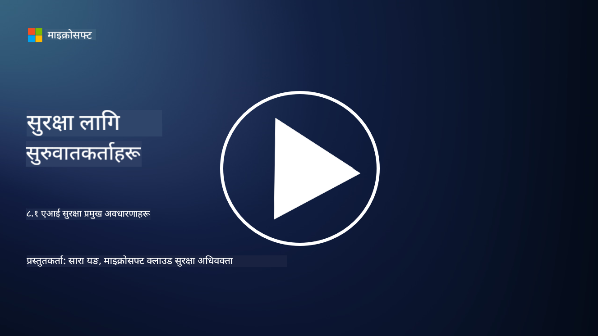

<!--
CO_OP_TRANSLATOR_METADATA:
{
  "original_hash": "66b61d96936cf25d20fcb411d4ce5227",
  "translation_date": "2025-09-03T22:46:46+00:00",
  "source_file": "8.1 AI security key concepts.md",
  "language_code": "ne"
}
-->
# एआई सुरक्षा प्रमुख अवधारणाहरू

## एआई सुरक्षा परम्परागत साइबर सुरक्षा भन्दा कसरी फरक छ?

एआई प्रणालीहरूको सुरक्षा परम्परागत साइबर सुरक्षाको तुलनामा अनौठो चुनौतीहरू प्रस्तुत गर्दछ, मुख्यतया एआईको सिक्ने क्षमता र निर्णय गर्ने प्रक्रियाको प्रकृतिका कारण। यहाँ केही प्रमुख फरकहरू छन्:

-   **डाटा अखण्डता**: एआई प्रणालीहरू सिक्नको लागि डाटामा धेरै निर्भर हुन्छन्। [यस डाटाको अखण्डता सुनिश्चित गर्नु महत्त्वपूर्ण छ, किनकि आक्रमणकारीहरूले डाटालाई हेरफेर गरेर एआईको व्यवहारलाई प्रभाव पार्न सक्छन्, जसलाई डाटा विषाक्तता भनिन्छ।]
-   **मोडेल सुरक्षा**: एआईको निर्णय गर्ने मोडेल आफैं आक्रमणको लक्ष्य बन्न सक्छ। [आक्रमणकारीहरूले मोडेललाई उल्टो इन्जिनियर गर्न वा यसको कमजोरीहरूको फाइदा उठाएर गलत वा हानिकारक निर्णय गराउन प्रयास गर्न सक्छन्।]
-   **विरोधी आक्रमणहरू**: एआई प्रणालीहरू विरोधी आक्रमणहरूको संवेदनशील हुन सक्छन्, जहाँ इनपुट डाटामा सानो, प्रायः अप्रत्याशित परिवर्तनहरूले एआईलाई त्रुटि वा गलत भविष्यवाणी गर्न बाध्य पार्न सक्छ।
-   **पूर्वाधार सुरक्षा**: परम्परागत साइबर सुरक्षा जस्तै, पूर्वाधारको सुरक्षा महत्त्वपूर्ण छ। तर एआई प्रणालीहरूमा क्लाउड-आधारित सेवाहरू वा विशेष हार्डवेयर जस्ता थप जटिल तहहरू हुन सक्छन्, जसले विशिष्ट सुरक्षा उपायहरूको आवश्यकता पर्छ।
-   **नैतिक विचारहरू**: सुरक्षा क्षेत्रमा एआईको प्रयोगले गोपनीयता चिन्ता र निर्णयमा पूर्वाग्रहको सम्भावना जस्ता नैतिक विचारहरू ल्याउँछ, जसलाई सुरक्षा रणनीतिमा सम्बोधन गर्नुपर्छ।

समग्रमा, एआई प्रणालीहरूको सुरक्षा एक फरक दृष्टिकोणको आवश्यकता पर्दछ, जसले एआई प्रविधिको अनौठो पक्षहरूलाई ध्यानमा राख्छ, जस्तै डाटा, मोडेल, र एआईको सिक्ने प्रक्रियाको सुरक्षा, साथै एआईको प्रयोगका नैतिक प्रभावहरूलाई सम्बोधन गर्दछ।

## एआई सुरक्षा र परम्परागत साइबर सुरक्षाबीच समानता र भिन्नता

एआई सुरक्षा र परम्परागत साइबर सुरक्षामा धेरै समानताहरू छन्, तर एआई प्रणालीहरूको अनौठो विशेषता र क्षमताका कारण केही स्पष्ट भिन्नताहरू पनि छन्। यहाँ कसरी फरक छन्:

- **खतराको जटिलता**: एआई प्रणालीहरूले साइबर सुरक्षामा नयाँ तहहरू थप्छन्। परम्परागत साइबर सुरक्षा मुख्यतया मालवेयर, फिशिङ आक्रमण, र नेटवर्क घुसपैठ जस्ता खतराहरूको सामना गर्छ। तर, एआई प्रणालीहरू विरोधी आक्रमण, डाटा विषाक्तता, र मोडेल छलजस्ता आक्रमणहरूको संवेदनशील हुन सक्छन्, जसले विशेष रूपमा मेसिन लर्निङ एल्गोरिदमलाई लक्षित गर्छ।
  
- **आक्रमण सतह**: एआई प्रणालीहरूको आक्रमण सतह परम्परागत प्रणालीहरूको तुलनामा ठूलो हुन सक्छ। किनकि तिनीहरू केवल सफ्टवेयरमा निर्भर छैनन्, तर डाटा र मोडेलमा पनि निर्भर छन्। आक्रमणकारीहरूले प्रशिक्षण डाटालाई लक्षित गर्न, मोडेललाई हेरफेर गर्न, वा एल्गोरिदमको कमजोरीहरूको फाइदा उठाउन सक्छन्।

- **खतराको अनुकूलनशीलता**: एआई प्रणालीहरूले आफ्नो वातावरणबाट सिक्न र अनुकूलन गर्न सक्छन्, जसले तिनीहरूलाई अनुकूलनशील र विकसित खतराहरूको संवेदनशील बनाउँछ। परम्परागत साइबर सुरक्षा उपायहरू एआई प्रणालीको व्यवहारमा आधारित निरन्तर विकसित आक्रमणहरूको सामना गर्न पर्याप्त नहुन सक्छ।

- **व्याख्या र स्पष्टता**: एआई प्रणालीले कुनै विशेष निर्णय किन गर्यो भन्ने कुरा बुझ्न परम्परागत सफ्टवेयर प्रणालीहरूको तुलनामा बढी चुनौतीपूर्ण हुन सक्छ। यो व्याख्या र स्पष्टताको अभावले एआई प्रणालीमा आक्रमण पत्ता लगाउन र रोक्न कठिन बनाउँछ।

- **डाटा गोपनीयता चिन्ता**: एआई प्रणालीहरूले प्रायः ठूलो मात्रामा डाटामा निर्भर गर्दछ, जसले यदि सही तरिकाले ह्यान्डल नगरिएमा गोपनीयता जोखिमहरू ल्याउन सक्छ। परम्परागत साइबर सुरक्षा उपायहरूले एआई प्रणालीसँग सम्बन्धित डाटा गोपनीयता चिन्ताहरूलाई पर्याप्त रूपमा सम्बोधन गर्न नसक्न सक्छ।

- **नियमक अनुपालन**: एआई सुरक्षाको लागि नियमक परिदृश्य अझै विकास भइरहेको छ, जसले एआई प्रणालीहरूले प्रस्तुत गर्ने अनौठो चुनौतीहरूलाई सम्बोधन गर्न विशिष्ट नियमहरू र मापदण्डहरू ल्याउँदैछ। परम्परागत साइबर सुरक्षा फ्रेमवर्कहरूलाई यी नयाँ नियमहरूको अनुपालन सुनिश्चित गर्न विस्तार वा अनुकूलन गर्न आवश्यक हुन सक्छ।

- **नैतिक विचारहरू**: एआई सुरक्षाले केवल प्रणालीलाई दुर्भावनापूर्ण आक्रमणबाट जोगाउने मात्र होइन, तर एआई प्रणालीहरूलाई नैतिक र जिम्मेवार तरिकाले प्रयोग गरिने सुनिश्चित गर्न पनि समावेश गर्दछ। यसमा निष्पक्षता, पारदर्शिता, र उत्तरदायित्व जस्ता विचारहरू समावेश छन्, जुन परम्परागत साइबर सुरक्षामा त्यति प्रमुख नहुन सक्छ।

## एआई परम्परागत आईटी प्रणालीहरूको सुरक्षा जस्तै कसरी छ?

एआई प्रणालीहरूको सुरक्षा परम्परागत साइबर सुरक्षासँग केही आधारभूत सिद्धान्तहरू साझा गर्दछ:

-   **खतराबाट सुरक्षा**: एआई र परम्परागत प्रणालीहरूलाई अनधिकृत पहुँच, डाटा संशोधन, र विनाश, साथै अन्य सामान्य खतराहरूबाट जोगाउन आवश्यक छ।
-   **कमजोरी व्यवस्थापन**: परम्परागत प्रणालीहरूलाई प्रभावित गर्ने धेरै कमजोरीहरू, जस्तै सफ्टवेयर बग वा गलत कन्फिगरेसन, एआई प्रणालीहरूलाई पनि असर गर्न सक्छ।
-   **डाटा सुरक्षा**: प्रशोधन गरिएको डाटाको सुरक्षा दुवै क्षेत्रमा महत्त्वपूर्ण छ, डाटा चुहावट रोक्न र गोपनीयता सुनिश्चित गर्न।
-   **आपूर्ति श्रृंखला सुरक्षा**: दुवै प्रकारका प्रणालीहरू आपूर्ति श्रृंखला आक्रमणहरूको संवेदनशील हुन्छन्, जहाँ एक सम्झौता गरिएको घटकले सम्पूर्ण प्रणालीको सुरक्षालाई कमजोर बनाउन सक्छ।

यी समानताहरूले देखाउँछ कि एआई प्रणालीहरूले नयाँ सुरक्षा चुनौतीहरू प्रस्तुत गरे पनि, तिनीहरूले परम्परागत साइबर सुरक्षा अभ्यासहरूको प्रयोगलाई पनि आवश्यक बनाउँछ। यो परम्परागत सुरक्षा ज्ञानको उपयोग गर्दै एआई प्रविधिको अनौठो पक्षहरूलाई अनुकूलन गर्ने मिश्रण हो।

## थप पढाइ

- [Not with a Bug, But with a Sticker [Book] (oreilly.com)](https://www.oreilly.com/library/view/not-with-a/9781119883982/)
   
- [Intro to AI Security Part 1: AI Security 101 | by HarrietHacks | Medium](https://medium.com/@harrietfarlow/intro-to-ai-security-part-1-ai-security-101-b8662a9efe5)
   
- [Best practices for AI security risk management | Microsoft Security Blog](https://www.microsoft.com/en-us/security/blog/2021/12/09/best-practices-for-ai-security-risk-management/?WT.mc_id=academic-96948-sayoung)
   
- [OWASP AI Security and Privacy Guide | OWASP Foundation](https://owasp.org/www-project-ai-security-and-privacy-guide/)

---

**अस्वीकरण**:  
यो दस्तावेज़ AI अनुवाद सेवा [Co-op Translator](https://github.com/Azure/co-op-translator) प्रयोग गरेर अनुवाद गरिएको छ। हामी यथार्थताको लागि प्रयास गर्छौं, तर कृपया ध्यान दिनुहोस् कि स्वचालित अनुवादमा त्रुटिहरू वा अशुद्धताहरू हुन सक्छ। यसको मूल भाषा मा रहेको मूल दस्तावेज़लाई आधिकारिक स्रोत मानिनुपर्छ। महत्वपूर्ण जानकारीको लागि, व्यावसायिक मानव अनुवाद सिफारिस गरिन्छ। यस अनुवादको प्रयोगबाट उत्पन्न हुने कुनै पनि गलतफहमी वा गलत व्याख्याको लागि हामी जिम्मेवार हुने छैनौं।