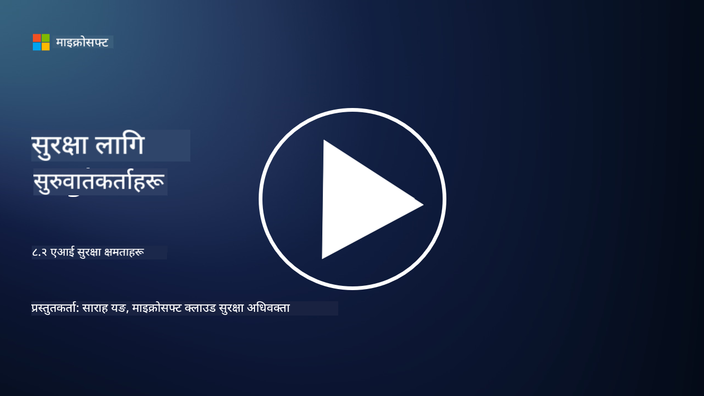

<!--
CO_OP_TRANSLATOR_METADATA:
{
  "original_hash": "b6bb7175672298d1e2f73ba7e0006f95",
  "translation_date": "2025-09-04T01:04:26+00:00",
  "source_file": "8.2 AI security capabilities.md",
  "language_code": "ne"
}
-->
# एआई सुरक्षा क्षमता

## हाल एआई प्रणालीलाई सुरक्षित गर्नका लागि के-कस्ता उपकरण र क्षमता उपलब्ध छन्?

हाल एआई प्रणालीलाई सुरक्षित गर्नका लागि विभिन्न उपकरण र क्षमता उपलब्ध छन्:

-   **Counterfit**: एआई प्रणालीको सुरक्षा परीक्षणका लागि खुला-स्रोत स्वचालन उपकरण, जसले संस्थाहरूलाई एआई सुरक्षा जोखिम मूल्यांकन गर्न र तिनीहरूको एल्गोरिदमको मजबूती सुनिश्चित गर्न मद्दत गर्दछ।
-   **Adversarial Machine Learning Tools**: यी उपकरणहरूले मेसिन लर्निङ मोडेललाई प्रतिकूल आक्रमणको विरुद्धमा कत्तिको मजबुत छ भनेर मूल्यांकन गर्छन्, जसले कमजोरीहरू पहिचान गर्न र समाधान गर्न सहयोग पुर्‍याउँछ।
-   **AI Security Toolkits**: खुला-स्रोत टूलकिटहरू उपलब्ध छन् जसले एआई प्रणालीलाई सुरक्षित गर्नका लागि स्रोतहरू प्रदान गर्छन्, जस्तै सुरक्षा उपायहरू लागू गर्न पुस्तकालयहरू र फ्रेमवर्कहरू।
-   **Collaborative Platforms**: कम्पनीहरू र एआई समुदायहरू बीचको साझेदारी, जसले एआई आपूर्ति श्रृंखलालाई सुरक्षित गर्न एआई-विशेष सुरक्षा स्क्यानरहरू र अन्य उपकरणहरू विकास गर्छ।

यी उपकरण र क्षमता एआई प्रणालीलाई विभिन्न खतराहरूबाट सुरक्षित गर्न समर्पित बढ्दो क्षेत्रको हिस्सा हुन्। यी अनुसन्धान, व्यावहारिक उपकरणहरू, र उद्योग सहयोगको संयोजन हुन्, जसले एआई प्रविधिहरूले ल्याउने अनौठो चुनौतीहरूको समाधान गर्न प्रयास गर्छ।

## एआई रेड टिमिङको बारेमा के? यो परम्परागत सुरक्षा रेड टिमिङबाट कसरी फरक छ?

एआई रेड टिमिङ परम्परागत सुरक्षा रेड टिमिङबाट केही मुख्य पक्षहरूमा फरक छ:

-   **एआई प्रणालीमा केन्द्रित**: एआई रेड टिमिङ विशेष रूपमा एआई प्रणालीका अनौठो कमजोरीहरूलाई लक्षित गर्छ, जस्तै मेसिन लर्निङ मोडेल र डाटा पाइपलाइनहरू, परम्परागत आईटी संरचनामा होइन।
-   **एआईको व्यवहार परीक्षण**: यसले एआई प्रणालीले असामान्य वा अप्रत्याशित इनपुटमा कसरी प्रतिक्रिया दिन्छ भनेर परीक्षण गर्छ, जसले आक्रमणकर्ताले फाइदा उठाउन सक्ने कमजोरीहरू देखाउन सक्छ।
-   **एआई असफलता अन्वेषण**: एआई रेड टिमिङले दुष्ट र निर्दोष दुवै प्रकारका असफलताहरूलाई हेर्छ, सुरक्षा उल्लङ्घन मात्र होइन, प्रणाली असफलताको व्यापक सेटलाई विचार गर्छ।
-   **प्रम्प्ट इन्जेक्सन र सामग्री उत्पादन**: यसले प्रम्प्ट इन्जेक्सन जस्ता असफलताहरूको परीक्षण पनि समावेश गर्छ, जहाँ आक्रमणकर्ताले एआई प्रणालीलाई हानिकारक वा आधारहीन सामग्री उत्पादन गर्न हेरफेर गर्छ।
-   **नैतिक र जिम्मेवार एआई**: यो जिम्मेवार एआई सुनिश्चित गर्नको हिस्सा हो, एआई प्रणालीलाई अनपेक्षित तरिकामा व्यवहार गर्न बाध्य पार्ने प्रयासहरू विरुद्ध मजबुत बनाउने।

समग्रमा, एआई रेड टिमिङ एक विस्तारित अभ्यास हो जसले सुरक्षा कमजोरीहरूको परीक्षण मात्र होइन, एआई प्रविधिहरूसँग सम्बन्धित अन्य प्रकारका प्रणाली असफलताहरूको परीक्षण पनि समावेश गर्छ। यो एआई प्रणालीलाई सुरक्षित बनाउन र एआई परिनियोजनसँग सम्बन्धित नयाँ जोखिमहरूलाई बुझ्न र समाधान गर्न महत्त्वपूर्ण छ।

## थप अध्ययन

 - [Microsoft AI Red Team building future of safer AI | Microsoft Security Blog](https://www.microsoft.com/en-us/security/blog/2023/08/07/microsoft-ai-red-team-building-future-of-safer-ai/?WT.mc_id=academic-96948-sayoung)
 - [Announcing Microsoft’s open automation framework to red team generative AI Systems | Microsoft Security Blog](https://www.microsoft.com/en-us/security/blog/2024/02/22/announcing-microsofts-open-automation-framework-to-red-team-generative-ai-systems/?WT.mc_id=academic-96948-sayoung)
 - [AI Security Tools: The Open-Source Toolkit | Wiz](https://www.wiz.io/academy/ai-security-tools)

---

**अस्वीकरण**:  
यो दस्तावेज़ AI अनुवाद सेवा [Co-op Translator](https://github.com/Azure/co-op-translator) प्रयोग गरी अनुवाद गरिएको हो। हामी यथासम्भव सटीकता सुनिश्चित गर्न प्रयास गर्छौं, तर कृपया ध्यान दिनुहोस् कि स्वचालित अनुवादहरूमा त्रुटिहरू वा अशुद्धताहरू हुन सक्छन्। यसको मूल भाषामा रहेको मूल दस्तावेज़लाई आधिकारिक स्रोत मानिनुपर्छ। महत्त्वपूर्ण जानकारीका लागि, व्यावसायिक मानव अनुवाद सिफारिस गरिन्छ। यस अनुवादको प्रयोगबाट उत्पन्न हुने कुनै पनि गलतफहमी वा गलत व्याख्याका लागि हामी जिम्मेवार हुने छैनौं।