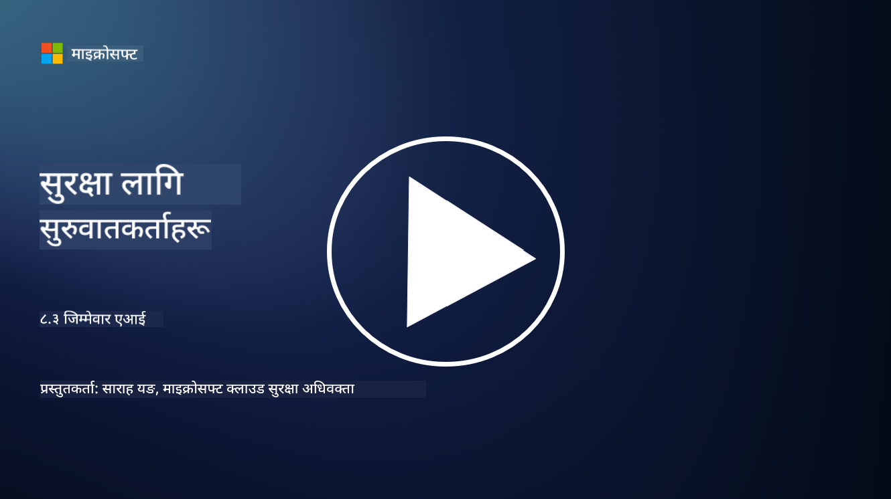

<!--
CO_OP_TRANSLATOR_METADATA:
{
  "original_hash": "5e9775ee91bde7d44577891d5f11c4c5",
  "translation_date": "2025-09-04T00:04:05+00:00",
  "source_file": "8.3 Responsible AI.md",
  "language_code": "ne"
}
-->
# जिम्मेवार एआई

## जिम्मेवार एआई के हो र यो एआई सुरक्षासँग कसरी सम्बन्धित छ?

जिम्मेवार एआई भनेको कृत्रिम बुद्धिमत्ताको विकास र प्रयोगलाई नैतिक, पारदर्शी, र सामाजिक मूल्यहरूसँग मेल खाने तरिकामा गर्ने प्रक्रिया हो। यसले निष्पक्षता, उत्तरदायित्व, र मजबूती जस्ता सिद्धान्तहरू समेट्छ, जसले एआई प्रणालीहरूलाई व्यक्तिहरू, समुदायहरू, र समाजको हितका लागि डिजाइन र सञ्चालन गर्न सुनिश्चित गर्दछ।

जिम्मेवार एआई र एआई सुरक्षाबीचको सम्बन्ध महत्त्वपूर्ण छ किनभने:

-   **नैतिक विचारहरू**: जिम्मेवार एआईले गोपनीयता र डाटा संरक्षण जस्ता सुरक्षा सम्बन्धित नैतिक विचारहरू समेट्छ। एआई प्रणालीहरूले प्रयोगकर्ताको गोपनीयता सम्मान गर्ने र व्यक्तिगत डाटालाई सुरक्षित राख्ने सुनिश्चित गर्नु जिम्मेवार एआईको मुख्य पक्ष हो।
-   **मजबूती र विश्वसनीयता**: एआई प्रणालीहरूलाई हेरफेर र आक्रमणबाट सुरक्षित राख्नुपर्छ, जुन जिम्मेवार एआई र एआई सुरक्षाको मुख्य सिद्धान्त हो। यसमा प्रतिकूल आक्रमणबाट सुरक्षा प्रदान गर्ने र एआई निर्णय प्रक्रियाको अखण्डता सुनिश्चित गर्ने समावेश छ।
-   **पारदर्शिता र व्याख्यात्मकता**: जिम्मेवार एआईको एक भाग भनेको एआई प्रणालीहरू पारदर्शी बनाउनु र तिनका निर्णयहरू व्याख्या गर्न सकिने बनाउनु हो। यो सुरक्षाका लागि महत्त्वपूर्ण छ, किनभने सरोकारवालाहरूले एआई प्रणालीहरू कसरी काम गर्छन् भन्ने बुझ्नुपर्छ ताकि तिनका सुरक्षा उपायहरूमा विश्वास गर्न सकियोस्।
-   **उत्तरदायित्व**: एआई प्रणालीहरूले आफ्ना कार्यहरूको लागि उत्तरदायी हुनुपर्छ, जसको अर्थ निर्णयहरू ट्रेस गर्न र कुनै समस्या समाधान गर्नका लागि संयन्त्रहरू हुनुपर्छ। यो सुरक्षा अभ्याससँग मेल खान्छ, जसले प्रणाली गतिविधिहरूको निगरानी र अडिट गरेर उल्लङ्घन रोक्न र प्रतिक्रिया दिन मद्दत गर्छ।

सारमा, जिम्मेवार एआई र एआई सुरक्षा आपसमा गाँसिएका छन्, जिम्मेवार एआई अभ्यासहरूले एआई प्रणालीहरूको सुरक्षा बढाउँछन् र यसको उल्टो पनि। जिम्मेवार एआई सिद्धान्तहरू लागू गर्दा एआई प्रणालीहरू नैतिक रूपमा मात्र होइन, सम्भावित खतराहरूबाट पनि सुरक्षित बनाइन्छ।

## कसरी सुनिश्चित गर्न सकिन्छ कि मेरो एआई प्रणाली सुरक्षित र नैतिक छ?

तपाईंको एआई प्रणाली सुरक्षित र नैतिक हो भन्ने सुनिश्चित गर्न बहुपक्षीय दृष्टिकोण अपनाउनु पर्छ, जसमा निम्न चरणहरू समावेश छन्:

- **नैतिक सिद्धान्तहरू पालना गर्नुहोस्**: मानव, सामाजिक, र वातावरणीय कल्याण; निष्पक्षता; गोपनीयता संरक्षण; विश्वसनीयता; पारदर्शिता; विवाद गर्न सकिने क्षमता; र उत्तरदायित्वलाई जोड दिने स्थापित नैतिक दिशानिर्देशहरू पालना गर्नुहोस्।

- **मजबूत सुरक्षा उपायहरू लागू गर्नुहोस्**: खतराहरू र कमजोरीहरूबाट बच्न सक्रिय सुरक्षा परीक्षण र एआई विश्वास, जोखिम, सुरक्षा व्यवस्थापन कार्यक्रमहरू प्रयोग गर्नुहोस्।

- **विविध सरोकारवालाहरूलाई संलग्न गर्नुहोस्**: एआई विकास प्रक्रियामा नैतिकताविद्, सामाजिक वैज्ञानिकहरू, र प्रभावित समुदायका प्रतिनिधिहरूलाई समावेश गरेर विविध दृष्टिकोण र मूल्यहरूलाई ध्यानमा राख्नुहोस्।

- **पारदर्शिता र व्याख्यात्मकता सुनिश्चित गर्नुहोस्**: एआईको निर्णय प्रक्रियाहरू पारदर्शी र व्याख्या गर्न सकिने बनाउनुहोस्, जसले विश्वास बढाउँछ र सम्भावित पूर्वाग्रह वा त्रुटिहरू पहिचान गर्न सजिलो बनाउँछ।

- **डाटा गोपनीयता कायम राख्नुहोस्**: प्रयोगकर्ताको गोपनीयता अधिकारको सम्मान गर्न एन्क्रिप्शन र अन्य डाटा संरक्षण उपायहरू मार्फत डाटाको गोपनीयता र प्रामाणिकता सुरक्षित गर्नुहोस्।

- **मानव निरीक्षण सक्षम गर्नुहोस्**: एआई प्रणालीहरूले गरेका निर्णयहरूको विवाद गर्न सकिने क्षमता र उत्तरदायित्व सुनिश्चित गर्न मानव निरीक्षणका लागि संयन्त्रहरू लागू गर्नुहोस्।

- **एआई सुरक्षामा जानकारी राख्नुहोस्**: एआई सुरक्षा र नैतिकतामा विकसित परिदृश्य बुझ्नका लागि पछिल्लो अनुसन्धान र छलफलहरूमा अपडेट रहनुहोस्।

- **नियमहरू पालना गर्नुहोस्**: तपाईंको एआई प्रणालीले सम्बन्धित सबै कानुन र नियमहरू पालना गरेको सुनिश्चित गर्नुहोस्, जसमा डाटा संरक्षण कानुन, भेदभाव विरोधी कानुन, र उद्योग-विशिष्ट दिशानिर्देशहरू समावेश हुन सक्छ।

## के तपाईं मलाई एआईको अनैतिक प्रयोगले निम्त्याएको सुरक्षा समस्याको केही उदाहरण दिन सक्नुहुन्छ?

यहाँ एआईको अनैतिक प्रयोगले निम्त्याउन सक्ने सुरक्षा समस्याहरूका केही उदाहरणहरू छन्:

- **पूर्वाग्रही निर्णय प्रक्रिया**: यदि एआई प्रणालीहरू पूर्वाग्रही डाटा सेटहरूमा प्रशिक्षित छन् भने तिनीहरूले विद्यमान पूर्वाग्रहलाई निरन्तरता दिन सक्छन् र बढावा दिन सक्छन्। उदाहरणका लागि, यदि खोज इन्जिनलाई सामाजिक रूढीवादीताहरू झल्काउने डाटामा प्रशिक्षित गरिन्छ भने, यसले पूर्वाग्रही खोज परिणामहरू देखाउन सक्छ, जसले अन्यायपूर्ण व्यवहार वा भेदभाव निम्त्याउन सक्छ।

- **न्यायिक प्रणालीमा एआई**: कानुनी निर्णय प्रक्रियामा एआईको प्रयोगले नैतिक चिन्ताहरू उठाउन सक्छ, विशेष गरी यदि एआईको निर्णय प्रक्रिया पारदर्शी छैन वा पूर्वाग्रही डाटाबाट प्रभावित छ भने। यसले अन्यायपूर्ण कानुनी परिणामहरू निम्त्याउन सक्छ र व्यक्तिहरूको अधिकारमा हनन गर्न सक्छ।

- **एआई प्रणालीहरूको हेरफेर**: एआई प्रणालीहरू प्रतिकूल आक्रमणको शिकार हुन सक्छन्, जहाँ इनपुट डाटामा सानो परिवर्तनले गलत परिणामहरू निम्त्याउन सक्छ। उदाहरणका लागि, स्वचालित सवारी साधनहरूलाई ट्राफिक चिन्हहरू गलत व्याख्या गर्न बाध्य पार्न सकिन्छ, जसले सुरक्षा जोखिम निम्त्याउन सक्छ।

- **एआईद्वारा संचालित निगरानी**: निगरानीका लागि एआईको प्रयोगले गोपनीयता उल्लङ्घन गर्न सक्छ, विशेष गरी यदि उचित सहमति बिना वा व्यक्तिगत स्वतन्त्रतामा हनन गर्ने तरिकामा प्रयोग गरिन्छ भने। यो विशेष गरी अधिनायकवादी शासनहरूमा समस्याग्रस्त हुन सक्छ, जसले असहमति निगरानी गर्न र दबाउन एआई प्रयोग गर्न सक्छ।

यी उदाहरणहरूले एआई प्रणालीहरूको विकास र प्रयोगमा नैतिक विचारहरूको महत्त्वलाई उजागर गर्छन् ताकि सुरक्षा समस्याहरू रोक्न र व्यक्तिहरूको अधिकार र गोपनीयता सुरक्षित गर्न सकियोस्।

## थप पढाइ

 - [Microsoft Responsible AI Standard v2 General Requirements](https://query.prod.cms.rt.microsoft.com/cms/api/am/binary/RE5cmFl?culture=en-us&country=us&WT.mc_id=academic-96948-sayoung)
 - [Responsible AI (mit.edu)](https://sloanreview.mit.edu/big-ideas/responsible-ai/)
 - [13 Principles for Using AI Responsibly (hbr.org)](https://hbr.org/2023/06/13-principles-for-using-ai-responsibly)

---

**अस्वीकरण**:  
यो दस्तावेज़ AI अनुवाद सेवा [Co-op Translator](https://github.com/Azure/co-op-translator) प्रयोग गरी अनुवाद गरिएको हो। हामी यथासम्भव सटीकता सुनिश्चित गर्न प्रयास गर्छौं, तर कृपया ध्यान दिनुहोस् कि स्वचालित अनुवादहरूमा त्रुटिहरू वा अशुद्धताहरू हुन सक्छन्। यसको मूल भाषामा रहेको मूल दस्तावेज़लाई आधिकारिक स्रोत मानिनुपर्छ। महत्त्वपूर्ण जानकारीका लागि, व्यावसायिक मानव अनुवाद सिफारिस गरिन्छ। यस अनुवादको प्रयोगबाट उत्पन्न हुने कुनै पनि गलतफहमी वा गलत व्याख्याका लागि हामी जिम्मेवार हुने छैनौं।