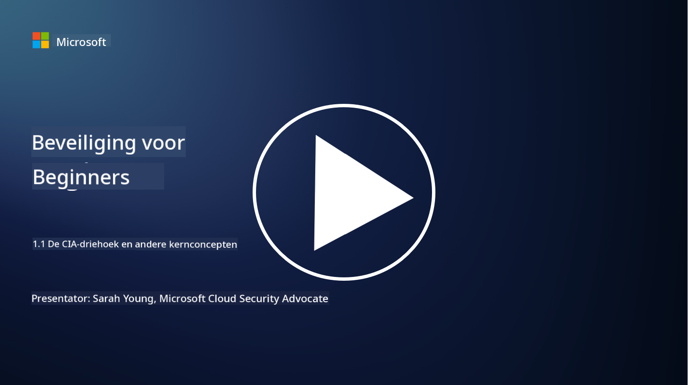
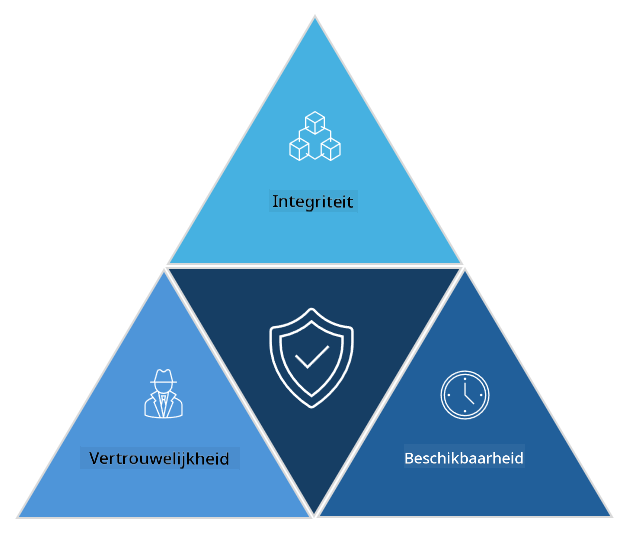

<!--
CO_OP_TRANSLATOR_METADATA:
{
  "original_hash": "16a76f9fa372fb63cffb6d76b855f023",
  "translation_date": "2025-09-04T01:10:45+00:00",
  "source_file": "1.1 The CIA triad and other key concepts.md",
  "language_code": "nl"
}
-->
# De CIA-driehoek en andere belangrijke concepten

## Introductie

In deze les behandelen we:

 - Wat is cybersecurity?
   
 
 - Wat is de cybersecurity CIA-driehoek?

   

 - Wat zijn authenticiteit, non-repudiatie en privacy in de context van cybersecurity?

## Wat is cybersecurity?

Cybersecurity, ook wel informatiebeveiliging genoemd, is de praktijk van het beschermen van computersystemen, netwerken, apparaten en gegevens tegen digitale aanvallen, ongeautoriseerde toegang, schade of diefstal. Het primaire doel van cybersecurity is het waarborgen van de vertrouwelijkheid, integriteit en beschikbaarheid van digitale middelen en informatie. Cybersecurity-professionals ontwerpen en implementeren beveiligingsmaatregelen om middelen, gegevens en informatie te beschermen. Nu steeds meer aspecten van ons leven gedigitaliseerd en online zijn, is cybersecurity een topprioriteit geworden voor zowel particulieren als organisaties.

## Wat is de cybersecurity CIA-driehoek?

De cybersecurity-driehoek verwijst naar het model dat de drie belangrijkste overwegingen omvat voor elk cybersecurity-werk of het ontwerpen van een systeem/omgeving:

### Vertrouwelijkheid

Dit is de overweging waarmee de meeste mensen bekend zijn wanneer ze denken aan "cybersecurity": vertrouwelijkheid is het proces van het beschermen van gegevens en informatie tegen ongeautoriseerde toegangspogingen, oftewel alleen mensen die de informatie nodig hebben, kunnen er toegang toe krijgen. Niet alle gegevens zijn echter gelijk, en gegevens worden meestal gecategoriseerd en beschermd op basis van hoeveel schade zou ontstaan als ze door de verkeerde mensen worden ingezien.

### Integriteit

Verwijst naar het beschermen van de nauwkeurigheid en betrouwbaarheid van gegevens binnen omgevingen en het voorkomen dat gegevens worden gewijzigd of aangepast door ongeautoriseerde personen. Bijvoorbeeld: een student wijzigt zijn geboortedatum in zijn rijbewijsregistratie bij het DMV om ouder te lijken, zodat hij zijn rijbewijs opnieuw kan laten afdrukken met een eerdere geboortedatum om alcohol te kopen.

### Beschikbaarheid

Dit is een overweging binnen operationele IT, maar beschikbaarheid is ook belangrijk voor cybersecurity. Er zijn specifieke soorten aanvallen die gericht zijn op beschikbaarheid en waar beveiligingsprofessionals tegen moeten beschermen (bijvoorbeeld distributed denial of service – DDoS – aanvallen).

**Cybersecurity CIA-driehoek**

## Wat zijn authenticiteit, non-repudiatie en privacy in de context van cybersecurity?

Dit zijn aanvullende belangrijke concepten die betrekking hebben op het waarborgen van de veiligheid en betrouwbaarheid van systemen en gegevens:

**Authenticiteit** - verwijst naar de zekerheid dat de informatie, communicatie of entiteit waarmee je interacteert echt is en niet is gewijzigd of aangepast door ongeautoriseerde partijen.

**Non-repudiatie** - is het concept dat ervoor zorgt dat een partij niet kan ontkennen dat ze betrokken was bij of de authenticiteit van een transactie of communicatie. Het voorkomt dat iemand beweert dat hij geen bericht heeft verzonden of een bepaalde actie heeft uitgevoerd wanneer er bewijs is dat het tegendeel bewijst.

**Privacy** - verwijst naar de bescherming van gevoelige en persoonlijk identificeerbare informatie tegen ongeautoriseerde toegang, gebruik, openbaarmaking of manipulatie. Het omvat het controleren wie toegang heeft tot persoonlijke gegevens en hoe die gegevens worden verzameld, opgeslagen en gedeeld.

## Aanvullende lectuur

[Wat is informatiebeveiliging (InfoSec)? | Microsoft Security](https://www.microsoft.com/security/business/security-101/what-is-information-security-infosec#:~:text=Three%20pillars%20of%20information%20security%3A%20the%20CIA%20triad,as%20guiding%20principles%20for%20implementing%20an%20InfoSec%20plan.)

---

**Disclaimer**:  
Dit document is vertaald met behulp van de AI-vertalingsservice [Co-op Translator](https://github.com/Azure/co-op-translator). Hoewel we streven naar nauwkeurigheid, dient u zich ervan bewust te zijn dat geautomatiseerde vertalingen fouten of onnauwkeurigheden kunnen bevatten. Het originele document in de oorspronkelijke taal moet worden beschouwd als de gezaghebbende bron. Voor kritieke informatie wordt professionele menselijke vertaling aanbevolen. Wij zijn niet aansprakelijk voor misverstanden of verkeerde interpretaties die voortvloeien uit het gebruik van deze vertaling.