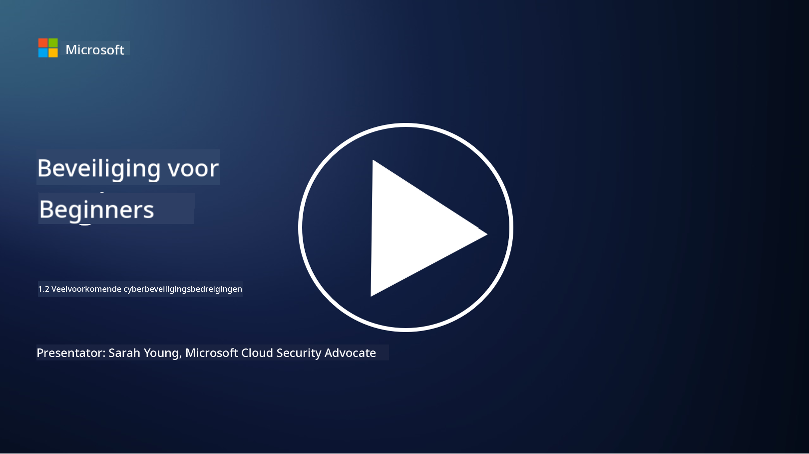

<!--
CO_OP_TRANSLATOR_METADATA:
{
  "original_hash": "6fc3030323139d7134a4ca9d03eccac9",
  "translation_date": "2025-09-03T23:25:33+00:00",
  "source_file": "1.2 Common cybersecurity threats.md",
  "language_code": "nl"
}
-->
# Veelvoorkomende cyberbeveiligingsdreigingen

## Introductie

In deze les behandelen we:

- Wat is een cyberbeveiligingsdreiging?

- Waarom willen kwaadwillende actoren gegevens en IT-systemen compromitteren?

- Wat zijn de meest voorkomende soorten cyberbeveiligingsdreigingen?

- Wat is het MITRE ATT&CK-framework?

- Waar kan ik op de hoogte blijven van het dreigingslandschap op het gebied van cyberbeveiliging?

## Wat is een cyberbeveiligingsdreiging?

Een cyberbeveiligingsdreiging verwijst naar elk potentieel gevaar of risico dat de vertrouwelijkheid, integriteit of beschikbaarheid van gegevens of IT-systemen kan compromitteren. Deze dreigingen worden veroorzaakt door kwaadwillende actoren die proberen kwetsbaarheden te exploiteren om ongeautoriseerde toegang te krijgen, gevoelige informatie te stelen, operaties te verstoren of schade toe te brengen aan individuen, organisaties of zelfs hele landen. Cyberbeveiligingsdreigingen kunnen verschillende vormen aannemen en zich richten op verschillende aspecten van digitale systemen en gegevens.

## Waarom willen kwaadwillende actoren gegevens en IT-systemen compromitteren?

Kwaadwillende actoren compromitteren gegevens en IT-systemen om verschillende redenen, vaak gedreven door persoonlijk gewin, ideologische motieven of de wens om verstoring te veroorzaken. Het begrijpen van deze motivaties kan organisaties en individuen helpen zich beter te verdedigen tegen cyberdreigingen. Enkele veelvoorkomende redenen waarom kwaadwillende actoren cyberaanvallen uitvoeren, zijn:

1. **Financieel gewin**: Veel aanvallen worden gedreven door de wens naar financiële winst. Kwaadwillende actoren kunnen gevoelige informatie stelen, zoals creditcardnummers, bankgegevens of persoonlijke identificatiegegevens, om fraude te plegen, identiteitsdiefstal te begaan, een individu of organisatie te chanteren of de gestolen gegevens te verkopen op het dark web.

2. **Spionage**: Landen, concurrenten of andere entiteiten kunnen cyberespionage uitvoeren om gevoelige overheids-, bedrijfs- of onderzoeksgegevens te stelen voor politieke, economische of militaire voordelen.

3. **Verstoring en sabotage**: Sommige aanvallen zijn gericht op het verstoren van kritieke infrastructuur, diensten of operaties om politieke of ideologische redenen. Deze aanvallen kunnen wijdverspreide chaos, financiële verliezen en reputatieschade veroorzaken.

4. **Ideologische motivaties**: Hacktivisten en groepen met ideologische of politieke motivaties kunnen systemen compromitteren om bewustwording te creëren over bepaalde kwesties, hun overtuigingen te promoten of te protesteren tegen specifieke acties of organisaties.

5. **Onbedoelde acties**: Niet alle kwaadwillende acties zijn opzettelijk; sommige individuen kunnen onbewust bijdragen aan cyberdreigingen door slachtoffer te worden van social engineering of deel uit te maken van een gecompromitteerd netwerk.

Uiteindelijk kunnen de motivaties voor het compromitteren van gegevens en IT-systemen sterk variëren, en de impact van deze aanvallen kan ernstig zijn. Het is belangrijk dat individuen, organisaties en overheden cyberbeveiliging serieus nemen en maatregelen implementeren om zich tegen deze dreigingen te beschermen.

## Wat zijn de meest voorkomende soorten cyberbeveiligingsdreigingen?

Er zijn verschillende veelvoorkomende soorten cyberaanvallen die kwaadwillende actoren gebruiken om systemen te compromitteren, gegevens te stelen en verstoringen te veroorzaken. Hier zijn enkele van de meest voorkomende soorten op het moment van schrijven:

1. **Phishing**:

Phishing omvat het verzenden van misleidende e-mails of berichten die afkomstig lijken te zijn van legitieme bronnen om ontvangers te misleiden gevoelige informatie te onthullen, zoals wachtwoorden, creditcardnummers of persoonlijke gegevens. Phishing kan slachtoffers ook leiden naar kwaadaardige websites of hen malware laten downloaden.

2. **Malware**:

Malware (kwaadaardige software) omvat een reeks kwaadaardige programma's die zijn ontworpen om systemen te infecteren, gegevens te stelen of schade te veroorzaken. Soorten malware zijn onder andere:

- **Ransomware**: Versleutelt bestanden en eist losgeld voor ontsleuteling.

- **Trojans**: Vermomd als legitieme software, geven ze aanvallers ongeautoriseerde toegang.

- **Virussen**: Zelfreplicerende programma's die zich aan bestanden hechten en verspreiden.

- **Wormen**: Zelfreplicerende programma's die zich via netwerken verspreiden.

3. **Denial of Service (DoS) en Distributed Denial of Service (DDoS)**:

DoS-aanvallen overbelasten een doelsysteem, waardoor het niet beschikbaar is voor gebruikers. DDoS-aanvallen maken gebruik van een netwerk van gecompromitteerde apparaten om een doelwit te overspoelen met verkeer, waardoor het systeem moeilijk kan functioneren of volledig stopt met werken.

4. **SQL-injectie**:

Bij deze aanval manipuleren aanvallers invoervelden van een webapplicatie om kwaadaardige SQL-query's in te voegen, waardoor ze mogelijk ongeautoriseerde toegang krijgen tot databases en gevoelige gegevens.

5. **Cross-Site Scripting (XSS)**:

Aanvallers injecteren kwaadaardige scripts in webapplicaties, die vervolgens worden uitgevoerd door browsers van nietsvermoedende gebruikers. Dit kan leiden tot diefstal van gebruikersgegevens en/of verspreiding van malware.

6. **Social engineering**:

Social engineering maakt gebruik van menselijke psychologie om individuen te manipuleren tot het onthullen van vertrouwelijke informatie of het uitvoeren van acties die de beveiliging compromitteren.

7. **Zero-Day (0day) Exploits**:

Deze aanvallen richten zich op kwetsbaarheden in software of hardware die nog niet bekend zijn bij de leverancier of het publiek. Aanvallers maken gebruik van deze kwetsbaarheden voordat er patches worden ontwikkeld. Veel organisaties maken zich zorgen over zero-days omdat er geen patch voor is, maar ze zijn niet zo algemeen als de andere aanvallen op deze lijst. Wanneer een zero-day wordt ontdekt, werken beveiligingsonderzoekers snel om een patch te maken, waardoor zero-days meestal van korte duur zijn.

8. **Credential-aanvallen**:

Deze aanvallen omvatten brute force-aanvallen, waarbij aanvallers herhaaldelijk wachtwoorden raden, en credential stuffing-aanvallen, waarbij gestolen inloggegevens van één site worden gebruikt om toegang te proberen op andere sites.

## Wat is het MITRE ATT&CK-framework?

Het [MITRE ATT&CK-framework](https://attack.mitre.org/) (Adversarial Tactics, Techniques, and Common Knowledge) is een framework dat de tactieken, technieken en procedures (TTP's) catalogiseert en categoriseert die tegenstanders gebruiken tijdens cyberaanvallen. Het framework is ontwikkeld door MITRE Corporation, een non-profitorganisatie die onderzoeks- en ontwikkelingscentra beheert voor verschillende overheidsinstanties.

Het MITRE ATT&CK-framework biedt een gestandaardiseerde manier om cyberdreigingen te beschrijven en analyseren, waardoor cyberbeveiligingsprofessionals beter kunnen begrijpen en verdedigen tegen verschillende aanvalstechnieken. Het wordt veel gebruikt door beveiligingsteams, dreigingsjagers en incidentresponders om:

1. **Gedrag van tegenstanders te begrijpen**: Het framework documenteert real-world aanvalsgedrag en beschrijft de stappen die aanvallers nemen, van de eerste toegang tot het bereiken van hun doelen. Het omvat een breed scala aan aanvalstechnieken die door verschillende dreigingsgroepen worden gebruikt.

2. **Verdedigingsstrategieën plannen en implementeren**: Beveiligingsteams kunnen het framework gebruiken om proactieve verdedigingsstrategieën te ontwikkelen die aansluiten bij de specifieke tactieken en technieken die tegenstanders mogelijk gebruiken.

3. **Incidentrespons en dreigingsjacht**: Bij het onderzoeken van incidenten of het uitvoeren van dreigingsjacht kunnen beveiligingsprofessionals verwijzen naar het framework om specifieke technieken die door aanvallers worden gebruikt te identificeren en te mitigeren.

Het MITRE ATT&CK-framework is georganiseerd in matrices die aanvalstechnieken groeperen op basis van specifieke platforms en omgevingen, zoals Windows, macOS, Linux en clouddiensten. Elke matrix is verdeeld in tactieken (hoogwaardige doelen) en technieken (specifieke methoden om die doelen te bereiken). Voor elke techniek biedt het framework informatie over hoe het werkt, mogelijke mitigaties en relevante verwijzingen naar real-world dreigingsactoren die de techniek hebben gebruikt.

Het framework wordt continu bijgewerkt en uitgebreid naarmate nieuwe dreigingsinformatie wordt verzameld en het cyberbeveiligingslandschap evolueert. Het is een waardevolle bron voor het verbeteren van de cyberbeveiligingshouding van een organisatie door een dieper begrip te bieden van hoe aanvallers opereren en hoe hun tactieken kunnen worden verdedigd.

## Waar kan ik op de hoogte blijven van het dreigingslandschap op het gebied van cyberbeveiliging?

Er zijn veel bronnen die kunnen worden gebruikt om op de hoogte te blijven van cyberbeveiligingsdreigingen. Hier is een selectie:

- [Open Web Application Security Project (OWASP) top 10 kwetsbaarheden](https://owasp.org/Top10/)
- [Common Vulnerabilities and Exposures (CVEs)](https://www.bing.com/ck/a?!&&p=53df6007f017bca2JmltdHM9MTY5MjU3NjAwMCZpZ3VpZD0zYmY4N2RiYS1jYWI1LTYwMDgtMWY1YS02ZmYyY2JjNjYxZWUmaW5zaWQ9NTc2OQ&ptn=3&hsh=3&fclid=3bf87dba-cab5-6008-1f5a-6ff2cbc661ee&psq=cve&u=a1aHR0cHM6Ly9iaW5nLmNvbS9hbGluay9saW5rP3VybD1odHRwcyUzYSUyZiUyZmN2ZS5taXRyZS5vcmclMmYmc291cmNlPXNlcnAtcnImaD1BZXN4S0VBWTNnbGhNZEFpd3daMlNSZkZQNTlrODhIUnYxRUtlSkY1RTk0JTNkJnA9a2NvZmZjaWFsd2Vic2l0ZQ&ntb=1 "Common Vulnerabilities and Exposures")
- [Microsoft Security Response Center blogs](https://msrc.microsoft.com/blog/)
- [National Institute of Standards and Technology (NIST)](https://www.dhs.gov/topics/cybersecurity): NIST biedt bronnen, waarschuwingen en de nieuwste updates over potentiële cyberbeveiligingsdreigingen.
- [Cybersecurity and Infrastructure Security Agency (CISA)](https://www.cisa.gov/resources-tools/resources/free-cybersecurity-services-and-tools): CISA biedt cyberbeveiligingsbronnen en best practices voor bedrijven, overheidsinstanties en andere organisaties. CISA deelt actuele informatie over soorten beveiligingsactiviteiten met grote impact die de gemeenschap in het algemeen beïnvloeden en diepgaande analyses van nieuwe en evoluerende cyberdreigingen.
- [National Cybersecurity Center of Excellence (NCCoE)](https://www.dhs.gov/topics/cybersecurity): NCCoE is een hub die praktische cyberbeveiligingsoplossingen biedt die kunnen worden toegepast in real-world situaties.
- [US-CERT](https://www.cisa.gov/resources-tools/resources/free-cybersecurity-services-and-tools): Het United States Computer Emergency Readiness Team (US-CERT) biedt een verscheidenheid aan cyberbeveiligingsbronnen, waaronder waarschuwingen, tips en meer.
- Het Cyber Emergency Response Team (CERT) van jouw land

---

**Disclaimer**:  
Dit document is vertaald met behulp van de AI-vertalingsservice [Co-op Translator](https://github.com/Azure/co-op-translator). Hoewel we ons best doen voor nauwkeurigheid, dient u zich ervan bewust te zijn dat geautomatiseerde vertalingen fouten of onnauwkeurigheden kunnen bevatten. Het originele document in zijn oorspronkelijke taal moet worden beschouwd als de gezaghebbende bron. Voor cruciale informatie wordt professionele menselijke vertaling aanbevolen. Wij zijn niet aansprakelijk voor misverstanden of verkeerde interpretaties die voortvloeien uit het gebruik van deze vertaling.