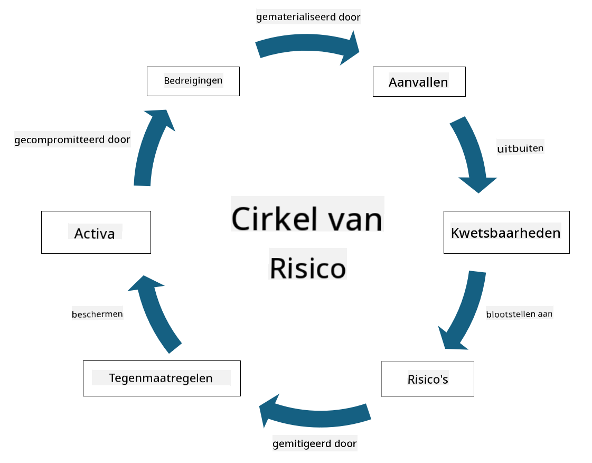

<!--
CO_OP_TRANSLATOR_METADATA:
{
  "original_hash": "fcca304f072cabf206388199e8e2e578",
  "translation_date": "2025-09-04T01:31:35+00:00",
  "source_file": "1.3 Understanding risk management.md",
  "language_code": "nl"
}
-->
# Begrijpen van risicobeheer

## Introductie

In deze les behandelen we:

 - Definities van veelgebruikte beveiligingsterminologie
   
 - Soorten beveiligingsmaatregelen

 - Beoordelen van beveiligingsrisico's

## Definities van veelgebruikte beveiligingsterminologie

Deze termen zijn fundamentele concepten binnen het domein van cybersecurity en risicobeheer. Laten we elk begrip uitleggen en hoe ze met elkaar samenhangen:

1. **Bedreigingsagent**:

Een bedreigingsagent is een individu, groep, organisatie of geautomatiseerd systeem dat de mogelijkheid heeft om kwetsbaarheden in een systeem of netwerk te benutten om schade of schade te veroorzaken. Bedreigingsagenten kunnen hackers, malware-auteurs, ontevreden werknemers of andere entiteiten zijn die een risico vormen voor informatie- en technologie systemen.

2. **Bedreiging**:

Een bedreiging is een potentiële gebeurtenis of actie die kwetsbaarheden in een systeem kan benutten en schade kan toebrengen aan een asset. Bedreigingen kunnen acties omvatten zoals hacken, datalekken, denial-of-service aanvallen en meer. Bedreigingen zijn het "wat" in termen van potentiële schade die kan worden toegebracht aan de assets van een organisatie.

3. **Kwetsbaarheid**:

Een kwetsbaarheid is een zwakte of fout in het ontwerp, de implementatie of configuratie van een systeem die kan worden benut door een bedreigingsagent om de beveiliging van het systeem te compromitteren. Kwetsbaarheden kunnen voorkomen in software, hardware, processen of menselijk gedrag. Het identificeren en aanpakken van kwetsbaarheden is essentieel om het risico op succesvolle aanvallen te minimaliseren.

4. **Risico**:

Risico is de mogelijkheid van verlies, schade of nadelige gevolgen die voortvloeien uit de interactie tussen een bedreiging en een kwetsbaarheid. Het is de kans dat een bedreigingsagent een kwetsbaarheid benut om een negatieve impact te veroorzaken. Risico's worden vaak beoordeeld op basis van hun potentiële impact en de waarschijnlijkheid van optreden.

5. **Asset**:

Een asset is alles van waarde dat een organisatie wil beschermen. Assets kunnen fysieke objecten zijn (zoals computers en servers), gegevens (klantinformatie, financiële gegevens), intellectueel eigendom (handelsgeheimen, patenten) en zelfs menselijke middelen (vaardigheden en kennis van werknemers). Het beschermen van assets is een belangrijk doel van cybersecurity.

6. **Blootstelling**:

Blootstelling verwijst naar de staat van kwetsbaarheid voor potentiële bedreigingen. Het treedt op wanneer er een kwetsbaarheid bestaat die kan worden benut door een bedreigingsagent. Blootstelling benadrukt het risico dat gepaard gaat met het aanwezig zijn van kwetsbaarheden in een systeem of netwerk.

7. **Maatregel**:

Een maatregel is een actie of mechanisme dat wordt geïmplementeerd om het risico dat gepaard gaat met kwetsbaarheden en bedreigingen te verminderen. Maatregelen kunnen technisch, procedureel of administratief van aard zijn. Ze zijn ontworpen om bedreigingen en kwetsbaarheden te voorkomen, te detecteren of te beperken. Voorbeelden zijn firewalls, toegangscontroles, encryptie, beveiligingsbeleid en training van werknemers.

Samenvattend: Bedreigingsagenten benutten kwetsbaarheden om bedreigingen uit te voeren, wat kan leiden tot risico's die schade kunnen veroorzaken aan waardevolle assets. Blootstelling treedt op wanneer kwetsbaarheden aanwezig zijn, en maatregelen worden geïmplementeerd om het risico te verminderen door de impact van bedreigingen op assets te voorkomen of te beperken. Dit raamwerk vormt de basis van risicobeheer in cybersecurity en helpt organisaties bij het identificeren, beoordelen en aanpakken van potentiële risico's voor hun informatiesystemen en assets.

## Soorten beveiligingsmaatregelen

Beveiligingsmaatregelen zijn acties of beschermingsmechanismen die worden geïmplementeerd om informatiesystemen en assets te beschermen tegen verschillende bedreigingen en kwetsbaarheden. Ze kunnen worden ingedeeld in verschillende categorieën op basis van hun focus en doel. Hier zijn enkele veelvoorkomende soorten beveiligingsmaatregelen:

1. **Administratieve maatregelen**:

Deze maatregelen hebben betrekking op beleid, procedures en richtlijnen die het beveiligingsgedrag en de praktijken binnen een organisatie reguleren.

- Beveiligingsbeleid en procedures: Gedocumenteerde richtlijnen die definiëren hoe beveiliging binnen een organisatie wordt gehandhaafd.

- Bewustwording en training: Programma's om werknemers te informeren over beveiligingspraktijken en potentiële bedreigingen.

- Incidentrespons en -beheer: Plannen voor het reageren op en beperken van beveiligingsincidenten.

2. **Technische maatregelen**:

Technische maatregelen maken gebruik van technologie om beveiligingsmechanismen af te dwingen en systemen en gegevens te beschermen. Voorbeelden van technische maatregelen zijn:

- Toegangscontroles: Mechanismen die de toegang van gebruikers tot bronnen beperken op basis van hun rollen en rechten.

- Encryptie: Het omzetten van gegevens in een beveiligd formaat om ongeautoriseerde toegang te voorkomen.

- Firewalls: Netwerkbeveiligingsapparaten die inkomend en uitgaand verkeer filteren en controleren.

- Intrusion Detection and Prevention Systems (IDPS): Tools die netwerkverkeer monitoren op verdachte activiteiten.

- Antivirus- en antimalware-software: Programma's die schadelijke software detecteren en verwijderen.

- Authenticatiemechanismen: Methoden om de identiteit van gebruikers te verifiëren, zoals wachtwoorden, biometrie en multi-factor authenticatie.

- Patchbeheer: Regelmatig bijwerken van software om bekende kwetsbaarheden aan te pakken.

3. **Fysieke maatregelen**:

Fysieke maatregelen zijn acties om fysieke assets en faciliteiten te beschermen.

- Beveiligingspersoneel: Personeel dat toegang tot fysieke locaties controleert en bewaakt.

- Bewakingscamera's: Videomonitoringsystemen om activiteiten te observeren en vast te leggen.

- Sloten en fysieke barrières: Fysieke maatregelen om toegang tot gevoelige gebieden te beperken.

- Omgevingscontroles: Maatregelen om temperatuur, luchtvochtigheid en andere omgevingsfactoren te reguleren die apparatuur en datacenters beïnvloeden.

4. **Operationele maatregelen**:

Deze maatregelen hebben betrekking op dagelijkse activiteiten en processen die de voortdurende beveiliging van systemen waarborgen.

- Wijzigingsbeheer: Processen voor het bijhouden en goedkeuren van wijzigingen in systemen en configuraties.

- Back-up en herstel: Plannen voor gegevensback-up en herstel in geval van systeemstoringen of rampen.

- Logging en auditing: Het monitoren en registreren van systeemactiviteiten voor beveiliging en naleving.

- Veilige programmeerpraktijken: Richtlijnen voor het schrijven van software om kwetsbaarheden te minimaliseren.

5. **Juridische en regelgevende maatregelen**:

Deze maatregelen zorgen voor naleving van relevante wetten, regelgeving en industrienormen. De normen waaraan een organisatie moet voldoen, hangen af van de jurisdictie, de sector en andere factoren.

- Gegevensbeschermingsregels: Naleving van wetten zoals GDPR, HIPAA en CCPA.

- Sector-specifieke normen: Voldoen aan normen zoals PCI DSS voor beveiliging van betaalkaartgegevens.

Deze categorieën van beveiligingsmaatregelen werken samen om een uitgebreide beveiligingshouding voor organisaties te creëren, waardoor hun systemen, gegevens en assets worden beschermd tegen een breed scala aan bedreigingen.

## Beoordelen van beveiligingsrisico's

Sommige beveiligingsprofessionals denken dat risicobeheer alleen aan risicoprofessionals wordt overgelaten, maar het begrijpen van het proces van het beheren van beveiligingsrisico's is belangrijk voor elke beveiligingsprofessional. Dit helpt hen om beveiligingsrisico's uit te drukken in termen die de rest van de organisatie begrijpt en waarop kan worden gehandeld.

Organisaties moeten voortdurend beveiligingsrisico's beoordelen en beslissen welke actie (of geen actie) ze ondernemen tegen risico's voor het bedrijf. Hieronder staat een overzicht van hoe dit meestal wordt gedaan. Merk op dat dit proces meestal wordt uitgevoerd door verschillende teams binnen een organisatie; het is zeldzaam dat één team verantwoordelijk is voor het end-to-end beheer van risico's.

1. **Identificeer assets en bedreigingen**:

De organisatie identificeert de assets die ze wil beschermen. Dit kunnen gegevens, systemen, hardware, software, intellectueel eigendom en meer zijn. Vervolgens identificeren ze potentiële bedreigingen die deze assets kunnen targeten.

2. **Beoordeel kwetsbaarheden**:

Organisaties identificeren vervolgens kwetsbaarheden of zwakke punten in systemen of processen die door bedreigingen kunnen worden benut. Deze kwetsbaarheden kunnen voortkomen uit softwarefouten, verkeerde configuraties, gebrek aan beveiligingsmaatregelen en menselijke fouten.

3. **Beoordeling van waarschijnlijkheid**:

De organisatie evalueert vervolgens de waarschijnlijkheid van het optreden van elke bedreiging. Dit omvat het overwegen van historische gegevens, dreigingsinformatie, trends in de sector en interne factoren. Waarschijnlijkheid kan worden gecategoriseerd als laag, gemiddeld of hoog op basis van de kans dat de bedreiging zich voordoet.

4. **Beoordeling van impact**:

Vervolgens bepaalt de organisatie de potentiële impact van elke bedreiging als deze een kwetsbaarheid zou benutten. Impact kan financiële verliezen, operationele verstoringen, reputatieschade, juridische gevolgen en meer omvatten. Impact kan ook worden gecategoriseerd als laag, gemiddeld of hoog op basis van de potentiële gevolgen.

5. **Risicoberekening**:

De beoordelingen van waarschijnlijkheid en impact worden gecombineerd om het algehele risiconiveau voor elke geïdentificeerde bedreiging te berekenen. Dit wordt vaak gedaan met behulp van een risicomatrix die numerieke waarden of kwalitatieve beschrijvingen toewijst aan waarschijnlijkheids- en impactniveaus. Het resulterende risiconiveau helpt bij het prioriteren van welke risico's onmiddellijke aandacht vereisen.

6. **Prioritering en besluitvorming**:

De organisatie prioriteert vervolgens risico's door zich te richten op die met de hoogste gecombineerde waarschijnlijkheids- en impactwaarden. Dit stelt hen in staat om middelen effectiever toe te wijzen en maatregelen te implementeren. Hoogrisicobedreigingen vereisen onmiddellijke aandacht, terwijl laagrisicobedreigingen mogelijk over een langere termijn worden aangepakt.

7. **Risicobehandeling**:

Op basis van de risicobeoordeling bepaalt de organisatie hoe elk risico kan worden beperkt of beheerd. Dit kan het implementeren van beveiligingsmaatregelen omvatten, het overdragen van risico via verzekeringen, of zelfs het accepteren van bepaalde niveaus van resterend risico als deze beheersbaar worden geacht/te duur om op te lossen/etc.

8. **Continue monitoring en evaluatie**:

Risicobeoordeling is geen eenmalig proces. Het moet periodiek worden uitgevoerd of wanneer er significante veranderingen in de omgeving van de organisatie plaatsvinden. Continue monitoring zorgt ervoor dat nieuwe bedreigingen, kwetsbaarheden of veranderingen in het bedrijfslandschap worden meegenomen.

Door beveiligingsrisico's op deze gestructureerde manier te beoordelen, kunnen organisaties weloverwogen beslissingen nemen over middelen, beveiligingsmaatregelen en algemene risicobeheerstrategieën. Het doel is om de algehele risico-exposure van de organisatie te verminderen en tegelijkertijd de beveiligingsinspanningen af te stemmen op de bedrijfsdoelen en -doelstellingen.

---

**Disclaimer**:  
Dit document is vertaald met behulp van de AI-vertalingsservice [Co-op Translator](https://github.com/Azure/co-op-translator). Hoewel we streven naar nauwkeurigheid, willen we u erop wijzen dat geautomatiseerde vertalingen fouten of onnauwkeurigheden kunnen bevatten. Het originele document in de oorspronkelijke taal moet worden beschouwd als de gezaghebbende bron. Voor kritieke informatie wordt professionele menselijke vertaling aanbevolen. Wij zijn niet aansprakelijk voor misverstanden of verkeerde interpretaties die voortvloeien uit het gebruik van deze vertaling.