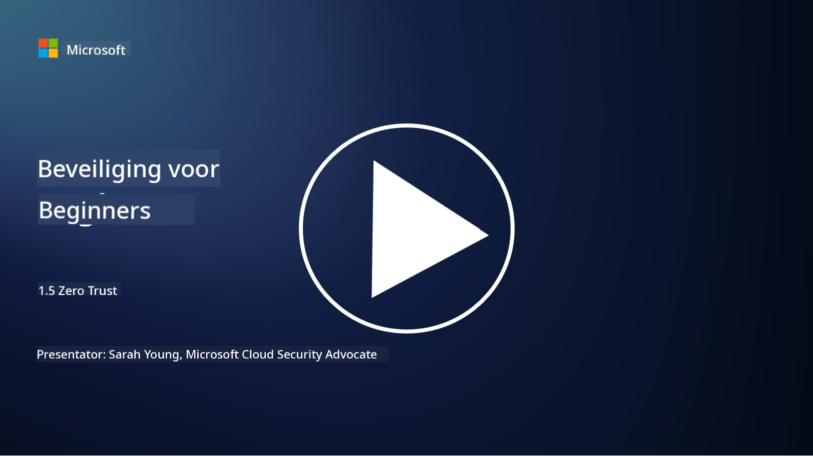
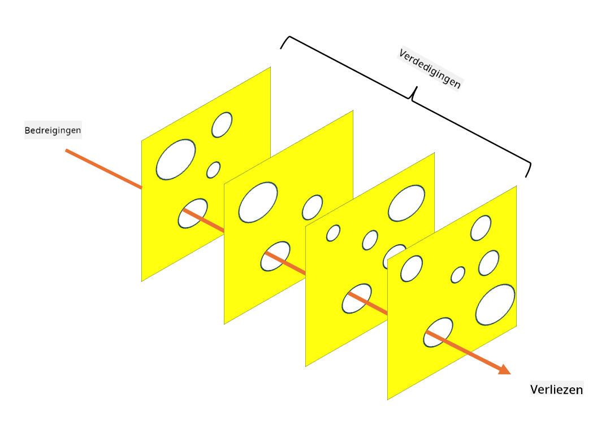

<!--
CO_OP_TRANSLATOR_METADATA:
{
  "original_hash": "75f77f972d2233c584f87c1eb96c983b",
  "translation_date": "2025-09-03T23:48:18+00:00",
  "source_file": "1.5 Zero trust.md",
  "language_code": "nl"
}
-->
# Zero Trust

"Zero trust" is een term die tegenwoordig veel wordt gebruikt in beveiligingskringen. Maar wat betekent het, is het slechts een modewoord? In deze les duiken we in wat zero trust precies inhoudt.

## Introductie

 - In deze les behandelen we:
   
   
 - Wat is zero trust?

   
  

 - Hoe verschilt zero trust van traditionele beveiligingsarchitecturen?

   
   

 - Wat is defense in depth?

## Zero Trust

Zero Trust is een cybersecuritybenadering die de traditionele opvatting van "vertrouwen maar verifiëren" uitdaagt door ervan uit te gaan dat geen enkele entiteit, zowel binnen als buiten het netwerk van een organisatie, inherent vertrouwd mag worden. In plaats daarvan pleit Zero Trust ervoor om elke gebruiker, elk apparaat en elke applicatie die toegang probeert te krijgen tot middelen te verifiëren, ongeacht hun locatie. Het kernprincipe van Zero Trust is het minimaliseren van het "aanvalsoppervlak" en het beperken van de potentiële impact van beveiligingsinbreuken.

In een Zero Trust-model worden de volgende principes benadrukt:

1. **Identiteit Verifiëren**: Authenticatie en autorisatie worden strikt toegepast op alle gebruikers en apparaten, ongeacht hun locatie. Onthoud dat een identiteit niet per se menselijk hoeft te zijn: het kan ook een apparaat, een applicatie, enzovoort zijn.

2. **Minimale Toegang**: Gebruikers en apparaten krijgen alleen de minimale toegang die nodig is om hun taken uit te voeren, waardoor de potentiële schade bij compromittering wordt verminderd.

3. **Micro-Segmentatie**: Netwerkbronnen worden opgedeeld in kleinere segmenten om laterale beweging binnen het netwerk te beperken in geval van een inbreuk.

4. **Continue Monitoring**: Doorlopende monitoring en analyse van gebruikers- en apparaatgedrag worden uitgevoerd om afwijkingen en potentiële bedreigingen te detecteren. Moderne monitoringtechnieken maken ook gebruik van machine learning, AI en dreigingsinformatie om extra details en context te bieden.

5. **Data Encryptie**: Data wordt zowel tijdens transport als in rust versleuteld om ongeautoriseerde toegang te voorkomen.

6. **Strikte Toegangscontrole**: Toegangscontroles worden afgedwongen op basis van context, zoals gebruikersrollen, apparaatstatus en netwerklocatie.

Microsoft verdeelt zero trust in vijf pijlers, die we in een latere les zullen bespreken.

## Verschillen met Traditionele Beveiligingsarchitecturen

Zero Trust verschilt op verschillende manieren van traditionele beveiligingsarchitecturen, zoals perimeter-gebaseerde modellen:

1. **Perimeter vs. Identiteitsgericht**: Traditionele modellen richten zich op het beveiligen van de netwerkperimeter en gaan ervan uit dat interne gebruikers en apparaten vertrouwd kunnen worden zodra ze binnen zijn. Zero Trust gaat ervan uit dat bedreigingen zowel van binnen als van buiten het netwerk kunnen komen en handhaaft strikte identiteitsgebaseerde controles.

2. **Impliciet vs. Expliciet Vertrouwen**: Traditionele modellen vertrouwen impliciet op apparaten en gebruikers binnen het netwerk totdat het tegendeel bewezen is. Zero Trust verifieert expliciet identiteiten en monitort continu op afwijkingen.

3. **Vlak vs. Gesegmenteerd Netwerk**: Traditionele architecturen omvatten vaak vlakke netwerken waar interne gebruikers brede toegang hebben. Zero Trust pleit voor het segmenteren van het netwerk in kleinere, geïsoleerde zones om potentiële inbreuken te beperken.

4. **Reactief vs. Proactief**: Traditionele beveiliging vertrouwt vaak op reactieve maatregelen zoals perimeter-firewalls en inbraakdetectie. Zero Trust hanteert een proactieve aanpak door ervan uit te gaan dat inbreuken waarschijnlijk zijn en hun impact te minimaliseren.

## Defense in Depth

Defense in depth, ook wel gelaagde beveiliging genoemd, is een cybersecuritystrategie die inhoudt dat meerdere lagen van beveiligingsmaatregelen worden ingezet om de activa van een organisatie te beschermen. Het doel is om overlappende lagen van verdediging te creëren, zodat als één laag wordt doorbroken, andere lagen nog steeds bescherming bieden. Elke laag richt zich op een ander aspect van beveiliging en verhoogt de algehele beveiligingspositie van een organisatie.

Defense in depth omvat een combinatie van technische, procedurele en fysieke beveiligingsmaatregelen. Deze kunnen bestaan uit firewalls, inbraakdetectiesystemen, toegangscontroles, encryptie, gebruikersopleiding, beveiligingsbeleid en meer. Het idee is om meerdere barrières te creëren die gezamenlijk het moeilijk maken voor aanvallers om de systemen en netwerken van een organisatie binnen te dringen. Dit wordt ook wel het "Zwitsers kaas"-model genoemd, dat ook wordt gebruikt bij het voorkomen van ongelukken in andere industrieën (bijvoorbeeld transport).

## Verdere Lezing

[Wat is Zero Trust?](https://learn.microsoft.com/security/zero-trust/zero-trust-overview?WT.mc_id=academic-96948-sayoung)

[Evoluerende Zero Trust – Microsoft Position Paper](https://query.prod.cms.rt.microsoft.com/cms/api/am/binary/RWJJdT?WT.mc_id=academic-96948-sayoung)

[Zero Trust en BeyondCorp Google Cloud | Google Cloud Blog](https://cloud.google.com/blog/topics/developers-practitioners/zero-trust-and-beyondcorp-google-cloud)

---

**Disclaimer**:  
Dit document is vertaald met behulp van de AI-vertalingsservice [Co-op Translator](https://github.com/Azure/co-op-translator). Hoewel we streven naar nauwkeurigheid, willen we u erop wijzen dat geautomatiseerde vertalingen fouten of onnauwkeurigheden kunnen bevatten. Het originele document in de oorspronkelijke taal moet worden beschouwd als de gezaghebbende bron. Voor kritieke informatie wordt professionele menselijke vertaling aanbevolen. Wij zijn niet aansprakelijk voor misverstanden of verkeerde interpretaties die voortvloeien uit het gebruik van deze vertaling.