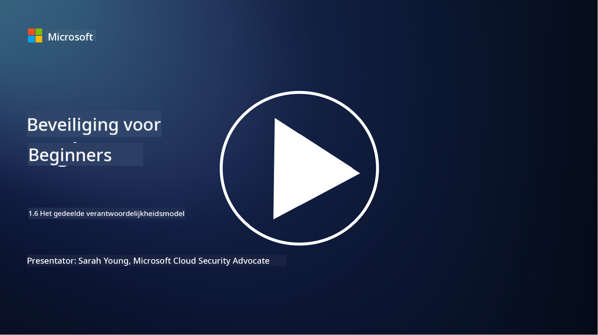

<!--
CO_OP_TRANSLATOR_METADATA:
{
  "original_hash": "a48db640d80c786b928ca178c414f084",
  "translation_date": "2025-09-04T00:26:59+00:00",
  "source_file": "1.6 Shared responsibility model.md",
  "language_code": "nl"
}
-->
# Het gedeelde verantwoordelijkheidsmodel

Gedeelde verantwoordelijkheid is een relatief nieuw concept in de IT dat is ontstaan met de opkomst van cloud computing. Vanuit een cybersecurityperspectief is het essentieel om te begrijpen wie welke beveiligingsmaatregelen levert, zodat er geen gaten in de verdediging ontstaan.

## Introductie

In deze les behandelen we:

 - Wat is gedeelde verantwoordelijkheid in de context van cybersecurity?
   
 - Wat is het verschil in gedeelde verantwoordelijkheid voor beveiligingsmaatregelen
   tussen IaaS, PaaS en SaaS?

   

 - Waar kun je vinden welke beveiligingsmaatregelen jouw cloudplatform biedt?

   
 

 - Wat betekent “vertrouwen maar verifiëren”?

## Wat is gedeelde verantwoordelijkheid in de context van cybersecurity?

Gedeelde verantwoordelijkheid in cybersecurity verwijst naar de verdeling van beveiligingstaken tussen een cloudserviceprovider (CSP) en zijn klanten. In cloudcomputingomgevingen, zoals Infrastructure as a Service (IaaS), Platform as a Service (PaaS) en Software as a Service (SaaS), hebben zowel de CSP als de klant een rol in het waarborgen van de beveiliging van gegevens, applicaties en systemen.

## Wat is het verschil in gedeelde verantwoordelijkheid voor beveiligingsmaatregelen tussen IaaS, PaaS en SaaS?

De verdeling van verantwoordelijkheden hangt meestal af van het type cloudservice dat wordt gebruikt:

 - **IaaS (Infrastructure as a Service)**: De CSP levert de fundamentele infrastructuur (servers, netwerken, opslag), terwijl de klant verantwoordelijk is voor het beheren van de besturingssystemen, applicaties en beveiligingsconfiguraties op die infrastructuur.
   
   
 - **PaaS (Platform as a Service):** De CSP biedt een platform waarop klanten applicaties kunnen bouwen en implementeren. De CSP beheert de onderliggende infrastructuur, terwijl de klant zich richt op applicatieontwikkeling en gegevensbeveiliging.

   

 - **SaaS (Software as a Service)**: De CSP levert volledig functionele applicaties die via het internet toegankelijk zijn. In dit geval is de CSP verantwoordelijk voor de beveiliging van de applicatie en infrastructuur, terwijl de klant het beheer van gebruikers en gegevensgebruik op zich neemt.

Het begrijpen van gedeelde verantwoordelijkheid is cruciaal omdat het verduidelijkt welke beveiligingsaspecten door de CSP worden gedekt en welke door de klant moeten worden aangepakt. Dit helpt misverstanden te voorkomen en zorgt ervoor dat beveiligingsmaatregelen volledig worden geïmplementeerd.

## Waar kun je vinden welke beveiligingsmaatregelen jouw cloudplatform biedt?

Om te achterhalen welke beveiligingsmaatregelen jouw cloudplatform biedt, kun je de documentatie en bronnen van de cloudserviceprovider raadplegen. Deze omvatten:

 - **Website en documentatie van de CSP**: De website van de CSP bevat informatie over de beveiligingsfuncties en maatregelen die als onderdeel van hun diensten worden aangeboden. CSP’s bieden meestal gedetailleerde documentatie die hun beveiligingspraktijken, maatregelen en aanbevelingen uitlegt. Dit kan bestaan uit whitepapers, beveiligingsgidsen en technische documentatie.
   
 - **Beveiligingsbeoordelingen en audits**: De meeste CSP’s laten hun beveiligingsmaatregelen beoordelen door onafhankelijke beveiligingsexperts en organisaties. Deze beoordelingen kunnen inzicht geven in de kwaliteit van de beveiligingsmaatregelen van de CSP. Soms leidt dit tot het verkrijgen van een beveiligingscertificaat (zie volgende punt).
 - **Certificeringen voor beveiligingsnaleving**: De meeste CSP’s behalen certificeringen zoals ISO:27001, SOC 2 en FedRAMP, enz. Deze certificeringen tonen aan dat de provider voldoet aan specifieke beveiligings- en nalevingsnormen.

Houd er rekening mee dat het detailniveau en de beschikbaarheid van informatie kunnen variëren tussen cloudproviders. Zorg er altijd voor dat je officiële en actuele bronnen van de cloudserviceprovider raadpleegt om weloverwogen beslissingen te nemen over de beveiliging van jouw cloudgebaseerde middelen.

## Wat betekent “vertrouwen maar verifiëren”?

In de context van het gebruik van een CSP, software van derden of andere IT-beveiligingsdiensten, kan een organisatie aanvankelijk vertrouwen op de claims van de provider over beveiligingsmaatregelen. Om echter echt de veiligheid van hun gegevens en systemen te waarborgen, moeten ze deze claims verifiëren door middel van beveiligingsbeoordelingen, penetratietests en een beoordeling van de beveiligingsmaatregelen van de externe partij voordat ze de software of dienst volledig integreren in hun operaties. Alle individuen en organisaties moeten streven naar vertrouwen maar verifiëren van de beveiligingsmaatregelen waarvoor zij niet verantwoordelijk zijn.

## Gedeelde verantwoordelijkheid binnen een organisatie
Onthoud dat gedeelde verantwoordelijkheid voor beveiliging binnen een organisatie tussen verschillende teams ook moet worden meegenomen. Het beveiligingsteam zal zelden alle maatregelen zelf implementeren en moet samenwerken met operationele teams, ontwikkelaars en andere delen van het bedrijf om alle benodigde beveiligingsmaatregelen te implementeren om een organisatie veilig te houden.

## Verdere lectuur
- [Shared responsibility in the cloud - Microsoft Azure | Microsoft Learn](https://learn.microsoft.com/azure/security/fundamentals/shared-responsibility?WT.mc_id=academic-96948-sayoung)
- [What is shared responsibility model? – Definition from TechTarget.com](https://www.techtarget.com/searchcloudcomputing/definition/shared-responsibility-model)
- [The shared responsibility model explained and what it means for cloud security | CSO Online](https://www.csoonline.com/article/570779/the-shared-responsibility-model-explained-and-what-it-means-for-cloud-security.html)
- [Shared Responsibility for Cloud Security: What You Need to Know (cisecurity.org)](https://www.cisecurity.org/insights/blog/shared-responsibility-cloud-security-what-you-need-to-know)

---

**Disclaimer**:  
Dit document is vertaald met behulp van de AI-vertalingsservice [Co-op Translator](https://github.com/Azure/co-op-translator). Hoewel we streven naar nauwkeurigheid, dient u zich ervan bewust te zijn dat geautomatiseerde vertalingen fouten of onnauwkeurigheden kunnen bevatten. Het originele document in zijn oorspronkelijke taal moet worden beschouwd als de gezaghebbende bron. Voor kritieke informatie wordt professionele menselijke vertaling aanbevolen. Wij zijn niet aansprakelijk voor eventuele misverstanden of verkeerde interpretaties die voortvloeien uit het gebruik van deze vertaling.