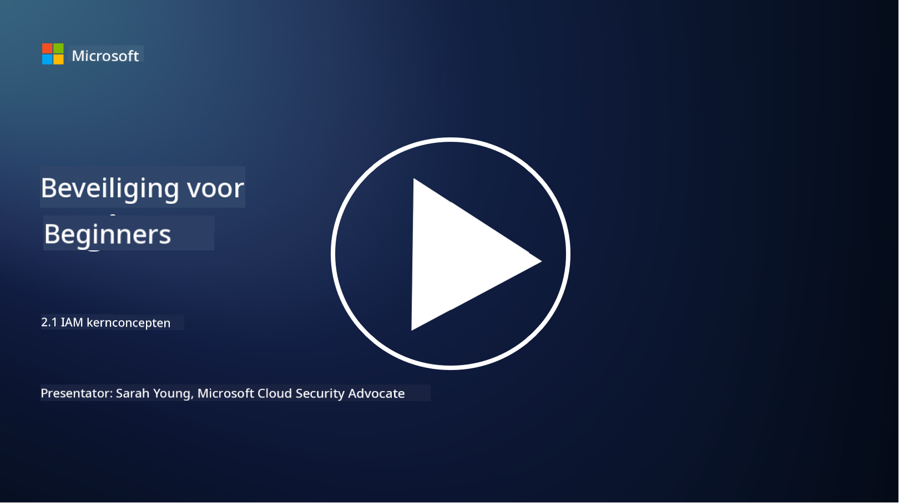

<!--
CO_OP_TRANSLATOR_METADATA:
{
  "original_hash": "2e3864e3d579f0dbb4ac2ec8c5f82acf",
  "translation_date": "2025-09-03T22:41:01+00:00",
  "source_file": "2.1 IAM key concepts.md",
  "language_code": "nl"
}
-->
# IAM kernconcepten

Heb je ooit ingelogd op een computer of een website? Natuurlijk wel! Dat betekent dat je al gebruik hebt gemaakt van identiteitscontroles in je dagelijkse leven. Identity and Access Management (IAM) is een belangrijke pijler van beveiliging, en we zullen er in de komende lessen meer over leren.

**Introductie**

In deze les behandelen we:

- Wat bedoelen we met Identity and Access Management (IAM) in de
  context van cybersecurity?
  
- Wat is het principe van minimale rechten?
  
- Wat is scheiding van taken?
  
- Wat is authenticatie en autorisatie?

## Wat bedoelen we met Identity and Access Management (IAM) in de context van cybersecurity?

Identity and Access Management (IAM) verwijst naar een reeks processen, technologieën en beleidsregels die worden geïmplementeerd om ervoor te zorgen dat de juiste personen de juiste toegang hebben tot middelen binnen de digitale omgeving van een organisatie. IAM omvat het beheren van digitale identiteiten (gebruikers, werknemers, partners) en hun toegang tot systemen, applicaties, gegevens en netwerken. Het primaire doel van IAM is het verbeteren van beveiliging, het stroomlijnen van gebruikersaccess en het waarborgen van naleving van organisatorische beleidsregels en regelgeving. IAM-oplossingen omvatten doorgaans gebruikersauthenticatie, autorisatie, identiteitsvoorziening, toegangscontrole en het beheer van de levenscyclus van gebruikers (zorgen dat accounts worden verwijderd wanneer ze niet langer worden gebruikt).

## Wat is het principe van minimale rechten?

Het principe van minimale rechten is een fundamenteel concept dat pleit voor het toekennen van alleen de minimale rechten die nodig zijn voor gebruikers en systemen om hun beoogde taken of rollen uit te voeren. Dit principe helpt de potentiële schade te beperken die kan optreden bij een beveiligingsinbreuk of interne dreiging. Door het principe van minimale rechten te volgen, verkleinen organisaties het aanvalsoppervlak en minimaliseren ze het risico op ongeautoriseerde toegang, datalekken en onbedoeld misbruik van rechten. In de praktijk betekent dit dat gebruikers alleen toegang krijgen tot de specifieke middelen en functionaliteiten die nodig zijn voor hun functie, en niet meer. Bijvoorbeeld, als je alleen een document hoeft te lezen, is het overbodig om volledige beheerdersrechten voor dat document te krijgen.

## Wat is scheiding van taken?

Scheiding van taken is een principe dat erop gericht is belangenconflicten te voorkomen en het risico op fraude en fouten te verminderen door kritieke taken en verantwoordelijkheden te verdelen over verschillende personen binnen een organisatie. In de context van cybersecurity houdt scheiding van taken in dat ervoor wordt gezorgd dat geen enkele persoon controle heeft over alle aspecten van een kritisch proces of systeem. Het doel is een systeem van checks and balances te creëren dat voorkomt dat één persoon zowel de opzet- als goedkeuringsfase van een proces kan uitvoeren. Bijvoorbeeld, in financiële systemen kan dit betekenen dat de persoon die transacties invoert in het systeem niet dezelfde persoon is die deze transacties goedkeurt. Dit vermindert het risico dat ongeautoriseerde of frauduleuze acties onopgemerkt blijven.

## Wat is authenticatie en autorisatie?

Authenticatie en autorisatie zijn twee fundamentele concepten in cybersecurity die een cruciale rol spelen bij het waarborgen van de beveiliging en integriteit van computersystemen en gegevens. Ze worden vaak samen gebruikt om toegang tot middelen te controleren en gevoelige informatie te beschermen.

**1. Authenticatie**: Authenticatie is het proces waarbij de identiteit van een gebruiker, systeem of entiteit die toegang probeert te krijgen tot een computersysteem of specifiek middel wordt geverifieerd. Het zorgt ervoor dat de geclaimde identiteit echt en accuraat is. Authenticatiemethoden maken doorgaans gebruik van een of meer van de volgende factoren:
    
    a. Iets dat je weet: Dit omvat wachtwoorden, pincodes of andere geheime kennis die alleen de geautoriseerde gebruiker zou moeten hebben.
    
    b. Iets dat je hebt: Dit betreft fysieke tokens of apparaten zoals smartcards, beveiligingstokens of mobiele telefoons die worden gebruikt om de identiteit van de gebruiker te bevestigen.
    
    c. Iets dat je bent: Dit verwijst naar biometrische factoren zoals vingerafdrukken, gezichtsherkenning of netvliesscans die uniek zijn voor een individu.
    

Authenticatiemechanismen worden gebruikt om te bevestigen dat een gebruiker is wie hij beweert te zijn voordat toegang tot een systeem of middel wordt verleend. Het helpt ongeautoriseerde toegang te voorkomen en zorgt ervoor dat alleen legitieme gebruikers acties binnen een systeem kunnen uitvoeren.

**2. Autorisatie**: Autorisatie is het proces waarbij specifieke rechten en privileges worden toegekend of geweigerd aan geauthenticeerde gebruikers of entiteiten nadat hun identiteit is geverifieerd. Het bepaalt welke acties of operaties een gebruiker mag uitvoeren binnen een systeem of op specifieke middelen. Autorisatie is vaak gebaseerd op vooraf gedefinieerde beleidsregels, toegangscontroleregels en rollen die aan gebruikers zijn toegewezen.

Autorisatie kan worden gezien als het beantwoorden van de vraag: "Wat mag een geauthenticeerde gebruiker doen?" Het omvat het definiëren en afdwingen van toegangscontrolebeleid om gevoelige gegevens en middelen te beschermen tegen ongeautoriseerde toegang of wijzigingen.

**Samenvattend:**

- Authenticatie stelt de identiteit van gebruikers of entiteiten vast.
- Autorisatie bepaalt welke acties en middelen geauthenticeerde gebruikers mogen benaderen of manipuleren.

## Verdere informatie

- [Describe identity concepts - Training | Microsoft Learn](https://learn.microsoft.com/training/modules/describe-identity-principles-concepts/?WT.mc_id=academic-96948-sayoung)
- [Introduction to identity - Microsoft Entra | Microsoft Learn](https://learn.microsoft.com/azure/active-directory/fundamentals/identity-fundamental-concepts?WT.mc_id=academic-96948-sayoung)
- [What is Identity Access Management (IAM)? | Microsoft Security](https://www.microsoft.com/security/business/security-101/what-is-identity-access-management-iam?WT.mc_id=academic-96948-sayoung)
- [What is IAM? Identity and access management explained | CSO Online](https://www.csoonline.com/article/518296/what-is-iam-identity-and-access-management-explained.html)
- [What is IAM? (auth0.com)](https://auth0.com/blog/what-is-iam/)
- [Security+: implementing Identity and Access Management (IAM) controls [updated 2021] | Infosec (infosecinstitute.com)](https://resources.infosecinstitute.com/certifications/securityplus/security-implementing-identity-and-access-management-iam-controls/)
- [least privilege - Glossary | CSRC (nist.gov)](https://csrc.nist.gov/glossary/term/least_privilege)
- [Security: The Principle of Least Privilege (POLP) - Microsoft Community Hub](https://techcommunity.microsoft.com/t5/azure-sql-blog/security-the-principle-of-least-privilege-polp/ba-p/2067390?WT.mc_id=academic-96948-sayoung)
- [Principle of least privilege | CERT NZ](https://www.cert.govt.nz/it-specialists/critical-controls/principle-of-least-privilege/)
- [Why is separation of duties required by NIST 800-171 and CMMC? - (totem.tech)](https://www.totem.tech/cmmc-separation-of-duties/)

---

**Disclaimer**:  
Dit document is vertaald met behulp van de AI-vertalingsservice [Co-op Translator](https://github.com/Azure/co-op-translator). Hoewel we streven naar nauwkeurigheid, dient u zich ervan bewust te zijn dat geautomatiseerde vertalingen fouten of onnauwkeurigheden kunnen bevatten. Het originele document in de oorspronkelijke taal moet worden beschouwd als de gezaghebbende bron. Voor cruciale informatie wordt professionele menselijke vertaling aanbevolen. Wij zijn niet aansprakelijk voor eventuele misverstanden of verkeerde interpretaties die voortvloeien uit het gebruik van deze vertaling.