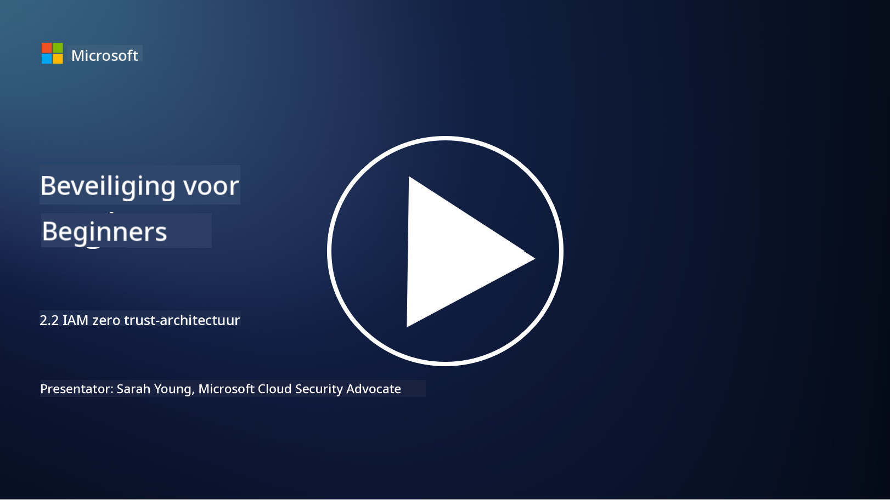

<!--
CO_OP_TRANSLATOR_METADATA:
{
  "original_hash": "4774a978af123f72ebb872199c4c4d4f",
  "translation_date": "2025-09-03T23:41:45+00:00",
  "source_file": "2.2 IAM zero trust architecture.md",
  "language_code": "nl"
}
-->
# IAM zero trust-architectuur

Identiteit is een essentieel onderdeel van het implementeren van een zero trust-architectuur en het opbouwen van een perimeter voor elke IT-omgeving. In deze sectie bespreken we waarom het belangrijk is om identiteitscontroles te gebruiken om zero trust te implementeren.

## Introductie

In deze les behandelen we:

 - Waarom moeten we identiteit gebruiken als onze perimeter in moderne IT-omgevingen?
   
 - Hoe verschilt dit van traditionele IT-architecturen?

 - Hoe wordt identiteit gebruikt om een zero trust-architectuur te implementeren?

## Waarom moeten we identiteit gebruiken als onze perimeter in moderne IT-omgevingen?

In moderne IT-omgevingen wordt het traditionele concept van een fysieke perimeter (met tools zoals firewalls en netwerkgrenzen) als primaire verdedigingslinie tegen cyberdreigingen steeds minder effectief door de toenemende complexiteit van technologie, de opkomst van werken op afstand en de adoptie van clouddiensten. Organisaties stappen daarom over op het gebruik van identiteit als de nieuwe perimeter. Dit betekent dat beveiliging draait om het verifiëren en beheren van de identiteit van gebruikers, apparaten en applicaties die toegang proberen te krijgen tot bronnen, ongeacht hun fysieke locatie.

Hier is waarom het gebruik van identiteit als perimeter cruciaal is in moderne IT-omgevingen:

**Werken op afstand**: Met werken op afstand en mobiele apparaten als norm, kunnen gebruikers vanaf verschillende locaties en apparaten toegang krijgen tot bronnen. De traditionele perimeterbenadering werkt niet meer wanneer gebruikers niet langer gebonden zijn aan een fysiek kantoor.

**Cloud- en hybride omgevingen**: Organisaties adopteren steeds vaker clouddiensten en hybride omgevingen. Data en applicaties bevinden zich niet langer uitsluitend binnen de grenzen van een organisatie, waardoor traditionele perimeterverdedigingen minder relevant worden.

**Zero trust-beveiliging**: Het concept van zero trust-beveiliging gaat ervan uit dat geen enkele entiteit, binnen of buiten het netwerk, automatisch vertrouwd mag worden. Identiteit vormt de basis voor het verifiëren van toegangsverzoeken, ongeacht waar ze vandaan komen.

**Dreigingslandschap**: Cyberdreigingen evolueren, en aanvallers vinden manieren om traditionele perimeterverdedigingen te omzeilen. Phishing, social engineering en interne dreigingen maken vaak gebruik van menselijke kwetsbaarheden in plaats van netwerkperimeters te doorbreken.

**Data-gecentreerde aanpak**: Het beschermen van gevoelige data is van het grootste belang. Door te focussen op identiteit kunnen organisaties controleren wie toegang heeft tot welke data, waardoor het risico op datalekken wordt verminderd.

## Hoe verschilt dit van traditionele IT-architecturen?

Traditionele IT-architecturen waren sterk afhankelijk van perimetergebaseerde beveiligingsmodellen, waarbij firewalls en netwerkgrenzen een belangrijke rol speelden in het buitenhouden van dreigingen. De belangrijkste verschillen tussen traditionele en identiteitsgerichte benaderingen zijn:

|      Aspect                 |      Traditionele IT-architecturen                                                               |      Identiteitsgerichte benadering                                                                         |
|-----------------------------|--------------------------------------------------------------------------------------------------|------------------------------------------------------------------------------------------------------------|
|     Focus                   |     Perimeterfocus: Vertrouwde op perimeterverdedigingen zoals firewalls en toegangscontrole.    |     Focus op identiteitsverificatie: Verschuiving van netwerkgrenzen naar het verifiëren van gebruikers/apparaten. |
|     Locatie                 |     Locatieafhankelijkheid: Beveiliging gekoppeld aan fysieke kantoorlocaties en netwerkgrenzen. |     Locatieonafhankelijkheid: Beveiliging niet gebonden aan specifieke locaties; toegang vanaf overal.      |
|     Vertrouwensassumptie    |     Verondersteld vertrouwen: Vertrouwen binnen de netwerkperimeter voor gebruikers/apparaten.   |     Zero trust-aanpak: Vertrouwen wordt nooit verondersteld; toegang wordt geverifieerd op basis van identiteit en context. |
|     Apparatenoverweging     |     Apparaten binnen perimeter: Aangenomen dat apparaten binnen de netwerkperimeter veilig zijn. |     Apparatenbewustzijn: Houd rekening met apparaatgezondheid en beveiligingsstatus, ongeacht locatie.      |
|     Databescherming         |     Databescherming: Gericht op het beveiligen van netwerkperimeters voor dataprotectie.         |     Data-gecentreerde bescherming: Gericht op het controleren van data-toegang op basis van identiteit en gevoeligheid van data. |

## Hoe wordt identiteit gebruikt om een zero trust-architectuur te implementeren?

In een zero trust-architectuur is het fundamentele principe om nooit automatisch vertrouwen te hebben in een entiteit, ongeacht of deze zich binnen of buiten de netwerkperimeter bevindt. Identiteit speelt een centrale rol bij het implementeren van een zero trust-aanpak door continue verificatie van entiteiten die toegang proberen te krijgen tot bronnen mogelijk te maken. Moderne identiteitsbeveiligingscontroles zorgen ervoor dat elke gebruiker, apparaat, applicatie en dienst die toegang tot bronnen zoekt, grondig wordt geïdentificeerd en geauthenticeerd voordat toegang wordt verleend. Dit omvat het verifiëren van hun digitale identiteit via methoden zoals gebruikersnaam/wachtwoordcombinaties, multi-factor authenticatie (MFA), biometrie en andere sterke authenticatiemechanismen.

## Verdere informatie

- [Securing identity with Zero Trust | Microsoft Learn](https://learn.microsoft.com/security/zero-trust/deploy/identity?WT.mc_id=academic-96948-sayoung)
- [Zero Trust Principles and Guidance for Identity and Access | CSA (cloudsecurityalliance.org)](https://cloudsecurityalliance.org/artifacts/zero-trust-principles-and-guidance-for-iam/)
- [Zero Trust Identity Controls - Essentials Series - Episode 2 - YouTube](https://www.youtube.com/watch?v=fQZQznIKcGM&list=PLXtHYVsvn_b_gtX1-NB62wNervQx1Fhp4&index=13)

---

**Disclaimer**:  
Dit document is vertaald met behulp van de AI-vertalingsservice [Co-op Translator](https://github.com/Azure/co-op-translator). Hoewel we streven naar nauwkeurigheid, willen we u erop wijzen dat geautomatiseerde vertalingen fouten of onnauwkeurigheden kunnen bevatten. Het originele document in de oorspronkelijke taal moet worden beschouwd als de gezaghebbende bron. Voor kritieke informatie wordt professionele menselijke vertaling aanbevolen. Wij zijn niet aansprakelijk voor misverstanden of verkeerde interpretaties die voortvloeien uit het gebruik van deze vertaling.