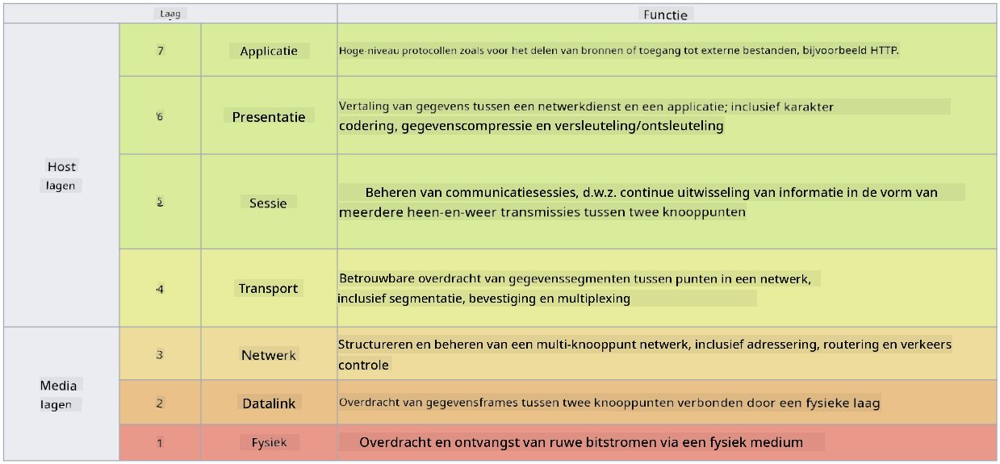

<!--
CO_OP_TRANSLATOR_METADATA:
{
  "original_hash": "252724eceeb183fb9018f88c5e1a3f0c",
  "translation_date": "2025-09-04T01:47:24+00:00",
  "source_file": "3.1 Networking key concepts.md",
  "language_code": "nl"
}
-->
# Netwerkconcepten in een notendop

Als je enige ervaring hebt in de IT, is de kans groot dat je al in aanraking bent gekomen met netwerkconcepten. Hoewel we in moderne omgevingen identiteit als onze primaire perimetercontrole gebruiken, betekent dit niet dat netwerkcontroles overbodig zijn. Hoewel dit een enorm onderwerp is, behandelen we in deze les enkele belangrijke netwerkconcepten.

In deze les bespreken we:

 - Wat is IP-adressering?
   
 - Wat is het OSI-model?

 - Wat is TCP/UDP?

 - Wat zijn poortnummers?

 - Wat is encryptie in rust en tijdens transport?

## Wat is IP-adressering?

IP-adressering, of Internet Protocol-adressering, is een numeriek label dat wordt toegewezen aan elk apparaat dat is verbonden met een computernetwerk dat het Internet Protocol gebruikt voor communicatie. Het fungeert als een unieke identificatie voor apparaten binnen een netwerk, waardoor ze gegevens kunnen verzenden en ontvangen via het internet of andere onderling verbonden netwerken. Er zijn twee hoofdversies van IP-adressering: IPv4 (Internet Protocol versie 4) en IPv6 (Internet Protocol versie 6). Een IP-adres wordt meestal weergegeven in IPv4-formaat (bijv. 192.168.1.1) of IPv6-formaat (bijv. 2001:0db8:85a3:0000:0000:8a2e:0370:7334).

## Wat is het OSI-model?

Het OSI (Open Systems Interconnection) model is een conceptueel raamwerk dat de functies van een communicatiesysteem standaardiseert in zeven afzonderlijke lagen. Elke laag voert specifieke taken uit en communiceert met aangrenzende lagen om efficiënte en betrouwbare gegevenscommunicatie tussen apparaten in een netwerk te waarborgen. De lagen, van onder naar boven, zijn als volgt:

 1. Fysieke laag
    
 2. Datalinklaag

 3. Netwerklaag

 4. Transportlaag

 5. Sessielaag

 6. Presentatielaag

 7. Applicatielaag

Het OSI-model biedt een gemeenschappelijke referentie om te begrijpen hoe netwerkprotocollen en -technologieën met elkaar samenwerken, ongeacht de specifieke hardware- of software-implementaties.

_ref: https://en.wikipedia.org/wiki/OSI_model_

## Wat is TCP/UDP?

TCP (Transmission Control Protocol) en UDP (User Datagram Protocol) zijn twee fundamentele transportlaagprotocollen die worden gebruikt in computernetwerken om communicatie tussen apparaten via het internet of binnen een lokaal netwerk mogelijk te maken. Ze zijn verantwoordelijk voor het opsplitsen van gegevens in pakketten voor verzending en het opnieuw samenstellen van die pakketten tot de oorspronkelijke gegevens aan de ontvangende kant. Ze verschillen echter in hun kenmerken en toepassingsgebieden.

**TCP (Transmission Control Protocol)**:

TCP is een verbinding-georiënteerd protocol dat betrouwbare en geordende gegevensoverdracht tussen apparaten biedt. Het legt een verbinding tot stand tussen de zender en de ontvanger voordat de gegevensuitwisseling begint. TCP zorgt ervoor dat datapakketten in de juiste volgorde aankomen en kan verloren pakketten opnieuw verzenden om gegevensintegriteit en volledigheid te garanderen. Dit maakt TCP geschikt voor toepassingen die betrouwbare gegevensoverdracht vereisen, zoals webbrowsen, e-mail, bestandsoverdracht (FTP) en databasecommunicatie.

**UDP (User Datagram Protocol)**:

UDP is een verbindingloos protocol dat snellere gegevensoverdracht biedt, maar niet hetzelfde niveau van betrouwbaarheid als TCP. Het legt geen formele verbinding vast voordat gegevens worden verzonden en bevat geen mechanismen voor het erkennen of opnieuw verzenden van verloren pakketten. UDP is geschikt voor toepassingen waarbij snelheid en efficiëntie belangrijker zijn dan gegarandeerde levering, zoals realtime communicatie, streaming media, online gaming en DNS-queries.

Samenvattend: TCP geeft prioriteit aan betrouwbaarheid en geordende levering, waardoor het geschikt is voor toepassingen die nauwkeurige gegevens vereisen, terwijl UDP snelheid en efficiëntie benadrukt, waardoor het geschikt is voor toepassingen waarbij een klein gegevensverlies of herordening acceptabel is in ruil voor lagere latentie. De keuze tussen TCP en UDP hangt af van de specifieke vereisten van de toepassing of dienst die wordt gebruikt.

## Wat zijn poortnummers?

In netwerken is een poortnummer een numerieke identificatie die wordt gebruikt om onderscheid te maken tussen verschillende diensten of toepassingen die op één apparaat binnen een netwerk draaien. Poorten helpen inkomende gegevens naar de juiste toepassing te leiden. Poortnummers zijn 16-bits ongetekende gehele getallen, wat betekent dat ze variëren van 0 tot 65535. Ze zijn onderverdeeld in drie reeksen:

- Well-Known Ports (0-1023): Gereserveerd voor standaarddiensten zoals HTTP (poort 80) en FTP (poort 21).

- Geregistreerde Poorten (1024-49151): Gebruikt voor toepassingen en diensten die niet tot het bekende bereik behoren, maar officieel zijn geregistreerd.

- Dynamische/Privé Poorten (49152-65535): Beschikbaar voor tijdelijk of privégebruik door toepassingen.

## Wat is encryptie in rust en tijdens transport?

Encryptie is het proces van het omzetten van gegevens in een beveiligd formaat om deze te beschermen tegen ongeautoriseerde toegang of manipulatie. Encryptie kan worden toegepast op gegevens zowel "in rust" (wanneer opgeslagen op een apparaat of server) als "tijdens transport" (wanneer verzonden tussen apparaten of via netwerken).

Encryptie in Rust: Dit houdt in dat gegevens worden versleuteld die zijn opgeslagen op apparaten, servers of opslagsystemen. Zelfs als een aanvaller fysieke toegang krijgt tot het opslagmedium, kan hij de gegevens niet openen zonder de encryptiesleutels. Dit is cruciaal voor het beschermen van gevoelige gegevens in geval van apparaatdiefstal, datalekken of ongeautoriseerde toegang.

Encryptie tijdens Transport: Dit houdt in dat gegevens worden versleuteld terwijl ze reizen tussen apparaten of via netwerken. Dit voorkomt afluisteren en ongeautoriseerde onderschepping van gegevens tijdens de overdracht. Veelgebruikte protocollen voor encryptie tijdens transport zijn HTTPS voor webcommunicatie en TLS/SSL voor het beveiligen van verschillende soorten netwerkverkeer.

## Verdere lectuur
- [How Do IP Addresses Work? (howtogeek.com)](https://www.howtogeek.com/341307/how-do-ip-addresses-work/)
- [Understanding IP Address: An Introductory Guide (geekflare.com)](https://geekflare.com/understanding-ip-address/)
- [What is the OSI model? The 7 layers of OSI explained (techtarget.com)](https://www.techtarget.com/searchnetworking/definition/OSI)
- [The OSI Model – The 7 Layers of Networking Explained in Plain English (freecodecamp.org)](https://www.freecodecamp.org/news/osi-model-networking-layers-explained-in-plain-english/)
- [TCP/IP protocols - IBM Documentation](https://www.ibm.com/docs/en/aix/7.3?topic=protocol-tcpip-protocols)
- [Common Ports Cheat Sheet: The Ultimate Ports & Protocols List (stationx.net)](https://www.stationx.net/common-ports-cheat-sheet/)
- [Azure Data Encryption-at-Rest - Azure Security | Microsoft Learn](https://learn.microsoft.com/azure/security/fundamentals/encryption-atrest?WT.mc_id=academic-96948-sayoung)

---

**Disclaimer**:  
Dit document is vertaald met behulp van de AI-vertalingsservice [Co-op Translator](https://github.com/Azure/co-op-translator). Hoewel we streven naar nauwkeurigheid, dient u zich ervan bewust te zijn dat geautomatiseerde vertalingen fouten of onnauwkeurigheden kunnen bevatten. Het originele document in zijn oorspronkelijke taal moet worden beschouwd als de gezaghebbende bron. Voor cruciale informatie wordt professionele menselijke vertaling aanbevolen. Wij zijn niet aansprakelijk voor eventuele misverstanden of verkeerde interpretaties die voortvloeien uit het gebruik van deze vertaling.