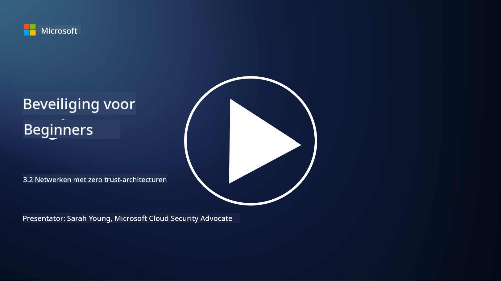

<!--
CO_OP_TRANSLATOR_METADATA:
{
  "original_hash": "680d6e14d9d33fc471c22f44679713f8",
  "translation_date": "2025-09-04T00:39:09+00:00",
  "source_file": "3.2 Networking zero trust architecture.md",
  "language_code": "nl"
}
-->
# Netwerkarchitecturen met zero trust

Het netwerk biedt een cruciale laag in zero trust-controles. In deze les leren we meer over:

- Wat is netwerksegmentatie?  
- Hoe helpt netwerksegmentatie bij het implementeren van zero trust?  
- Wat is end-to-end encryptie?

## Wat is netwerksegmentatie?

Netwerksegmentatie is de praktijk waarbij een netwerk wordt opgedeeld in kleinere, geïsoleerde segmenten of subnetwerken. Elk segment is geïsoleerd van de andere, en toegang tussen segmenten wordt gecontroleerd en beperkt op basis van specifieke beveiligingsbeleid. Netwerksegmentatie wordt gebruikt om de beveiliging te verbeteren door de impact van mogelijke inbreuken te beperken en laterale beweging van aanvallers binnen het netwerk te voorkomen.

Door netwerksegmentatie te implementeren, kan een organisatie "zones" creëren die verschillende soorten gebruikers, applicaties en gegevens scheiden. Dit verkleint het aanvalsoppervlak en minimaliseert de potentiële schade veroorzaakt door een beveiligingsincident. Netwerksegmentatie kan worden gerealiseerd met technologieën zoals virtuele LANs (VLANs), firewalls en toegangscontroles.

## Hoe helpt netwerksegmentatie bij het implementeren van zero trust?

Netwerksegmentatie sluit nauw aan bij de principes van het Zero Trust-model. In een Zero Trust-architectuur helpt netwerksegmentatie het principe van "least privilege" te handhaven door ervoor te zorgen dat gebruikers en apparaten alleen toegang hebben tot de specifieke middelen en diensten die ze nodig hebben om hun taken uit te voeren. Door het netwerk op te splitsen in kleinere zones, kunnen organisaties strikte toegangscontroles implementeren, kritieke middelen isoleren en laterale beweging van aanvallers voorkomen.

Netwerksegmentatie helpt ook bij het afdwingen van identiteitsgebaseerde toegangscontroles, waarbij gebruikers en apparaten grondig worden geauthenticeerd en geautoriseerd voordat ze toegang krijgen tot specifieke segmenten. Dit voorkomt ongeautoriseerde toegang tot gevoelige middelen en beperkt de impact van gecompromitteerde inloggegevens.

## Wat is end-to-end encryptie?

End-to-end (E2E) encryptie is een beveiligingsmaatregel die ervoor zorgt dat gegevens gedurende hun hele reis van de verzender naar de ontvanger versleuteld blijven. In dit proces worden gegevens aan de kant van de verzender versleuteld, en alleen de ontvanger beschikt over de sleutel om de gegevens te ontsleutelen en te lezen. De versleutelings- en ontsleutelingsprocessen vinden plaats op de eindpunten, waardoor het voor ongeautoriseerde partijen, inclusief dienstverleners en tussenpersonen, uiterst moeilijk wordt om toegang te krijgen tot de onversleutelde gegevens.

E2E encryptie biedt een hoog niveau van vertrouwelijkheid en beveiliging voor gegevensoverdracht, zelfs als de gegevens door verschillende tussenliggende systemen of netwerken gaan. Het wordt vaak gebruikt in veilige berichtenapps, e-maildiensten en andere communicatieplatforms om gevoelige informatie te beschermen tegen onderschepping en ongeautoriseerde toegang.

Deze versleutelingsmethode zorgt ervoor dat zelfs als aanvallers toegang krijgen tot de gegevens tijdens de overdracht, ze alleen versleutelde inhoud zien die zonder de ontsleutelingssleutel betekenisloos is. End-to-end encryptie speelt een cruciale rol bij het beschermen van gebruikersprivacy en het beveiligen van gevoelige informatie tegen blootstelling aan ongeautoriseerde partijen.

## Wat is SASE?

SASE staat voor "Secure Access Service Edge" en is een cybersecurity-framework en -architectuur die netwerkbeveiliging en wide-area networking (WAN)-mogelijkheden combineert in één cloudgebaseerde dienst. SASE is ontworpen om veilige en schaalbare toegang te bieden tot netwerkbronnen, applicaties en gegevens voor externe en mobiele gebruikers, terwijl het netwerkbeheer wordt vereenvoudigd en de complexiteit van traditionele netwerk- en beveiligingsarchitecturen wordt verminderd.

Belangrijke kenmerken en componenten van SASE zijn:

1. **Cloudgebaseerd:** SASE wordt geleverd als een clouddienst, wat betekent dat beveiligings- en netwerkfuncties vanuit de cloud worden aangeboden in plaats van te vertrouwen op traditionele hardware en apparaten op locatie.  

2. **Integratie van beveiliging en netwerken:** SASE integreert verschillende beveiligingsdiensten zoals secure web gateways (SWG), firewall as a service (FWaaS), data loss prevention (DLP), zero-trust network access (ZTNA) en WAN-optimalisatie met wide-area networking-mogelijkheden. Deze integratie helpt beveiligings- en netwerkoperaties te stroomlijnen.  

3. **Zero Trust:** SASE werkt volgens het principe van zero trust, wat betekent dat het strikte toegangscontroles en beleid van minimaal privilege afdwingt. Gebruikers en apparaten worden niet standaard vertrouwd en moeten worden geauthenticeerd en geautoriseerd voordat ze toegang krijgen tot middelen.  

4. **Identiteitsgericht:** SASE richt zich op gebruikers- en apparaatidentiteiten als basis voor toegangscontrole. Identiteits- en contextgebaseerde beleidsregels worden gebruikt om toegangsrechten te bepalen, en deze beleidsregels passen zich dynamisch aan op basis van gebruikersgedrag en context.  

5. **Schaalbaarheid en flexibiliteit:** SASE kan eenvoudig worden opgeschaald om een groot aantal gebruikers en apparaten te accommoderen, waardoor het geschikt is voor organisaties met diverse en veranderende netwerk- en beveiligingsbehoeften.  

SASE is vooral relevant in het moderne tijdperk van werken op afstand en cloudadoptie, omdat het een uitgebreide en flexibele aanpak biedt voor het beveiligen en beheren van netwerktoegang. Het helpt organisaties zich aan te passen aan veranderende beveiligings- en netwerkvereisten, terwijl het een sterke focus behoudt op gebruikersgerichte en zero trust-beveiligingsmodellen.

## Verdere informatie

- [Wat is netwerksegmentatie? - Cisco](https://www.cisco.com/c/en/us/products/security/what-is-network-segmentation.html#~benefits)  
- [Wat is microsegmentatie? - Cisco](https://www.cisco.com/c/en/us/products/security/what-is-microsegmentation.html)  
- [Netwerksegmentatie en segregatie implementeren | Cyber.gov.au](https://www.cyber.gov.au/resources-business-and-government/maintaining-devices-and-systems/system-hardening-and-administration/network-hardening/implementing-network-segmentation-and-segregation)  
- [Wat is netwerksegmentatie en waarom is het belangrijk | CompTIA](https://www.comptia.org/blog/security-awareness-training-network-segmentation)  
- [Netwerksegmentatie: Concepten en Praktijken (cmu.edu)](https://insights.sei.cmu.edu/blog/network-segmentation-concepts-and-practices/)  
- [Beveilig netwerken met Zero Trust | Microsoft Learn](https://learn.microsoft.com/security/zero-trust/deploy/networks?WT.mc_id=academic-96948-sayoung)  
- [Wat is end-to-end encryptie? | IBM](https://www.ibm.com/topics/end-to-end-encryption)  
- [Wat is end-to-end encryptie en waarom is het belangrijk? (howtogeek.com)](https://www.howtogeek.com/711656/what-is-end-to-end-encryption-and-why-does-it-matter/)  
- [Definitie van Secure Access Service Edge (SASE) - Gartner Information Technology Glossary](https://www.gartner.com/en/information-technology/glossary/secure-access-service-edge-sase)  
- [Wat is Secure Access Service Edge (SASE)? | Microsoft Security](https://www.microsoft.com/security/business/security-101/what-is-sase?WT.mc_id=academic-96948-sayoung)  

---

**Disclaimer**:  
Dit document is vertaald met behulp van de AI-vertalingsservice [Co-op Translator](https://github.com/Azure/co-op-translator). Hoewel we streven naar nauwkeurigheid, willen we u erop wijzen dat geautomatiseerde vertalingen fouten of onnauwkeurigheden kunnen bevatten. Het originele document in de oorspronkelijke taal moet worden beschouwd als de gezaghebbende bron. Voor kritieke informatie wordt professionele menselijke vertaling aanbevolen. Wij zijn niet aansprakelijk voor misverstanden of verkeerde interpretaties die voortvloeien uit het gebruik van deze vertaling.