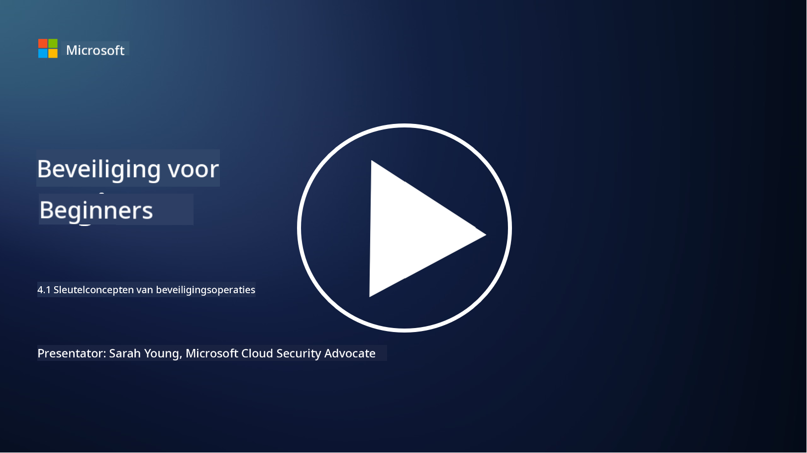

<!--
CO_OP_TRANSLATOR_METADATA:
{
  "original_hash": "6a55b31df9eebf550d040cef0ef7dff3",
  "translation_date": "2025-09-04T02:03:39+00:00",
  "source_file": "4.1 SecOps key concepts.md",
  "language_code": "nl"
}
-->
# Belangrijke concepten van beveiligingsoperaties

Beveiligingsoperaties zijn een cruciaal onderdeel van de algehele beveiligingsfunctie van een organisatie. In deze les leren we hier meer over:

 - Wat is een beveiligingsoperatiefunctie binnen een bedrijf?
   
 - Welke vormen kunnen beveiligingsoperaties aannemen?
   
   - Hoe verschillen beveiligingsoperaties van traditionele IT-operaties?

## Wat is een beveiligingsoperatiefunctie binnen een bedrijf?

Een beveiligingsoperatiefunctie binnen een bedrijf verwijst naar een toegewijd team of afdeling die verantwoordelijk is voor het monitoren, detecteren, onderzoeken en reageren op cyberbeveiligingsdreigingen en -incidenten. Het primaire doel van een beveiligingsoperatiefunctie is om de vertrouwelijkheid, integriteit en beschikbaarheid van de digitale middelen van een organisatie te waarborgen door proactief beveiligingsrisico's te identificeren en te beperken en effectief te reageren op beveiligingsincidenten.

## Welke vormen kunnen beveiligingsoperaties aannemen?

Beveiligingsoperaties kunnen verschillende vormen aannemen, afhankelijk van de grootte en complexiteit van de organisatie. Enkele veelvoorkomende vormen zijn:

**Security Operations Center (SOC):** Een gecentraliseerd team dat verantwoordelijk is voor 24/7 monitoring, analyse en reactie op beveiligingsgebeurtenissen. SOC's maken vaak gebruik van geavanceerde tools en technologieën om bedreigingen in realtime te identificeren en erop te reageren.

**Incident Response Team:** Een gespecialiseerd team dat zich richt op het reageren op beveiligingsincidenten en -inbreuken. Ze voeren onderzoeken uit, coördineren responsinspanningen en faciliteren herstel.

**Threat Hunting Team:** Een team dat proactief zoekt naar tekenen van geavanceerde bedreigingen en verborgen kwetsbaarheden die mogelijk niet door traditionele beveiligingstools worden gedetecteerd.

**Red Team/Blue Team:** Het red team simuleert aanvallen om kwetsbaarheden te identificeren, terwijl het blue team zich verdedigt tegen die aanvallen. Beide teams werken samen om beveiligingsmaatregelen te verbeteren.

**Managed Security Services Provider (MSSP):** Sommige organisaties besteden hun beveiligingsoperaties uit aan externe aanbieders die gespecialiseerd zijn in beveiligingsmonitoring en incidentrespons.

## Hoe verschillen beveiligingsoperaties van traditionele IT-operaties?

Beveiligingsoperaties en traditionele IT-operaties zijn gerelateerde maar verschillende functies:

**Focus:** IT-operaties richten zich op het beheren en onderhouden van de IT-infrastructuur van de organisatie, waarbij de functionaliteit en beschikbaarheid worden gewaarborgd. Beveiligingsoperaties daarentegen geven prioriteit aan het identificeren en beperken van beveiligingsrisico's en het reageren op incidenten.

**Verantwoordelijkheden:** IT-operaties behandelen taken zoals systeemonderhoud, software-updates en gebruikersondersteuning. Beveiligingsoperaties behandelen dreigingsdetectie, incidentrespons, kwetsbaarheidsbeheer en beveiligingsmonitoring.

**Tijdigheid:** IT-operaties leggen de nadruk op directe systeembeschikbaarheid en prestaties. Beveiligingsoperaties richten zich op het identificeren en verhelpen van bedreigingen, wat niet altijd overeenkomt met directe beschikbaarheid.

**Vaardigheden:** Beveiligingsoperaties vereisen gespecialiseerde vaardigheden in dreigingsanalyse, incidentrespons en cyberbeveiligingstools. IT-operaties vereisen expertise in systeembeheer, netwerkbeheer en applicatieondersteuning.

## Workflow voor incidentrespons

De NIST Cybersecurity Framework Core Functions beschrijven vijf overkoepelende functies die continu moeten worden uitgevoerd als onderdeel van de operationele omgeving van een organisatie om cyberbeveiligingsrisico's te verminderen. 

Het is belangrijk te begrijpen dat deze activiteiten deel moeten uitmaken van een grotere cirkel die aansluit op en in lijn is met de bredere cyberbeveiligingsprocessen van een organisatie.

**Opmerking:** Je kunt meer lezen over het NIST Cybersecurity Framework op [https://www.nist.gov/cybersecurity](https://www.nist.gov/cybersecurity)

## Verdere lectuur

- [Security operations | Microsoft Learn](https://learn.microsoft.com/security/operations/overview?WT.mc_id=academic-96948-sayoung)
- [Implementing security operations processes | Microsoft Learn](https://learn.microsoft.com/security/operations/?WT.mc_id=academic-96948-sayoung)
- [What is a security operations center (SOC)? | Microsoft Security](https://www.microsoft.com/security/business/security-101/what-is-a-security-operations-center-soc?WT.mc_id=academic-96948-sayoung)
- [What Is a Security Operations Center | Cybersecurity | CompTIA](https://www.comptia.org/content/articles/what-is-a-security-operations-center)

---

**Disclaimer**:  
Dit document is vertaald met behulp van de AI-vertalingsservice [Co-op Translator](https://github.com/Azure/co-op-translator). Hoewel we streven naar nauwkeurigheid, willen we u erop wijzen dat geautomatiseerde vertalingen fouten of onnauwkeurigheden kunnen bevatten. Het originele document in de oorspronkelijke taal moet worden beschouwd als de gezaghebbende bron. Voor kritieke informatie wordt professionele menselijke vertaling aanbevolen. Wij zijn niet aansprakelijk voor misverstanden of verkeerde interpretaties die voortvloeien uit het gebruik van deze vertaling.