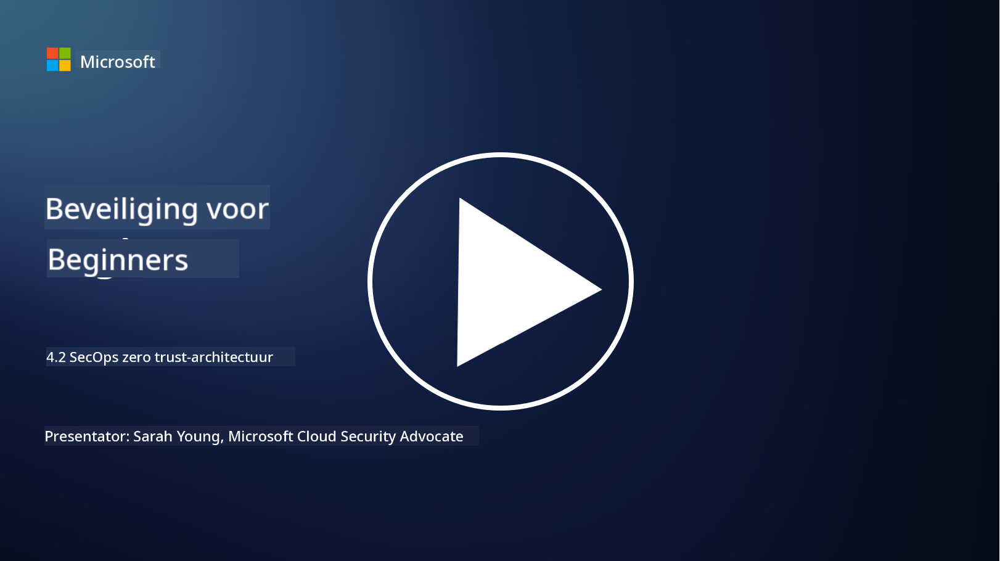

<!--
CO_OP_TRANSLATOR_METADATA:
{
  "original_hash": "45bbdc114e70936816b0b3e7c40189cf",
  "translation_date": "2025-09-04T00:45:39+00:00",
  "source_file": "4.2 SecOps zero trust architecture.md",
  "language_code": "nl"
}
-->
# SecOps zero trust-architectuur

Beveiligingsoperaties vormen twee onderdelen van een zero trust-architectuur en in deze les leren we over beide:

- Hoe moeten IT-architecturen worden opgebouwd om gecentraliseerde logverzameling mogelijk te maken?

- Wat zijn de beste praktijken voor beveiligingsoperaties in moderne IT-omgevingen?

## Hoe moeten IT-architecturen worden opgebouwd om gecentraliseerde logverzameling mogelijk te maken?

Gecentraliseerde logverzameling is een cruciaal onderdeel van moderne beveiligingsoperaties. Het stelt organisaties in staat om logs en gegevens van verschillende bronnen, zoals servers, applicaties, netwerkapparaten en beveiligingstools, te verzamelen in een centrale opslagplaats voor analyse, monitoring en incidentrespons. Hier zijn enkele beste praktijken voor het bouwen van IT-architecturen die gecentraliseerde logverzameling ondersteunen:

1. **Integratie van logbronnen**:

- Zorg ervoor dat alle relevante apparaten en systemen zijn geconfigureerd om logs te genereren. Dit omvat servers, firewalls, routers, switches, applicaties en beveiligingsapparaten.

- Configureer logbronnen om logs door te sturen naar een gecentraliseerde logverzamelaar of beheersysteem.

2. **Kies de juiste SIEM-tool (Security Information and Event Management)**:

- Kies een SIEM-oplossing die aansluit bij de behoeften en schaal van uw organisatie.

- Zorg ervoor dat de gekozen oplossing logverzameling, aggregatie, analyse en rapportage ondersteunt.

3. **Schaalbaarheid en redundantie**:

- Ontwerp de architectuur voor schaalbaarheid om een groeiend aantal logbronnen en een verhoogd logvolume te accommoderen.

- Implementeer redundantie voor hoge beschikbaarheid om verstoringen door hardware- of netwerkstoringen te voorkomen.

4. **Veilig transporteren van logs**:

- Gebruik veilige protocollen zoals TLS/SSL of IPsec om logs van bronnen naar de centrale opslagplaats te transporteren.

- Implementeer authenticatie en toegangscontroles om ervoor te zorgen dat alleen geautoriseerde apparaten logs kunnen verzenden.

5. **Normalisatie**:

- Standaardiseer logformaten en normaliseer gegevens om consistentie en eenvoud in analyse te waarborgen.

6. **Opslag en retentie**:

- Bepaal de juiste retentieperiode voor logs op basis van compliance- en beveiligingseisen.

- Sla logs veilig op en bescherm ze tegen ongeautoriseerde toegang en manipulatie.

## Wat zijn de beste praktijken voor beveiligingsoperaties in moderne IT-omgevingen?

Naast gecentraliseerde logverzameling zijn hier enkele beste praktijken voor beveiligingsoperaties in moderne IT-omgevingen:

1. **Continue monitoring**: Implementeer continue monitoring van netwerk- en systeemactiviteiten om bedreigingen in realtime te detecteren en erop te reageren.

2. **Threat intelligence**: Blijf op de hoogte van opkomende bedreigingen en kwetsbaarheden door gebruik te maken van threat intelligence-feeds en -diensten.

3. **Gebruikerstraining**: Voer regelmatig bewustwordingstrainingen uit voor medewerkers om risico's van social engineering en phishing-aanvallen te verminderen.

4. **Incidentresponsplan**: Ontwikkel en test een incidentresponsplan om een snelle en effectieve reactie op beveiligingsincidenten te waarborgen.

5. **Beveiligingsautomatisering**: Maak gebruik van beveiligingsautomatisering en orkestratietools om incidentrespons en repetitieve taken te stroomlijnen.

6. **Back-up en herstel**: Implementeer robuuste back-up- en hersteloplossingen om gegevensbeschikbaarheid te garanderen in geval van gegevensverlies of ransomware-aanvallen.

## Verdere informatie

- [Microsoft Security Best Practices module: Security operations | Microsoft Learn](https://learn.microsoft.com/security/operations/security-operations-videos-and-decks?WT.mc_id=academic-96948-sayoung)
- [Security operations - Cloud Adoption Framework | Microsoft Learn](https://learn.microsoft.com/azure/cloud-adoption-framework/secure/security-operations?WT.mc_id=academic-96948-sayoung)
- [Wat is Security Operations and Analytics Platform Architecture? Een definitie van SOAPA, hoe het werkt, voordelen en meer (digitalguardian.com)](https://www.digitalguardian.com/blog/what-security-operations-and-analytics-platform-architecture-definition-soapa-how-it-works#:~:text=All%20in%20all%2C%20security%20operations%20and%20analytics%20platform,become%20more%20efficient%20and%20operative%20with%20your%20security.)

---

**Disclaimer**:  
Dit document is vertaald met behulp van de AI-vertalingsservice [Co-op Translator](https://github.com/Azure/co-op-translator). Hoewel we streven naar nauwkeurigheid, willen we u erop wijzen dat geautomatiseerde vertalingen fouten of onnauwkeurigheden kunnen bevatten. Het originele document in de oorspronkelijke taal moet worden beschouwd als de gezaghebbende bron. Voor kritieke informatie wordt professionele menselijke vertaling aanbevolen. Wij zijn niet aansprakelijk voor misverstanden of verkeerde interpretaties die voortvloeien uit het gebruik van deze vertaling.