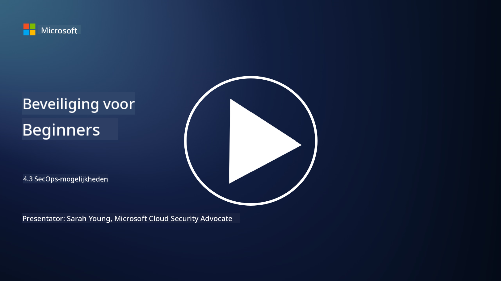

<!--
CO_OP_TRANSLATOR_METADATA:
{
  "original_hash": "553eb694c89f1caca0694e8d8ab89e0e",
  "translation_date": "2025-09-04T01:20:15+00:00",
  "source_file": "4.3 SecOps capabilities.md",
  "language_code": "nl"
}
-->
# SecOps-mogelijkheden

In deze sectie bespreken we meer details over de kernhulpmiddelen en mogelijkheden die kunnen worden gebruikt in beveiligingsoperaties.

In deze les behandelen we:

- Wat is een Security Information and Event Management (SIEM)-tool?

- Wat is XDR?

- Welke mogelijkheden kunnen worden gebruikt om beveiligingsoperaties te verbeteren?

## Wat is een Security Information and Event Management (SIEM)-tool?

Een Security Information and Event Management (SIEM)-tool biedt analyse van beveiligingswaarschuwingen die worden gegenereerd in de IT-omgeving van een organisatie. Ze verzamelen, aggregeren, correleren en analyseren loggegevens en beveiligingsevenementen van verschillende bronnen, zoals netwerkapparaten, servers, applicaties en beveiligingssystemen.

Belangrijke functies en mogelijkheden van SIEM-tools zijn onder andere:

1. **Logverzameling**: SIEM-tools verzamelen logbestanden en beveiligingsevenementgegevens van een breed scala aan apparaten, systemen en applicaties, waaronder firewalls, inbraakdetectiesystemen, antivirussoftware en meer.

2. **Gegevensnormalisatie**: Ze normaliseren loggegevens naar een gemeenschappelijk formaat om analyse en correlatie te vergemakkelijken.

3. **Evenementcorrelatie**: SIEM-tools correleren gebeurtenissen om patronen en afwijkingen te identificeren die kunnen wijzen op beveiligingsincidenten of bedreigingen.

4. **Waarschuwingen en meldingen**: SIEM-tools genereren waarschuwingen en meldingen in realtime wanneer verdachte activiteiten of beveiligingsschendingen worden gedetecteerd, zodat er direct kan worden gereageerd.

5. **Incidentdetectie**: Ze vergemakkelijken de detectie van beveiligingsincidenten, waaronder ongeautoriseerde toegang, datalekken, malware-infecties en interne bedreigingen.

6. **Gebruikers- en entiteitsgedragsanalyse (UEBA)**: Sommige SIEM-tools bevatten UEBA-mogelijkheden om abnormaal gebruikers- en entiteitsgedrag te identificeren dat kan wijzen op gecompromitteerde accounts of interne bedreigingen.

7. **Integratie van dreigingsinformatie**: SIEM-tools kunnen worden geïntegreerd met dreigingsinformatiefeeds om bedreigingsdetectie te verbeteren door bekende indicatoren van compromittering (IOCs) te vergelijken met netwerkactiviteit.

8. **Automatisering en orkestratie**: Automatiseringsfuncties stellen SIEM-tools in staat om reacties op veelvoorkomende beveiligingsincidenten te automatiseren, waardoor reactietijden en handmatige inspanningen worden verminderd.

9. **Dashboard en visualisatie**: Ze bieden dashboards en visualisatietools voor het monitoren van beveiligingsgegevens en het maken van aangepaste rapporten.

10. **Integratie met andere beveiligingstools**: SIEM-tools integreren vaak met andere beveiligingstools en technologieën, zoals Endpoint Detection and Response (EDR)-oplossingen, om een holistisch beeld te bieden van de beveiligingsstatus van een organisatie.

## Wat is XDR?

XDR (Extended Detection and Response) is een technologie die de mogelijkheden van traditionele Endpoint Detection and Response (EDR) uitbreidt en combineert met bredere beveiligingstelemetrie van verschillende bronnen om een meer omvattend beeld te bieden van de beveiligingsstatus van een organisatie. XDR is bedoeld om bedreigingsdetectie, incidentrespons en algehele beveiliging te verbeteren door de beperkingen van het uitsluitend vertrouwen op EDR, SIEM of andere individuele beveiligingstools aan te pakken.

Belangrijke kenmerken en componenten van XDR zijn onder andere:

1. **Gegevensintegratie**: XDR integreert gegevens van meerdere bronnen, waaronder endpoints, netwerkverkeer, clouddiensten, e-mail en meer. Deze uitgebreide gegevensaggregatie biedt een bredere context voor bedreigingsdetectie en analyse.

2. **Geavanceerde analyses**: XDR maakt gebruik van geavanceerde analyses, machine learning en gedragsanalyse om beveiligingsbedreigingen te identificeren en te prioriteren. Het zoekt naar patronen en afwijkingen in de geïntegreerde gegevens om zowel bekende als onbekende bedreigingen te detecteren.

3. **Geautomatiseerde bedreigingsdetectie**: XDR automatiseert de detectie van beveiligingsbedreigingen en afwijkingen door informatie uit verschillende bronnen te correleren. Het kan complexe aanvalsketens identificeren die zich over meerdere vectoren uitstrekken.

4. **Incidentonderzoek en -respons**: XDR biedt tools voor incidentonderzoek en -respons, waarmee beveiligingsteams snel de omvang en impact van incidenten kunnen beoordelen en passende corrigerende maatregelen kunnen nemen.

5. **Integratie van dreigingsinformatie**: Het integreert dreigingsinformatiefeeds en -gegevens om bedreigingsdetectie te verbeteren door bekende indicatoren van compromittering (IOCs) te vergelijken met de netwerk- en endpointactiviteit van de organisatie.

6. **Geïntegreerde console**: XDR biedt doorgaans een geïntegreerde console of dashboard waar beveiligingsteams beveiligingswaarschuwingen en incidenten van verschillende bronnen op een gecentraliseerde manier kunnen bekijken en beheren.

7. **Platformonafhankelijke dekking**: XDR-oplossingen dekken een breed scala aan platforms, waaronder endpoints, servers, cloudomgevingen en mobiele apparaten, waardoor het geschikt is voor moderne, multiplatform IT-omgevingen.

## Welke mogelijkheden kunnen worden gebruikt om beveiligingsoperaties te verbeteren?

Om beveiligingsoperaties te verbeteren, kunnen organisaties verschillende mogelijkheden benutten naast SIEM-tools:

1. **Machine learning en kunstmatige intelligentie**: Implementeer geavanceerde analyses, machine learning en AI om zich ontwikkelende bedreigingen te detecteren en dreigingsjacht te automatiseren.

2. **Gebruikers- en entiteitsgedragsanalyse (UEBA)**: Analyseer gebruikers- en entiteitsgedrag om afwijkingen en interne bedreigingen te detecteren.

3. **Dreigingsinformatiefeeds**: Integreer dreigingsinformatiefeeds om op de hoogte te blijven van de nieuwste bedreigingen en indicatoren van compromittering.

4. **Security Orchestration, Automation, and Response (SOAR)**: Implementeer SOAR-platforms om incidentrespons te automatiseren en workflows voor beveiligingsoperaties te stroomlijnen.

5. **Misleidingstechnologieën**: Gebruik misleidingstechnologieën om aanvallers binnen het netwerk te misleiden en te detecteren.

## Verdere lectuur

- [What is SIEM? | Microsoft Security](https://www.microsoft.com/security/business/security-101/what-is-siem?WT.mc_id=academic-96948-sayoung)
- [What Is SIEM? - Security Information and Event Management - Cisco](https://www.cisco.com/c/en/us/products/security/what-is-siem.html)
- [Security information and event management - Wikipedia](https://en.wikipedia.org/wiki/Security_information_and_event_management)
- [What Is XDR? | Microsoft Security](https://www.microsoft.com/security/business/security-101/what-is-xdr?WT.mc_id=academic-96948-sayoung)
- [XDR & XDR Security (kaspersky.com.au)](https://www.kaspersky.com.au/resource-center/definitions/what-is-xdr)
- [The Power of SecOps: Redefining Core Security Capabilities - The New Stack](https://thenewstack.io/the-power-of-secops-redefining-core-security-capabilities/)
- [Seven Steps to Improve Your Security Operations and Response (securityintelligence.com)](https://securityintelligence.com/seven-steps-to-improve-your-security-operations-and-response/)

---

**Disclaimer**:  
Dit document is vertaald met behulp van de AI-vertalingsservice [Co-op Translator](https://github.com/Azure/co-op-translator). Hoewel we streven naar nauwkeurigheid, willen we u erop wijzen dat geautomatiseerde vertalingen fouten of onnauwkeurigheden kunnen bevatten. Het originele document in de oorspronkelijke taal moet worden beschouwd als de gezaghebbende bron. Voor kritieke informatie wordt professionele menselijke vertaling aanbevolen. Wij zijn niet aansprakelijk voor misverstanden of verkeerde interpretaties die voortvloeien uit het gebruik van deze vertaling.