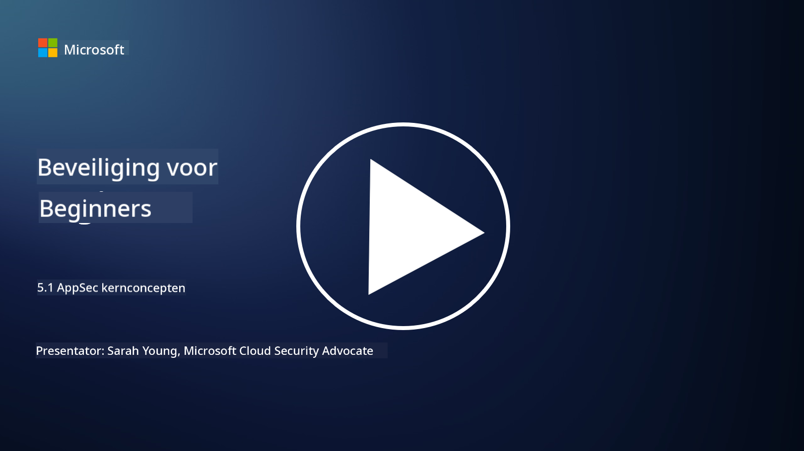

<!--
CO_OP_TRANSLATOR_METADATA:
{
  "original_hash": "e4b56bb23078d3ffb7ad407d280b0c36",
  "translation_date": "2025-09-04T00:32:48+00:00",
  "source_file": "5.1 AppSec key concepts.md",
  "language_code": "nl"
}
-->
# AppSec kernconcepten

Applicatiebeveiliging is een beveiligingsspecialisatie op zichzelf. In dit deel van de cursus gaan we dieper in op applicatiebeveiliging.

## Introductie

In deze les behandelen we:

- Wat is applicatiebeveiliging?

- Wat zijn de kernconcepten/principes van applicatiebeveiliging?

## Wat is applicatiebeveiliging?

Applicatiebeveiliging, vaak afgekort als "AppSec," verwijst naar de praktijk van het beschermen van softwareapplicaties tegen beveiligingsdreigingen, kwetsbaarheden en aanvallen. Het omvat de processen, technieken en tools die worden gebruikt om beveiligingsrisico's te identificeren, te beperken en te voorkomen gedurende de ontwikkeling, implementatie en onderhoud van een applicatie.

Applicatiebeveiliging is cruciaal omdat applicaties vaak doelwitten zijn voor cyberaanvallen. Kwaadwillende actoren maken gebruik van kwetsbaarheden en zwakke plekken in software om ongeautoriseerde toegang te krijgen, gegevens te stelen, diensten te verstoren of andere schadelijke activiteiten uit te voeren. Effectieve applicatiebeveiliging helpt de vertrouwelijkheid, integriteit en beschikbaarheid van een applicatie en de bijbehorende gegevens te waarborgen.

## Wat zijn de kernconcepten/principes van applicatiebeveiliging?

Belangrijke concepten en principes die ten grondslag liggen aan applicatiebeveiliging zijn:

1. **Veilig ontwerp**:

- Beveiliging moet vanaf het begin worden geïntegreerd in het ontwerp en de architectuur van de applicatie, in plaats van achteraf te worden toegevoegd.

2. **Inputvalidatie**:

- Alle gebruikersinvoer moet worden gevalideerd om ervoor te zorgen dat deze voldoet aan de verwachte formaten en vrij is van schadelijke code of gegevens.

3. **Outputcodering**:

- Gegevens die naar de client worden verzonden, moeten correct worden gecodeerd om kwetsbaarheden zoals cross-site scripting (XSS) te voorkomen.

4. **Authenticatie en autorisatie**:

- Gebruikers moeten worden geauthenticeerd en hun toegang tot bronnen moet worden geautoriseerd op basis van hun rollen en permissies.

5. **Gegevensbescherming**:

- Gevoelige gegevens moeten worden versleuteld tijdens opslag, transmissie en verwerking om ongeautoriseerde toegang te voorkomen.

6. **Sessiebeheer**:

- Veilig sessiebeheer zorgt ervoor dat gebruikerssessies beschermd zijn tegen kaping en ongeautoriseerde toegang.

7. **Veilige afhankelijkheden**:

- Zorg ervoor dat alle softwareafhankelijkheden up-to-date zijn met beveiligingspatches om kwetsbaarheden te voorkomen.

8. **Foutafhandeling en logging**:

- Implementeer veilige foutafhandeling om te voorkomen dat gevoelige informatie wordt onthuld en zorg voor veilige logpraktijken.

9. **Beveiligingstesten**:

- Test applicaties regelmatig op kwetsbaarheden met methoden zoals penetratietesten, codebeoordelingen en geautomatiseerde scan-tools.

10. **Veilige softwareontwikkelingscyclus (SDLC)**:

- Integreer beveiligingspraktijken in elke fase van de softwareontwikkelingscyclus, van eisen tot implementatie en onderhoud.

## Verdere leestips

- [SheHacksPurple: Wat is Applicatiebeveiliging? - YouTube](https://www.youtube.com/watch?v=eNmccQNzSSY)
- [Wat is Applicatiebeveiliging? - Cisco](https://www.cisco.com/c/en/us/solutions/security/application-first-security/what-is-application-security.html#~how-does-it-work)
- [Wat is applicatiebeveiliging? Een proces en tools voor het beveiligen van software | CSO Online](https://www.csoonline.com/article/566471/what-is-application-security-a-process-and-tools-for-securing-software.html)
- [OWASP Cheat Sheet Series | OWASP Foundation](https://owasp.org/www-project-cheat-sheets/)

---

**Disclaimer**:  
Dit document is vertaald met behulp van de AI-vertalingsservice [Co-op Translator](https://github.com/Azure/co-op-translator). Hoewel we streven naar nauwkeurigheid, willen we u erop wijzen dat geautomatiseerde vertalingen fouten of onnauwkeurigheden kunnen bevatten. Het originele document in de oorspronkelijke taal moet worden beschouwd als de gezaghebbende bron. Voor kritieke informatie wordt professionele menselijke vertaling aanbevolen. Wij zijn niet aansprakelijk voor misverstanden of verkeerde interpretaties die voortvloeien uit het gebruik van deze vertaling.