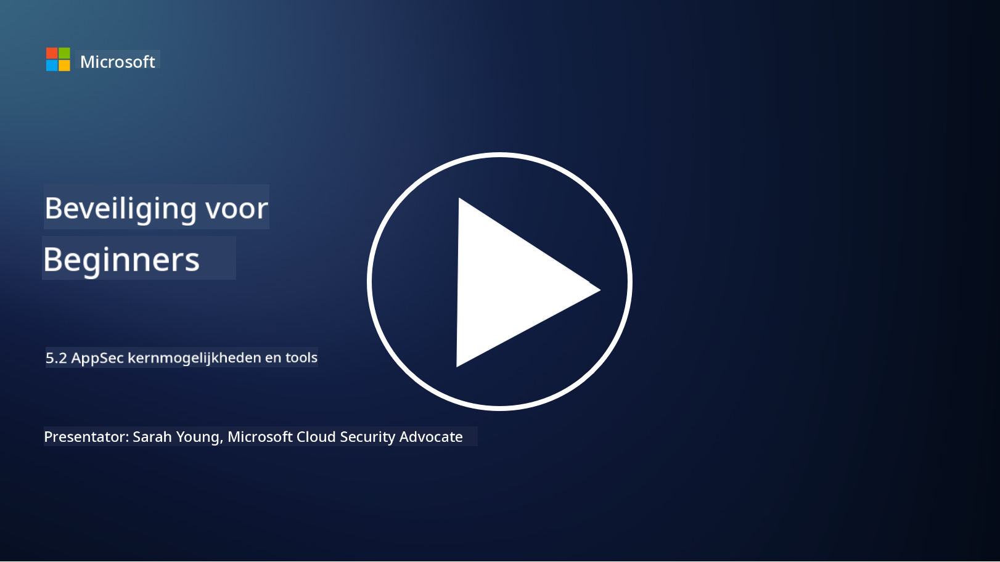

<!--
CO_OP_TRANSLATOR_METADATA:
{
  "original_hash": "790a3fa7e535ec60bb51bde13e759781",
  "translation_date": "2025-09-04T00:51:05+00:00",
  "source_file": "5.2 AppSec key capabilities.md",
  "language_code": "nl"
}
-->
## Introductie

In deze les behandelen we wat de belangrijkste mogelijkheden en tools zijn die worden gebruikt in applicatiebeveiliging.

## Belangrijke mogelijkheden en tools voor AppSec

Belangrijke mogelijkheden en tools die worden gebruikt in applicatiebeveiliging zijn essentieel voor het identificeren, mitigeren en voorkomen van beveiligingslekken en bedreigingen in softwaretoepassingen. Hier zijn enkele van de belangrijkste:

**1. Statische Applicatiebeveiligingstests (SAST)**:

- **Mogelijkheden**: Analyseert broncode, bytecode of binaire code om beveiligingslekken in de codebasis van de applicatie te identificeren.

- **Tools**: Voorbeelden zijn Fortify, Checkmarx en Veracode.

**2. Dynamische Applicatiebeveiligingstests (DAST)**:

- **Mogelijkheden**: Scant een draaiende applicatie om kwetsbaarheden te identificeren door invoerverzoeken te sturen en reacties te analyseren.

- **Tools**: Voorbeelden zijn ZAP, Burp Suite en Qualys Web Application Scanning.

**3. Interactieve Applicatiebeveiligingstests (IAST)**:

- **Mogelijkheden**: Combineert elementen van SAST en DAST om code tijdens runtime te analyseren, wat nauwkeurigere resultaten oplevert en het aantal fout-positieven vermindert.

- **Tools**: Voorbeelden zijn Contrast Security en HCL AppScan.

**4. Runtime Application Self-Protection (RASP)**:

- **Mogelijkheden**: Bewaakt en beschermt applicaties in real-time, detecteert en reageert op beveiligingsbedreigingen zodra ze zich voordoen.

- **Tools**: Voorbeelden zijn Veracode Runtime Protection en F5 Advanced WAF met RASP.

**5. Web Application Firewalls (WAFs)**:

- **Mogelijkheden**: Biedt een beschermende laag tussen de applicatie en het internet, filtert inkomend verkeer en blokkeert kwaadaardige verzoeken.

- **Tools**: Voorbeelden zijn ModSecurity, AWS WAF en Akamai Kona Site Defender.

**6. Afhankelijkheidsscans**:

- **Mogelijkheden**: Identificeert kwetsbaarheden in externe bibliotheken en componenten die in de applicatie worden gebruikt.

- **Tools**: Voorbeelden zijn OWASP Dependency-Check en Snyk.

**7. Penetratietesten (Pen Testing)**:

- **Mogelijkheden**: Simuleert aanvallen uit de echte wereld om kwetsbaarheden te ontdekken en de beveiliging van een applicatie te beoordelen.

- **Tools**: Uitgevoerd door gecertificeerde ethische hackers en beveiligingsprofessionals met behulp van verschillende tools zoals Metasploit en Nmap.

**8. Beveiligingsscans en -analyses**:

- **Mogelijkheden**: Scant op bekende kwetsbaarheden, configuratiefouten en beveiligingsmisconfiguraties.

- **Tools**: Voorbeelden zijn Nessus, Qualys Vulnerability Management en OpenVAS.

**9. Containerbeveiligingstools**:

- **Mogelijkheden**: Gericht op het beveiligen van gecontaineriseerde applicaties en hun omgevingen.

- **Tools**: Voorbeelden zijn Docker Security Scanning en Aqua Security.

**10. Training in veilig ontwikkelen**:

- **Mogelijkheden**: Biedt trainings- en bewustwordingsprogramma's voor ontwikkelteams om veilige coderingspraktijken te bevorderen.

- **Tools**: Aangepaste trainingsprogramma's en platforms.

**11. Beveiligingstestframeworks**:

- **Mogelijkheden**: Biedt uitgebreide testframeworks voor verschillende behoeften op het gebied van applicatiebeveiligingstests.

- **Tools**: OWASP Amass, OWASP OWTF en FrAppSec.

**12. Tools voor veilige codereviews**:

- **Mogelijkheden**: Beoordeelt broncode op beveiligingslekken en best practices voor codering.

- **Tools**: Voorbeelden zijn SonarQube en Checkmarx.

**13. Tools voor veilige API's en microservices**:

- **Mogelijkheden**: Gericht op het beveiligen van API's en microservices, inclusief authenticatie, autorisatie en gegevensbescherming.

- **Tools**: Voorbeelden zijn Apigee, AWS API Gateway en Istio.

## Verdere lezing

- [Wat is applicatiebeveiliging? Concepten, tools en best practices | HackerOne](https://www.hackerone.com/knowledge-center/what-application-security-concepts-tools-best-practices)
- [Wat is IAST? (Interactieve Applicatiebeveiligingstests) (comparitech.com)](https://www.comparitech.com/net-admin/what-is-iast/)
- [10 soorten tools voor applicatiebeveiligingstests: wanneer en hoe ze te gebruiken (cmu.edu)](https://insights.sei.cmu.edu/blog/10-types-of-application-security-testing-tools-when-and-how-to-use-them/)
- [Het evenwicht van cyberbeveiligingsrisico's verschuiven: principes en benaderingen voor beveiliging door ontwerp en standaard | Cyber.gov.au](https://www.cyber.gov.au/about-us/view-all-content/publications/principles-and-approaches-for-security-by-design-and-default)

---

**Disclaimer**:  
Dit document is vertaald met behulp van de AI-vertalingsservice [Co-op Translator](https://github.com/Azure/co-op-translator). Hoewel we streven naar nauwkeurigheid, dient u zich ervan bewust te zijn dat geautomatiseerde vertalingen fouten of onnauwkeurigheden kunnen bevatten. Het originele document in de oorspronkelijke taal moet worden beschouwd als de gezaghebbende bron. Voor kritieke informatie wordt professionele menselijke vertaling aanbevolen. Wij zijn niet aansprakelijk voor misverstanden of verkeerde interpretaties die voortvloeien uit het gebruik van deze vertaling.