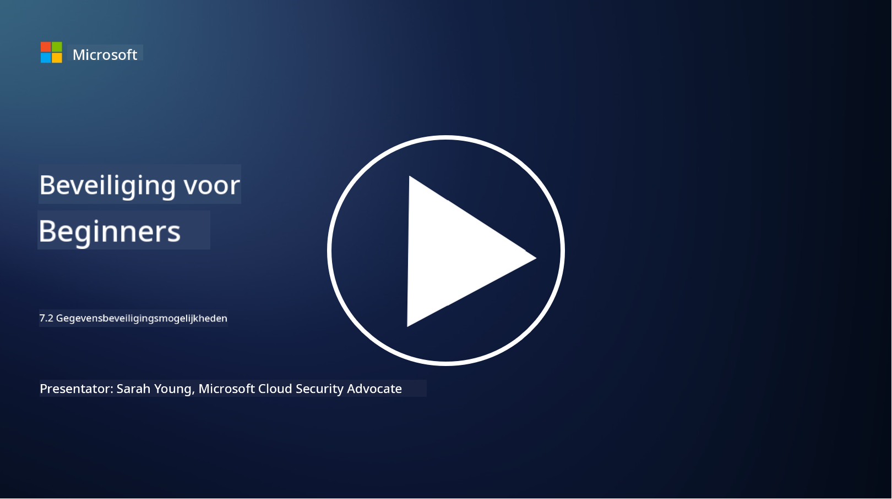

<!--
CO_OP_TRANSLATOR_METADATA:
{
  "original_hash": "50697add9758e54693442d502d2d5f8a",
  "translation_date": "2025-09-04T00:56:45+00:00",
  "source_file": "7.2 Data security capabilities.md",
  "language_code": "nl"
}
-->
# Gegevensbeveiligingsmogelijkheden

In deze sectie bespreken we meer details over de kernhulpmiddelen en mogelijkheden die worden gebruikt bij gegevensbeveiliging:

**Introductie**

In deze les behandelen we:

- Wat is tooling voor het voorkomen van gegevensverlies?

- Wat is tooling voor het beheer van interne risico's?

- Welke tooling is beschikbaar voor gegevensretentie?

## Wat is tooling voor het voorkomen van gegevensverlies?

Tooling voor het voorkomen van gegevensverlies (Data Loss Prevention, DLP) verwijst naar een reeks softwareoplossingen en technologieën die zijn ontworpen om ongeautoriseerde toegang, delen of lekken van gevoelige of vertrouwelijke gegevens binnen een organisatie te voorkomen. Deze tools gebruiken inhoudsinspectie, beleidsafdwinging en monitoring om gevoelige gegevens te identificeren en te beschermen tegen blootstelling of misbruik. Voorbeelden van DLP-producten zijn: Symantec Data Loss Prevention, McAfee Total Protection for Data Loss Prevention, Microsoft 365 DLP**: Integreert met Microsoft 365-applicaties om organisaties te helpen gevoelige gegevens in e-mails, documenten en berichten te identificeren en te beschermen.

## Wat is tooling voor het beheer van interne risico's?

Tooling voor het beheer van interne risico's helpt organisaties bij het identificeren en beperken van risico's die worden veroorzaakt door werknemers, contractanten of partners die mogelijk opzettelijk of onopzettelijk de gegevensbeveiliging in gevaar brengen. Deze tools monitoren gebruikersgedrag, toegangsmodellen en gegevensgebruik om verdachte activiteiten en potentiële interne bedreigingen te detecteren. Voorbeelden van producten voor het beheer van interne risico's zijn: Microsoft Insider Risk Management (onderdeel van Microsoft 365), Forcepoint Insider Threat Data Protection, Varonis Insider Threat Detection.

## Welke tooling is beschikbaar voor gegevensretentie?

Tooling voor gegevensretentie omvat software en oplossingen die zijn ontworpen om het bewaren en verwijderen van gegevens te beheren in overeenstemming met de gegevensretentiebeleid en wettelijke vereisten van een organisatie. Deze tools helpen het proces van het bewaren van gegevens voor specifieke periodes te automatiseren en ze veilig te verwijderen wanneer ze niet langer nodig zijn. Voorbeelden van producten voor gegevensretentie zijn: Veritas Enterprise Vault, Commvault Complete Data Protection, Microsoft data lifecycle management. Deze oplossingen helpen organisaties controle te behouden over gegevensretentie en -verwijdering, zorgen voor naleving van gegevensbeschermingsregels en beheren gegevens efficiënt gedurende hun levenscyclus.

## Verdere lectuur

- [Gids voor Data Security Posture Management (DSPM) | CSA (cloudsecurityalliance.org)](https://cloudsecurityalliance.org/blog/2023/03/31/the-big-guide-to-data-security-posture-management-dspm/)
- [Gegevensverliespreventie op endpoints, apps en services | Microsoft Purview](https://youtu.be/hvqq8L_0kgI)
- [18 Beste Softwaretools voor Gegevensverliespreventie 2023 (Gratis + Betaald) (comparitech.com)](https://www.comparitech.com/data-privacy-management/data-loss-prevention-tools-software/)
- [Gegevensverliespreventie (nist.gov)](https://tsapps.nist.gov/publication/get_pdf.cfm?pub_id=904672)
- [Meer informatie over het beheer van interne risico's | Microsoft Learn](https://learn.microsoft.com/purview/insider-risk-management?WT.mc_id=academic-96948-sayoung)
- [Data Lifecycle Management | IBM](https://www.ibm.com/topics/data-lifecycle-management)
- [Wat is Data Lifecycle Management (DLM)? | 2023 Best Practices (selecthub.com)](https://www.selecthub.com/big-data-analytics/data-lifecycle-management/)

---

**Disclaimer**:  
Dit document is vertaald met behulp van de AI-vertalingsservice [Co-op Translator](https://github.com/Azure/co-op-translator). Hoewel we streven naar nauwkeurigheid, dient u zich ervan bewust te zijn dat geautomatiseerde vertalingen fouten of onnauwkeurigheden kunnen bevatten. Het originele document in zijn oorspronkelijke taal moet worden beschouwd als de gezaghebbende bron. Voor cruciale informatie wordt professionele menselijke vertaling aanbevolen. Wij zijn niet aansprakelijk voor misverstanden of verkeerde interpretaties die voortvloeien uit het gebruik van deze vertaling.