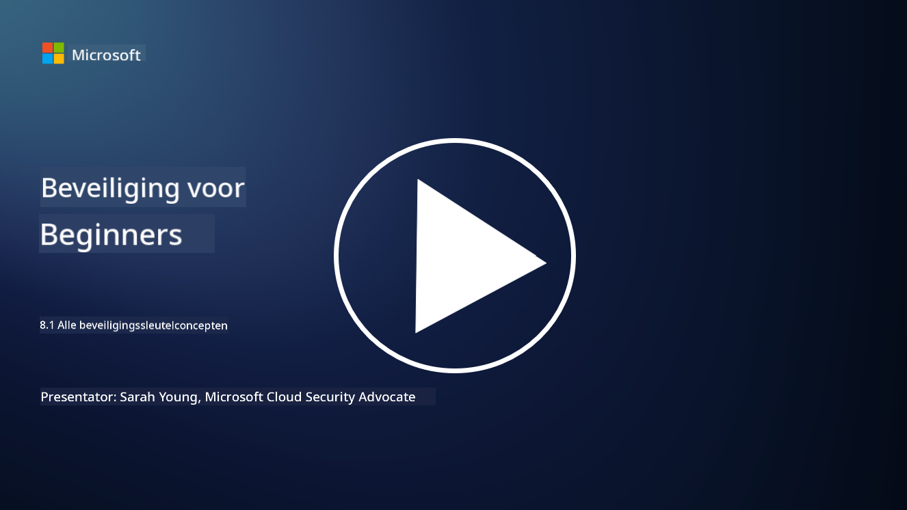

<!--
CO_OP_TRANSLATOR_METADATA:
{
  "original_hash": "66b61d96936cf25d20fcb411d4ce5227",
  "translation_date": "2025-09-03T22:49:00+00:00",
  "source_file": "8.1 AI security key concepts.md",
  "language_code": "nl"
}
-->
# AI-beveiliging: kernconcepten

## Hoe verschilt AI-beveiliging van traditionele cyberbeveiliging?

Het beveiligen van AI-systemen brengt unieke uitdagingen met zich mee in vergelijking met traditionele cyberbeveiliging, voornamelijk door de aard van AI’s leervermogen en besluitvormingsprocessen. Hier zijn enkele belangrijke verschillen:

-   **Data-integriteit**: AI-systemen zijn sterk afhankelijk van data om te leren. Het waarborgen van de integriteit van deze data is cruciaal, omdat aanvallers de data kunnen manipuleren om het gedrag van AI te beïnvloeden, een tactiek die bekend staat als data poisoning.
-   **Modelbeveiliging**: Het besluitvormingsmodel van de AI zelf kan een doelwit zijn. Aanvallers kunnen proberen het model te reverse-engineeren of de zwakke punten ervan te exploiteren om verkeerde of schadelijke beslissingen te veroorzaken.
-   **Adversariële aanvallen**: AI-systemen kunnen kwetsbaar zijn voor adversariële aanvallen, waarbij kleine, vaak onmerkbare wijzigingen in invoergegevens de AI fouten of verkeerde voorspellingen laten maken.
-   **Infrastructuurbeveiliging**: Hoewel traditionele cyberbeveiliging zich ook richt op het beschermen van infrastructuur, hebben AI-systemen vaak extra lagen van complexiteit, zoals cloudgebaseerde diensten of gespecialiseerde hardware, die specifieke beveiligingsmaatregelen vereisen.
-   **Ethische overwegingen**: Het gebruik van AI in beveiliging brengt ethische vraagstukken met zich mee, zoals privacykwesties en de mogelijkheid van vooringenomenheid in besluitvorming, die moeten worden meegenomen in de beveiligingsstrategie.

Kortom, het beveiligen van AI-systemen vereist een andere aanpak die rekening houdt met de unieke aspecten van AI-technologie, waaronder de bescherming van data, modellen en het leerproces van de AI, terwijl ook de ethische implicaties van AI-implementatie worden aangepakt.

AI-beveiliging en traditionele cyberbeveiliging hebben veel overeenkomsten, maar ze verschillen ook door de unieke kenmerken en mogelijkheden van kunstmatige intelligentiesystemen. Hier is hoe ze verschillen:

- **Complexiteit van bedreigingen**: AI-systemen brengen nieuwe lagen van complexiteit in cyberbeveiliging. Traditionele cyberbeveiliging richt zich voornamelijk op bedreigingen zoals malware, phishingaanvallen en netwerkindringingen. AI-systemen kunnen echter kwetsbaar zijn voor aanvallen zoals adversariële aanvallen, data poisoning en modelontwijking, die specifiek gericht zijn op de machine learning-algoritmen zelf.

- **Aanvalsoppervlak**: AI-systemen hebben vaak een groter aanvalsoppervlak in vergelijking met traditionele systemen. Dit komt doordat ze niet alleen afhankelijk zijn van software, maar ook van data en modellen. Aanvallers kunnen de trainingsdata aanvallen, modellen manipuleren of kwetsbaarheden in de algoritmen zelf exploiteren.

- **Aanpasbaarheid van bedreigingen**: AI-systemen kunnen zich aanpassen en leren van hun omgeving, wat ze kwetsbaarder kan maken voor adaptieve en evoluerende bedreigingen. Traditionele cyberbeveiligingsmaatregelen zijn mogelijk niet voldoende om aanvallen te verdedigen die voortdurend evolueren op basis van het gedrag van het AI-systeem.

- **Interpretatie en uitlegbaarheid**: Begrijpen waarom een AI-systeem een bepaalde beslissing heeft genomen is vaak uitdagender in vergelijking met traditionele softwaresystemen. Dit gebrek aan interpretatie en uitlegbaarheid kan het moeilijk maken om aanvallen op AI-systemen effectief te detecteren en te mitigeren.

- **Privacykwesties rondom data**: AI-systemen zijn vaak afhankelijk van grote hoeveelheden data, wat privacyrisico’s kan introduceren als deze niet goed worden behandeld. Traditionele cyberbeveiligingsmaatregelen zijn mogelijk niet voldoende om deze specifieke privacykwesties rondom AI-systemen aan te pakken.

- **Regelgevingsnaleving**: Het regelgevingslandschap voor AI-beveiliging is nog in ontwikkeling, met specifieke regelgeving en standaarden die worden geïntroduceerd om de unieke uitdagingen van AI-systemen aan te pakken. Traditionele cyberbeveiligingskaders moeten mogelijk worden uitgebreid of aangepast om te voldoen aan deze nieuwe regelgeving.

- **Ethische overwegingen**: AI-beveiliging omvat niet alleen het beschermen van systemen tegen kwaadaardige aanvallen, maar ook het waarborgen dat AI-systemen op een ethische en verantwoordelijke manier worden gebruikt. Dit omvat overwegingen zoals eerlijkheid, transparantie en verantwoordelijkheid, die mogelijk minder prominent zijn in traditionele cyberbeveiliging.

## Hoe lijkt AI-beveiliging op het beveiligen van traditionele IT-systemen?

Het beveiligen van AI-systemen deelt verschillende fundamentele principes met traditionele cyberbeveiliging:

-   **Bedreigingsbescherming**: Zowel AI- als traditionele systemen moeten worden beschermd tegen ongeautoriseerde toegang, datamodificatie en vernietiging, evenals andere veelvoorkomende bedreigingen.
-   **Kwetsbaarheidsbeheer**: Veel kwetsbaarheden die traditionele systemen beïnvloeden, zoals softwarefouten of verkeerde configuraties, kunnen ook AI-systemen treffen.
-   **Databeveiliging**: Het beschermen van verwerkte data is cruciaal in beide domeinen om datalekken te voorkomen en vertrouwelijkheid te waarborgen.
-   **Beveiliging van de toeleveringsketen**: Beide soorten systemen zijn vatbaar voor aanvallen op de toeleveringsketen, waarbij een gecompromitteerd onderdeel de beveiliging van het hele systeem kan ondermijnen.

Deze overeenkomsten benadrukken dat hoewel AI-systemen nieuwe beveiligingsuitdagingen introduceren, ze ook de toepassing van gevestigde cyberbeveiligingspraktijken vereisen om robuuste bescherming te garanderen. Het is een combinatie van het benutten van traditionele beveiligingsinzichten en het aanpassen aan de unieke aspecten van AI-technologie.

## Verdere literatuur

- [Not with a Bug, But with a Sticker [Book] (oreilly.com)](https://www.oreilly.com/library/view/not-with-a/9781119883982/)
- [Intro to AI Security Part 1: AI Security 101 | by HarrietHacks | Medium](https://medium.com/@harrietfarlow/intro-to-ai-security-part-1-ai-security-101-b8662a9efe5)
- [Best practices for AI security risk management | Microsoft Security Blog](https://www.microsoft.com/en-us/security/blog/2021/12/09/best-practices-for-ai-security-risk-management/?WT.mc_id=academic-96948-sayoung)
- [OWASP AI Security and Privacy Guide | OWASP Foundation](https://owasp.org/www-project-ai-security-and-privacy-guide/)

---

**Disclaimer**:  
Dit document is vertaald met behulp van de AI-vertalingsservice [Co-op Translator](https://github.com/Azure/co-op-translator). Hoewel we streven naar nauwkeurigheid, dient u zich ervan bewust te zijn dat geautomatiseerde vertalingen fouten of onnauwkeurigheden kunnen bevatten. Het originele document in zijn oorspronkelijke taal moet worden beschouwd als de gezaghebbende bron. Voor cruciale informatie wordt professionele menselijke vertaling aanbevolen. Wij zijn niet aansprakelijk voor misverstanden of verkeerde interpretaties die voortvloeien uit het gebruik van deze vertaling.