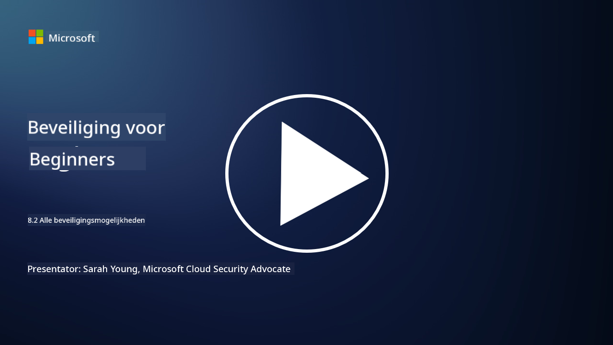

<!--
CO_OP_TRANSLATOR_METADATA:
{
  "original_hash": "b6bb7175672298d1e2f73ba7e0006f95",
  "translation_date": "2025-09-04T01:05:53+00:00",
  "source_file": "8.2 AI security capabilities.md",
  "language_code": "nl"
}
-->
# AI-beveiligingsmogelijkheden

## Welke tools en mogelijkheden hebben we momenteel om AI-systemen te beveiligen?

Er zijn momenteel verschillende tools en mogelijkheden beschikbaar om AI-systemen te beveiligen:

-   **Counterfit**: Een open-source automatiseringstool voor het testen van de beveiliging van AI-systemen, ontworpen om organisaties te helpen bij het uitvoeren van AI-beveiligingsrisicobeoordelingen en het waarborgen van de robuustheid van hun algoritmen.
-   **Adversarial Machine Learning Tools**: Deze tools evalueren de robuustheid van machine learning-modellen tegen aanvallen, zodat kwetsbaarheden kunnen worden geïdentificeerd en aangepakt.
-   **AI Security Toolkits**: Er zijn open-source toolkits beschikbaar die middelen bieden voor het beveiligen van AI-systemen, waaronder bibliotheken en frameworks voor het implementeren van beveiligingsmaatregelen.
-   **Samenwerkingsplatforms**: Partnerschappen tussen bedrijven en AI-gemeenschappen om AI-specifieke beveiligingsscanners en andere tools te ontwikkelen voor het beveiligen van de AI-keten.

Deze tools en mogelijkheden maken deel uit van een groeiend vakgebied dat zich richt op het verbeteren van de beveiliging van AI-systemen tegen verschillende bedreigingen. Ze vertegenwoordigen een combinatie van onderzoek, praktische tools en samenwerking binnen de industrie om de unieke uitdagingen van AI-technologieën aan te pakken.

## Hoe zit het met AI red teaming? Hoe verschilt dat van traditionele security red teaming?

AI red teaming verschilt op verschillende belangrijke punten van traditionele security red teaming:

-   **Focus op AI-systemen**: AI red teaming richt zich specifiek op de unieke kwetsbaarheden van AI-systemen, zoals machine learning-modellen en datastromen, in plaats van op traditionele IT-infrastructuur.
-   **Testen van AI-gedrag**: Het omvat het testen van hoe AI-systemen reageren op ongebruikelijke of onverwachte invoer, wat kwetsbaarheden kan blootleggen die door aanvallers kunnen worden misbruikt.
-   **Onderzoeken van AI-fouten**: AI red teaming kijkt zowel naar kwaadaardige als onbedoelde fouten, waarbij een breder scala aan scenario's en mogelijke systeemfouten wordt overwogen dan alleen beveiligingsinbreuken.
-   **Promptinjectie en contentgeneratie**: AI red teaming omvat ook het onderzoeken van fouten zoals promptinjectie, waarbij aanvallers AI-systemen manipuleren om schadelijke of ongegronde inhoud te genereren.
-   **Ethische en verantwoorde AI**: Het maakt deel uit van het waarborgen van verantwoorde AI door ontwerp, zodat AI-systemen robuust zijn tegen pogingen om ze op ongewenste manieren te laten functioneren.

Kortom, AI red teaming is een uitgebreide praktijk die niet alleen gericht is op het opsporen van beveiligingskwetsbaarheden, maar ook op het testen van andere soorten systeemfouten die specifiek zijn voor AI-technologieën. Het is een cruciaal onderdeel van het ontwikkelen van veiligere AI-systemen door nieuwe risico's die gepaard gaan met AI-implementatie te begrijpen en te beperken.

## Verdere lectuur

 - [Microsoft AI Red Team bouwt aan de toekomst van veiligere AI | Microsoft Security Blog](https://www.microsoft.com/en-us/security/blog/2023/08/07/microsoft-ai-red-team-building-future-of-safer-ai/?WT.mc_id=academic-96948-sayoung)
 - [Aankondiging van Microsoft’s open automatiseringsframework voor red teaming van generatieve AI-systemen | Microsoft Security Blog](https://www.microsoft.com/en-us/security/blog/2024/02/22/announcing-microsofts-open-automation-framework-to-red-team-generative-ai-systems/?WT.mc_id=academic-96948-sayoung)
 - [AI Security Tools: De Open-Source Toolkit | Wiz](https://www.wiz.io/academy/ai-security-tools)

---

**Disclaimer**:  
Dit document is vertaald met behulp van de AI-vertalingsservice [Co-op Translator](https://github.com/Azure/co-op-translator). Hoewel we streven naar nauwkeurigheid, dient u zich ervan bewust te zijn dat geautomatiseerde vertalingen fouten of onnauwkeurigheden kunnen bevatten. Het originele document in de oorspronkelijke taal moet worden beschouwd als de gezaghebbende bron. Voor kritieke informatie wordt professionele menselijke vertaling aanbevolen. Wij zijn niet aansprakelijk voor misverstanden of verkeerde interpretaties die voortvloeien uit het gebruik van deze vertaling.