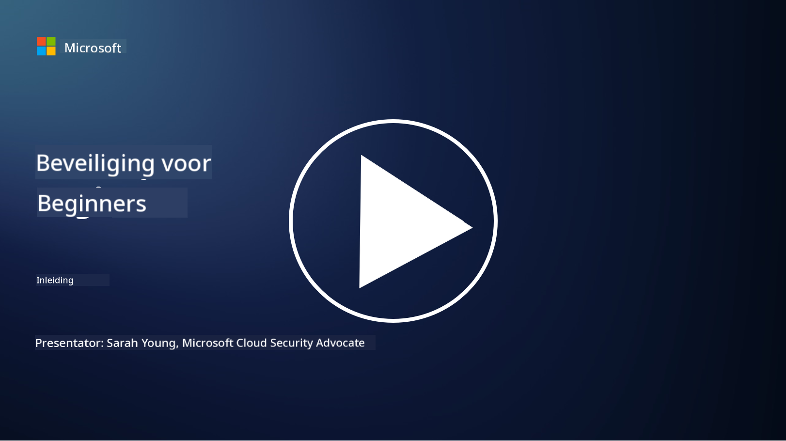

<!--
CO_OP_TRANSLATOR_METADATA:
{
  "original_hash": "79a7e63fa60f649eb3560e1cd7246272",
  "translation_date": "2025-11-18T17:34:26+00:00",
  "source_file": "README.md",
  "language_code": "nl"
}
-->

### 🌐 Meertalige Ondersteuning

#### Ondersteund via GitHub Action (Automatisch & Altijd Up-to-Date)

<!-- CO-OP TRANSLATOR LANGUAGES TABLE START -->
[Arabisch](../ar/README.md) | [Bengaals](../bn/README.md) | [Bulgaars](../bg/README.md) | [Birmaans (Myanmar)](../my/README.md) | [Chinees (Vereenvoudigd)](../zh/README.md) | [Chinees (Traditioneel, Hong Kong)](../hk/README.md) | [Chinees (Traditioneel, Macau)](../mo/README.md) | [Chinees (Traditioneel, Taiwan)](../tw/README.md) | [Kroatisch](../hr/README.md) | [Tsjechisch](../cs/README.md) | [Deens](../da/README.md) | [Nederlands](./README.md) | [Ests](../et/README.md) | [Fins](../fi/README.md) | [Frans](../fr/README.md) | [Duits](../de/README.md) | [Grieks](../el/README.md) | [Hebreeuws](../he/README.md) | [Hindi](../hi/README.md) | [Hongaars](../hu/README.md) | [Indonesisch](../id/README.md) | [Italiaans](../it/README.md) | [Japans](../ja/README.md) | [Koreaans](../ko/README.md) | [Litouws](../lt/README.md) | [Maleis](../ms/README.md) | [Marathi](../mr/README.md) | [Nepalees](../ne/README.md) | [Nigeriaans Pidgin](../pcm/README.md) | [Noors](../no/README.md) | [Perzisch (Farsi)](../fa/README.md) | [Pools](../pl/README.md) | [Portugees (Brazilië)](../br/README.md) | [Portugees (Portugal)](../pt/README.md) | [Punjabi (Gurmukhi)](../pa/README.md) | [Roemeens](../ro/README.md) | [Russisch](../ru/README.md) | [Servisch (Cyrillisch)](../sr/README.md) | [Slowaaks](../sk/README.md) | [Sloveens](../sl/README.md) | [Spaans](../es/README.md) | [Swahili](../sw/README.md) | [Zweeds](../sv/README.md) | [Tagalog (Filipijns)](../tl/README.md) | [Tamil](../ta/README.md) | [Thais](../th/README.md) | [Turks](../tr/README.md) | [Oekraïens](../uk/README.md) | [Urdu](../ur/README.md) | [Vietnamees](../vi/README.md)
<!-- CO-OP TRANSLATOR LANGUAGES TABLE END -->

**Als je extra vertalingen wilt, kun je de ondersteunde talen [hier](https://github.com/Azure/co-op-translator/blob/main/getting_started/supported-languages.md) vinden.**

#### Word lid van onze community 

# 🚀 Cybersecurity voor Beginners – een curriculum

In dit snel veranderende tijdperk van AI-technologie is het nog belangrijker om te begrijpen hoe IT-systemen beveiligd kunnen worden. Deze cursus is ontworpen om je de fundamentele concepten van cyberbeveiliging te leren en je beveiligingskennis een kickstart te geven. Het is onafhankelijk van leveranciers en opgedeeld in korte lessen die ongeveer 30-60 minuten duren. Elke les bevat een korte quiz en links naar verdere verdieping als je meer over het onderwerp wilt leren.

Wat deze cursus behandelt 📚

- 🔐 Basisconcepten van cyberbeveiliging zoals de CIA-driehoek, de verschillen tussen risico's, bedreigingen, enz.
- 🛡️ Begrijpen wat een beveiligingsmaatregel is en in welke vormen deze voorkomt.
- 🌐 Begrijpen wat zero trust is en waarom dit belangrijk is in moderne cyberbeveiliging.
- 🔑 Inzicht in kernconcepten en thema's op het gebied van identiteit, netwerken, beveiligingsoperaties, infrastructuur en gegevensbeveiliging.
- 🔧 Voorbeelden geven van tools die worden gebruikt om beveiligingsmaatregelen te implementeren.

Wat deze cursus niet behandelt 🙅‍♂️

- 🚫 Hoe specifieke beveiligingstools te gebruiken.
- 🚫 Hoe te "hacken" of offensieve beveiliging uit te voeren.
- 🚫 Leren over specifieke nalevingsnormen.

Wanneer je deze cursus hebt afgerond, kun je doorgaan met enkele van onze Microsoft Learn-modules. We raden aan om je leertraject voort te zetten met [Microsoft Security, Compliance, and Identity Fundamentals.](https://learn.microsoft.com/training/paths/describe-concepts-of-security-compliance-identity/?WT.mc_id=academic-96948-sayoung) 

Uiteindelijk kun je overwegen om het [Examen SC-900: Microsoft Security, Compliance, and Identity Fundamentals examen](https://learn.microsoft.com/credentials/certifications/exams/sc-900/?WT.mc_id=academic-96948-sayoung) af te leggen.

> 💁 Als je feedback of suggesties hebt over deze cursus of inhoud die we missen, horen we dat graag van je!

## Overzicht van Modules 📝 
| **Module nummer** | **Naam van de module**                    | **Behandelde concepten**             | **Leerdoelen**                                                                                                  |
|-------------------|-------------------------------------------|--------------------------------------|-----------------------------------------------------------------------------------------------------------------|
| **1.1**           | Basisconcepten beveiliging                | [De CIA-driehoek](https://github.com/microsoft/Security-101/blob/main/1.1%20The%20CIA%20triad%20and%20other%20key%20concepts.md)                        | Leer over vertrouwelijkheid, beschikbaarheid en integriteit. Ook authenticiteit, niet-afwijzing en privacy.     |
| **1.2**           | Basisconcepten beveiliging                | [Veelvoorkomende cyberbeveiligingsbedreigingen](https://github.com/microsoft/Security-101/blob/main/1.2%20Common%20cybersecurity%20threats.md)        | Leer over de veelvoorkomende cyberbeveiligingsbedreigingen voor individuen en organisaties.                     |
| **1.3**           | Basisconcepten beveiliging                | [Begrijpen van risicomanagement](https://github.com/microsoft/Security-101/blob/main/1.3%20Understanding%20risk%20management.md)       | Leer over het beoordelen en begrijpen van risico's – impact/waarschijnlijkheid en het implementeren van maatregelen.                                                                                                               | |
| **1.4**           | Basisconcepten beveiliging                | [Beveiligingspraktijken en documentatie](https://github.com/microsoft/Security-101/blob/main/1.4%20Security%20practices%20and%20documentation.md) | Leer over het verschil tussen beleid, procedures, standaarden en regelgeving/wetten.                            |
| **1.5**           | Basisconcepten beveiliging                | [Zero trust](https://github.com/microsoft/Security-101/blob/main/1.5%20Zero%20trust.md)                           | Leer wat zero trust is en hoe dit de architectuur beïnvloedt. Wat is defense in depth?                          |
| **1.6**           | Basisconcepten beveiliging                | [Het gedeelde verantwoordelijkheidsmodel](https://github.com/microsoft/Security-101/blob/main/1.6%20Shared%20responsibility%20model.md)                           | Wat is het gedeelde verantwoordelijkheidsmodel en hoe beïnvloedt dit cyberbeveiliging?                          |
| **1.7**           | [Eindquiz van de module](https://github.com/microsoft/Security-101/blob/main/1.7%20End%20of%20module%20quiz.md)                        |                                      |                                                                                                                 |
| **2.1**           | Basisprincipes identiteit & toegangsbeheer | [IAM kernconcepten](https://github.com/microsoft/Security-101/blob/main/2.1%20IAM%20key%20concepts.md)                     | Leer over het principe van minimale rechten, scheiding van taken, hoe IAM zero trust ondersteunt.               |
| **2.2**           | Basisprincipes identiteit & toegangsbeheer | [IAM zero trust architectuur](https://github.com/microsoft/Security-101/blob/main/2.2%20IAM%20zero%20trust%20architecture.md)          | Leer hoe identiteit de nieuwe perimeter is voor moderne IT-omgevingen en de bedreigingen die het voorkomt.      |
| **2.3**           | Basisprincipes identiteit & toegangsbeheer | [IAM mogelijkheden](https://github.com/microsoft/Security-101/blob/main/2.3%20IAM%20capabilities.md)                     | Leer over IAM-mogelijkheden en maatregelen om identiteiten te beveiligen.                                       |
| **2.4**           | [Eindquiz van de module](https://github.com/microsoft/Security-101/blob/main/2.4%20End%20of%20module%20quiz.md)                        |                                      |                                                                                                                 |
| **3.1**           | Basisprincipes netwerkbeveiliging         | [Netwerk kernconcepten](https://github.com/microsoft/Security-101/blob/main/3.1%20Networking%20key%20concepts.md)              | Leer over netwerkconcepten (IP-adressering, poortnummers, encryptie, enz.).                                     |
| **3.2**           | Basisprincipes netwerkbeveiliging         | [Netwerk zero trust architectuur](https://github.com/microsoft/Security-101/blob/main/3.2%20Networking%20zero%20trust%20architecture.md)   | Leer hoe netwerken bijdragen aan een E2E ZT-architectuur en de bedreigingen die het voorkomt.                   |
| **3.3**           | Basisprincipes netwerkbeveiliging         | [Netwerkbeveiligingsmogelijkheden](https://github.com/microsoft/Security-101/blob/main/3.3%20Network%20security%20capabilities.md)        | Leer over netwerkbeveiligingstools – firewalls, WAF, DDoS-bescherming, enz.                                     |
| **3.4**           | [Eindquiz van de module](https://github.com/microsoft/Security-101/blob/main/3.4%20End%20of%20module%20quiz.md)                        |                                      |                                                                                                                 |
| **4.1**           | Basisprincipes beveiligingsoperaties      | [SecOps kernconcepten](https://github.com/microsoft/Security-101/blob/main/4.1%20SecOps%20key%20concepts.md)                  | Leer waarom beveiligingsoperaties belangrijk zijn en hoe het verschilt van normale IT-operatieteams.            |
| **4.2**           | Basisprincipes beveiligingsoperaties      | [SecOps zero trust architectuur](https://github.com/microsoft/Security-101/blob/main/4.2%20SecOps%20zero%20trust%20architecture.md)       | Leer hoe SecOps bijdraagt aan een E2E ZT-architectuur en de bedreigingen die het voorkomt.                      |
| **4.3**           | Basisprincipes beveiligingsoperaties      | [SecOps mogelijkheden](https://github.com/microsoft/Security-101/blob/main/4.3%20SecOps%20capabilities.md)                  | Leer over SecOps-tools – SIEM, XDR, enz.                                                                        |
| **4.4**           | [Eindquiz van de module](https://github.com/microsoft/Security-101/blob/main/4.4%20End%20of%20module%20quiz.md)                        |                                      |                                                                                                                 |
| **5.1**           | Basisprincipes applicatiebeveiliging      | [AppSec kernconcepten](https://github.com/microsoft/Security-101/blob/main/5.1%20AppSec%20key%20concepts.md)                  | Leer over AppSec-concepten zoals secure by design, inputvalidatie, enz.                                         |
| **5.2**           | Basisprincipes van applicatiebeveiliging | [AppSec mogelijkheden](https://github.com/microsoft/Security-101/blob/main/5.2%20AppSec%20key%20capabilities.md)                  | Leer over AppSec tools: beveiligingstools voor de pipeline, code scanning, geheimen scannen, enz.               |
| **5.3**           | [Einde module quiz](https://github.com/microsoft/Security-101/blob/main/5.3%20End%20of%20module%20quiz.md)                        |                                      |                                                                                                                 |
| **6.1**           | Basisprincipes van infrastructuurbeveiliging | [Belangrijke concepten infrastructuurbeveiliging](https://github.com/microsoft/Security-101/blob/main/6.1%20Infrastructure%20security%20key%20concepts.md) | Leer over het versterken van systemen, patchen, beveiligingshygiëne, containerbeveiliging.                     |
| **6.2**           | Basisprincipes van infrastructuurbeveiliging | [Mogelijkheden infrastructuurbeveiliging](https://github.com/microsoft/Security-101/blob/main/6.2%20Infrastructure%20security%20capabilities.md) | Leer over tools die kunnen helpen bij infrastructuurbeveiliging, zoals CSPM, containerbeveiliging, enz.         |
| **6.3**           | [Einde module quiz](https://github.com/microsoft/Security-101/blob/main/6.3%20End%20of%20module%20quiz.md)                        |                                      |                                                                                                                 |
| **7.1**           | Basisprincipes van gegevensbeveiliging    | [Belangrijke concepten gegevensbeveiliging](https://github.com/microsoft/Security-101/blob/main/7.1%20Data%20security%20key%20concepts.md)           | Leer over gegevensclassificatie en -bewaring en waarom dit belangrijk is voor een organisatie.                  |
| **7.2**           | Basisprincipes van gegevensbeveiliging    | [Mogelijkheden gegevensbeveiliging](https://github.com/microsoft/Security-101/blob/main/7.2%20Data%20security%20capabilities.md)           | Leer over tools voor gegevensbeveiliging – DLP, risicobeheer binnen de organisatie, gegevensbeheer, enz.        |
| **7.3**           | [Einde module quiz](https://github.com/microsoft/Security-101/blob/main/7.3%20End%20of%20module%20quiz.md)                        |
| **8.1**           | Basisprincipes van AI-beveiliging         | [Belangrijke concepten AI-beveiliging](https://github.com/microsoft/Security-101/blob/main/8.1%20AI%20security%20key%20concepts.md)          | Leer over de verschillen en overeenkomsten tussen traditionele beveiliging en AI-beveiliging.                   |
| **8.2**           | Basisprincipes van AI-beveiliging         | [Mogelijkheden AI-beveiliging](https://github.com/microsoft/Security-101/blob/main/8.2%20AI%20security%20capabilities.md)           | Leer over AI-beveiligingstools en de controles die kunnen worden gebruikt om AI te beveiligen.                  |
| **8.3**           | Basisprincipes van AI-beveiliging         | [Verantwoordelijke AI](https://github.com/microsoft/Security-101/blob/main/8.3%20Responsible%20AI.md)          | Leer wat verantwoordelijke AI is en AI-specifieke risico's waar beveiligingsprofessionals zich bewust van moeten zijn. |
| **8.4**           | [Einde module quiz](https://github.com/microsoft/Security-101/blob/main/8.4%20End%20of%20module%20quiz.md)     

## 🎒 Andere Cursussen 

Ons team biedt ook andere cursussen aan! Bekijk:

### Azure / Edge / MCP / Agents

---

### Generatieve AI Serie

[-9333EA?style=for-the-badge&labelColor=E5E7EB&color=9333EA)](https://github.com/microsoft/Generative-AI-for-beginners-dotnet?WT.mc_id=academic-105485-koreyst)
[-C084FC?style=for-the-badge&labelColor=E5E7EB&color=C084FC)](https://github.com/microsoft/generative-ai-for-beginners-java?WT.mc_id=academic-105485-koreyst)
[-E879F9?style=for-the-badge&labelColor=E5E7EB&color=E879F9)](https://github.com/microsoft/generative-ai-with-javascript?WT.mc_id=academic-105485-koreyst)

---

### Kern Leren

---

### Copilot Serie

## Hulp Nodig

Als je vastloopt of vragen hebt over het bouwen van AI-apps, sluit je aan bij medeleerlingen en ervaren ontwikkelaars in discussies over MCP. Het is een ondersteunende community waar vragen welkom zijn en kennis vrij wordt gedeeld.

Als je productfeedback hebt of fouten tegenkomt tijdens het bouwen, bezoek dan:

---

<!-- CO-OP TRANSLATOR DISCLAIMER START -->
**Disclaimer**:  
Dit document is vertaald met behulp van de AI-vertalingsservice [Co-op Translator](https://github.com/Azure/co-op-translator). Hoewel we streven naar nauwkeurigheid, dient u zich ervan bewust te zijn dat geautomatiseerde vertalingen fouten of onnauwkeurigheden kunnen bevatten. Het originele document in de oorspronkelijke taal moet worden beschouwd als de gezaghebbende bron. Voor kritieke informatie wordt professionele menselijke vertaling aanbevolen. Wij zijn niet aansprakelijk voor eventuele misverstanden of verkeerde interpretaties die voortvloeien uit het gebruik van deze vertaling.
<!-- CO-OP TRANSLATOR DISCLAIMER END -->