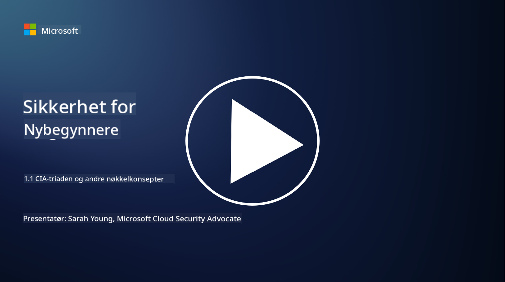
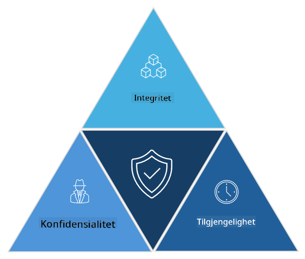

<!--
CO_OP_TRANSLATOR_METADATA:
{
  "original_hash": "16a76f9fa372fb63cffb6d76b855f023",
  "translation_date": "2025-09-04T01:10:26+00:00",
  "source_file": "1.1 The CIA triad and other key concepts.md",
  "language_code": "no"
}
-->
# CIA-triaden og andre viktige konsepter

## Introduksjon

I denne leksjonen skal vi dekke:

 - Hva er cybersikkerhet?
   
 
 - Hva er cybersikkerhetens CIA-triade?

   

 - Hva er autentisitet, uavviselighet og personvern i sammenheng med cybersikkerhet?

## Hva er cybersikkerhet?

Cybersikkerhet, også kjent som informasjonssikkerhet, er praksisen med å beskytte datasystemer, nettverk, enheter og data mot digitale angrep, uautorisert tilgang, skade eller tyveri. Hovedmålet med cybersikkerhet er å sikre konfidensialitet, integritet og tilgjengelighet av digitale eiendeler og informasjon. Cybersikkerhetseksperter designer og implementerer sikkerhetskontroller for å beskytte eiendeler, data og informasjon. Etter hvert som stadig mer av livene våre har blitt digitalisert og online, har cybersikkerhet blitt en topp prioritet for både privatpersoner og organisasjoner.

## Hva er cybersikkerhetens CIA-triade?

Cybersikkerhetens triade refererer til modellen som omfatter de tre hovedhensynene for alt arbeid innen cybersikkerhet eller design av et system/miljø:

### Konfidensialitet

Dette er det aspektet de fleste forbinder med "cybersikkerhet": konfidensialitet handler om å beskytte data og informasjon mot uautoriserte tilgangsforsøk, altså at kun personer som trenger å se informasjonen, har tilgang til den. Ikke all data er like viktig, og data kategoriseres og beskyttes vanligvis basert på hvor mye skade som ville oppstå dersom den havnet i feil hender.

### Integritet

Handler om å beskytte nøyaktigheten og påliteligheten til data i et miljø og forhindre at data blir endret eller manipulert av uautoriserte personer. For eksempel: en student endrer fødselsdatoen sin i førerkortregisteret hos Vegvesenet for å gjøre seg eldre, slik at de kan få førerkortet sitt reprintet med en tidligere fødselsdato for å kjøpe alkohol.

### Tilgjengelighet

Dette er et viktig hensyn innen operasjonell IT, men tilgjengelighet er også avgjørende for cybersikkerhet. Det finnes spesifikke typer angrep som retter seg mot tilgjengelighet, og sikkerhetseksperter må beskytte mot disse (f.eks. distribuerte tjenestenektangrep – DDoS-angrep).

**Cybersikkerhetens CIA-triade**

## Hva er autentisitet, uavviselighet og personvern i sammenheng med cybersikkerhet?

Dette er andre viktige konsepter som handler om å sikre systemers og datas pålitelighet og sikkerhet:

**Autentisitet** - refererer til forsikringen om at informasjonen, kommunikasjonen eller enheten du interagerer med, er ekte og ikke har blitt manipulert eller endret av uautoriserte parter.

**Uavviselighet** - er konseptet som sikrer at en part ikke kan nekte for sin involvering eller ektheten av en transaksjon eller kommunikasjon. Det forhindrer noen fra å hevde at de ikke sendte en melding eller utførte en bestemt handling når det finnes bevis som sier det motsatte.

**Personvern** - handler om å beskytte sensitiv og personlig identifiserbar informasjon mot uautorisert tilgang, bruk, deling eller manipulering. Det innebærer å kontrollere hvem som har tilgang til personopplysninger og hvordan disse dataene samles inn, lagres og deles.

## Tilleggslesing

[Hva er informasjonssikkerhet (InfoSec)? | Microsoft Security](https://www.microsoft.com/security/business/security-101/what-is-information-security-infosec#:~:text=Three%20pillars%20of%20information%20security%3A%20the%20CIA%20triad,as%20guiding%20principles%20for%20implementing%20an%20InfoSec%20plan.)

---

**Ansvarsfraskrivelse**:  
Dette dokumentet er oversatt ved hjelp av AI-oversettelsestjenesten [Co-op Translator](https://github.com/Azure/co-op-translator). Selv om vi tilstreber nøyaktighet, vennligst vær oppmerksom på at automatiske oversettelser kan inneholde feil eller unøyaktigheter. Det originale dokumentet på sitt opprinnelige språk bør anses som den autoritative kilden. For kritisk informasjon anbefales profesjonell menneskelig oversettelse. Vi er ikke ansvarlige for eventuelle misforståelser eller feiltolkninger som oppstår ved bruk av denne oversettelsen.