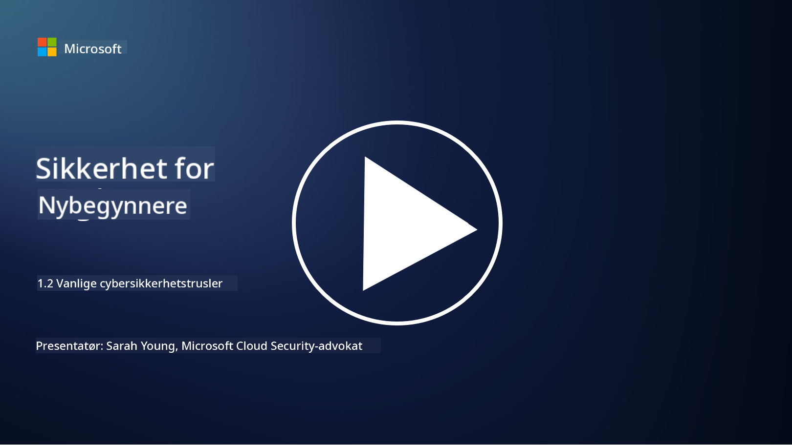

<!--
CO_OP_TRANSLATOR_METADATA:
{
  "original_hash": "6fc3030323139d7134a4ca9d03eccac9",
  "translation_date": "2025-09-03T23:25:05+00:00",
  "source_file": "1.2 Common cybersecurity threats.md",
  "language_code": "no"
}
-->
# Vanlige cybersikkerhetstrusler

## Introduksjon

I denne leksjonen skal vi dekke:

- Hva er en cybersikkerhetstrussel?

- Hvorfor ønsker ondsinnede aktører å kompromittere data og IT-systemer?

- Hva er de vanligste typene cybersikkerhetstrusler?

- Hva er MITRE ATT&CK-rammeverket?

- Hvor kan jeg holde meg oppdatert på landskapet for cybersikkerhetstrusler?

## Hva er en cybersikkerhetstrussel?

En cybersikkerhetstrussel refererer til enhver potensiell fare eller risiko som kan kompromittere konfidensialiteten, integriteten eller tilgjengeligheten til data eller IT-systemer. Disse truslene kommer fra ondsinnede aktører som forsøker å utnytte sårbarheter for å få uautorisert tilgang, stjele sensitiv informasjon, forstyrre operasjoner eller skade enkeltpersoner, organisasjoner eller til og med hele nasjoner. Cybersikkerhetstrusler kan ta ulike former og rette seg mot forskjellige aspekter av digitale systemer og data.

## Hvorfor ønsker ondsinnede aktører å kompromittere data og IT-systemer?

Ondsinnede aktører kompromitterer data og IT-systemer av ulike grunner, ofte drevet av personlig vinning, ideologiske motiver eller ønsket om å skape forstyrrelser. Å forstå disse motivasjonene kan hjelpe organisasjoner og enkeltpersoner med å bedre forsvare seg mot cybertrusler. Noen vanlige grunner til at ondsinnede aktører utfører cyberangrep inkluderer:

1. **Økonomisk vinning**: Mange angrep er drevet av ønsket om økonomisk gevinst. Ondsinnede aktører kan stjele sensitiv informasjon som kredittkortnumre, bankkontodetaljer eller personlig identifikasjonsinformasjon for å begå svindel, identitetstyveri, kreve løsepenger eller selge den stjålne informasjonen på det mørke nettet.

2. **Spionasje**: Nasjonalstater, konkurrenter eller andre enheter kan utføre cyber-spionasje for å stjele sensitiv informasjon fra myndigheter, bedrifter eller forskningsinstitusjoner for politiske, økonomiske eller militære fordeler.

3. **Forstyrrelse og sabotasje**: Noen angrep har som mål å forstyrre kritisk infrastruktur, tjenester eller operasjoner av politiske eller ideologiske grunner. Disse angrepene kan føre til omfattende kaos, økonomiske tap og skade på omdømme.

4. **Ideologiske motiver**: Aktivister og grupper med ideologiske eller politiske motiver kan kompromittere systemer for å skape oppmerksomhet rundt visse saker, fremme sine overbevisninger eller protestere mot spesifikke handlinger eller organisasjoner.

5. **Utilsiktede handlinger**: Ikke alle ondsinnede handlinger er bevisste; noen individer kan uvitende bidra til cybertrusler ved å bli offer for sosial manipulering eller være en del av et kompromittert nettverk.

Til syvende og sist kan motivasjonene for å kompromittere data og IT-systemer variere mye, og konsekvensene av disse angrepene kan være alvorlige. Det er viktig for enkeltpersoner, organisasjoner og myndigheter å ta cybersikkerhet på alvor og implementere tiltak for å beskytte seg mot disse truslene.

## Hva er de vanligste typene cybersikkerhetstrusler?

Det finnes flere vanlige typer cyberangrep som ondsinnede aktører bruker for å kompromittere systemer, stjele data og skape forstyrrelser. Her er noen av de mest utbredte typene på tidspunktet for skrivingen:

1. **Phishing**:

Phishing innebærer å sende villedende e-poster eller meldinger som ser ut til å komme fra legitime kilder for å lure mottakere til å avsløre sensitiv informasjon, som passord, kredittkortnumre eller personlige detaljer. Phishing kan også føre ofre til ondsinnede nettsteder eller få dem til å laste ned skadelig programvare.

2. **Malware**:

Malware (ondsinnet programvare) omfatter en rekke skadelige programmer som er designet for å infisere systemer, stjele data eller forårsake skade. Typer av malware inkluderer:

- **Ransomware**: Krypterer filer og krever løsepenger for dekryptering.

- **Trojanere**: Forkledd som legitim programvare, gir de angripere uautorisert tilgang.

- **Virus**: Selv-replikerende programmer som fester seg til filer og sprer seg.

- **Ormer**: Selv-replikerende programmer som sprer seg gjennom nettverk.

3. **Denial of Service (DoS) og Distributed Denial of Service (DDoS)**:

DoS-angrep overbelaster et målsystem, slik at det blir utilgjengelig for brukere. DDoS-angrep involverer bruk av et nettverk av kompromitterte enheter for å oversvømme et mål med trafikk, noe som gjør det vanskelig for systemet å fungere ordentlig eller kan stoppe systemet helt.

4. **SQL Injection**:

I dette angrepet manipulerer angripere en webapplikasjons inndatafelt for å injisere ondsinnede SQL-spørringer, og kan potensielt få uautorisert tilgang til databaser og sensitiv informasjon.

5. **Cross-Site Scripting (XSS)**:

Angripere injiserer ondsinnede skript i webapplikasjoner, som deretter utføres av intetanende brukeres nettlesere. Dette kan føre til tyveri av brukerdata og/eller spredning av skadelig programvare.

6. **Sosial manipulering**:

Sosial manipulering utnytter menneskelig psykologi for å manipulere individer til å avsløre konfidensiell informasjon eller utføre handlinger som kompromitterer sikkerheten.

7. **Zero-Day (0day) Exploits**:

Disse angrepene retter seg mot sårbarheter i programvare eller maskinvare som ennå ikke er kjent for leverandøren eller offentligheten. Angripere utnytter disse sårbarhetene før det utvikles oppdateringer. Mange organisasjoner bekymrer seg for zero-days siden det ikke finnes noen oppdatering for dem, men de er ikke like vanlige som de andre angrepene på denne listen. Når en zero-day oppdages, vil sikkerhetsforskere jobbe raskt for å lage en oppdatering, og derfor er zero-days generelt kortvarige.

8. **Angrep på legitimasjon**:

Disse angrepene inkluderer brute force-angrep, der angripere gjentatte ganger gjetter passord, og credential stuffing-angrep, der stjålne legitimasjoner fra ett nettsted brukes til å forsøke tilgang på andre nettsteder.

## Hva er MITRE ATT&CK-rammeverket?

[MITRE ATT&CK-rammeverket](https://attack.mitre.org/) (Adversarial Tactics, Techniques, and Common Knowledge) er et rammeverk som katalogiserer og kategoriserer taktikker, teknikker og prosedyrer (TTP-er) som motstandere bruker under cyberangrep. Rammeverket ble opprettet av MITRE Corporation, en ideell organisasjon som driver forsknings- og utviklingssentre for ulike myndighetsorganer.

MITRE ATT&CK-rammeverket gir en standardisert måte å beskrive og analysere cybertrusler på, slik at cybersikkerhetsprofesjonelle bedre kan forstå og forsvare seg mot ulike angrepsteknikker. Det brukes mye av sikkerhetsteam, trusseljegere og hendelsesrespondenter til:

1. **Forstå motstanders atferd**: Rammeverket dokumenterer virkelige angrepsatferder og beskriver trinnene angripere tar fra første inntrenging til oppnåelse av mål. Det dekker et bredt spekter av angrepsteknikker brukt av ulike trusselgrupper.

2. **Planlegge og implementere forsvarsstrategier**: Sikkerhetsteam kan bruke rammeverket til å utvikle proaktive forsvarsstrategier som samsvarer med de spesifikke taktikkene og teknikkene motstandere kan bruke.

3. **Hendelseshåndtering og trusseljakt**: Når man undersøker hendelser eller utfører trusseljakt, kan sikkerhetsprofesjonelle referere til rammeverket for å identifisere og redusere spesifikke teknikker brukt av angripere.

MITRE ATT&CK-rammeverket er organisert i matriser som grupperer angrepsteknikker basert på spesifikke plattformer og miljøer, som Windows, macOS, Linux og skytjenester. Hver matrise er delt inn i taktikker (høynivåmål) og teknikker (spesifikke metoder brukt for å oppnå disse målene). For hver teknikk gir rammeverket informasjon om hvordan den fungerer, potensielle mottiltak og relevante referanser til virkelige trusselaktører som har brukt teknikken.

Rammeverket oppdateres og utvides kontinuerlig etter hvert som ny trusselinformasjon samles inn og cybersikkerhetslandskapet utvikler seg. Det er en verdifull ressurs for å styrke en organisasjons cybersikkerhet ved å gi en dypere forståelse av hvordan angripere opererer og hvordan man kan forsvare seg mot deres taktikker.

## Hvor kan jeg holde meg oppdatert på landskapet for cybersikkerhetstrusler?

Det finnes mange kilder som kan brukes for å holde seg oppdatert på cybersikkerhetstrusler. Her er et utvalg:

- [Open Web Application Security Project (OWASP) top 10 vulnerabilities](https://owasp.org/Top10/)
- [Common Vulnerabilities and Exposures (CVEs)](https://www.bing.com/ck/a?!&&p=53df6007f017bca2JmltdHM9MTY5MjU3NjAwMCZpZ3VpZD0zYmY4N2RiYS1jYWI1LTYwMDgtMWY1YS02ZmYyY2JjNjYxZWUmaW5zaWQ9NTc2OQ&ptn=3&hsh=3&fclid=3bf87dba-cab5-6008-1f5a-6ff2cbc661ee&psq=cve&u=a1aHR0cHM6Ly9iaW5nLmNvbS9hbGluay9saW5rP3VybD1odHRwcyUzYSUyZiUyZmN2ZS5taXRyZS5vcmclMmYmc291cmNlPXNlcnAtcnImaD1BZXN4S0VBWTNnbGhNZEFpd3daMlNSZkZQNTlrODhIUnYxRUtlSkY1RTk0JTNkJnA9a2NvZmZjaWFsd2Vic2l0ZQ&ntb=1 "Common Vulnerabilities and Exposures")
- [Microsoft Security Response Center blogs](https://msrc.microsoft.com/blog/)
- [National Institute of Standards and Technology (NIST)](https://www.dhs.gov/topics/cybersecurity): NIST gir ressurser, varsler og siste oppdateringer om potensielle cybersikkerhetstrusler.
- [Cybersecurity and Infrastructure Security Agency (CISA)](https://www.cisa.gov/resources-tools/resources/free-cybersecurity-services-and-tools): CISA gir cybersikkerhetsressurser og beste praksis for bedrifter, myndighetsorganer og andre organisasjoner. CISA deler oppdatert informasjon om høyprofilerte typer sikkerhetsaktivitet som påvirker samfunnet generelt, samt dyptgående analyser av nye og utviklende cybertrusler.
- [National Cybersecurity Center of Excellence (NCCoE)](https://www.dhs.gov/topics/cybersecurity): NCCoE er et knutepunkt som gir praktiske cybersikkerhetsløsninger som kan brukes i virkelige situasjoner.
- [US-CERT](https://www.cisa.gov/resources-tools/resources/free-cybersecurity-services-and-tools): United States Computer Emergency Readiness Team (US-CERT) gir en rekke cybersikkerhetsressurser, inkludert varsler, tips og mer.
- Ditt lands Cyber Emergency Response Team (CERT)

---

**Ansvarsfraskrivelse**:  
Dette dokumentet er oversatt ved hjelp av AI-oversettelsestjenesten [Co-op Translator](https://github.com/Azure/co-op-translator). Selv om vi streber etter nøyaktighet, vær oppmerksom på at automatiserte oversettelser kan inneholde feil eller unøyaktigheter. Det originale dokumentet på sitt opprinnelige språk bør anses som den autoritative kilden. For kritisk informasjon anbefales profesjonell menneskelig oversettelse. Vi er ikke ansvarlige for misforståelser eller feiltolkninger som oppstår ved bruk av denne oversettelsen.