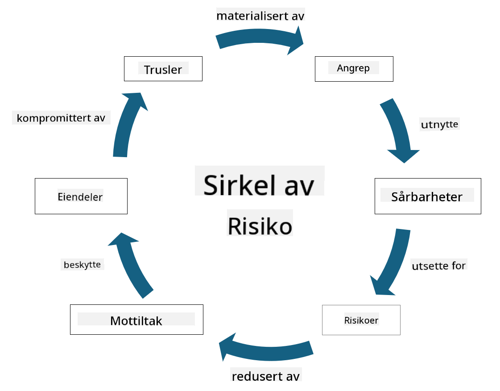

<!--
CO_OP_TRANSLATOR_METADATA:
{
  "original_hash": "fcca304f072cabf206388199e8e2e578",
  "translation_date": "2025-09-04T01:31:06+00:00",
  "source_file": "1.3 Understanding risk management.md",
  "language_code": "no"
}
-->
# Forstå risikostyring

## Introduksjon

I denne leksjonen skal vi dekke:

 - Definisjoner av ofte brukte sikkerhetstermer
   
 - Typer sikkerhetskontroller

 - Vurdering av sikkerhetsrisikoer

## Definisjoner av ofte brukte sikkerhetstermer

Disse begrepene er grunnleggende konsepter innen cybersikkerhet og risikostyring. La oss bryte ned hvert begrep og hvordan de henger sammen:

1. **Trusselaktør**:

En trusselaktør er en person, gruppe, organisasjon eller automatisert system som har potensial til å utnytte sårbarheter i et system eller nettverk for å forårsake skade. Trusselaktører kan være hackere, malware-forfattere, misfornøyde ansatte eller andre enheter som utgjør en risiko for informasjon og teknologisystemer.

2. **Trussel**:

En trussel er en potensiell hendelse eller handling som kan utnytte sårbarheter i et system og forårsake skade på en ressurs. Trusler kan inkludere handlinger som hacking, datainnbrudd, tjenestenektangrep og mer. Trusler representerer "hva" som kan forårsake skade på en organisasjons ressurser.

3. **Sårbarhet**:

En sårbarhet er en svakhet eller feil i et systems design, implementering eller konfigurasjon som kan utnyttes av en trusselaktør for å kompromittere systemets sikkerhet. Sårbarheter kan finnes i programvare, maskinvare, prosesser eller menneskelig atferd. Å identifisere og adressere sårbarheter er avgjørende for å minimere risikoen for vellykkede angrep.

4. **Risiko**:

Risiko er potensialet for tap, skade eller ødeleggelse som oppstår fra samspillet mellom en trussel og en sårbarhet. Det er sannsynligheten for at en trusselaktør vil utnytte en sårbarhet og forårsake en negativ innvirkning. Risiko vurderes ofte basert på potensielle konsekvenser og sannsynlighet for at det skjer.

5. **Ressurs**:

En ressurs er alt av verdi som en organisasjon ønsker å beskytte. Ressurser kan inkludere fysiske objekter (som datamaskiner og servere), data (kundeinformasjon, finansielle opplysninger), immaterielle eiendeler (forretningshemmeligheter, patenter) og til og med menneskelige ressurser (ansattes ferdigheter og kunnskap). Å beskytte ressurser er et sentralt mål innen cybersikkerhet.

6. **Eksponering**:

Eksponering refererer til tilstanden av å være sårbar for potensielle trusler. Det oppstår når en sårbarhet eksisterer som kan utnyttes av en trusselaktør. Eksponering fremhever risikoen forbundet med å ha sårbarheter i et system eller nettverk.

7. **Kontroll**:

En kontroll er et tiltak som er satt i verk for å redusere risikoen forbundet med sårbarheter og trusler. Kontroller kan være tekniske, prosessuelle eller administrative. De er designet for å forhindre, oppdage eller begrense potensielle trusler og sårbarheter. Eksempler inkluderer brannmurer, tilgangskontroller, kryptering, sikkerhetspolicyer og opplæring av ansatte.

For å oppsummere forholdet mellom disse begrepene: Trusselaktører utnytter sårbarheter for å utføre trusler, som kan føre til risikoer som har potensial til å skade verdifulle ressurser. Eksponering oppstår når sårbarheter er til stede, og kontroller settes i verk for å redusere risikoen ved å forhindre eller begrense virkningen av trusler på ressurser. Denne rammeverket danner grunnlaget for risikostyring innen cybersikkerhet, og veileder organisasjoner i å identifisere, vurdere og håndtere potensielle risikoer for deres informasjonssystemer og ressurser.

## Typer sikkerhetskontroller

Sikkerhetskontroller er tiltak eller beskyttelser som implementeres for å beskytte informasjonssystemer og ressurser mot ulike trusler og sårbarheter. De kan klassifiseres i flere kategorier basert på deres fokus og formål. Her er noen vanlige typer sikkerhetskontroller:

1. **Administrative kontroller**:

Disse kontrollene er knyttet til policyer, prosedyrer og retningslinjer som styrer organisasjonens sikkerhetspraksis og brukeratferd.

- Sikkerhetspolicyer og prosedyrer: Dokumenterte retningslinjer som definerer hvordan sikkerhet opprettholdes i en organisasjon.

- Sikkerhetsbevissthet og opplæring: Programmer for å utdanne ansatte om beste praksis innen sikkerhet og potensielle trusler.

- Hendelseshåndtering: Planer for å respondere på og begrense sikkerhetshendelser.

2. **Tekniske kontroller**:

Tekniske kontroller innebærer bruk av teknologi for å håndheve sikkerhetstiltak og beskytte systemer og data. Eksempler på tekniske kontroller er:

- Tilgangskontroller: Tiltak som begrenser brukeres tilgang til ressurser basert på deres roller og tillatelser.

- Kryptering: Konvertering av data til et sikkert format for å forhindre uautorisert tilgang.

- Brannmurer: Nettverkssikkerhetsenheter som filtrerer og kontrollerer innkommende og utgående trafikk.

- Intrusjonsdeteksjon og -forebyggingssystemer (IDPS): Verktøy som overvåker nettverkstrafikk for mistenkelig aktivitet.

- Antivirus og antimalware-programvare: Programmer som oppdager og fjerner skadelig programvare.

- Autentiseringsmekanismer: Metoder for å verifisere brukeres identitet, som passord, biometriske data og flerfaktorautentisering.

- Patch-håndtering: Regelmessig oppdatering av programvare for å adressere kjente sårbarheter.

3. **Fysiske kontroller**:

Fysiske kontroller er tiltak for å beskytte fysiske ressurser og fasiliteter.

- Sikkerhetsvakter og adgangskontrollpersonell: Personell som overvåker og kontrollerer tilgang til fysiske områder.

- Overvåkningskameraer: Videoovervåkingssystemer for å overvåke og registrere aktiviteter.

- Låser og fysiske barrierer: Fysiske tiltak for å begrense tilgang til sensitive områder.

- Miljøkontroller: Tiltak for å regulere temperatur, fuktighet og andre miljøfaktorer som påvirker utstyr og datasentre.

4. **Operasjonelle kontroller**:

Disse kontrollene er knyttet til daglige operasjoner og aktiviteter som sikrer kontinuerlig sikkerhet for systemer.

- Endringshåndtering: Prosesser for å spore og godkjenne endringer i systemer og konfigurasjoner.

- Backup og katastrofegjenoppretting: Planer for sikkerhetskopiering og gjenoppretting av data ved systemfeil eller katastrofer.

- Logging og revisjon: Overvåking og registrering av systemaktiviteter for sikkerhet og samsvar.

- Sikker kodingspraksis: Retningslinjer for å skrive programvare som minimerer sårbarheter.

5. **Juridiske og regulatoriske kontroller**:

Disse kontrollene sikrer samsvar med relevante lover, forskrifter og industristandarder. Standardene en organisasjon må følge avhenger av jurisdiksjon, bransje og andre faktorer.

- Databeskyttelsesreguleringer: Samsvar med lover som GDPR, HIPAA og CCPA.

- Bransjespesifikke standarder: Overholdelse av standarder som PCI DSS for sikkerhet av betalingskortdata.

Disse kategoriene av sikkerhetskontroller jobber sammen for å skape en omfattende sikkerhetsstrategi for organisasjoner, og hjelper dem med å beskytte systemer, data og ressurser mot et bredt spekter av trusler.

## Vurdering av sikkerhetsrisikoer

Noen sikkerhetsprofesjonelle mener at risikostyring er noe som overlates til risikoprofesjonelle, men det er viktig for enhver sikkerhetsprofesjonell å forstå prosessen med å håndtere sikkerhetsrisiko for å kunne uttrykke risiko på en måte resten av organisasjonen kan forstå og handle på.

Organisasjoner må kontinuerlig vurdere sikkerhetsrisikoer og avgjøre hvilke tiltak (eller ingen tiltak) som skal tas mot risikoer for virksomheten. Nedenfor er en oversikt over hvordan dette vanligvis gjøres. Merk at denne prosessen vanligvis utføres av flere forskjellige team innen en organisasjon; det er sjelden at ett team har ansvar for hele risikostyringsprosessen.

1. **Identifisere ressurser og trusler**:

Organisasjonen identifiserer ressursene den ønsker å beskytte. Dette kan inkludere data, systemer, maskinvare, programvare, immaterielle eiendeler og mer. Deretter identifiserer de potensielle trusler som kan målrette disse ressursene.

2. **Vurdere sårbarheter**:

Organisasjonen identifiserer deretter sårbarheter eller svakheter i systemer eller prosesser som kan utnyttes av trusler. Disse sårbarhetene kan skyldes programvarefeil, feilkonfigurasjoner, mangel på sikkerhetskontroller og menneskelige feil.

3. **Sannsynlighetsvurdering**:

Organisasjonen vurderer deretter sannsynligheten for at hver trussel oppstår. Dette innebærer å ta hensyn til historiske data, trusselinformasjon, bransjetrender og interne faktorer. Sannsynlighet kan kategoriseres som lav, middels eller høy basert på sannsynligheten for at trusselen materialiserer seg.

4. **Konsekvensvurdering**:

Deretter bestemmer organisasjonen den potensielle konsekvensen av hver trussel hvis den skulle utnytte en sårbarhet. Konsekvenser kan omfatte økonomiske tap, driftsforstyrrelser, omdømmeskader, juridiske konsekvenser og mer. Konsekvenser kan også kategoriseres som lav, middels eller høy basert på potensielle resultater.

5. **Risikoberegning**:

Sannsynlighets- og konsekvensvurderingene kombineres for å beregne det totale risikonivået for hver identifisert trussel. Dette gjøres ofte ved hjelp av en risikomatrise som tildeler numeriske verdier eller kvalitative beskrivelser til sannsynlighets- og konsekvensnivåer. Det resulterende risikonivået hjelper med å prioritere hvilke risikoer som trenger umiddelbar oppmerksomhet.

6. **Prioritering og beslutningstaking**:

Organisasjonen prioriterer deretter risikoer ved å fokusere på de med høyest kombinerte sannsynlighets- og konsekvensverdier. Dette gjør det mulig å fordele ressurser og implementere kontroller mer effektivt. Høyrisiko trusler krever umiddelbar oppmerksomhet, mens lavrisiko trusler kan adresseres over tid.

7. **Risikobehandling**:

Basert på risikovurderingen bestemmer organisasjonen hvordan hver risiko skal håndteres eller reduseres. Dette kan innebære å implementere sikkerhetskontroller, overføre risiko gjennom forsikring, eller akseptere visse nivåer av gjenværende risiko hvis de anses som håndterbare/for kostbare å fikse/etc.

8. **Kontinuerlig overvåking og gjennomgang**:

Risikovurdering er ikke en engangshendelse. Den bør gjennomføres periodisk eller når det skjer betydelige endringer i organisasjonens miljø. Kontinuerlig overvåking sikrer at nye trusler, sårbarheter eller endringer i forretningslandskapet blir tatt i betraktning.

Ved å vurdere sikkerhetsrisikoer på en strukturert måte kan organisasjoner ta informerte beslutninger om ressursfordeling, sikkerhetskontroller og overordnede risikostyringsstrategier. Målet er å redusere organisasjonens totale risikoeksponering samtidig som sikkerhetsinnsatsen tilpasses organisasjonens forretningsmål og strategier.

---

**Ansvarsfraskrivelse**:  
Dette dokumentet er oversatt ved hjelp av AI-oversettelsestjenesten [Co-op Translator](https://github.com/Azure/co-op-translator). Selv om vi tilstreber nøyaktighet, vennligst vær oppmerksom på at automatiske oversettelser kan inneholde feil eller unøyaktigheter. Det originale dokumentet på sitt opprinnelige språk bør anses som den autoritative kilden. For kritisk informasjon anbefales profesjonell menneskelig oversettelse. Vi er ikke ansvarlige for eventuelle misforståelser eller feiltolkninger som oppstår ved bruk av denne oversettelsen.