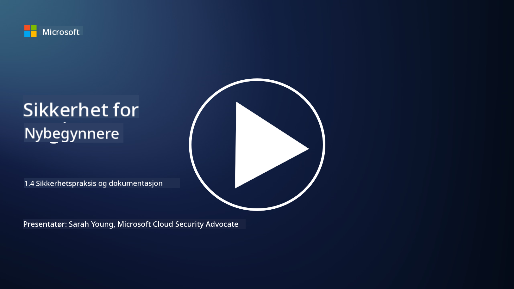

<!--
CO_OP_TRANSLATOR_METADATA:
{
  "original_hash": "d33500902124e52870935bdce4546fcc",
  "translation_date": "2025-09-04T00:20:25+00:00",
  "source_file": "1.4 Security practices and documentation.md",
  "language_code": "no"
}
-->
# Sikkerhetspraksis og dokumentasjon

Du har kanskje hørt uttrykkene "sikkerhetspolicy", "sikkerhetsstandard" osv. brukt før, men realiteten er at mange cybersikkerhetsprofesjonelle ikke bruker dem riktig. I denne delen vil vi forklare hva hvert av disse uttrykkene betyr og hvorfor en organisasjon ville benytte seg av dem.

## Introduksjon

I denne leksjonen skal vi dekke:

 - Hva er en sikkerhetspolicy?
   
 - Hva er en sikkerhetsstandard?

   

 - Hva er en sikkerhetsbaseline?

   

 - Hva er en sikkerhetsveiledning?
 - Hva er en sikkerhetsprosedyre?

   

 - Hva er lover og forskrifter i cybersikkerhetskontekst?

Disse begrepene brukes ofte i cybersikkerhetssammenheng for å definere ulike nivåer av sikkerhetsdokumentasjon og praksis innen en organisasjon. La oss klargjøre hvert begrep:

## Hva er en sikkerhetspolicy?

En sikkerhetspolicy er et overordnet dokument som beskriver en organisasjons overordnede sikkerhetsmål, prinsipper og retningslinjer. Den gir et rammeverk for å ta sikkerhetsrelaterte beslutninger og setter tonen for organisasjonens sikkerhetsinnstilling. Sikkerhetspolicyer dekker vanligvis emner som akseptabel bruk av ressurser, databeskyttelse, tilgangskontroll, hendelseshåndtering og mer. En policy er uavhengig av løsninger og teknologi. Et eksempel på en sikkerhetspolicy som mange vil være kjent med, er en organisasjons policy for akseptabel bruk.

## Hva er en sikkerhetsstandard?

En sikkerhetsstandard er et mer detaljert og spesifikt dokument som gir retningslinjer og krav for implementering av sikkerhetskontroller og tiltak innen en organisasjon. Standarder er mer konkrete og tekniske enn policyer, og gir spesifikke instruksjoner og anbefalinger for konfigurasjon og vedlikehold av systemer, nettverk og prosesser for å oppnå sikkerhetsmål. Et eksempel på en sikkerhetsstandard kan være _"All intern data må krypteres både i hvilemodus og under overføring."_

## Hva er en sikkerhetsbaseline?

En sikkerhetsbaseline er et sett med minimumskonfigurasjoner for sikkerhet som anses som essensielle for et bestemt system, en applikasjon eller et miljø på et gitt tidspunkt. Den definerer et utgangspunkt for sikkerhet som bør implementeres på tvers av alle relevante instanser. Sikkerhetsbaseliner bidrar til å sikre konsistens og et visst nivå av sikkerhet i hele organisasjonens IT-infrastruktur. Et eksempel på en sikkerhetsbaseline kan være _"Azure VMer må ikke ha direkte tilgang til Internett."_

## Hva er en sikkerhetsveiledning?

En sikkerhetsveiledning er et dokument som gir anbefalinger og råd når en spesifikk sikkerhetsstandard ikke gjelder. Veiledninger forsøker å håndtere "gråsoner" som oppstår når en standard ikke dekker, eller bare delvis dekker et emne.

## Hva er en sikkerhetsprosedyre?

En sikkerhetsprosedyre er en detaljert steg-for-steg-guide som beskriver de spesifikke handlingene og oppgavene som må utføres for å gjennomføre en sikkerhetsrelatert prosess eller oppgave. Prosedyrene er praktiske og handlingsorienterte dokumenter som gir en klar sekvens av handlinger som skal følges under hendelseshåndtering, systemvedlikehold, brukeropplæring og andre sikkerhetsrelaterte aktiviteter. Et eksempel på en sikkerhetsprosedyre kan være _"Når en P1-sikkerhetshendelse genereres av Microsoft Sentinel, må sikkerhetsoperasjonssenteret (SOC) umiddelbart informere den på vakt sikkerhetsansvarlige og sende detaljene om hendelsen til dem."_

Oppsummert representerer disse begrepene ulike nivåer av dokumentasjon og veiledning innen en organisasjons cybersikkerhetsrammeverk. Sikkerhetspolicyer setter de overordnede målene, standarder gir detaljerte krav, baseliner etablerer minimumskonfigurasjoner, veiledninger gir beste praksis, og prosedyrer gir handlingsrettede trinn for sikkerhetsprosesser.

## Hva er lover/forskrifter i cybersikkerhetskontekst?

Lover og forskrifter refererer til juridiske rammeverk etablert av myndigheter og reguleringsorganer for å definere og håndheve regler, standarder og krav for sikring av digitale systemer, data og informasjon. Disse lovene og forskriftene varierer fra jurisdiksjon til jurisdiksjon og fokuserer på ulike aspekter av cybersikkerhet, inkludert databeskyttelse, personvern, rapportering av hendelser og sikkerheten til kritisk infrastruktur. Her er noen eksempler på lover og forskrifter relatert til cybersikkerhet: f.eks. General Data Protection Regulation (GDPR), Health Insurance Portability and Accountability Act (HIPAA), California Consumer Privacy Act (CCPA), Payment Card Industry Data Security Standard (PCI DSS).

## Videre lesing

[Informasjonssikkerhetspolicy-maler | SANS Institute](https://www.sans.org/information-security-policy/)

[Overholdelse av cybersikkerhets- og personvernlovgivning | NIST](https://www.nist.gov/mep/cybersecurity-resources-manufacturers/compliance-cybersecurity-and-privacy-laws-and-regulations)

---

**Ansvarsfraskrivelse**:  
Dette dokumentet er oversatt ved hjelp av AI-oversettelsestjenesten [Co-op Translator](https://github.com/Azure/co-op-translator). Selv om vi streber etter nøyaktighet, vær oppmerksom på at automatiserte oversettelser kan inneholde feil eller unøyaktigheter. Det originale dokumentet på sitt opprinnelige språk bør anses som den autoritative kilden. For kritisk informasjon anbefales profesjonell menneskelig oversettelse. Vi er ikke ansvarlige for misforståelser eller feiltolkninger som oppstår ved bruk av denne oversettelsen.